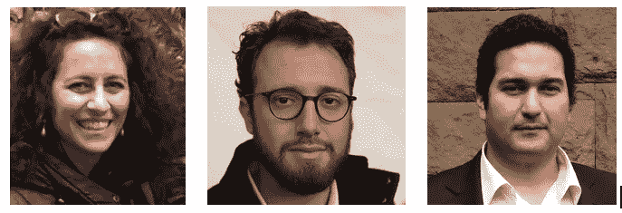

# 真正的人工智能挑战未来

> 原文：<https://towardsdatascience.com/do-not-worry-but-worry-43b5902c1ce6?source=collection_archive---------38----------------------->

## 不要担心，但要担心

*面试官:* [*【塔马尼尼】*](https://www.linkedin.com/in/paolo-tamagnini/)*[*KNIME*](http://www.knime.com)*

**

*左起:罗莎丽亚·西里波、保罗·塔马格尼尼和迭戈·阿里纳斯。(图片来自采访者和被采访者)*

*不久前，我的一位同事在一次重要会议上做了主题演讲后发表声明说，如今，关于人工智能(AI)[以及未来的相关挑战]的每一场演讲都需要至少是启示性的。是真的。到目前为止，大多数纪录片、节目、TED 演讲、主题演讲和类似的演示都明显使用了一种非常恐惧技术的语气。这有多少是真的？*

*我们真的注定要失败吗？我们应该向人工智能投降吗？*

*AI 会接管人类吗？*

*AI 是黑魔法吗？*

*一旦你将一个人工智能应用投入生产，你就不能再控制它了，这是真的吗？*

*有多少数据科学家能够控制人工智能应用？*

*我们已经向来自 KNIME 的人工智能专家 Rosaria Silipo 和来自圣安德鲁斯大学的 Diego Arenas 提出了这些问题。*

*[Rosaria Silipo](https://www.linkedin.com/in/rosaria/) ，博士，现任 KNIME 首席数据科学家，在西门子、Viseca、Nuance Communications 和私人咨询公司从事应用人工智能、预测分析和机器学习工作超过 25 年。Rosaria 分享了她在广泛的行业和部署中的实践经验，包括物联网、客户智能、金融服务、社交媒体和网络安全，她撰写了 50 多份技术出版物，包括她的新书:“[智能数据科学指南](https://www.springer.com/de/book/9783030455736)”(编辑。Springer)和“[用 KNIME 进行无代码深度学习](https://www.packtpub.com/product/codeless-deep-learning-with-knime/9781800566613)”(ed。Packt)。*

*[Diego](https://www.linkedin.com/in/darenasc/) 是一名从事数据科学和数据工程项目的研究工程师，正在完成他的计算机科学博士学位。Diego 拥有 15 年以上的数据相关项目工作经验；他拥有数据科学硕士学位，曾在银行、金融、电信、零售、人力资源、教育、交通、制造等不同行业担任顾问和机器学习专家。Diego 是一个开源贡献者，也是一个数据爱好者。*

****【保罗】让我们从一个流行的问题开始。AI 像黑魔法吗？****

*[Rosaria] AI 是由一套算法和数据处理技术组成的。最终都是数学、统计和数据处理。所以，不。这不是黑魔法，这只是数学。它并不比我汽车的引擎更神奇，它使我的汽车从 A 地移动到 B 地，即使我不了解它的机械的所有细节。*

*像这样的比较对人工智能产生了一种非常恐惧技术的感觉，促使人们拒绝所有这一切。带着这种恐慌的态度，唯一的解决办法就是告别一切，从你的社交媒体到所有的 messenger 应用，从你的吸尘器到你的汽车，从微波炉到你的牙刷，放弃现代技术的所有好处。*

*对门外汉来说，看起来的确像是黑魔法，但正如罗莎丽亚所说，它不是。当你看到魔术时，你可能会认为有什么超自然的事情在发生。然而，一旦你仔细观察，你会发现对你迅速贴上标签的魔法有一个合乎逻辑的解释。*

*这同样适用于人工智能，人们可能会承认人工智能所不具备的能力，当你更仔细地看它时，最终可以用数学运算来解释，在 consort 中工作给人一种难以理解的印象。*

*人工智能应用能够从数据中学习。那么，一旦你将一个人工智能应用程序投入生产，你就不能再控制它了，这是真的吗？*

*[Diego]我们需要将人工智能应用视为助手。一个助手，可以做我们以前做的同样的工作，但更准确或更有效。这改变了执行任务的人。但是，仍然应该监视助手，以检查它是否偏离了结果。*

*你可以，也应该，控制部署，如果人工智能系统没有按预期运行，你可以拔掉插头。人工智能系统的设计和实现应该考虑到这一点。人工智能系统不应该执行伦理上有问题的任务，或者人类出于伦理原因不会执行的任务。*

*一旦你将一个人工智能应用程序投入生产，你会想看看它的表现如何。通常的情况是，你可以用更新的版本(用更近的数据训练)更新或替换你的 AI 系统，或者只是因为结果是错误的或不如预期的好而关闭 AI 系统。*

*另一件要考虑的事情是，一旦你开始处理你的人工智能应用程序给出的结果，你可能正在改变原始问题的性质。因此，有必要监控其性能，以测量任何重大偏差。*

*【Rosaria】很多 AI 应用都是基于机器学习和深度学习算法的。在这两种情况下，一个模型被训练来执行一个特定的任务:给出推荐、产生流失率、提供有针对性的广告、预测机械故障等等*

*是的，这种算法从数据中学习，它们的知识会随着新输入的数据定期或持续更新，甚至在它们的生产生命周期中也是如此。然而，从那里说你不能控制他们了，这一步有点太大了。他们受到控制:他们不断受到监控，以确保他们保持良好的表现。它们可以永远停止使用，也可以随时进行临时维护。*

*有多少数据科学家可以控制人工智能应用？*

*【Rosaria】数据科学家的职业资格是一个宽泛的规范:从负责整个数据架构、收集、存储和准备的数据工程师，到机器学习/深度学习工程师构建和培训模型；从业务分析师和领域专家，定义每个项目的规格并使用最终解决方案，到 IT 生产专家，实际上负责在真实世界的数据上执行和维护真实世界中的 AI 应用程序。所有这些人至少控制一个人工智能应用程序的一部分，如果不是全部的话。*

*根据[一篇关于 KDNuggets](https://www.kdnuggets.com/2018/09/how-many-data-scientists-are-there.html) 、*的文章，2017 年 6 月，Kaggle 社区* *突破 100 万会员，ka ggle 2018 年 9 月 19 日的邮件称，他们在 2018 年 8 月突破 200 万会员。*“考虑到主要是机器学习工程师属于 Kaggle 社区，并且这只是世界上所有机器学习工程师的一小部分，并且考虑到构建 AI 解决方案所涉及的大量其他资格，那么能够控制 AI 端解决方案的专业人士的数量肯定远远高于仅仅几个人。*

*[Diego]有许多人在日常工作中专门研究特定类型的问题。这可能是某种数据科学或机器学习技术或算法。一个人工智能应用程序意味着几个不同的领域，所以这里的最佳策略是模块化开发和部署，并围绕专业人员团队工作。在我看来，能在 AI 中成功部署一个端到端解决方案的人，在公司里是稀缺的。通常是分析师自己学习新的技术和工具。*

*针对公司的工作量类型，拥有一个平衡的团队是关键。在角色和经验方面保持平衡。组建协作和有凝聚力的团队是公司分析团队生存的关键。*

*在人工智能领域工作的人和不熟悉该技术的人对人工智能的理解有区别吗？*

*[迭戈]是的，这是不同的。该领域的人员将知道针对特定问题使用什么技术。他们会明白，他们只是使用程序和算法来获得问题的近似解决方案。人工智能系统通常是不同机器学习模型的混合。*

*有时你可以看到不在这个领域但想用人工智能解决一切的人过于兴奋。这令人担忧。在提出任何解决方案之前，有责任首先了解技术并评估使用它的后果。关于人工智能的使用，我们应该在未来几年从专家和非专家那里看到更多的问责。*

*是的，当然。从事 AI 工作的人都知道，算法只是算法。不熟悉人工智能的人必须依靠泄露的纪录片可能说的话。你知道这种技术恐惧的启示方法无助于为如何解决真正问题的理性讨论做准备。*

****【Paolo】所以，你是说 AI 不会接管人类？****

*我真的不认为会这样。它可能会改变我们的生活方式，或好或坏，但我不认为任何算法接近发展某种意识或能够自行行动。我认为，在当今最先进的技术水平下，机器人和算法不会逃脱我们的控制。他们可能会取代乔布斯，但那是另一回事了。*

*[Diego]想象一下，我们有一个能够使用其他人工智能系统的人工智能系统，让我们称之为全局人工智能。给定一个任务，它能够选择正确的人工智能来解决它。这个全局人工智能能够使用和控制其他人工智能系统来执行不同的任务。现在想象一下，控制系统可以通过重新训练和/或重新适应新任务来改善其他人工智能系统和它自己。在某些时候，人工智能系统的能力可能会超过人类的平均智能。此后不久，它就能够在没有人类帮助或干预的情况下进行自我训练。接下来会发生什么？这是我们担心的情况。在关于这个话题的对话中，通常有两方，一方说这个场景不可能实现。另一方面，有人认为这是一个潜在的威胁，因此我们应该努力减轻这种情况下的任何意外后果。*

*如果你选择在这场对话中选择关心的一方，我们必须说，我们远远没有达到这种独立的水平。人工智能系统不太可能接管世界，但更紧迫的问题是强大人工智能系统的控制者。我们要求使用我们的数据并影响我们决策的算法和系统更加透明。*

*你谈到人类的工作被机器人取代。未来 AI 还有哪些真正的挑战？*

*[Rosaria]未来人工智能面临着许多挑战！*

*许多将与数据安全和隐私保护有关。所有这些数据都可用，所有我的数据都可用，谁可以访问它们？谁能用它们做什么？法律允许公司如何处理我的数据？法律允许其他公民查看我的数据吗？我的隐私得到足够的保护了吗？*

*出现数据泄露怎么办？有黑客攻击怎么办？我的数据是否受到足够的保护？我的敏感数据是否受到足够的保护？谁有我的数据，还能控制我？我怎样才能避免那种力量控制我？这些问题不仅仅是技术上的答案，还需要法律和政治上的答案。*

*人工智能面临的另一种挑战是责任。如果一个算法做了决策，谁来为错误的决策负责？从自动驾驶汽车到贷款转让，从医疗诊断到面部识别，谁将为错误负责？谁来为假新闻的传播负责？还是为了社交媒体上的“言论自由”？自由言论在哪里结束，攻击性言论在哪里开始？同样，在技术答案之前，这里需要政治和法律答案。*

*算法是基于数据的，数据是有偏见的，就像它来自的世界一样。我们应该努力纠正算法对某些种族群体的偏见，还是仅仅依靠数据？如果我们要做出努力，我们不是在干涉当前的世界体系吗？*

*人工智能将取代一些工作。不可否认，人工智能将对未来世界产生经济影响。我们需要让人们为过渡做好准备，最重要的是，我们需要让下一代做好更多与人工智能兼容的工作的准备。*

*[迭戈]我同意罗莎丽亚。*

*对我来说，一些巨大的挑战围绕着公平、问责、透明和道德。像任何工具一样，人工智能可以用来增加或减少世界上的不平等。使用模型来提出建议或影响人们生活中的决策，给使用人工智能系统进行自动决策的公司带来了巨大的责任，我们没有看到许多公司致力于对他们的机器学习模型或人工智能系统进行道德评估。*

*我们可以期待更多的人工智能系统和项目将透明度作为开发过程的一部分。包括向外行用户解释人工智能系统所做决定的系统组件。*

*数据代理是另一个挑战，用户拥有多少自己的数据。他们能够在多大程度上分享和了解他们自己的数据所产生的见解。*

*如果人工智能将接管一些重复性工作是真的，那么政府应该努力重新培训劳动力，以改善人们的生活。希望技术和人工智能系统的受控和透明使用能够对世界产生积极影响。*

*所以，你在说“不要担心，但要担心”。*

*[罗萨莉亚][*大笑*]是的，这正是我所说的。*

*人工智能对未来提出了挑战。我们现在需要解决这些问题，以便在进入一个更加自动化和人工智能驱动的世界时尽可能少出现问题。处理这些问题需要更多的法律和政治决策，而不是技术发展。*

*与此同时，我们需要保持理性，公平地评估技术的利弊，而不是用世界末日的术语来描述人工智能，因为它比实际情况更复杂，更不可控。*

*[Diego]我们需要解决许多令人担忧的问题，例如，改善人工智能系统的立法，规范企业问责制，以及总体上建立一个更加公平和透明的系统。这是人工智能应用令人兴奋的时代，我认为在梦想人工智能控制的世界之前，我们应该专注于解决我们更直接的问题。*

*所以，是的。不要担心，但要担心。*