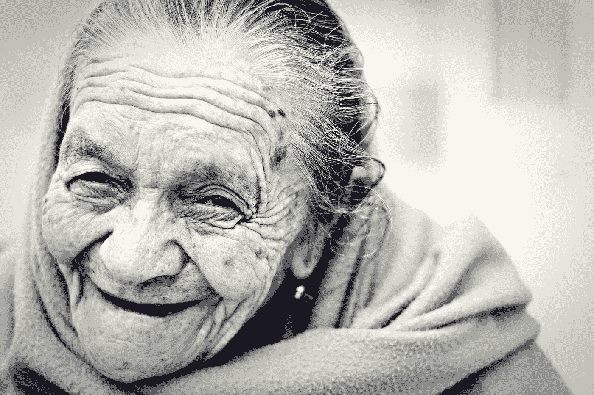
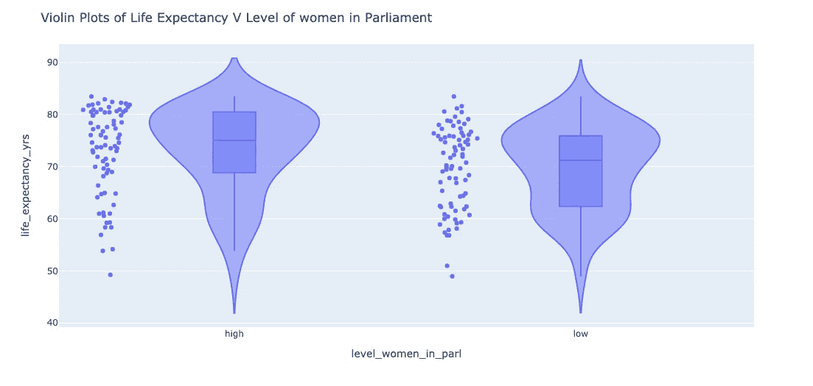
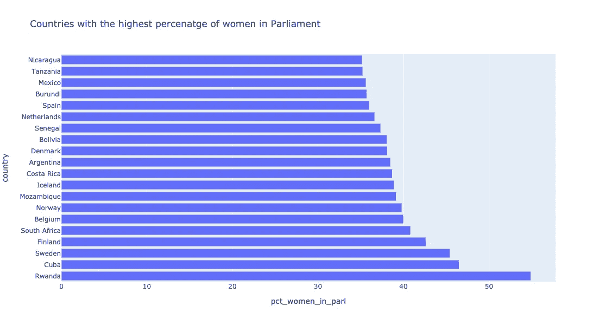
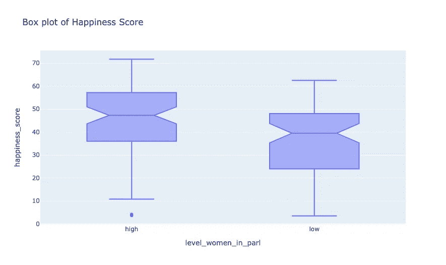
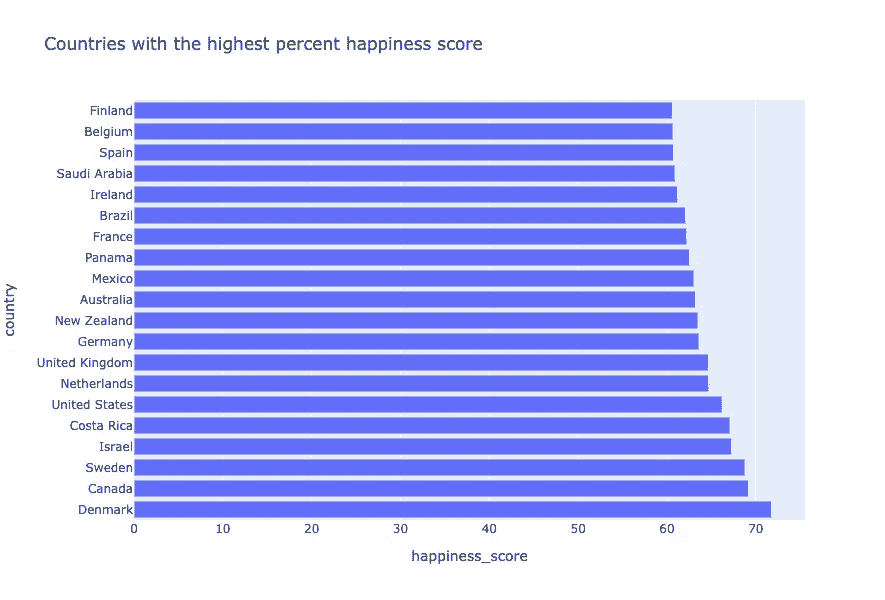
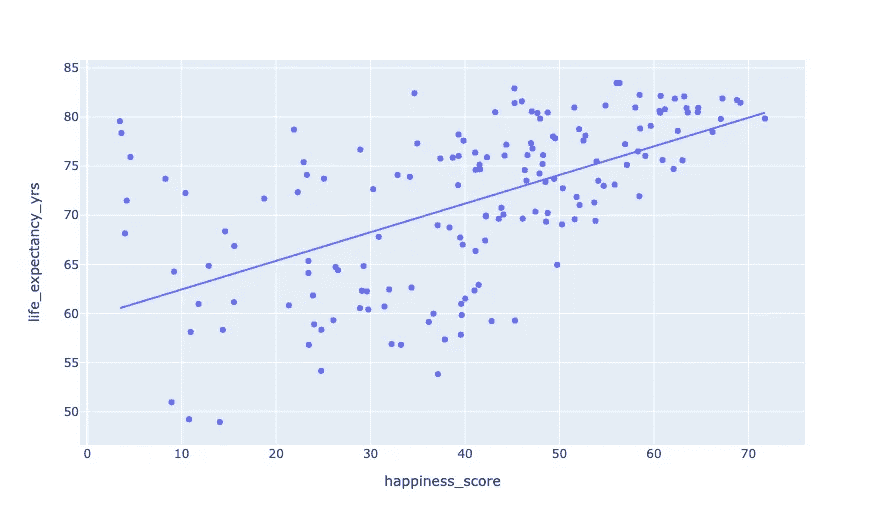
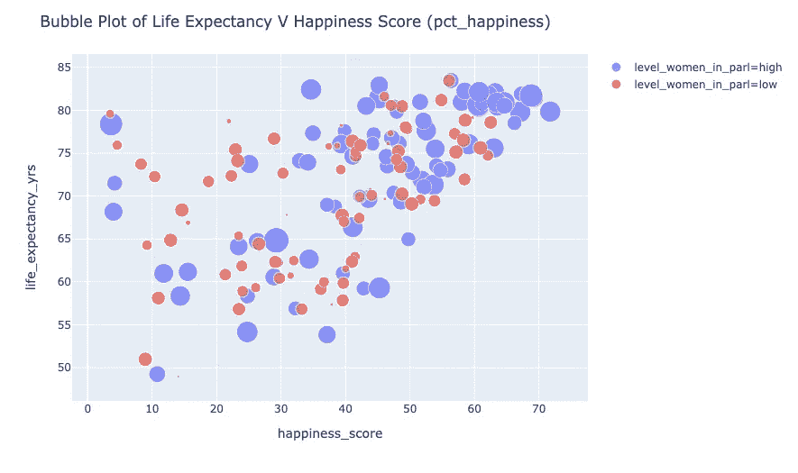
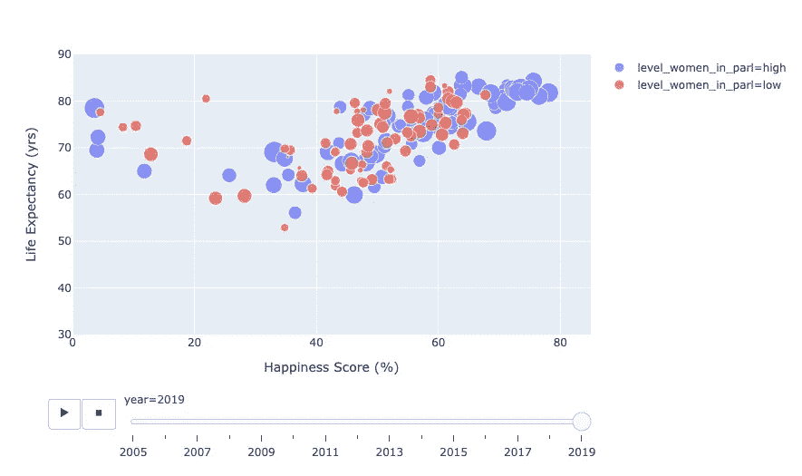

# 幸福长寿:

> 原文：<https://towardsdatascience.com/do-people-in-countries-with-more-women-in-congress-live-longer-happier-lives-28b85d8e653f?source=collection_archive---------65----------------------->

## 国会中更多的女性就是答案吗？

克里斯蒂安·纽曼在 [Unsplash](https://unsplash.com?utm_source=medium&utm_medium=referral) 上的照片

# **简介**

在国会中有更多女性的国家，人们会活得更长久、更幸福吗？几乎在所有存在某种形式政府的国家中，政治职位或议会或国会中的职位历来都是由男性主导的。然而，这些年来，一些国家的议会中女性人数稳步上升。

这是我对数据进行统计分析的结果报告，旨在测试议会中有更多女性的国家是否有更高的预期寿命和更高的幸福指数。那么到底什么是幸福指数呢？

“请想象一个梯子，梯级从底部的 0 到顶部的 10。梯子的顶端代表你可能过的最好的生活，梯子的底端代表你可能过的最坏的生活。你个人认为你现在站在梯子的哪一级？”这一指标也被称为 *Cantril life ladder，*是如何收集被调查国家每位受访者的幸福得分的。

分析了由每个国家每年平均预期寿命组成的数据集。这项研究中使用的数据收集时间跨度从 1800 年的预期寿命数据开始，到 2005 年的幸福得分，范围一直到 2019/2020 年。我从 [Gapminder](http://gapminder.org/data) 获取所有数据。

# **方法论**

在这项研究中，我总共包括了全球 160 个国家，每个国家都有每年收集的女性在议会中的比例、预期寿命和幸福指数的平均值。

为了便于分析，数据按国家分组，然后在收集数据的所有年份计算所有三个值的平均值、预期寿命、女性在议会中所占的百分比和幸福指数，这样每个国家就有了三个平均值。

创建了两个附加特征来帮助分析；这些新特征被用来将幸福指数和议会中女性的比例分为高或低幸福指数，或高或低议会中女性的比例。

最后，根据女议员比例高的国家和女议员比例低的国家，将数据分成两部分。然后计算预期寿命和幸福得分的平均值，并在双样本 t 检验中进行比较，以查看平均值的差异是否在 0.05 的α显著性水平上具有统计学显著性

# **议会中的妇女和预期寿命**

结果显示，女议员比例较高的国家的平均预期寿命约为**73.1 岁**，而女议员比例较低的国家的平均预期寿命为**69.7 岁**。我运行了一个*双样本 t 检验*来看看这个差异是否具有统计显著性——不等于零(替代假设)，或者它是否不具有统计显著性——等于零(零假设)。

*图(1)* [*点击此处查看上图*](https://plotly.com/~mena2020/1/) *的互动版。上面的小提琴图在左边显示了妇女在议会中高水平的国家，在右边显示了妇女在议会中低水平的国家。内部方框图显示，议会中妇女比例较高的国家一般平均预期寿命较高。*

**双样本 t 检验结果(平均寿命)**

> t 检验的 p 值为 **0.0097** ，因此我拒绝零假设，并得出结论，议会中女性比例高的国家与议会中女性比例低的国家之间的预期寿命均值差异**不等于零**，在 0.05 的阿尔法显著性水平上具有统计显著性。因此，人们可以得出结论，最有可能的情况是，议会中女性比例较高的国家平均寿命也更长。

*图(2)* [*点击此处查看互动版上图*](https://plotly.com/~mena2020/17/) *。该条形图显示了议会中女性比例(以百分比表示)最高的前 20 个国家。令人惊讶的是，卢旺达以近 55%的比例高居榜首，但该国也是排名靠前的国家中的异数，其平均预期寿命约为 65 岁，低于排名靠前的其他国家的平均水平。*

# 议会中的女性和幸福指数

议会中女性比例较高的国家的平均幸福指数约为 45.1%(T1)，而女性比例较低的国家的平均幸福指数约为 36.6%(T3)(T2)。我像前面一样，通过运行双样本 t 检验，重复了验证均值差异是否具有统计显著性的过程。

*图(3)* [*点击此处查看上图互动版*](https://plotly.com/~mena2020/15/) *。上面的方框图左边显示的是议会中女性比例高的国家，右边显示的是女性比例低的国家。从图表中，我们看到左边的国家比右边的国家平均有更高的幸福分数，或者说幸福百分比。*

**双样本 t 检验结果(幸福指数平均值)**

> p 值为 **0.0009** ，因此我拒绝零假设，并得出结论，议会中女性比例较高的国家和比例较低的国家之间的幸福得分均值差异**不等于零，**在 0.05α水平上具有统计学意义。这就导致了一个结论，那就是议会中女性比例高的国家平均来说也更幸福。

*图(4)* [*点击此处查看互动版上图*](https://plotly.com/~mena2020/19/) *。该条形图显示了幸福指数最高的前 20 个国家。丹麦以大约 72%的平均幸福分数高居榜首。*

# 幸福指数和预期寿命

为了总结这项研究，我进行了回归分析，以测试幸福指数与预期寿命之间的关系。

**回归分析/回归图**

*图(5)* [*点击此处查看互动版上图*](https://plotly.com/~mena2020/21/) *。回归图显示拟合预期寿命和幸福指数的 OLS 回归图。这条线的强度不算中等，但很积极。*

**回归分析结果(预期寿命和幸福指数)**

> OLS 结果显示 p 值小于 0.005，R 平方值为 0.33。因此，我们拒绝零假设，即适合该模型的两个变量不相关，并得出结论**在 0.05 alpha 水平上，幸福百分比和预期寿命之间存在统计上的显著关系。回归线显示了幸福百分比和预期寿命之间的正相关，但是中等偏弱；大约 33%的预期寿命差异可以用幸福百分比的变化来解释。**

*图(6)* [*点击此处查看互动版上图*](https://plotly.com/~mena2020/23/) *。显示幸福得分和预期寿命平均值的气泡图。颜色代表议会中女性比例的高低，而气泡的大小代表每个国家议会中女性的实际比例。*

**预期寿命 V 幸福分数动画泡泡剧情**

*图(7)* [*点击此处，动画显示上图*](https://plotly.com/~mena2020/25/) *中的气泡。气泡图显示了 2005 年至 2019 年间议会中的女性比例、幸福指数和预期寿命的变化。请注意气泡是如何向上和略微向右流动的，这表明在气泡所代表的国家中，女性在议会中的比例正在增加。*

# 结论、局限性和展望

> 关于女议员比例较高的国家是否比女议员比例较低的国家预期寿命更长的问题，我的结论是，当一个国家的女议员比例较高时，这个国家的预期寿命也很可能更长。
> 
> 此外，与议会中女性比例较低的国家相比，议会中女性比例较高的国家平均幸福指数也较高。
> 
> *对于回归分析，我发现幸福指数和预期寿命之间存在一种正相关关系，尽管这两个变量之间的相关强度不太大。*
> 
> *为了清理数据，为了便于分析，我用零替换了原始数据集中缺失的值，由于三个数据文件的年份范围不同，最终的数据框架共有 160 个国家。因此，如果更多的国家加入到数据跨越更长时间的列表中，t 检验和回归分析的结果可能会有所不同。*
> 
> 这个项目的前景可能包括收集更多关于更多国家议会中妇女比例的数据，最终目标是测试这里的结果是否仍然成立。
> 
> *第二个目标是调查其他社会因素和议会中女性比例的提高是如何影响预期寿命和幸福感的。*