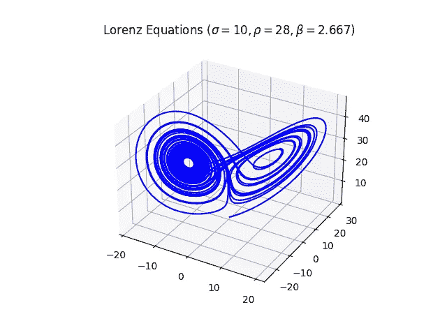

# 自定义 Scipy ODE 解算器

> 原文：<https://towardsdatascience.com/do-stuff-at-each-ode-integration-step-monkey-patching-solve-ivp-359b39d5f2?source=collection_archive---------25----------------------->

## 融入时尚

## 猴子给 Scipy 打补丁，在每个集成步骤做事情


由[罗宾·施雷纳](https://unsplash.com/@robin_schreiner)在 [Unsplash](http://unsplash.com) 上拍摄的照片

除非你在过去的几年里生活在岩石下，否则你肯定知道 Python 语言通常是科学计算任务的首选武器，因为它是免费的、可扩展的、易于掌握的，并且具有与最好的商业软件相当的性能。科学计算 Python 栈几乎总是由著名的包 **Numpy 和 Scipy** 、数值类型的高质量实现、许多不同的数学运算和常见的计算原语组成。

在研究和工程中一个很常见的任务就是**整合**<https://en.wikipedia.org/wiki/Ordinary_differential_equation>**的系统，特别是初值问题。在 Scipy 中，实现这一点的首选方式是通过函数`[solve_ivp](https://docs.scipy.org/doc/scipy/reference/generated/scipy.integrate.solve_ivp.html)`。你提供要积分的函数，你想要使用的积分算法/解算器的种类( [RK25，RK45](https://en.wikipedia.org/wiki/Runge%E2%80%93Kutta_methods) 等)。)，通常的集成参数，您就可以开始了。让我们试着整合一个著名的自治微分系统，[洛伦兹方程](https://en.wikipedia.org/wiki/Lorenz_system):**

**洛伦兹系统的代码**

****

**一个人可以解决洛伦兹系统，而不显示解决方案的图形吗？那鸿(图片由作者提供)**

****在使用了一点点** `**solve_ivp**` **之后，我很快意识到** **当前版本的函数没有办法指定在集成的每一步之后要执行的回调或任务**。**

**在执行这类任务的软件中，这通常是可能的。虽然最终的解决方案是在最后交付的，但是在每一步之后，您可能想要做的事情是，例如，在解决方案生成时绘制解决方案，以便在早期发现 bug 和错误，或者简单地显示某种信息或指标。当解决计算昂贵和/或必须长时间集成的系统时，特别需要这些特性。那么……怎么做呢？**

**最幼稚的做法是编辑`solve_ivp`的源代码，但这是一个大禁忌:该功能将不再像所有其他使用它的软件预期的那样工作，这是一个灾难。我们可以推出自己版本的`solve_ivp`或我们正在使用的求解器，但这涉及到大量的复制粘贴，这将意味着有效地派生当前版本的函数，并且如果我们想跟上可能推出的更新，还需要进行艰苦的维护。最正统、最精简、最优雅的解决方案，或者说最不会让计算机科学家皱眉的解决方案，是 [**猴子补丁**](https://en.wikipedia.org/wiki/Monkey_patch) 。**

****Monkey patching 是一种编程技术，涉及在运行时动态修改对象，以完成一些期望的行为，而不干预它们的源代码**。你可以把它想象成在你的代码开始运行的时候临时定制一个对象来满足你的需求。在本文中，我将展示一个非常简单的用例:添加一个进度条，它将告诉我们在什么点上进行集成，并给我们关于计算速度和进展的反馈。为此，我们将使用轻量级的可扩展包`[tqdm](https://github.com/tqdm/tqdm)`。**

**猴子补丁代码**

**这是怎么回事？嗯，通过查看 [solve_ivp 源代码](https://github.com/scipy/scipy/blob/701ffcc8a6f04509d115aac5e5681c538b5265a2/scipy/integrate/_ivp/ivp.py#L156)，我体会到两件事:**

*   **所有可用的解算器，如`RK23`、`RK45`、`BDF`等。，继承自一个名为`OdeSolver`的母类。**
*   **`solve_ivp`初始化`OdeSolver`并调用方法`step`推进整合。**

**因此，这个想法是将我们自己的进度条形码添加到`__init__`和`step`方法中。由于我们还想继续做这两个方法在原始代码中做的老事情(咄)，我们将这两个方法“保存”为`old_init`和`old_step`，并用与方法完全相同的签名编写我们自己的包装函数。我们的版本，除了调用旧代码，还创建、更新和关闭一个 tqdm 进度条。最后，我们只是用我们自己的增强版本修补了这两个方法；也就是说，我们简单地在加载的活类上动态替换那些属性——这就是动态编程语言的本质。瞧啊。现在，每当`solve_ivp`使用`OdeSolver`时，就会出现进度条。**

```
**IVP: 100%|##########| 40.0/40.0 [00:00<00:00, 232.66ut/s]**
```

**您还可以继续做其他有趣的事情:绘制解决方案、显示指标、发出警告、进行健全性检查……就像您可以提供自己的回调函数一样！**