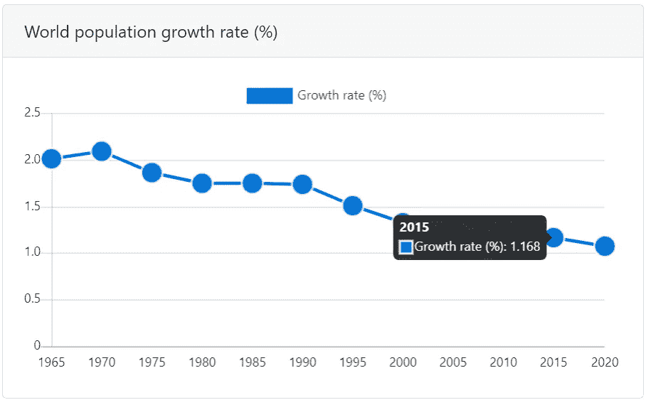
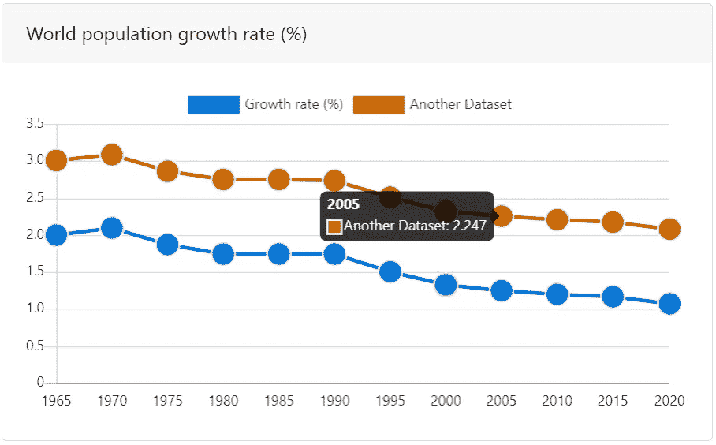
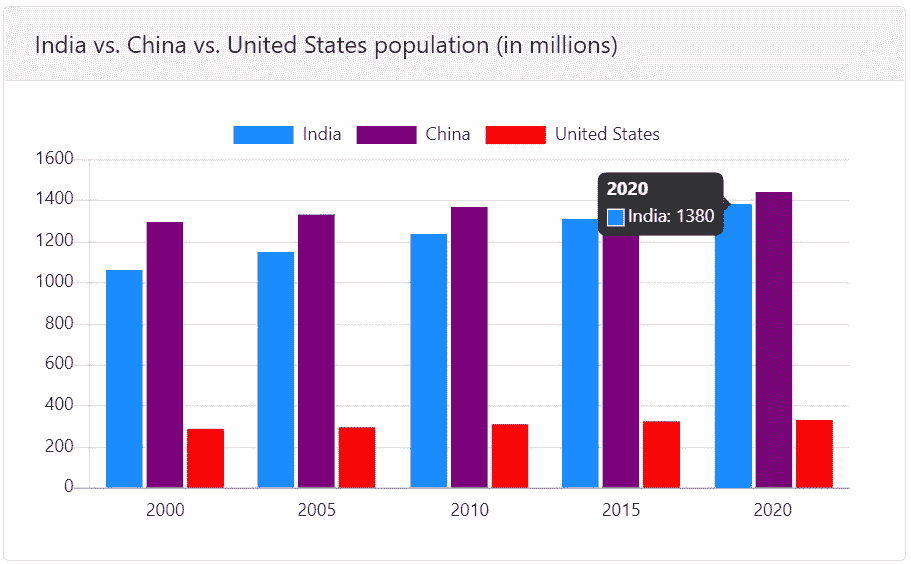
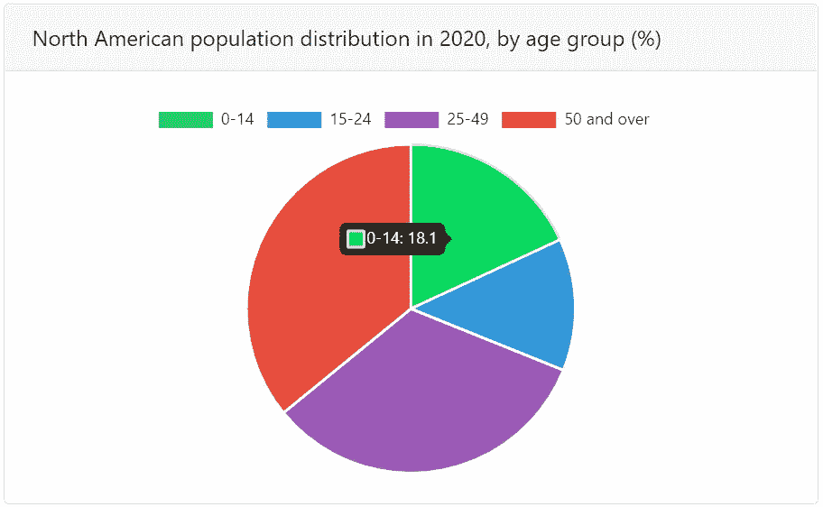
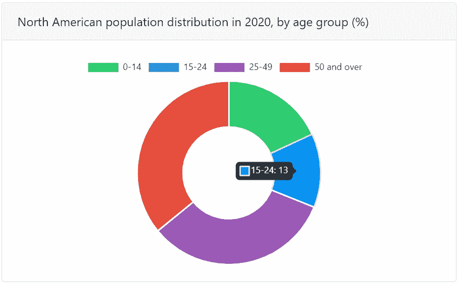
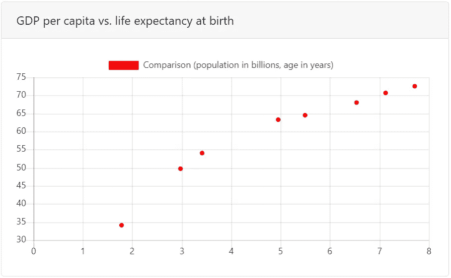
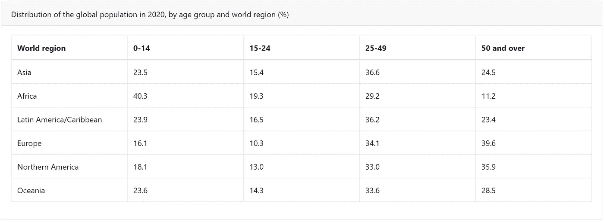

# 这样做可以让你的网站在几分钟内变得互动

> 原文：<https://towardsdatascience.com/do-this-to-make-your-website-interactive-in-minutes-c11b7495d088?source=collection_archive---------46----------------------->

## 利用 Chart.js 数据可视化的力量提升您的项目

图片由[米利安](https://unsplash.com/@mjessier)在 [Unsplash](https://unsplash.com/photos/eveI7MOcSmw) 上拍摄

数据讲述有意义的故事，有了可视化的补充，我们可以收集有价值的见解，以有效地发现、支持和分享想法。但是静态图像通常不能实现数据可视化的全部功能。

> 如果我们在网站上增加用户与数据的交互，我们能解锁什么？

无论是在项目、个人网站还是博客帖子中，允许用户自定义和探索实践都可以带来更有用和更难忘的体验。

有了 [Chart.js](https://www.chartjs.org/) ，你可以非常容易地插入令人惊叹的表格和图表，成为一个更有影响力的故事讲述者。这篇文章将指导您使用这个工具，包括在页面上设置和创建几种类型的图形。

## 那么，Chart.js 到底是什么？

Chart.js 是一个免费的开源库，用于在 JavaScript 文件和 HTML `canvas`元素中制作动画。它包括八种不同类型的图形:折线图、条形图、圆环图、饼图、散点图、气泡图、雷达图和极区图，但也可以在同一页面上混合搭配多个图形。

## 我们打算在这个指南中做什么？

我们将介绍如何设置 Chart.js，创建关于世界人口统计的初始图表，并设置它们的样式。

# 数据源

以下是本教程中使用的所有数据源的链接。

*   [2020 年全球人口分布，按年龄组和世界区域划分](https://www.statista.com/statistics/875605/percentage-share-of-world-population-by-age-and-by-world-region/)
*   [世界人口增长率(%)](https://data.worldbank.org/indicator/SP.POP.GROW?end=2019&start=1961)
*   [全国人口统计](https://www.macrotrends.net/countries/USA/united-states/population)
*   [人均国内生产总值与预期寿命统计数据](https://ourworldindata.org/grapher/life-expectancy-vs-gdp-per-capita?tab=table&stackMode=absolute&time=1891&country=&region=World)

# 步骤 1:包括图书馆

我已经整理了一个 [GitHub 库](https://github.com/asmikumar/chartjs-tutorial)包含了我们将在本教程中讨论的所有内容。如果您打开`index.html`文件，您应该看到浏览器中弹出一页图表。

现在，在文本编辑器中打开`index.html`获取代码。为了方便地导入最新版本的 Chart.js，我们将使用 use [this CDN link](https://cdnjs.com/libraries/Chart.js) (以“Chart.min.js”结尾)。然后，将链接放在一个`script`标签中，如上所示。

为了格式化我们的图表，包括 [CDN 链接](https://www.bootstrapcdn.com/)到 Bootstrap CSS 和 Bootstrap JS。如果你认为关于 Bootstrap 的更多信息会有所帮助，请点击这里查看。

# 步骤 2:准备 HTML

在开始可视化我们的数据之前，我们需要准备的一件主要事情是在我们的 HTML 中定义一个我们想要绘制图表的区域。我们必须为我们网页上的每个图形添加`canvas`元素。这是如何工作的。

在上面的代码片段中，我们给我们的图形(在本例中是一个线图)一个`id`，也就是`line`，它指向`canvas`元素，我们稍后可以用它来引用 JavaScript 中指定的图形元素。您可以随意命名该元素；唯一重要的是，当在所有文件中引用图表时，使用相同的`id`。请记住，每个`id`必须是唯一的。

# 步骤 3:用 JavaScript 创建大纲

为了让我的数据易于组织，我选择将每个图形的代码放在一个单独的 JavaScript 文件中。请随意遵循不同的格式，但这是我发现最有效的。

创建一个 JavaScript 文件(并将其放入一个名为。js 如果你喜欢的话)。

让我们来分解一下`line.js`发生了什么。首先，我们定位之前添加到我们的`index.html`文件中的`canvas`元素(注意`id` `line`)。然后，使用那个`canvas`元素，我们创建一个折线图(`type: 'line'`)，并传入我们的数据。

# 步骤 4:插入数据

编辑图表所需的所有数据。对于这个样本线图，我们将使用世界银行的[人口增长统计数据](https://data.worldbank.org/indicator/SP.POP.GROW?end=2019&start=1961)。下载数据(如果愿意，也可以手动输入)。

然后，将数据复制并粘贴到如下所示的数组格式中。这是 JavaScript 文件整体结构不可或缺的一部分。

我们也可以给数据集一个标签。如果您保存并刷新 HTML 页面，您将看到一个新的折线图。但是，我们可以采取措施自定义视觉效果，包括轴刻度线和标签、图表标题、点和线的颜色、悬停效果等等！

# 步骤 5:格式和样式

我们还可以将多个数据集添加到一个图表中，这有助于描绘更多趋势。这在下面的代码中被注释掉了。

对于我们想要创建的每一行，我们向`datasets`数组添加另一个对象。每个对象都可以有一个调整范围；我们不仅可以传递新数据来画线，还可以更改线的名称、行为和外观。这些特征可以按照完成的`line.js`文件中的描述进行编辑。在 [Chart.js 文档](https://www.chartjs.org/docs/latest/charts/)中阅读更多关于您可以选择的定制的详细描述！

## 成品线图

左:一个数据集，右:两个数据集

到目前为止，我们已经了解了如何在网页上创建、个性化和查看折线图。让我们看看 Chart.js 提供的一些其他可视化工具。这些都包含在本教程开头链接的存储库中。

# 其他类型的可视化

Chart.js 提供了几种其他类型的图表，比如表格、条形图、饼图、散点图等等。下面是更多示例的 JavaScript 代码。

## 条形图

左:三个数据集，右:两个数据集

## 圆形分格统计图表

左:饼图，右:圆环图

## 散点图

## 桌子

这段代码包含在`index.html`中，而不是 JavaScript 中。

# 要记住的关键事情

在审查代码时，请记住这些提示。

*   确保每个图表的`canvas` `id`在整个 HTML 和 JavaScript 文件中保持一致。
*   记得用`script`标签链接 HTML 中的 JavaScript 文件。
*   确保每次添加新要素或数据集时都放置一个逗号。否则，图形将无法正确渲染(或根本无法渲染)。
*   在进行重大更改后刷新 HTML 页面，以跟踪您的进度。
*   玩得开心！请在评论中分享你的想法或问题。