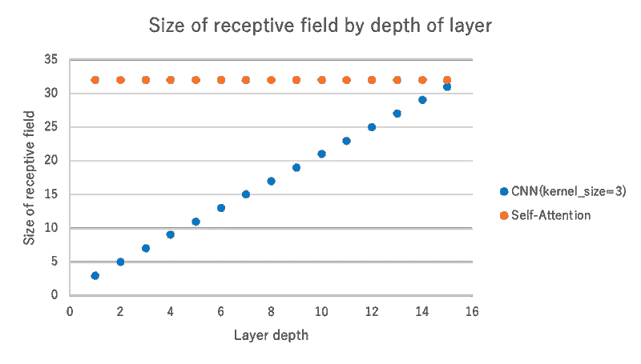
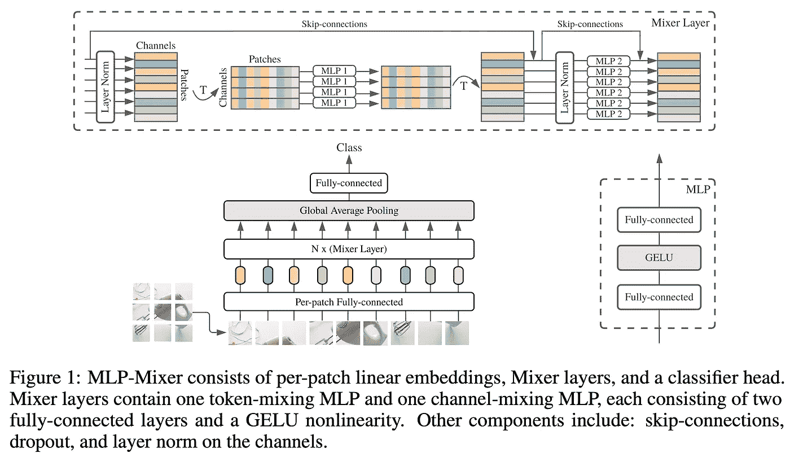
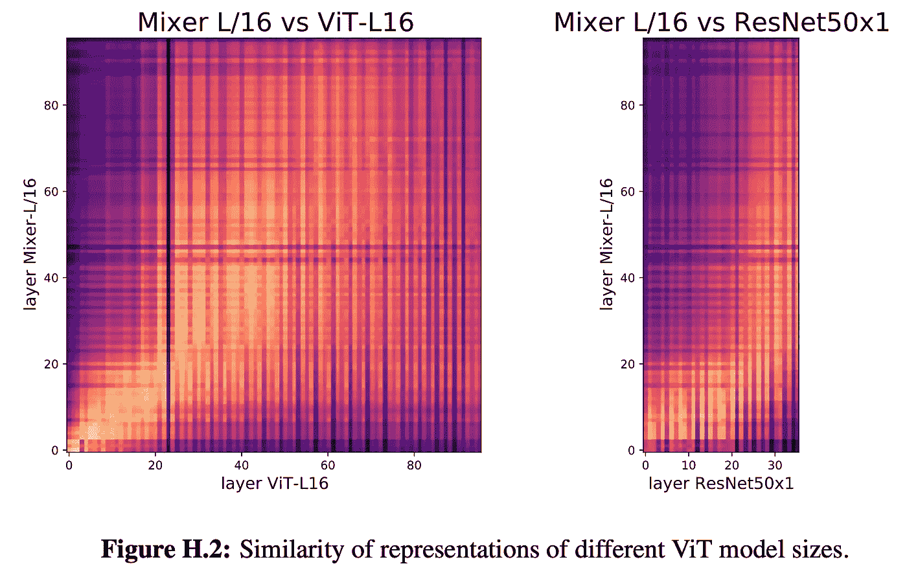

# 视觉变形器看起来像卷积神经网络吗？(论文解释)

> 原文：<https://towardsdatascience.com/do-vision-transformers-see-like-convolutional-neural-networks-paper-explained-91b4bd5185c8?source=collection_archive---------2----------------------->

## [思想和理论](https://towardsdatascience.com/tagged/thoughts-and-theory)

视觉变形金刚(ViT)近年来势头越来越猛。本文将解释论文*“视觉变形金刚看起来像卷积神经网络吗？”* ( [Raghu 等人，2021](https://arxiv.org/abs/2108.08810) )由 Google Research 和 Google Brain 发布，并探讨常规使用的 CNN 和 Vision Transformer 的区别。

# 本文摘要和博客内容

本文有六个中心摘要:ResNet ( [He et al .，2016](https://openaccess.thecvf.com/content_cvpr_2016/html/He_Deep_)) as a representative of CNN-based networks. Residual_Learning_CVPR_2016_paper.html) )和 ViT 为代表的基于 CNN 的网络。

1.  ***与 CNN***相比，ViT 在浅层和深层获得的表征之间具有更大的相似性
2.  ***与 CNN 不同，ViT 从浅层获得全局表示，但从浅层获得的局部表示也很重要。***
3.  ***ViT 中的 Skip 连接甚至比 CNN(ResNet)中的影响更大，并对表示的性能和相似性产生实质性影响。***
4.  ***ViT 比 ResNet*** 保留更多的空间信息
5.  ***ViT 可以学习大量数据的高质量中间表征***
6.  ***MLP 混频器的表示更接近 ViT 而不是 ResNet***

在这篇博客中，我将首先简要回顾 ResNet 和 ViT 的结构，它们是基于 CNN 的模型的代表性示例，然后进一步研究本文中描述的所获得的表示的差异。

## ResNet 基础知识

ResNet 是计算机视觉(CV)任务的流行模型。如下面的图 2 所示，ResNet 的加权传播端使用跳过一层权重的 skip 连接进行求和。具有跳跃连接的求和过程减轻了诸如梯度消失的问题，并且允许比先前网络更深的层。

ResNet 架构来自[何等，2016](https://openaccess.thecvf.com/content_cvpr_2016/html/He_Deep_)) as a representative of CNN-based networks. Residual_Learning_CVPR_2016_paper.html)

# 视觉转换器(ViT)基础知识

首先，让我们来看看视觉变压器(ViT)中使用的变压器编码器。

## 变压器

变压器是在论文《注意力是你所需要的全部》( [Vaswani et al .，2017](https://arxiv.org/abs/1706.03762) )中提出的模型。它是一个使用称为自我关注的机制的模型，这种机制既不是 CNN，也不是 LSTM，并建立了 Transformer 模型，以显著优于现有的方法。结果比现有的方法好得多。

注意下图中标有多头注意的部分是 Transformer 的核心部分，但它也像 ResNet 一样使用了 skip-joining。

变压器架构。来自[瓦斯瓦尼等人，2017](https://arxiv.org/abs/1706.03762)

变压器中使用的注意机制使用了三个变量: ***Q*** (查询)、 ***K*** (键)、和 ***V*** (值)。简单地说，它计算一个查询标记(标记:类似于一个单词)和一个键标记的注意力权重，并乘以与每个键相关联的值。简而言之，它计算查询令牌和密钥令牌之间的关联(注意力权重),并乘以与每个密钥相关联的值。

(单头)自我关注

将 **Q，K，V** 计算定义为单头，多头注意机制定义如下。上图中的(单头)注意机制原样使用了 ***Q*** 和 ***K*** 。尽管如此，在多头注意力机制中，每个头都有其投影矩阵*****【w_i^v***，并且它们使用使用这些矩阵投影的特征值来计算注意力权重。**

****

**多头注意力**

**如果这个注意机制中使用的 ***Q，K，V*** 都是从同一个输入计算出来的，则专门称为自我注意。另一方面，Transformer 解码器的上部不是一个“自我”注意力机制，因为它使用来自编码器的 ***Q*** 和来自解码器的 ***K*** 和 ***V*** 来计算注意力。**

**实际应用的图像如下图所示。该图示出了使用单词“making”作为查询为每个关键令牌计算的注意力权重的可视化。转换器使用多头自关注机制传播到后面的层，每个头学习不同的依赖关系。下图中的关键词是彩色的，代表每个头部的注意力权重。**

****

**注意力权重可视化。从 [Vaswani 等人，2017](https://arxiv.org/abs/1706.03762) 引用的图像，我已经注释过了。**

**###视觉转换器(ViT)**

**视觉转换器(ViT)是一种将转换器应用于图像分类任务的模型，于 2020 年 10 月提出( [Dosovitskiy 等人 2020](https://arxiv.org/abs/2010.11929) )。模型架构与原始的 Transformer 几乎相同，但有一点不同，它允许将图像作为输入处理，就像自然语言处理一样。**

****

**视觉转换器架构。图片引自 [Dosovitskiy et al. 2020](https://arxiv.org/abs/2010.11929) ，我已经做了注释。**

**首先，ViT 将图像分成 N 个“小块”,例如 16x16。由于面片本身是 3D 数据(高 x 宽 x 通道数)，它们不能由处理语言(2D)的转换器直接处理，因此它将它们展平并进行线性投影，以将其转换为 2D 数据。因此，每个补丁都可以被视为一个令牌，可以输入到转换器中。**

**此外，ViT 采用先预训练后微调的策略。ViT 使用包含 3 亿张图像的数据集 JFT-300M 进行预训练，然后在 ImageNet 等下游任务上进行微调。ViT 是第一个在 ImageNet 上实现 SotA 性能的纯变形金刚模型，这导致了对变形金刚应用于计算机视觉任务的研究大幅增加。**

**但是，训练 ViT 需要大量的数据。变压器在数据较少的情况下不太准确，但在数据较多的情况下变得更加准确，并且在 JFT-300M 上进行预训练时表现优于 CNN。更多详情请参考原论文。**

****

**视觉转换结果。( [Dosovitskiy 等人 2020](https://arxiv.org/abs/2010.11929)**

# **根据我们得到的表达式比较 ResNet 和 ViT**

**到目前为止，我们已经看到了 ResNet 和 ViT 的概述，两者在图像识别任务中都可以有不错的表现，但是 ***它们之间有什么区别呢？*** 在论文《视觉变形金刚看起来像卷积神经网络吗？作者对其进行了研究。**

**让我们仔细看看介绍中提到的以下六点。**

1.  *****与 CNN***相比，ViT 在浅层和深层获得的表征之间具有更大的相似性**
2.  *****与 CNN 不同，ViT 从浅层获得全局表示，但从浅层获得的局部表示也很重要。*****
3.  **ViT 中的 Skip 连接甚至比 CNN(ResNet)中的更有影响，并且实质上影响表示的性能和相似性。**
4.  *****ViT 比 ResNet*** 保留更多的空间信息**
5.  *****ViT 可以学习大量数据的高质量中间表征*****
6.  *****MLP 混频器的表示更接近 ViT 而不是 ResNet*****

## *****1。与 CNN***相比，ViT 在浅层和深层获得的表示之间有更多的相似性**

**ViT 和 ResNet 的主要区别之一是初始层的大视野。**

****

**相对于输入图像的感受野大小。**

**CNN(ResNet)只有固定大小的内核视场(大小 3 或 7)。具体来说，CNN 是通过一层一层地重复“卷积”内核周围的信息来逐渐扩大视野的。相比之下，ViT 使用自我关注机制，允许模型即使在最低层也具有整个视野。这样，根据网络的结构，视野是不同的。**

**下图是 ViT 的实际视野(自我注意机制的有效距离)。在浅层，有一些像 CNN 这样局部视野的部分，但也有很多头部具有全局视野。**

****

**注意距离。该数据引自 [Dosovitskiy 等人 2020 年](https://arxiv.org/abs/2010.11929)**

**那么，ResNet 和 ViT 在各层深度获得的表象，结构上有什么区别呢？为了找到答案，作者在下图(图 1)中绘制了每一层获得的表示的相似性。**

****

**[拉古等人，2021 年](https://arxiv.org/abs/2108.08810)**

**在上图中，他们使用一种称为 CKA 相似性的测量方法绘制了每个图层所获得的表示的相似性(我不会深入 CKA 相似性的技术细节，因此如果您想了解更多信息，请参考原始论文。)图形的对角线分量因为与自身相似，自然高，但是我们再来看看图形的其他部分。**

**首先，在 ViT(左边两个)中，我们可以看到整体的着色表明，无论层的深度如何，都在获得相似的表征。另一方面，在 CNN(右边两个)中，我们注意到在浅层和深层获得的表征之间没有相似性。这可能是因为在 ViT 中，我们从一开始就获得全局表示，而在 CNN 中，我们需要传播层来获得全局表示。**

**ViT 和 ResNet 之间的相似性绘制在下图中(图 2)。**

****

**[拉古等人，2021 年](https://arxiv.org/abs/2108.08810)**

**我们可以看到 ViT 的 1 到 40 层和 ResNet 的 1 到 70 层的相似度很高。所以 ResNet 需要 70 层来获得 ViT 需要 40 层来获得的表示。这意味着，在浅层获得一种表示的方法是非常不同的。此外，ViT 深层与 ResNet 深层的相似度较低。所以图像的抽象表示在 ViT 和 ResNet 之间有很大的不同。**

**顺便提一下，一些研究的动机是，由于自我注意图的相似性，ViT 不会受益于加深([周等，2021](https://arxiv.org/abs/2103.11886) )。该研究关注头部之间的高度多样性，并提出了一种称为重新注意的机制，该机制引入了一个学习参数来混合不同头部之间的特征。他们使用它取得了良好的效果(DeepViT)。**

****

**自我关注和再关注**

****

**使用再注意的深度得益于加深([周等，2021](https://arxiv.org/abs/2103.11886) )**

## *****2。与 CNN 不同，ViT 从浅层获得全局表示，但从浅层获得的局部表示也很重要*****

**下图(图 3)是用 JFT-300M (3 亿张图片)预训练，用 ImageNet(130 万张图片)微调后，自我注意机制的有效距离(5000 个数据的自我注意距离的平均值)。**

****

**[拉古等人，2021 年](https://arxiv.org/abs/2108.08810)**

**在浅层(encoder_block0，1)中，我们可以看到模型同时获得了局部和全局表示，而在深层(encoder_block22，23，30，31)，所有表示都具有全局视图。**

**正如我们在视觉转换器的描述中看到的，训练 ViT 需要大量的数据(如 JFT-300M)，如果数据不足，精度就会下降。下图(图 4)显示了这种情况下的相似之处。**

****

**[Raghu 等人，2021 年](https://arxiv.org/abs/2108.08810)**

**如果我们比较图 3 和图 4，我们可以看到，当数据集很小时，我们无法在浅层获得局部表示。从这个结果以及“ViT 在数据量很小时达不到精度”的事实，我们可以看出，用足够数据训练的 ViT 所获得的“局部表示”对精度有显著的影响。**

**但是数据量和所需的表示之间有什么关系呢？下图(图 12)说明了这一点。**

****

**[拉古等人，2021 年](https://arxiv.org/abs/2108.08810)**

**对于约 10%数据的浅层表示，与使用所有数据获得的表示的相似性在某种程度上增加了。然而，对于深层表示，即使有 30%的数据，相似度也低于 0.2。由此，我们可以说，有助于准确性的深层表示法只能通过大量数据来学习。前面提到局部表示很重要，但似乎在深层可以获得的全局表示也很重要。**

**虽然这里没有具体说明，但是实验很可能是用 JFT-300M 进行的，所以即使我们说总数据的 3%，仍然有 10M 左右的数据量(大概是 ImageNet 的 10 倍)。在我看来，30%的数据(100M)就足以获得浅层应该获得的局部表示，如果数据更多，就有可能获得全局表示中重要的东西。**

## *****3。ViT 中的跳过连接甚至比 CNN(ResNet)中的更有影响力，并且实质上影响表现的性能和相似性*****

**接下来，让我们看看跳过连接和习得表达相似性之间的关系。如下图所示(图 8)。**

****

**[拉古等人，2021 年](https://arxiv.org/abs/2108.08810)**

**在该图所示的实验中，我们计算当消除层 ***i*** 的跳过连接时所获得的表示的相似度。将该图与图 1 的左侧(ViT)相比较，可以看到在消除了跳过连接的层 ***i*** 之后，所获得的表示的类似趋势发生了剧烈变化。换句话说，跳过连接对制图表达传播有重大影响，当它被消除时，图层的相似性会发生显著变化。顺便说一句，当在中间层消除跳跃连接时，精度下降约 4%。**

**接下来，我们来看看跳过连接在信息传播中是如何发挥作用的。请看下图(图 7)。**

****

**[拉古等人，2021 年](https://arxiv.org/abs/2108.08810)**

**在图 7 的左面板中，**|*| | z _ I |/| f(z _ I)| |*|**，比值为$ ***z_i*** ，输入信息到$i$层中的自我注意，而 ***f(z_i)*** ，经自我注意和多层网络变换后的特征值***【z _ I***，被标绘为)比率越大，通过跳跃连接传播的信息越多；左边的图 7 显示了类标记通过初始层中的跳跃连接进行传播，而图像通过自我注意和多层网络进行传播。在更深的层面上，趋势是相反的。**

**右图显示了与 ResNet 的对比。绿线为 ResNet，而 ViT 值较大，说明通过跳跃结的信息传播起主要作用。**

**虽然论文中没有具体提到，但跳过连接在信息传播中起着重要作用，这一事实可能导致在图 8 中消除中间层的跳过连接时精度显著下降。**

## *****4。ViT 比 ResNet*** 保留更多的空间信息**

**接下来，我们来比较一下 ViT 和 ResNet 保留了多少位置信息。看下图。**

****

**[拉古等人，2021](https://arxiv.org/abs/2108.08810)**

**在本实验中，作者通过绘制输入图像的补片与特定位置的最终图层特征图之间的 CKA 相似性，测试了哪些 ViT 和 ResNet 保留了位置信息。如果它保留位置信息，那么在某个位置与输入图像的片的相似度应该仅在对应于特征图中该位置的位置处高。**

**首先，我们来看看 ViT(上，中)。不出所料，在最后一层，对应位置的相似度较高。这意味着 ViT 传播表示，同时保留位置信息。接下来，我们来看看 ResNet(底排)。在这种情况下，不相关位置的相似性更高，表明它没有保留位置信息。**

**这种趋势上的差异很可能是因为网络结构的不同。看下图(图取自[王等 2021](http://Wang et al., 2021) )。**

****

**[王等，2021](http://Wang et al., 2021)**

**ResNet 和其他基于 CNN 的图像分类网络以降低的分辨率传播表示。比如 ResNet 有五个阶段，每个阶段的分辨率减半，这样最终的特征图大小为 1/32 * 1/32(上图左图)。另一方面，ViT 首先标记为 16x16 大小，这会降低该区域的分辨率，但它会以该分辨率传播到最终层。因此，ViT 比 ResNet 更有可能保留位置信息。然而，首先，图像分类任务不需要位置信息来进行分类决策，因此不能说 ViT 比 ResNet 有优势，因为位置信息被保留了。**

**此外，在最近的研究中，像 ResNet 这样逐渐降低分辨率的策略经常被用于视觉变压器相关的研究中。例如，右上角显示的金字塔视觉转换器。Transformer 系统使用自我关注，占用的内存大小与图像大小的四次方成比例增加。这使得难以处理大分辨率，但是通过使用逐渐降低分辨率的策略，如在 CNN 系统中，可以在第一层中处理高分辨率信息，同时节省存储器。**

## *****5。ViT 可以学习大量数据的高质量中间表征*****

**接下来，让我们看看中间层表示的质量。下图(图 13)展示了这个实验。**

****

**[拉古等人，2021 年](https://arxiv.org/abs/2108.08810)**

**在这个实验中，作者试图看看他们是否可以使用中间层的表示来用线性模型进行分类。简单模型(如线性模型)的精度越高，图层的表现就越好。**

**首先，我们来看看数据集的大小和得到的表示之间的关系(左图)。这里，我们比较了包含 130 万张图片的 ImageNet(虚线)和包含 3 亿张图片的 JFT-300M(实线)的实验结果。正如你所看到的，在 JFT-300M 上训练的表现更好，这是一个巨大的数据集。接下来是包括 ResNet 在内的车型对比。可以看出，较大的模型产生更好的表示。**

**作为旁注，在右图中，基于 ResNet 的模型的精度在接近最终层时突然增加。这是为什么呢？**

**Frosst 及其同事的一项研究提供了一个提示( [Frosst et al .，2019](https://arxiv.org/abs/1902.01889) )。他们在 ResNet 的中间层引入了带有温度项的软最近邻损失，并研究了它的行为。软最近邻损失通过类别指示特征的纠缠状态。较大的软最近邻损失值表示按类划分的要素相互交织，而较小的值表示按类划分的要素相互分离。**

****

**软最近邻损失**

****

**值越小，分类越好。([弗罗斯特等人，2019](https://arxiv.org/abs/1902.01889) )**

**[软最近邻损失]**

**下图显示了 ResNet 的每个块中的软最近邻损失的值。众所周知，这是一个高性能的图像分类网络，但除了最后一层之外，它没有分离每一类的特征。在我看来，ResNet 的这一特性可能是最后一层附近精度快速提升的原因，如图 13 所示。**

****

**在最后一层，软最近邻损失的值很小，表明要素是按类别分开的。([弗罗斯特等人，2019 年](https://arxiv.org/abs/1902.01889))**

## *****6。MLP-混频器的表示更接近 ViT 而不是 ResNet*****

**最近，代替变压器，使用多层感知器(MLPs)，即具有密集层的网络，已经提出了高度精确的图像分类模型。一个典型的例子是称为 MLP 混频器的网络( [Tolstikhin 等人，2021](https://arxiv.org/abs/2105.01601) )。这个网络的结构如下图所示。**

****

**([托尔斯泰欣等人，2021 年](https://arxiv.org/abs/2105.01601))**

**MLP 混合器是一种系统，它使用 MLP1 在小块之间混合信息，然后使用 MLP2 在小块内混合信息，然后通过堆积组合两者的块来传播。这种 MLP 混频器可以达到与 ViT 相同或更高的精度。下图以与前面相同的方式比较了 MLP 混频器的表示。将该图与图 1 和图 2 进行比较，作者认为总的趋势与 ViT 相似。**

**MLP 混合器通过将图像划分为类似 ViT 的面片来传播图像，因此它在结构上比 ResNet 更接近 ViT。这种结构可能是造成这种结果的原因。**

****

**Raghu 等人，2021 年**

****

**[Raghu 等人，2021 年](https://arxiv.org/abs/2108.08810)**

# **结论**

**在这篇文章中，我详细研究了 ViT 和 CNN 之间的差异。概括来说，这里有两者之间的一些差异。变形金刚将继续在计算机视觉领域发挥重要影响。希望这篇文章能帮助你了解变形金刚。**

1.  *****与 CNN***相比，ViT 在浅层和深层获得的表征之间具有更大的相似性**
2.  *****与 CNN 不同，ViT 从浅层获得全局表征，但从浅层获得的局部表征也很重要。*****
3.  *****ViT 中的 Skip 连接甚至比 CNN(ResNet)中的影响更大，并对表示的性能和相似性产生实质性影响。*****
4.  *****ViT 比 ResNet*** 保留更多的空间信息**
5.  *****ViT 可以学习大量数据的高质量中间表征*****
6.  *****MLP-混频器的表征更接近 ViT 而不是 ResNet*****

**— — — — — — — — — — — — — — — — — — –**

# **🌟我每周发布时事通讯！请订阅！🌟**

** [## 阿基拉的机器学习新闻- Revue

### 由 Akira 的机器学习新闻-由 Akihiro FUJII:制造工程师/机器学习工程师/硕士…

www.getrevue.co](https://www.getrevue.co/profile/akiratosei) 

— — — — — — — — — — — — — — — — — — — — — — — — — — — — — — —

# 其他博客

 [## 机器学习 2020 摘要:84 篇有趣的论文/文章

### 在这篇文章中，我总共展示了 2020 年发表的 84 篇我觉得特别有趣的论文和文章…

towardsdatascience.com](/machine-learning-2020-summary-84-interesting-papers-articles-45bd45c0d35b)  [## 计算机视觉 x 变形金刚的最新发展和看法

### 《变形金刚》和 CNN 的区别，为什么《变形金刚》很重要，它的弱点是什么。

towardsdatascience.com](/recent-developments-and-views-on-computer-vision-x-transformer-ed32a2c72654)  [## 超大质量模型 GPT-3 的到达和极限

### 在这篇博文中，我将从技术上解释 GPT 3 号，GPT 3 号取得了什么，GPT 3 号没有取得什么…

medium.com](https://medium.com/analytics-vidhya/reach-and-limits-of-the-supermassive-model-gpt-3-5012a6ddff00)**