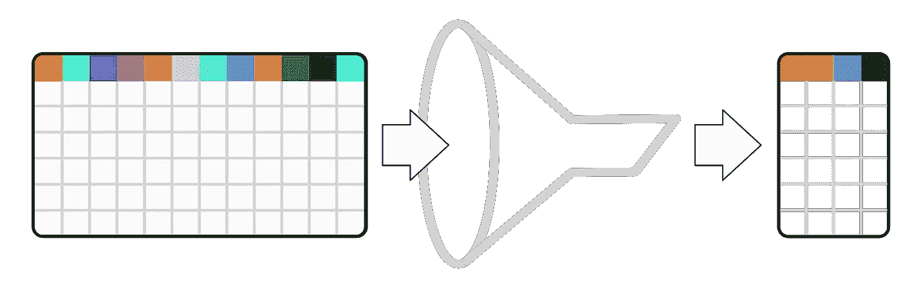
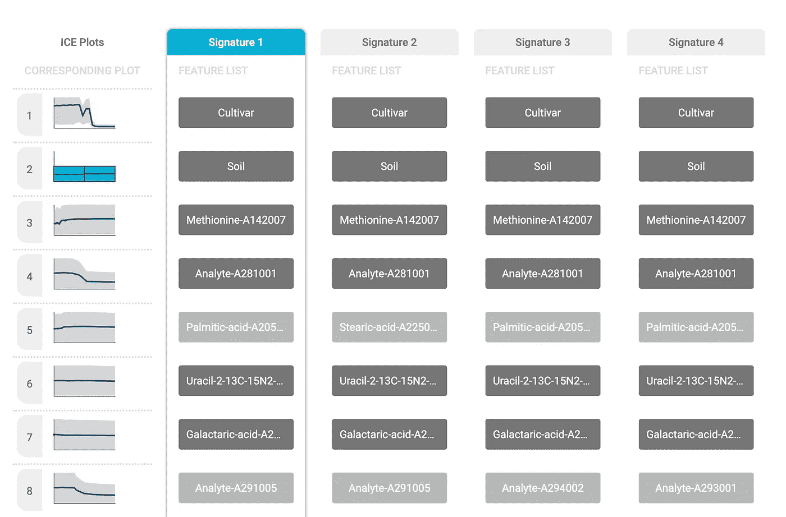

# 我们真的需要数据分析管道中的特征选择吗？

> 原文：<https://towardsdatascience.com/do-we-really-need-feature-selection-in-a-data-analysis-pipeline-dc8401621c6c?source=collection_archive---------22----------------------->

## 定义特征选择问题并识别其优点和缺点显示了它的价值

照片来自 Shutterstock

在典型的数据分析或监督机器学习任务中，目标是使用一组预测器(也称为特征、变量或属性)为感兴趣的变量(也称为目标或结果)构建预测模型。这种预测模型构建的流水线通常由几个步骤组成，例如特征提取/构建(例如，使用降维技术)、预处理(例如，缺失值插补、标准化)、特征选择和模型训练。这些步骤中的任何一个，除了模型训练，当然都可以省略。这篇文章关注的是为什么我们在数据分析管道中需要一个特性选择步骤。要回答这个问题，我们首先需要定义什么是特征选择。接下来，我们需要检查它的优点和缺点，以便得出最后的结论。

# 什么是特征选择？

在机器学习和统计学中，特征选择，也称为变量选择、属性选择或变量子集选择，是选择相关特征的子集(也称为特征、变量或属性)以用于模型构建的过程，有人在维基百科中读到。这是一个相对模糊的定义，没有明确特征选择的目标。更清晰的定义如下:[特征选择可定义为**选择变量的最小尺寸子集的问题，这些变量集合(多变量)包含为感兴趣的目标变量(结果)**](http://proceedings.mlr.press/r4/tsamardinos03a.html)产生最佳预测模型所需的所有预测信息。

因此，特征选择任务的目标是在给定已经选择的变量的情况下，过滤掉不相关的或冗余的变量，并且仅选择那些为感兴趣的结果提供集体唯一信息的变量，从而产生在性能方面最优的预测模型。

**作者照片*:特征选择任务的目标是过滤掉不相关或冗余的变量，只保留那些为感兴趣的结果提供集体唯一信息的变量。***

# 使用特征选择的优势

通过只选择几个特征(最重要的特征)并且不考虑其余的特征，通常可以学习到更好的模型，尤其是在高维设置中。这是违反直觉的，因为**理想的机器学习建模算法**应该至少能够在不应用特征选择的情况下执行，因为由所选特征提供的信息已经包含在所提供的数据中。事实上，渐近地(即，当样本大小趋于无穷大)并且给定一个**完美/理想**学习算法(实际上，没有这样的算法)，没有理由为预测任务执行特征选择。

然而，在实践中，解决特征选择问题有几个优点。通过移除不相关和冗余的特征，建模算法的“工作”变得越来越容易，因此通常会产生更好的最终模型。使学习算法的任务变得更容易的另一个优点是，它的训练时间变得更短，并且使用更少的资源(例如，存储器)。这是因为良好的特征选择有助于建模，特别是对于易受维数灾难影响的算法。

特征选择是监督机器学习管道中的一个常见组件，当分析的目标是**知识发现**时，特征选择是必不可少的。知识发现在分子生物学和生命科学等领域非常重要，在这些领域，研究人员主要对理解问题的潜在机制感兴趣。选择一个特征子集可以简化模型，使它们更容易被研究人员/用户解释。最后，特征选择的一个重要方面是用户通过使用具有较少特征的模型可以实现的成本优化。如果测量某些特征非常昂贵，并且每个特征都与成本相关联，那么这一点尤其重要。

# 特征选择的缺点

[特征选择问题是 NP 难的](https://www.tandfonline.com/doi/abs/10.1080/00949658208810560?casa_token=pQPgnwLItcAAAAAA:uPT20cBuQ1kv42Pj3CCziVax_59wStJt2hmTgjKZqlYfzxhrMu3UBJsGrqfU8r3tl-I-xTL1cEU)。对于线性模型，有几种方法可以精确地解决这个问题(也称为最佳子集选择问题)。虽然结果很有希望，但精确的方法最多只能处理几百或几千个变量(因此，它们不适用于高维数据)。

为了有效地解决特征选择问题，大多数方法依赖于某种近似。大多数近似方法可以大致分为[逐步方法](https://www.amazon.com/Statistical-McGraw-Hill-Operations-Decision-Sciences/dp/0072386886)如 [FBED](https://www.jmlr.org/papers/volume20/17-334/17-334.pdf) ，基于稀疏性的方法如 [LASSO](https://rss.onlinelibrary.wiley.com/doi/abs/10.1111/j.2517-6161.1996.tb02080.x?casa_token=1z9yc850ksYAAAAA:nkjsoyqcQ0qUaZv8hHxoAvFvlLYxWsqW5tmlQ6LQ4yoVsILcNfNv0ngE4jZ48UAEx9CcYA91pGunMw) ，[信息论方法](https://www.jmlr.org/papers/volume13/brown12a/brown12a.pdf)，以及[基于因果的方法](https://www.jmlr.org/papers/v11/aliferis10a.html)。尽管它们是近似值，并不能解决确切的问题，但对于一大类分布或在某些条件下，它们仍然是最佳的。

我之前提到的一个优点是，只选择一个特征子集可以在更短的时间内训练出简化的模型。不幸的是，通常的情况是，特征选择的任务本身非常慢，这减少了更快的模型训练的好处。但是，这可以通过缓存所选要素并因此仅应用一次要素选择来进行优化。

绝大多数特征选择方法的另一个缺点是，它们任意地寻求识别问题的唯一解决方案。然而，在实践中，经常会有多个预测甚至信息[等价解存在](https://www.ncbi.nlm.nih.gov/pmc/articles/PMC2675502/)。尤其是在潜在问题中存在固有冗余的领域中。分子生物学就是这样一个例子，通常存在多种解决方案。

虽然单个解决方案对于构建最佳预测模型是可接受的，但是当特征选择被应用于知识发现时，这是不够的。事实上，它甚至可能是误导。例如，如果一项医学研究中的几组风险因素对一个事件的总体预测能力相同，那么只返回其中一组并声称其余的都是多余的就是误导。

**作者照片:** ***对 JADBio 进行的用于马铃薯品质预测的代谢生物标志物的分析产生了多种解决方案(Steinfath 等. Plant Biotechnol J. 2010 Oct8(8):900–11).在第五个特征中区分了 4 个等价的解决方案。***

# 定论

简而言之，我建议是的，我们需要在我们的数据分析管道中进行特征选择。即使本文中列出的优点和缺点并不详尽，我认为使用特性选择的好处已经很明显了。特别是在任务包含高维数据的情况下，知识发现和/或不同特征与不同成本相关联是优先的。事实上，我们能做的最好的(这是我们在 JADBio 中的选择；[www.jadbio.com)](http://www.jadbio.com))用于测试有无功能选择的配置。当然，这伴随着我们需要考虑的任何资源限制，但是在任何情况下，我们都可以尝试各种技巧。最后，不要忘记“赢家的诅咒”无时无刻不在困扰着你，你创造了无数的模型([你能信任 AutoML 吗？](https://www.kdnuggets.com/2020/12/trust-automl.html))。