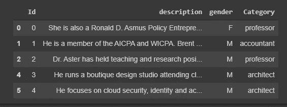
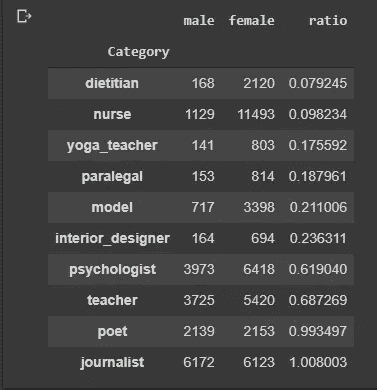
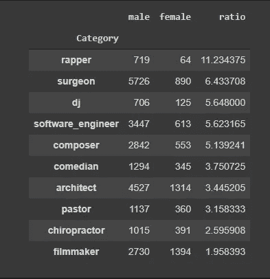
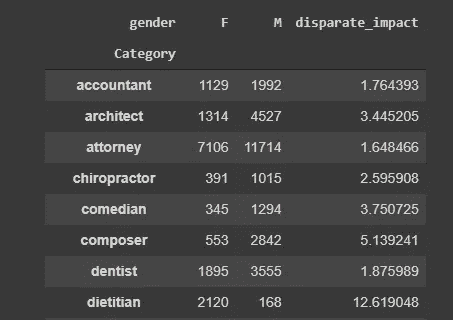

# 你在训练一个 AI 的时候会考虑公平的成分吗？

> 原文：<https://towardsdatascience.com/do-you-consider-the-fairness-component-when-training-an-ai-58cee6e16f6a?source=collection_archive---------32----------------------->

## 以下是我对为什么公平在人工智能/人工智能领域很重要的看法

普里西拉·杜·普里兹在 [Unsplash](https://unsplash.com/s/photos/gender-equality?utm_source=unsplash&utm_medium=referral&utm_content=creditCopyText) 上的照片

我想你花了无数个小时在一份工作申请上，却发现申请被拒绝了，不是因为缺乏技能，而是因为申请人是女性。

是的，这是不公平的。

这实际上发生在亚马逊，当时他们正在测试一个自动化系统，通过使用人工智能的帮助，从一群申请人中选择最佳候选人。人工智能是根据 10 年来收集的简历进行训练的，训练数据中的大多数简历都属于男性。这影响了人工智能在选择过程中偏向男性。此外，它描绘了科技行业男性主导的可悲现实。你可以在这里阅读这篇文章[的更多内容。](https://www.reuters.com/article/us-amazon-com-jobs-automation-insight-idUSKCN1MK08G)

随着人工智能发展的增长，许多复杂而耗时的任务正在通过预测模型实现自动化。每年都有一套新的复杂的人工智能架构被建立起来，这种架构的决策过程的可解释性正在下降。这增加了认可机构有偏见或“不公平”的原因。

# 敏感特征

由[trollino](https://unsplash.com/@trollinho?utm_source=unsplash&utm_medium=referral&utm_content=creditCopyText)在 [Unsplash](https://unsplash.com/s/photos/sensitive?utm_source=unsplash&utm_medium=referral&utm_content=creditCopyText) 上拍摄的照片

当 AI/ ML 模型在包含诸如性别、种族、民族等敏感特征的数据上被训练时，将不会被证明是公平的模型。他们会捕捉数据中存在的差异，并在他们的预测中表现出来。因此，我们通过在训练过程中使用敏感特征，将偏见(性别偏见、种族偏见等)添加到模型中。

可能存在这样的情况，当您不使用任何显式敏感特征来训练模型时，模型中仍然会有一些偏差。这可能取决于其他因素，如数据不平衡。如果模型的可解释性很低，这个问题就很难解决。我们需要了解这些数据是如何被用来做最终预测的。

# 偏见

克里斯蒂安·卢在 [Unsplash](https://unsplash.com/s/photos/bias?utm_source=unsplash&utm_medium=referral&utm_content=creditCopyText) 上的照片

一般来说，偏见是一种潜在的假设，我们利用它来做决定。人类天生就有偏见，这种偏见使我们能够更快地做出决定。当人工智能从数据中学习时，我们从以前的经验中学习，并做出一些心理构建来做出决定。这些偏见中的一些实际上帮助我们做出好的决定，但有时没那么大帮助。

对于一个人工智能模型，我们希望消除**不想要的偏见**，并使模型在做出判断/决定时公平。

这些有偏见的人工智能的更多例子可以在下面的文章中看到:

1.  [**研究揭露脸书招聘广告中的性别偏见**](https://www.dw.com/en/study-unveils-facebook-gender-bias-in-job-ads/a-57152645)脸书的人工智能向特定性别展示了某些广告，如向男性观众展示多米诺的送货工作等。
2.  [**数百万黑人受医疗算法中的种族偏见影响**](https://www.nature.com/articles/d41586-019-03228-6)一种算法被开发出来给病人分配风险分数，其中倾向于给黑人分配比同样患病的白人低的风险分数。
3.  [**一种流行的算法在预测犯罪方面并不比随机选择的人更好**](https://www.theatlantic.com/technology/archive/2018/01/equivant-compas-algorithm/550646/)COMPAS(替代制裁的矫正罪犯管理剖析)给一个人分配一个分数，表明犯罪的风险。
4.  [**抱怨推特图像裁剪算法存在偏见**](https://blog.twitter.com/engineering/en_us/topics/insights/2021/sharing-learnings-about-our-image-cropping-algorithm)用户质疑推特算法在裁剪图像时存在性别和种族偏见。

正如你所看到的，有很多例子表明有偏见的人工智能加剧了社会不平等。从道德和伦理的角度来看，这是一个问题。

# 偏差来源

马库斯·斯皮斯克在 [Unsplash](https://unsplash.com/s/photos/source?utm_source=unsplash&utm_medium=referral&utm_content=creditCopyText) 上的照片

从我们人类的角度来看，我们说人工智能算法是有缺陷的，无法解决有偏见的预测问题。

相反，人工智能会认为已经建立的模型是基于实际现实的。就像，人工智能会从我们提供给它的数据中学习东西。如果偏差固有地存在于数据中，那么预测模型也会有偏差。

因此，预测偏差的一个来源来自数据本身。例如，考虑一下亚马逊的自动简历选择器。如果输入数据由男性候选人的许多简历示例组成，则最终的预测/决策将倾向于接近男性候选人(因为该算法是在男性候选人数据多于女性候选人数据的基础上训练的)。

也许，我们可以通过向人工智能模型提供由相同数量的两性简历组成的数据来调整这些有偏见的预测。在接下来的章节中，我将讨论一些技术来**消除**有偏预测模型。

# 示例数据集

我参加了一个关于 NLP 多类分类任务的 [Kaggle 竞赛](https://www.kaggle.com/c/defi-ia-insa-toulouse)，我们得到了各种工作的描述，我们的目标是将它们与 28 种不同的工作进行匹配，如牙医、教师、律师等。

> 注:本次 Kaggle 比赛数据采集自 [CommonCrawl](https://www.wikiwand.com/en/Common_Crawl) ，免费使用。

在这里，我们有一个明确的性别特征分配给每个职位描述。在工作描述的文本中存在一些隐含的性别信息，如代词(他/她)，性别词(母亲，父亲，儿子，女儿等)。

数据集(来源:作者)

从数据集的截图中，我们可以看到职位描述中的性别代词，也是一个性别特征。

让我们检查数据集中各种工作之间的性别差异。

## **女性较多的十大工作示例:**

女性占主导地位的工作实例(来源:作者)

我对每个职位的数据集中出现的例子进行了比例分析(男性:女性)。从图中，你可以看到像 ***营养师、护士、教师*** 这样的工作似乎更以女性为主。

像 ***诗人*** 和 ***记者*** 这样的工作，男女比例接近 1，我们看到男女比例几乎相等。

## 男性较多的 10 大工作:

男性主导的工作实例(来源:作者)

如果我们访问光谱的另一端，我们看到像 ***说唱歌手******外科医生******DJ***这样的工作大多是男性主导的。

这显示了我们将输入到人工智能模型中的差异。该模型将根据这些差异和性别敏感特征进行训练，以成为有偏差的预测模型。

尽管我们会提出一个在测试集上表现相当好的精确模型，但它不会是一个公平的模型。

在这种情况下，偏差可能会从以下方面蔓延到模型中:

1.  性别特征
2.  描述中隐含的性别信息
3.  高度不平衡的工作类别，如营养师，说唱歌手。

# 有什么解决办法吗？

约翰·施诺布里奇在 [Unsplash](https://unsplash.com/s/photos/solution?utm_source=unsplash&utm_medium=referral&utm_content=creditCopyText) 上拍摄的照片

有一些方法可以解决这个问题，但我们不能完全消除这个问题。

我们(我的团队)在比赛中研究的方法:

1.  删除性别特征，不要在培训过程中考虑它。
2.  删除所有与性别有关的词汇，如代词、名词、形容词等。
3.  在训练模型之前，去除单词嵌入的偏差。
4.  语言反向翻译。

总之，我们的目标是通过执行文本预处理，在稍后阶段，在我们训练模型之前，消除单词嵌入的偏见，从源头上消除性别偏见。

我们用于去偏置的一些 python 库:

*   Debiaswe:尽量减少单词嵌入的性别歧视
*   [双硬 Debias:为性别偏见缓解定制单词嵌入](https://github.com/uvavision/Double-Hard-Debias)

我们能够完全消除偏见吗？

不幸的是，没有，没有完全，但我们设法在某种程度上减少了偏见。

# 公平性度量

对于这个特定的数据集，我们使用宏观不同影响作为性能指标来计算模型的公平性。对于每项工作，我们采用最大性别数与最小性别数的比率。

公平指标(来源:作者)

例如，要计算 ***会计*** 工作的不同影响，我们只需用最大性别数(1992)除以最小性别数(1129)。所有工作都是如此。

要计算宏观不同影响，只需取所有单独不同影响分数的平均值。

> 鸣谢:在本次比赛的 78 支参赛队伍中，我的队伍在 [Kaggle 私人排行榜排名](https://www.kaggle.com/c/defi-ia-insa-toulouse/leaderboard)中名列第八。

# 结论

使用人工智能自动化复杂的任务令人印象深刻，但我们应该首先解决由此产生的问题，即有偏见的预测模型。人工智能中的公平性最近得到了很多关注，更多的研究正在进行中，以使模型尽可能公平。可解释的人工智能(XAI)也是一个重要的主题，它可以指出模型中偏差的来源。

有一些研究希望提高人工智能情况下的公平性:

*   [Fairness 360](https://aif360.readthedocs.io/en/latest/):IBM 开发的一个 python 库，用来减轻偏见，增加模型的公平性。
*   公平流:脸书为了减少人工智能中的偏见而使用的工具。
*   ML-Fairness Gym:Google 开发的一个工具包，用于研究人工智能中的公平性。

最后，人工智能中的公平已经引起了业内大玩家的关注，更多的研究将被投入到这个主题中。所以，如果你还没有看过的话，绝对值得你花时间去看看。

如果你看到了这篇文章的这一部分，感谢你的阅读和关注。我希望你觉得这篇文章内容丰富，并且可以通过 [LinkedIn](https://www.linkedin.com/in/rohithteja/) 、 [Twitter](https://twitter.com/RohithTeja15) 或 [GitHub](https://github.com/rohithteja) 联系到我。