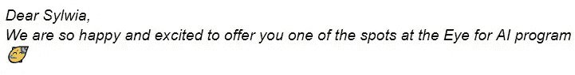
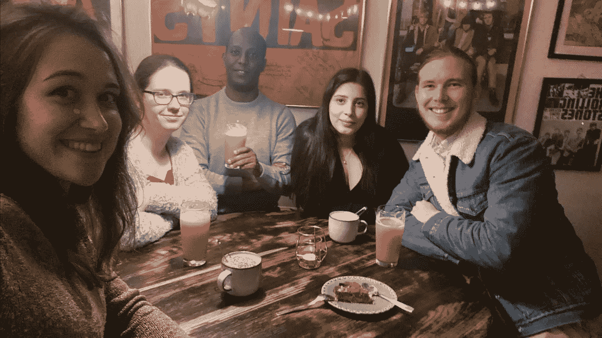
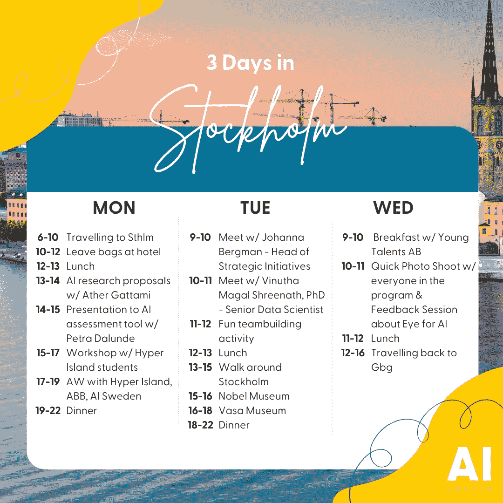
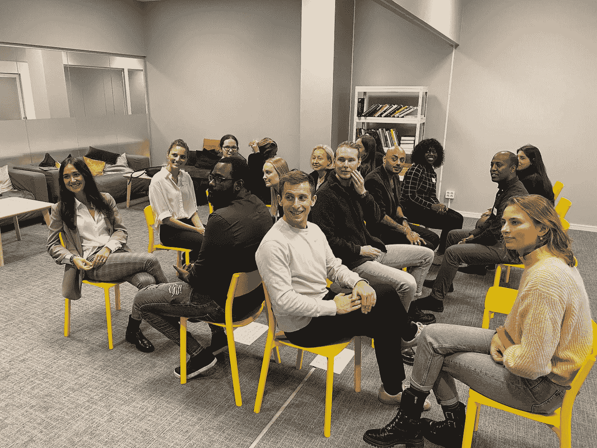
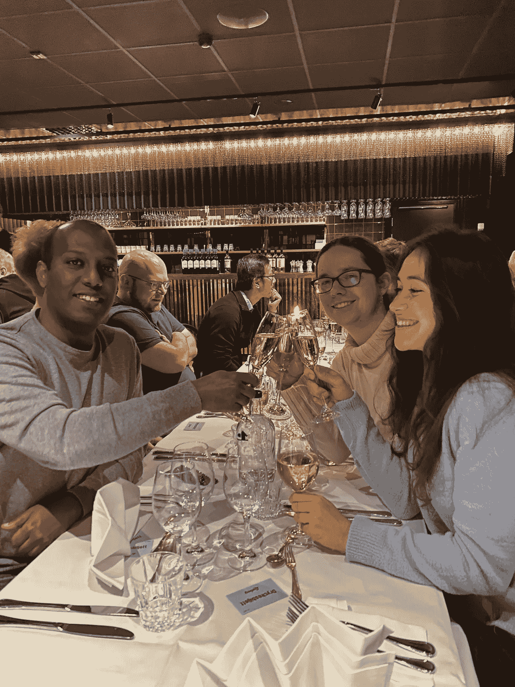

# 通过吸引国际人才加速瑞典应用人工智能的发展

> 原文：<https://towardsdatascience.com/do-you-have-an-eye-for-ai-82161a0baf34?source=collection_archive---------37----------------------->

为了加强瑞典在人工智能领域的吸引力，人工智能瑞典公司与三个合作伙伴组织一起推出了人工智能人才计划之眼。[*syl wia Majchrowska*](https://sylwia-majchrowska.medium.com/)*分享她是如何在 AI 人才计划中脱颖而出的。*

照片由[玛丽娜·维塔莱](https://unsplash.com/@marina_mv08?utm_source=medium&utm_medium=referral)在 [Unsplash](https://unsplash.com?utm_source=medium&utm_medium=referral) 上拍摄

我过着有序稳定的生活，在一个与计算机视觉领域相关的研究项目中有一份专业工作(然而，合同将于 10 月底到期)，还在攻读物理学博士学位(正在最后冲刺，目前主要专注于完成一篇论文)。然而，在 9 月初，整个稳定并不重要，因为我收到了一封电子邮件，开头是一句话:

不到一个月，我整理好未了的事情，收拾好行李箱，动身前往瑞典。不过这个故事还是从头说起吧。

# 你对人工智能有眼光吗？

[人工智能之眼项目](https://www.ai.se/en/eyeforai)是一个为期 18 个月的独家项目，由[瑞典人工智能协会](https://www.ai.se/en)与阿斯利康大学、Sahlgrenska 大学医院和 Zenseact 共同创建，得到了人工智能妇女协会的支持。我正在参加人工智能之眼的第一个试点项目，这是一个面向人工智能未来领导者的研究生项目，于 2021 年 10 月开始。总共有 4 名候选人被选中参加这个项目——我来自波兰，另外 3 名优秀的候选人来自世界各地:西班牙、伊朗和厄立特里亚。在这个项目中，我与来自西班牙的女孩桑德拉搭档，我将与她轮流工作——在每家公司工作 6 个月。

第一次和我来自人工智能项目的新朋友见面。图片作者。

# 人工智能瑞典的第一步

该计划的前两周是位于哥德堡的 AI 瑞典组织的入职流程(第一周，我主要在网上准备，而我在波兰还有一些未完成的任务)和斯德哥尔摩(第二周的前 3 天)。在我踏上这个斯堪的纳维亚国家的第一步时，项目主管陪着我。作为该项目的参与者，我获得了有竞争力的薪酬、住房解决方案和积极融入瑞典社区。我现在的老板负责把我从机场带到我的新公寓(也是他帮我找到的)。人工智能项目经理的眼睛在招聘过程的每一步都做了非常好的组织，并在一开始就照顾我们瑞典！他们准备了一个精彩的介绍日项目，让我们有机会见到来自瑞典 AI 公司和合作伙伴公司的了不起的人。

斯德哥尔摩三日游计划。图片作者。

来认识新面孔。我有机会见到了管理该组织的人员、其目标和令人感兴趣的使命，即

> “为了我们的社会、我们的竞争力以及生活在瑞典的每个人的利益，加速人工智能的使用”。

为了实现这一使命，该组织开展了许多活动，培训人工智能领域的未来领导者和人才。AI Sweden 创建了数据工厂和 Edge Lab，通过提供积累资源(硬件、软件和数据)的空间，在一个共同的操场上连接其合作伙伴！

但是技术和资源还不足以实现人工智能的转变。公司正在培训来自[超级岛](https://www.hyperisland.com/)的天才学生参加[人工智能改变代理程序](https://www.ai.se/en/join-our-team/ai-change-agent)。人工智能变革代理人这一新角色背后的主要思想是，通过了解人工智能的可能性和挑战，学习如何进行组织变革，以找到新的工作方式，因为每个组织都是不同的——有不同的目标、使命，并处于不同的水平。理解如何在这种环境下采取行动，通过使用人工智能使员工的工作变得更容易，这种能力非常重要。

与超级岛学生的团队建设活动。图片作者。

加速人工智能的另一个关键限制因素是数据隐私限制，特别是在医疗保健领域，我的项目专业部分始于 Sahlgrenska 大学医院。Sahlgrenska 大学医院旨在通过建立由 Magnus Kjellberg 领导的人工智能能力中心来关注人工智能。我参与的第一个项目与合成数据生成和联合学习有关，在我看来，这在开发该领域的人工智能方面起着至关重要的作用。此外，我们计划指导一些与任务相关的硕士论文项目。我相信这是一个很好的机会去探索更多，也发展我自己的软技能。

# 融入瑞典社会

但是人活着并不仅仅是为了工作。我到达瑞典的时间有点晚(我需要额外的一周时间来准备移居到这个国家)，我的项目同事证明是不可替代的，他们在两天内就带我参观了哥德堡。他们以当地人的身份带我参观了这座城市。我们参观了 Haga，这是市中心最古老的街区之一。在这里，我第一次参加了一个瑞典 fika(一个喝咖啡的休息时间，是的，有一个特别的词来形容那个时间！)在瑞典。哈加街上满是糖果和咖啡馆。我尝了一个盘子大小的肉桂面包，味道好极了！

瑞典 fika！图片作者。

在入职过程中，我们有很多机会加深相互了解。其中之一是在 Zensacts 成立一周年之际，在哥德堡市中心的游乐园 Liseberg 玩了一整天。实际上，Liseberg 的整个景色是为即将到来的万圣节准备的——充满了南瓜和可怕的装饰。我们玩游戏机很开心，还可以尝试过山车——螺旋。我们也有机会聆听了首席执行官的激励性演讲，并在音乐的伴奏下与 Zensact 员工共进晚餐。

我和朋友在利斯堡的正式餐厅。图片作者。

甚至我现在居住地的周边都有利于与人融合。这座建筑位于两个城市的中心——哥德堡和蒙达尔。它位于靠近 Sahlgrenska 大学医院和阿斯利康 R&D 中心。此外，靠近自然保护区让我有机会在工作之余呼吸新鲜空气。湖边专门准备了烧烤的地方，让我们可以在温暖的日子里和邻居一起吃饭。

自然保护区里山与海交汇的地方。图片作者。

了解了瑞典语，融入瑞典社区将变得更加容易——到目前为止，每次去商店都与一次难忘的冒险和对食品杂货的猜测有关。为了学习瑞典语，我们每周五都组织课程。我相信整个项目将会是一次奇妙的经历，并永远改变我的生活。

*原载于 2021 年 11 月 8 日*[*https://majsylw . netlify . app*](https://majsylw.netlify.app/post/eye4ai/)*。*