# 你知道 Python 有内置数组吗？

> 原文：<https://towardsdatascience.com/do-you-know-python-has-built-in-array-c2afa4200b97?source=collection_archive---------4----------------------->


由 [pasja1000](https://pixabay.com/users/pasja1000-6355831/) 在 [Pixabay](https://pixabay.com/photos/alpine-highway-panorama-far-view-3673008/) 拍摄的照片

## 大家都用“List”，但是 Python 确实有“Array”

当我们在 Python 中说“数组”时，很可能我们指的是“列表”。确实如此。Python List 是 Python 中一个非常强大灵活的容器类型。虽然有点令人困惑，但我们总是在 Python 中使用 List，就像在大多数其他编程语言中使用等价的概念“数组”一样。

或者，你可能会说 Python 确实有“数组”，但它来自 NumPy 库。那也是真的。当我们在处理数学问题时，通常是多维数组或矩阵，NumPy 数组是一个必备的工具。

然而，以上两者今天都不会在本文中介绍。我要介绍一下 Python 中的“数组”。没错，既不是“List”，也不是 NumPy“Array”，而是 Python 内置的“Array”。你知道有这种东西吗？

# Python 数组基础


照片由[pineapple 22 在](https://pixabay.com/users/pineapple22productions-14350514/) [Pixabay](https://pixabay.com/photos/machined-parts-metal-metallic-4673366/) 上制作

该数组是内置的 Python，这仅仅意味着您不需要下载和安装它，因为它肯定附带了本机 Python。但是，就像“datetime”等其他内置库一样，您仍然需要导入它。

```
import array
```

在我们使用数组之前，重要的是要理解它仍然与大多数其他编程语言中的典型数组概念有很大的不同。

最特殊的特征是它必须用类型代码来定义。我们可以列出所有可用的类型代码如下。

```
array.typecodes
```

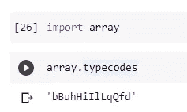

每个字符对应于数组将包含的特定数据类型。类型代码和相应的类型可在以下官方文件中找到。

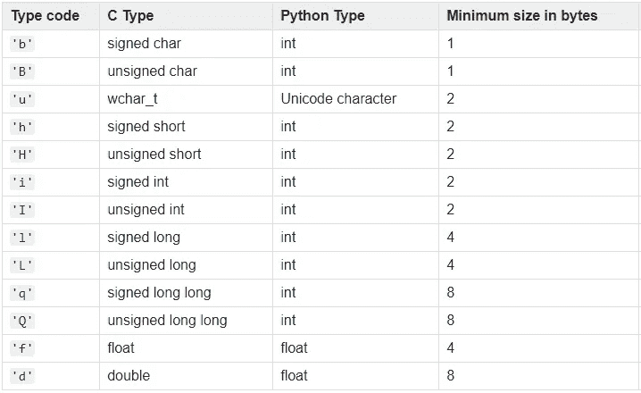

Python 官方文档中的表格:`[array](https://docs.python.org/3.9/library/array.html#module-array)`

数组的类型代码必须在数组实例化时定义。这也意味着

> Python 数组只能包含某种类型的元素。

这和列表很不一样，对吧？对于 Python 列表，我们可以灵活地将任何对象放在一个列表中，而不用担心它们的类型。

现在，让我们定义一个数组。我想再次导入这个库，如下所示，因为我不想让`array.array()`出现在我的代码中，就像`datetime.datetime.now()`有点难看一样。

```
from array import array
```

我们可以如下定义一个字符数组。

```
arr = array('u', 'abcdefg')
```

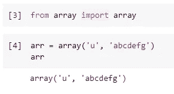

参考上表，类型代码“u”表示该数组包含 Unicode 字符。所以，这些字母将被分开处理，现在这个数组中有 7 个元素。

# 数组的功能


照片由 [PIRO4D](https://pixabay.com/users/piro4d-2707530/) 在 [Pixabay](https://pixabay.com/photos/iron-gate-wrought-iron-metal-gate-1623303/) 上拍摄

好的。这个内置数组好像挺独特的。因此，它也有一些相当独特的特点如下。

## 1.获取类型代码

因为类型代码对于一个数组来说非常重要，它决定了数组可以有什么样的元素。我们可以通过访问它的属性`typecode`来获取类型代码。

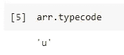

## 2.获取数组项的大小

如上所述，与 Python List 不同，数组要严格得多。也就是说，数组包含的项必须是相同的类型。因此，项目的大小也将相同。我们可以检查每个项目的大小。

```
arr.itemsize
```

不要混淆这不是数组的长度，而是数组中单个元素的大小。

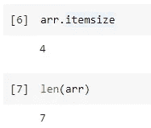

## 3.计算出现的次数

像 Python List 一样，这个数组也有`count()`函数，它将计算数组中某个项目的出现次数。可能你都不知道 Python 列表有这个？试试吧:)

```
arr.count('b')
```

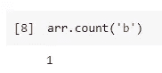

## 4.追加和扩展

如果我们想在数组中添加新的元素，我们可以使用`append()`或者`extend()`函数。前者将添加单个元素，而后者可以一次添加多个项目。

```
arr.append('h')
arr.extend('ijk')
```

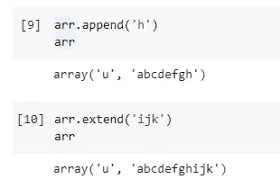

## 5.操纵索引

作为一个数组，我们必须能够使用索引对它做一些事情。是的，我们可以得到某个项目的索引。请注意，如果项目在数组中重复，我们将只有第一次出现的索引。

```
arr.index('c')
```

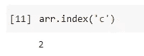

此外，我们可以在某个索引处插入一个条目。

```
arr.insert(2, 'x')
```

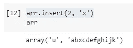

如果我们想删除某个索引处的某个项目，我们可以使用`pop()`功能。

```
arr.pop(2)
```

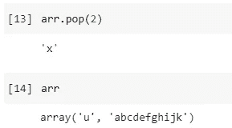

将该项弹出数组后，原始数组将被就地更新。

我们也可以如下反转数组。

```
arr.reverse()
```

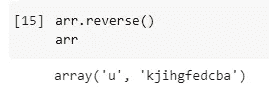

## 6.要列出的数组

当然，我们不必局限在 Array 的范围内，因为它是相当受限制的。如果我们想把它转换成一个普通的 Python 列表，这是很容易做到的。

```
my_list = arr.tolist()
```

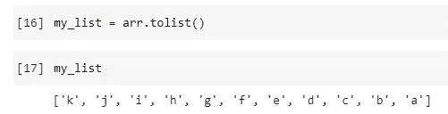

# 什么时候用 Python 数组？


[MustangJoe](https://pixabay.com/users/mustangjoe-2162920/) 在 [Pixabay](https://pixabay.com/photos/gears-cogs-machine-machinery-1236578/) 上的照片

我想这是最重要的问题。如果 Python 数组比 Python 列表有更多的限制，为什么我们需要它呢？换句话说，我们应该在什么时候使用它？

简短的回答是:您可能永远不会使用它，因为列表和 NumPy 数组通常是更好的选择。这也是很少有人知道 Python 有内置数组类型的原因。

但是，当一个东西被限制的时候，它一定会带来一些好处。那就是所谓的“取舍”。在这种情况下，Python 数组的大小将小于 Python 列表。

我们来举个例子。创建了一个包含 100，000 个整数的 Python 列表。然后，将其转换为 Python 数组。

```
list_large = list(range(0, 100000))
arr_large = array('I', list_large)
```

让我们看看它们的大小。

```
arr_large.__sizeof__()
list_large.__sizeof__()
```

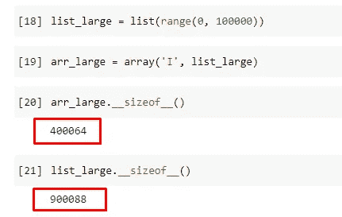

可以看出，数组的大小只有链表大小的一半左右，甚至小于一半。这是因为数组的类型码是固定的，每一项的字节数也是固定的。它失去了一些灵活性，但开销更少。

> Python 数组使用的内存比 Python 列表少。

# 摘要


由[免费拍摄的照片](https://pixabay.com/users/free-photos-242387/)在 [Pixabay](https://pixabay.com/photos/sparks-saw-equipment-metal-tool-692122/) 上

在本文中，我介绍了 Python 中内置的 Python 数组。它不是我们非常熟悉的 Python 列表。在数学计算和建模方面，NumPy 数组也不是非常强大。它内置于 Python 中，有很大的局限性，因为它只能包含相同类型的元素。

<https://medium.com/@qiuyujx/membership>  

**如果你觉得我的文章有帮助，请考虑加入灵媒会员来支持我和成千上万的其他作家！(点击上面的链接)**