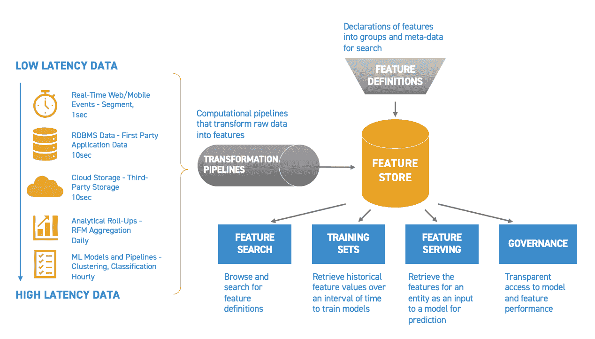

# 需要特色店吗？

> 原文：<https://towardsdatascience.com/do-you-need-a-feature-store-35b90c3d8963?source=collection_archive---------23----------------------->

## 特征商店使生产更精确的 ML 模型变得更容易和更便宜。

作者:[蒙特·兹韦本](https://mzweben.medium.com/)，[摩根·斯威尼](https://medium.com/@morgansweeney)

来源: [alexdndz](https://stock.adobe.com/contributor/203982763/alexdndz?load_type=author&prev_url=detail) /Adobe Stock

一个机器学习模型只会和它输入的数据一样好。更准确地说，一个模型的好坏取决于它被赋予的*特性*。

特征是从原始数据点或几个原始数据点的集合中提取的有用的度量或属性。模型中使用的特定特征将取决于模型试图做出的预测。例如，如果模型试图预测欺诈性交易，相关特征可能包括交易是否发生在国外，购买量是否大于平时，或者购买量是否与给定客户的典型支出不符。这些特征可以从诸如购买的位置、购买的价值、平均购买的价值以及进行购买的特定用户的合计消费模式等数据点来计算。

虽然训练 ML 模型的数据是最重要的，但准备好好的数据是数据科学家最具挑战性的任务之一。事实上，数据科学家平均 80% 的时间都花在了*数据准备*上。这包括收集数据，清理和组织数据，并将其工程化为特征。这项工作是手工的、单调的、乏味的: [76%](https://www.forbes.com/sites/gilpress/2016/03/23/data-preparation-most-time-consuming-least-enjoyable-data-science-task-survey-says/?sh=190034f26f63) 的数据科学家认为数据准备是他们工作中最不愉快的部分。也许最重要的是，这项工作可能是不必要的——整个公司的许多数据科学家最终都在埋头研究数据，以计算公司另一位数据科学家已经发现的相同特征。此外，数据科学家每次想要部署模型时，都要花费大量精力来复制相同的特征工程管道。

如果这看起来效率低下，那是因为它确实如此。小企业和领先的人工智能公司正在转向*功能商店*来解决这个问题。

**什么是特色店？**

来源:作者

一个 [**特征库**](https://splicemachine.com/product/feature-store/) 是一个专门用来自动输入、跟踪和管理机器学习模型中的数据的系统。功能存储计算和存储功能，使它们能够在整个公司范围内被注册、发现、使用和共享。要素存储可确保预测要素始终保持最新，并以一致的方式维护每个要素值的历史记录，以便可以对模型进行训练和重新训练。具体而言，特征存储包括:

1.  **自动化数据转换**
2.  **一致特征注册**
3.  **模特培训和再培训**
4.  **实时特征服务**
5.  **模式监控。**

**自动化数据转换**

要素存储管理将原始数据转换为要素值的数据管道。这些可以是一次聚合数 Pb 数据的预定管道(如计算大型零售商的每个客户 30 天、60 天和 90 天的平均消费金额)，也可以是由事件触发并即时更新特征值的实时管道(如在特定客户每次刷信用卡时更新其今天的消费总额)。

**一致特征注册表**

功能注册表是一个中央界面，用于对组织内的功能定义进行编目。要素注册表包含标准化的要素定义和关联的元数据，作为组织的单一信息源。

功能存储使搜索可用功能和功能定义变得简单明了。它向数据科学家公开 API 和 ui，以查看当前可用的功能、管道和正在生产模型中使用或正在开发中的训练数据集。然后，数据科学家可以挑选用例所需的特性，并将它们合并到模型中，而无需任何额外的代码。

**模特培训和再培训**

特征存储将较旧的特征组织到时间序列数据库中，以便在训练模型时，所有示例都具有同时对齐的特征。由于所有历史要素值都与其最新值一起存储，因此要素存储可为要素生成完整的训练数据集，并将其与训练标注正确对齐。随着这些特征的更新，特征库可以以完全相同的方式为模型再训练生成更新的训练数据集。

**实时特写服务**

特征存储为机器学习模型提供由最新特征值组成的单一特征向量。例如，如果应用程序想要向用户推荐特定产品，模型可能需要知道用户在特定支出类别中花费的平均金额，以及在过去 48 小时内花费在购物上的总时间。特性存储将拥有这些度量标准*的*最新值*，可立即用于模型*，而不必运行数据管道来计算它们。

**模式监控**

假设模型的所有先前预测都与当时模型的输入一起存储，则将这些要素(从要素存储中收集)与更新的标注(当它们可用时)与模型预测进行比较就变成了一个简单的 API 调用。这允许用户监控模型的性能，并跟踪任何特征漂移、模型预测漂移和模型精度(当标签可用时)。因为特征存储以时间一致的方式保存所有最新的特征值和所有历史值，所以使用特征存储监控模型很容易。

**特色店如何提高生产力和业绩？**

来源: [alexdndz](https://stock.adobe.com/contributor/203982763/alexdndz?load_type=author&prev_url=detail) /Adobe Stock

通过实现以下功能，特征存储提高了数据科学家的工作效率，并改善了企业中 ML 模型的性能:

1.  **特征重用**

在典型的数据科学工作流中，新项目需要收集数据，将其转换为可用的功能，培训，然后部署模型。因为特性不容易共享，多个团队在各自的筒仓中经常多次重复相同的特性工程工作。

有了要素库，数据科学家可以通过探索现有的要素，立即着手解决新问题。在许多情况下，用于过去模型的特征，或者由其他数据科学家构建的特征，可以在你的下一个机器学习项目中重用。

如果还没有所需的功能，数据科学家可以随时添加新功能，从而在将来为自己和他人加强功能存储。随着这一迭代过程的发展，它的价值通过加速数据科学和简化模型部署而增加。

**2。特征一致性**

缺乏一致的方法来计算特征会导致不同数据仓库之间的模型差异很大。例如，在一家零售公司中，一个团队可能通过从销售额中减去退货来计算“总客户收入”，而另一个团队只使用销售额来计算。两者都是有效的指标，但如果它们都被称为“总客户收入”，则会导致不同数据管道中计算的指标不一致。

功能存储的单一功能注册表为功能提供了一个中心位置，每个功能都以单一方式计算，因此不会再有混淆。

**3。时间点正确性**

用于训练的特征值组必须是在模型被训练的事件发生时已知的值。这确保了当模型用于预测时，它使用的输入特征值与其训练一致。特征存储通过产生训练数据集来解决这个问题，该训练数据集具有在建模事件的时间点从每个特征集的历史中获取的时间一致的特征值。

**4。模型可解释性和治理**

有了特性库，您可以轻松地识别模型训练的数据，并将其与部署的模型实际输入的数据进行比较。这使得迭代、训练和调试模型变得更加容易，因为您能够确切地看到您在什么时候使用了什么数据。此外，端到端的沿袭确保您可以回答为什么您的模型在过去的任何时间点做出某些预测的问题。

**特色店的好处**

来源: [alexdndz](https://stock.adobe.com/contributor/203982763/alexdndz?load_type=author&prev_url=detail) /Adobe Stock

数据科学家少之又少，而且价格不菲。通过消除重复和不必要的工作来提高数据科学生产力，意味着您可以用现有的员工在更短的时间内制作更多的模型。

通过将数据新鲜度提升到一个全新的水平，特征存储可以实现更精确的模型。通过将数据管道从 ML 模型中分离出来，可以在需要时立即检索可能需要数小时计算的基于聚合的大型特征。这使得实时模型能够访问它们原本无法访问的特征值。通过访问实时数据，模型可以根据现实世界中正在发生的事情进行更准确的预测，而不是停留在昨天的数据上。

功能商店允许企业人工智能以前所未有的方式扩展机器学习。特征商店不仅使你的模型尽可能的精确，它们还为你的 ML 团队提供了一个组织结构，使他们的工作更加容易和愉快。通过特色商店让您的公司在竞争中领先。

如果你想看一个特色商店的运作，看看这个 5 分钟的[视频](https://www.youtube.com/watch?v=4rpMIeBwgSk)。