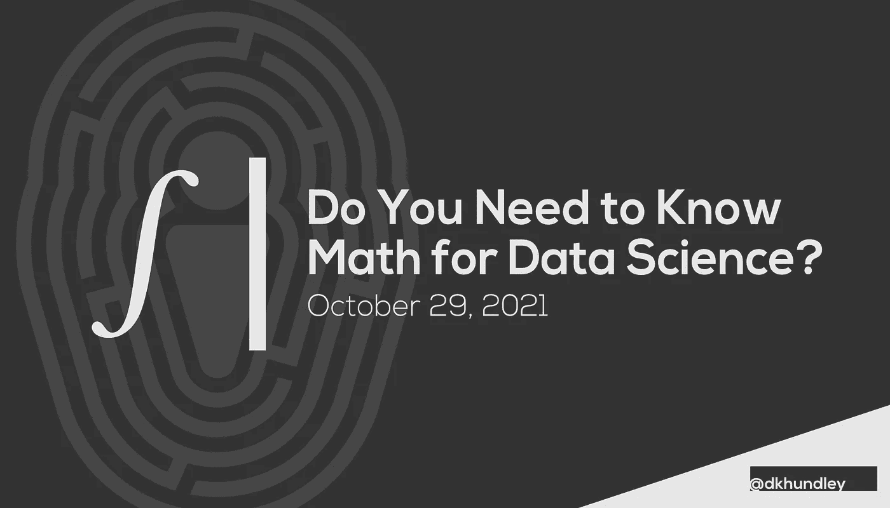

# 数据科学需要懂数学吗？

> 原文：<https://towardsdatascience.com/do-you-need-to-know-math-for-data-science-fb3a1761305c?source=collection_archive---------23----------------------->

## 这是我过去两年在学生和经验丰富的专业人士中工作的经验。

阻止人们进入数据科学领域的最大障碍之一是他们可能必须学习数学的观念，正如你可能猜到的，大多数人不想这样做。不幸的是，大多数人在高中时期都对数学感到厌恶。我个人认为，这在很大程度上是因为当我们能够将学习与现实世界的概念联系起来时，我们学得最好，我还没有看到很多高中水平的数学课为现实世界的数学概念打下良好的基础。

(在不进一步离题的情况下，我实际上想知道我们是否应该在高中开始教授数据科学的数学，这样学生就可以看到数学有多棒！)

如果你浏览数据科学家职位的招聘信息，你可能会发现需要某种形式的数学经验，通常是某种学士或硕士学位。当然，这进一步加强了对数学的需求，但有一点要记住，不仅仅是数据科学职位，工作职位通常写得不好，因为它们通常是由对该职位没有直接经验的招聘人员写的。同样，这不是数据科学特有的问题。这是几乎任何技术职位都会发生的事情。

说了这么多，我想我会分享我在这个领域从业两年多的想法。我不仅有机会在自己的公司工作，还有机会指导来自数据科学训练营的学生，指导参加传统四年制大学数据科学专业的大学生，等等。坦率地说，就我自己的经历而言，我没有任何正式的数学学位。事实上，我唯一的正式学位是在领导领域。但是我已经对数学和所有我们能用它做的很酷的事情产生了喜爱的欣赏。从 3Blue1Brown 制作的优秀视频到 Steven Strogatz 和 Ben Orlin 这样的人写的精彩书籍，我认为我是世界上少数热爱数学但没有数学学位的人之一。😂

为了解决这篇文章直接提出的大问题，答案并不是简单的“是或否”。实际上，我会很乐意在这里:**是的，你确实需要知道数学，但你需要知道某些数学概念到什么程度将取决于你的具体兴趣**。为了帮助弄清楚这到底意味着什么，我将把这篇文章的剩余部分分成两个主要部分。在第一个主要部分，我将把所需的数学知识分成三个不同的层次:第一层是所需的最低层次的数学知识，第三层是所需的最高层次的数学知识。然后，在第二个主要部分，我将给出一些例子，在这些例子中，我们将数据科学应用于所有行业，并分享我对该工作所关联的数学层的想法。

好的，让我们跳到这三个不同的层次！

# 数学教育的三个层次

在进入这些层次之前，我只想重申，这些只是由我自己和我自己的个人经历定义的。虽然我想我有资格对此给出一个体面的意见，但我完全认识到，互联网上一个人的意见本身并不意味着什么。这里的目的是给你一些初步的想法，告诉你如何规划你自己的数学学习之旅。我不一定要告诉你如何玩转我个人定义的这些层。

## 第 1 层:对数学的概念性理解

正如我在介绍中提到的，我不认为没有数据科学领域的数学教育是不可避免的。同时，我认为重要的是要承认**现在大多数数学都是由某种形式的计算机计算的**。无论是打开手机上的计算器应用程序为你的咖啡师计算适当的小费，还是使用电子表格汇总一列数字的总和，我们自己大多不再做数学计算了。

同时，即使是上面提到的那些比较琐碎的任务，还是有一定程度的数学知识的。我能在我的小费计算器中输入数字仅仅是因为我了解小数的基本乘法是如何工作的。数据科学在很大程度上也是如此。我们有许多像 Numpy 和 Scikit-Learn 这样的优秀代码库，它们会为我们做所有这些计算，而不需要我们自己去计算。事实上，深度学习现在成为一个东西的原因是，由于计算机在执行深度学习算法时进行的大量计算，人类几乎不可能创建像神经网络这样的东西。

因此，我会说**对任何数据科学家的最低要求是从概念上理解我们如何使用数学来支持各种数据科学活动**。尽管这听起来(也确实)比获得全面的数学教育容易，但我还是要说，你不能错过像中学数学教育这样的东西。在不深入探究我可能放入第 1 级桶的所有内容的情况下，您肯定需要知道的一些概念示例是统计概念(例如，平均值、标准差、统计显著性)、基本线性代数概念(例如，矩阵、线性变换)和基本微积分概念(例如，导数、积分、梯度下降)。

但是现代教育已经走了很长的路来教授这些概念，而学生不必学习基础的数学计算。例如，前面提到的 3 blue 1 brown[在 YouTube 上有一个关于线性代数的惊人系列](https://youtube.com/playlist?list=PLZHQObOWTQDPD3MizzM2xVFitgF8hE_ab)，它用动画教学生这些概念，并在很大程度上避免在计算本身上花费太多时间。因此，即使我知道什么是随机梯度下降(SGD ),以及它如何应用于深度学习神经网络，老实说，如果你让我写下数学公式，我也写不出来。

在我们进入下一层之前，我想指出的是，这一小节最长，因为**我个人认为大多数数据科学家不需要超过这一层**。在下一节中，我会用一些例子来解释得更清楚一些，但是我希望这能让你有所放松。在我自己的数据科学学习之旅开始时，我最初担心，如果没有获得正式的数学学位，我将无法进入这个领域。我很高兴地说，事实并非如此，即使这意味着你没有完全摆脱困境！

## 第 2 层:数学计算的中等知识

大多数人可能只具备第 1 层知识，但您最好的数据科学家需要更深入地了解底层计算，以获得最佳结果来解决业务问题。这些人仍然可能使用数据科学库来帮助增强他们的工作，但他们将能够以比第 1 层人员更优化的方式应用他们的知识。

如果没有一个具体的例子，很难描述这一层，所以我将用我自己作为例子。当我试图学习我们如何使用数学来比较两个信息矩阵之间的相似性时，老实说，我很挣扎，因为我对线性代数没有更深的理解。我向一个数学背景更强的朋友求助，他很快就能告诉我该做什么。

几年过去了，我一直在努力阐明那个问题是什么，但我还没有找到一种更干净的方法来完成那种工作，而不需要更深入地理解那些线性代数概念。换句话说，我仍然没有找到一个神奇的软件库，将所有这些计算抽象出来。同样，我确信如果我能更好地理解这些数学概念，有些事情我可能会做得更好。第二层次的最佳候选人可能拥有某个数学领域的学士学位，如果不是至少辅修某个数学领域的话。

## 第三层:数学专业教育

尽管我们在几乎每个行业都发现了数据科学的应用，但我认为仍有一些领域不可避免地需要全面的数学教育。我考虑的这些领域，往往甚至需要专门的执照才能成为一名积极的从业者。这将在我们下一节的例子中变得更加清楚。

# 这些层如何应用于不同空间的示例

好了，现在我们已经定义了我们的层，我想快速列举一些不同的例子会有所帮助。在下面的小节中，我将介绍一些不同的示例，说明我如何将该角色或活动与其中一个层对应起来，并简要解释我为什么要这样分类。让我们跳进这些例子！

## 机器学习工程师:第 1 层

这是我白天的工作。因为机器学习工程师(MLE)的职位定义非常模糊，所以我对它的定义是，MLE 更专注于在软件环境中实现预测模型，而不是自己创建这些预测模型。模型将由一个独立的数据科学家角色创建，因此 MLEs 更接近于一般的软件工程师，而不是数据科学家。但是对于 MLE 来说，理解基本的数学概念仍然是很重要的，因为他们经常需要整合一些有助于解决模型漂移等问题的方法。

## 初级数据科学家:第 1 层

正如我在上面提到的，使用像 Numpy 和 Scikit 这样的 Python 库有很长的路要走——在它们抽象出底层数学概念的时候学习。虽然我在日常工作中是一个 MLE，但我喜欢在工作之外创建自己的预测模型来取乐，我完全可以通过一级知识水平。同样，我认为即使是初级的数据科学家也无法通过中学水平的数学知识，所以在我看来，最低水平永远是第一级。

## 深度学习实践者:第 1 层

这可能会让一些人感到惊讶，但正如我上面提到的，深度学习几乎不可能用手来计算，因为计算机会进行数十亿次小计算来执行深度学习算法。无论你对自然语言处理(NLP)还是图像分类感兴趣，都无法回避这样一个事实，即你需要计算机的帮助来执行这些复杂的算法。当然，一般的深度学习实践者仍然需要理解像激活函数这样的东西如何在神经网络的各层之间使用，但我想说的是，理解实际计算如何工作并不那么重要。(当然，如果你想为一个主要的深度学习图书馆做贡献，那你就需要更像第三级知识的东西。)

## 首席数据科学家:第 2 层

虽然初级数据科学家可以在第 1 层知识上走得很远，但最好的数据科学家将能够在第 2 层知识上更进一步。正如我上面提到的，我的朋友能够比我更好地理解线性代数，能够在几乎没有任何时间内解决我试图解决的问题。我最终学会了如何做他在那个小问题上做的事情，但是如果没有第二层的知识，一个初级的数据科学家可能会在更复杂的问题上挣扎。当然，如果一个复杂的问题可以用更复杂的知识水平来解决，这些人应该得到适当的认可，这就是为什么首席数据科学家的角色几乎出现在每个利用数据科学的公司中。

## 精算分析师:第三级

当我写第三层的描述时，这正是我所想的，主要是因为我自己在保险行业工作。我完全认为精算科学是数据科学的一种形式，但我不可能委托一个具有 1 级或 2 级知识水平的人来构建精算模型。这些人需要三级知识，如果我没记错，我认为你必须通过一些精算考试，才能成为一名执业精算分析师。

## 硬件工程师:第 3 级

这可能是显而易见的，但我还是把它放在这里。如果你想创建类似用于深度学习的 GPU 的东西，你需要非常专业的数学背景，这是无法回避的事实。如今，硬件的游戏名称是“优化”，鉴于硬件工程师直接与这些特殊计算计算机芯片下面的芯片一起工作，这些人必须灵活运用他们的每一点数学技能来最大限度地利用芯片！

这篇文章到此结束！我希望这对刚刚开始进入数据科学领域的人们有所帮助。显然，最优秀的数据科学家将会是那些拥有最高知识水平的人，但是我希望这是令人鼓舞的，你不必拥有最强大的数学教育就可以进入数据科学领域。感谢阅读，下一篇文章再见！