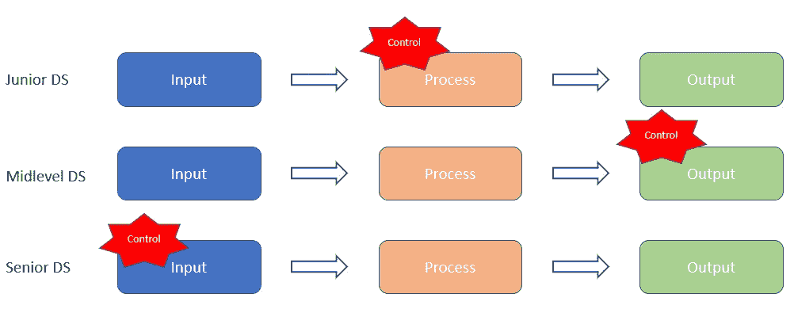

# 你需要管理一个数据科学家团队吗？—理解控制理论可能会改变一切

> 原文：<https://towardsdatascience.com/do-you-need-to-manage-a-team-of-data-scientists-aac3ad401ab4?source=collection_archive---------18----------------------->

[纪念媒体](https://unsplash.com/@heymemento?utm_source=unsplash&utm_medium=referral&utm_content=creditCopyText)在 [Unsplash](https://unsplash.com/s/photos/leadership?utm_source=unsplash&utm_medium=referral&utm_content=creditCopyText) 上拍摄的照片

## 我将如何使用它来管理初级、中级和高级数据科学家

数据科学家是商界非常抢手的职位。有很多人想进入这个领域，也有一些人想尽可能长时间地呆在这个领域。如果你不知道如何正确管理数据科学家，这可能会很困难，特别是当你在世界上晋升时，所以我们将根据控制理论讨论管理初级、中级和高级数据科学家的不同方法。

# 1.管理数据科学家的问题是

管理数据科学家的问题在于没有固定的方法。每个企业对其数据科学团队都有不同的需求和要求，因此管理他们的流程因公司而异。这不仅仅是管理人员，还包括管理项目和项目结果。您可能希望以一种方式管理初级数据科学家，而以另一种方式管理高级数据科学家。显然，您会将更具挑战性和更大规模的项目分配给高级数据科学家，这就是为什么以不同的方式管理它们是有意义的。然而，如果不了解原因和方式，管理初级数据科学家和中级数据科学家可能对任何一组人都没有效率或效果。更别说事先说清楚了。

例如，管理一个既有初级又有中级水平的团队，但只将更具挑战性的项目分配给高级人员，可能会导致低级人员感到沮丧，他们可能会觉得自己在职业生涯中受到阻碍或没有发展。你不会想这么做的，对吧？

考虑到所有这些，管理数据科学团队是一件棘手的事情，需要作为数据科学经理/领导者/老板的你进行大量的思考和规划…无论你给自己取什么头衔:)

# 2.什么是控制理论，它在工作场所是如何工作的

好的。你听说过控制理论吗？这个理论在管理领域已经存在了一段时间。基本上，控制理论认为，根据可能结果的不确定性水平和你可以采取的路径，你必须控制过程的不同方面。

上面的插图描述了我的意思。假设有一个明确定义的结果，并且你确切地知道你必须做什么来实现这个结果。该理论认为，你的管理重点应该放在员工的行为上。对于那些您知道可能的结果，但由于环境的变化，有多种方法可以达到结果的项目，那么建议您关注结果，并让您的员工灵活地想出如何达到结果。对于那些复杂的和/或“以前从未做过的”类型的项目，你应该把你的注意力集中在雇佣最有能力的员工来管理这个项目上。

# 3.初级、中级和高级数据科学家如何使用控制理论

通过定义明确的参数，你可以使用控制理论来管理初级数据科学家。例如，如果你是一名经理，负责向小型企业销售小工具，你雇用了三名经验水平不同的数据科学家，然后给每个人一个他们将负责的要素，如确保有足够的供应来满足需求，或管理活动成本或管理需求。

-如果你雇佣了一名初级数据科学家，那么定义上一个项目的成功之处，并设定清晰的参数来遵循该模式。对于这个角色，当你招聘这个角色时，你应该强调他们的技术能力和服从指示的意愿。他/她更可能做探索性的数据分析和文档。

-中层数据科学家在了解目标后，可以找出在这些界限内获得预期结果的方法。他们更有可能尝试新事物，因为他们对以前的项目有足够的经验。他们可能会测试不同的机器学习算法以获得定义的结果。在招聘这个职位时，你的面试问题应该设计成捕捉他们与其他团队成员合作解决问题的能力，并关注推动他们努力实现目标。

-高级数据科学家将更好地了解您的公司如何运作，以及设置哪些参数很重要，以便他们能够找到以最佳方式实现这一目标的方法。你可能想从一个你以前没有真正做过的想法或创新方式开始。你应该让高级数据科学家更自由地探索和挑战假设。因此，寻找他们以前管理项目的经验至关重要，从理想化到生产应该是你的雇佣标准。

# 4.为什么你应该尝试这种新的管理系统

我们知道这是典型的医院员工管理方式。当你走进一家医院时，你很可能会得到一名护士，她会例行检查你的体温和血压。假设你需要一名神经外科医生，你知道他/她不受预先设定的程序约束，也不受医院主管的密切监控/管理。

很容易根据一些任务的难度来分配任务和管理重点(例如，将简单的任务交给初级数据科学家)。然而，我建议你应该根据你所能控制的来转移你的管理重点。

-初级数据科学家需要得到更有经验的数据科学家的指导；如果听之任之，他们可能会觉得自己的能力和技能不够。

-中层员工将受益于对项目的控制，这使他们能够为自己(或与他们的初级数据科学家)做出决策。

-高级工作人员将能够在管理初级和中级工作人员的同时，汇集他们的经验和知识。

数据科学是一个需要理解统计学、机器学习和数据工程的领域。一次性学会所有这些技能并将其应用到实际项目中并不容易。建立你的技能需要时间和经验。随着你的职业向项目领导、经理或高管的方向发展，你需要开始考虑发展你的管理技能(即软技能)。当你成为经理、领导者或老板时，也许你可以利用控制理论来重新思考如何在管理多个项目和利益相关者的同时管理你的数据科学家。通常，将简单的任务分配给初级员工，将困难的任务分配给高级员工是一个好主意，但是使用这种方法，你可能会错过这两类员工提高技能的机会。