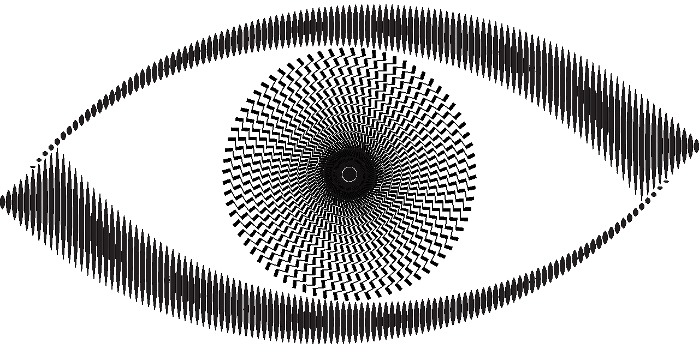
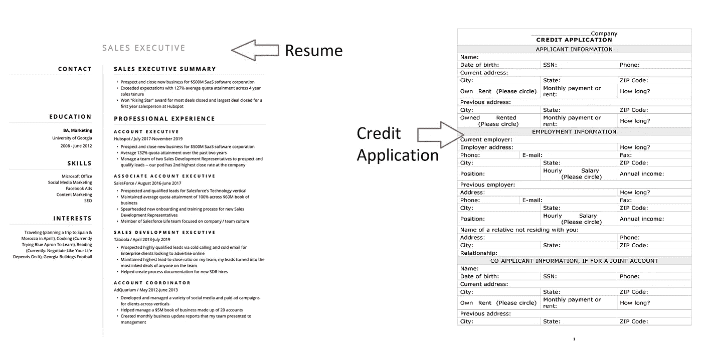
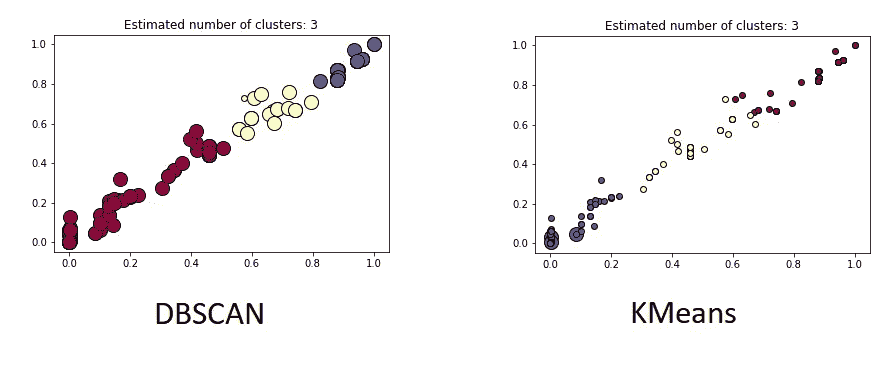
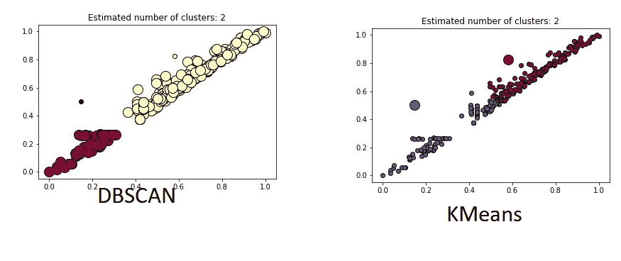
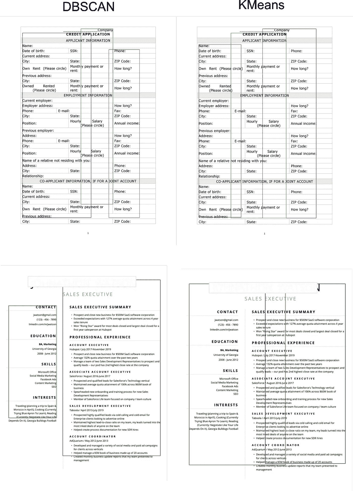

# 你看到我看到的了吗？

> 原文：<https://towardsdatascience.com/do-you-see-what-i-see-30af821b8015?source=collection_archive---------28----------------------->

## 无监督学习在文档布局中的应用

图片来自[皮克斯拜](https://pixabay.com/?utm_source=link-attribution&utm_medium=referral&utm_campaign=image&utm_content=4914536)的[戈登·约翰逊](https://pixabay.com/users/gdj-1086657/?utm_source=link-attribution&utm_medium=referral&utm_campaign=image&utm_content=4914536)

感知是第一个无监督的算法。

以视觉为例。你有没有注意到我们的大脑是如何自动将视觉空间中接近的事物分组的？请注意，在下图中，我们倾向于看到两组独立的 6 个点，而不仅仅是总共 12 个点的图像:

作者图片

这种自然的群体倾向并不是视觉所独有的。事实上，莫尔斯电码之所以有效，是因为听觉是围绕类似的[原理](https://books.google.com/books?id=Mu9wDwAAQBAJ&pg=PT56&lpg=PT56&dq=morse+code+and+auditory+perception+gestalt&source=bl&ots=p528GH9RkP&sig=ACfU3U31T7URDbExjD_aCpIsjZnW0CipaQ&hl=en&sa=X&ved=2ahUKEwimmMSP84v0AhVjFjQIHbuoAuEQ6AF6BAgTEAM#v=onepage&q=morse%20code%20and%20auditory%20perception%20gestalt&f=false)组织的。

在数据科学中，[无监督学习](https://en.wikipedia.org/wiki/Unsupervised_learning)是数学模型试图发现数据中自然出现的模式。一类无监督学习是聚类分析。聚类算法像我们的感知系统一样工作，因为距离有助于确定[数据](/the-5-clustering-algorithms-data-scientists-need-to-know-a36d136ef68)中的自然分组。

但是不同的聚类算法以不同的方式定义和使用距离来决定哪些数据属于哪个组。因此，对于相同的聚类任务，每种算法的性能可能会有所不同。

简而言之，仅仅因为我们的眼睛可能会看到一个清晰的集群解决方案，并不意味着我们的算法会得出相同的结论。

我们的眼睛可能会看到聚类算法可能会与之斗争的模式的一个领域是文档。在这个简短演示的剩余部分，我用两种不同的聚类算法(KMeans & DBSCAN)进行实验，并测试它们识别图像上文字的柱状结构的能力。这里我问这些聚类算法；你“看到”我看到的了吗？让我们找出答案。

# 文档理解

当我们看文件时，很容易感受到我们的感知系统在起作用。简历、表格、法律文件和学期论文都有一个页面布局的组织。在某些情况下，这些形式可能包括使用线条和网格对不同部分进行物理划界。在其他情况下，仅仅是单词的组织就足以让我们的眼睛知道哪个单词与哪个部分相匹配。

然而，对于机器来说，理解这些文档的布局并不容易。事实上，研究人员和公司已经在复杂的深度学习方法上花费了数百万美元，以自动识别文档中的不同部分。

不幸的是，这些深度学习方法有一些限制，包括它们的计算成本、手动标记数据的需要以及样本大小。简而言之，重点是使用深度神经网络架构的监督学习来更好地理解文档布局。

尽管我们几乎不用费力就能看到非常清晰的部分，但所有这一切都发生了。基于这种认识，我决定测试无监督聚类算法检测基本文档组织的能力。

# 实验

为此，我选择了两个示例文档，一个具有非常清晰的列组织，另一个具有稍微复杂一些的列组织。第一份是简历示例，第二份是信贷申请表示例:

作者图片

在这两个示例中，您可以在每个文档中看到不同的列组织。两个集群算法用于测试它们准确检测这个列结构的能力，KMeans 和 DBSCAN。

[KMeans](https://en.wikipedia.org/wiki/K-means_clustering) 算法通过在 n 维空间中随机初始化一个中心点来工作。中心点的数量由执行聚类分析的人员在运行模型之前确定。然后，根据每个点到最近质心的距离，将每个点分配到一个组中。一旦所有点被分组，就计算该组的平均值来更新中心。该过程重复进行，直到质心不再显著变化。

[DBSCAN](https://en.wikipedia.org/wiki/DBSCAN) (带噪声的应用程序的基于密度的空间聚类)另一方面，通过从 n 维空间中的一个点开始工作。然后，该算法将该起始点一定距离内的所有点进行分组，以形成聚类。距离度和最小点数是 DBSCAN 所需的唯一两个超参数。因此，DBSCAN 不具有与 KMeans 相同的限制，即先验地知道可能存在多少可能的集群。也就是说，距离，或称之为ε，通常需要调整。

为了实现测试，我使用了以下环境:

> 操作系统:Windows 10
> 
> Python 3.7.3
> 
> sci kit-学习 1.0.1
> 
> OpenCV
> 
> 熊猫
> 
> Matplotlib 3.3.2
> 
> 立方体立方体 5.0.0

# 密码

首先，我首先提供图像的路径，并使用内置的 Python 库 glob 列出所有图像。jpg 图片。然后，我使用 OpenCV 读入每个图像，将图像传递给 Pytesseract 的“image_to_data”方法，该方法返回一个制表符分隔的字符串。通过使用 Python StringIO 库，Pandas 的“read_csv”方法可以将制表符分隔的字符串正确地解释为数据帧。

一旦创建了 dataframe，我就删除空值并添加“right”和“bottom”列来标识找到的每个单词的右边和底部像素位置。聚类前的最后一步是规范化将在聚类中使用的“左/右”列，并将它们放入一个数组中。所有这些都在我命名为 data 的元组列表中捕获。

数据列表包括原始图像的名称、图像数组、来自 tesseract 的数据框以及标准化的左/右列数组。

一旦捕获了所需的数据，我就开始测试 DBSCAN 和 KMeans。在下面的代码中，我们通过为变量“an”输入一个值来手动输入我们想要生成输出的图像，然后运行下面的代码来生成输出。这里有一个例子:

为了进一步解释上面的代码，我们从数据列表中的每个元组提取以下信息:

> 用于聚类的左/右数组(X)
> 
> 具有镶嵌输出(df)的数据帧

然后，我们将聚类数组(X)传递给 DBSCAN(第 13–15 行)或 KMeans 模型(第 18–23 行)，生成并保存结果的散点图(第 26–64 行)，将数据帧连接到模型提供的聚类标签(第 66 行)，找到聚类的边界框(第 68–71 行)，并在保存之前将它们添加到图像中。请注意，运行模型和生成图像的代码很大程度上是从这里的[分叉出来的。](https://scikit-learn.org/stable/auto_examples/cluster/plot_dbscan.html)

# 结果呢

在这两种情况下，我们看到每种算法的表现都相似，只是结果有一些微小但重要的变化。对于 3 列图像(信贷应用程序)，两种解决方案都找到了相似的聚类，但分布略有不同。

作者图片

然而，最大的不同是两栏图像(简历)，KMeans 似乎将第二栏中的一些数据与第一栏混为一谈。

作者图片

在评估每个解决方案的边界框时，我们看到 KMeans 在 3 列图像中表现稍好，而 DBSCAN 在 2 列图像中表现好得多。

作者图片

# 结论

KMeans 的最大限制是该模型有几个超参数，我们可以进一步试验以调整解决方案，而 DBSCAN 只有 2 个(ε和聚类中的最小点数)。因此，DBSCAN 更容易调整，可以更有效地找到更适合 3 列图像的结果。

在这两种情况下，我们看到如何利用无监督聚类算法来帮助识别简单的文档列结构。如果试图对齐 OCR 引擎的输出，以便数据与其列标签正确对齐，这样的分析会非常有用。

简而言之，我们的无监督文档布局方法显示了聚类算法如何能够“看到”我们人眼所看到的，但也可能需要一些调整才能正确。

比如参与学习数据科学、职业发展或糟糕的商业决策？[加入我](https://www.facebook.com/groups/thinkdatascience)。