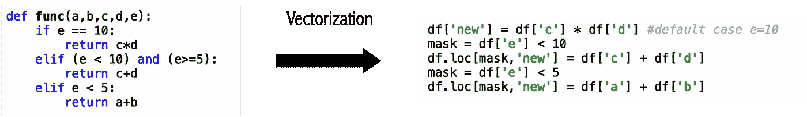
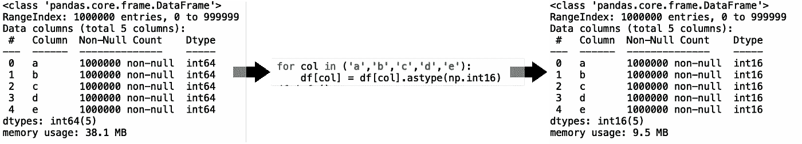

# 熊猫用 Apply 吗？有一种速度快 600 倍的方法

> 原文：<https://towardsdatascience.com/do-you-use-apply-in-pandas-there-is-a-600x-faster-way-d2497facfa66?source=collection_archive---------0----------------------->

## 通过利用矢量化和数据类型，您可以大大加快 Pandas 中复杂计算的速度

我最近读了另一篇文章,向你展示了如何加速熊猫的应用功能。这些文章通常会告诉您并行化 apply 函数，使其速度提高 2 到 4 倍。

在我向您展示如何将速度提高 600 倍之前，让我们用普通的 apply()来说明一个用例。


[信用](https://pixnio.com/architecture/street/architecture-building-city-clock-people-road-sky-speed-street)

# 熊猫申请

让我们假设您有一个熊猫数据帧 df，并想对它执行一些操作。

我将使用具有 1m 行和五列的数据帧(整数范围从 0 到 10；我正在使用类似于[这篇文章](/add-this-single-word-to-make-your-pandas-apply-faster-90ee2fffe9e8)的设置

```
df = pd.DataFrame(np.random.randint(0, 11, size=(1000000, 5)), columns=('a','b','c','d','e'))
```

我想应用一个基于“e”的逻辑，它将基于其他四列生成一个结果。

```
def func(a,b,c,d,e):
    if e == 10:
        return c*d
    elif (e < 10) and (e>=5):
        return c+d
    elif e < 5:
        return a+b
```

让我们用熊猫申请这个功能。

```
df['new'] = df.apply(lambda x: func(x['a'], x['b'], x['c'], x['d'], x['e']), axis=1)
```

我们得到大约 11.8 秒的运行时间(超过 10 次运行，最小运行时间为 11.7 秒)。

# 平行熊猫申请更快

您可以通过使用 [swifter](https://github.com/jmcarpenter2/swifter) 轻松地并行化这个过程。

由于 swifter 在默认情况下没有和 anaconda 一起安装，所以您必须先安装它。

```
conda install -c conda-forge swifter
```

我们现在可以通过在*应用*之前调用*更快的*来使用并行化应用

```
import swifter
df['new'] = df.**swifter**.apply(lambda x : func(x['a'],x['b'],x['c'],x['d'],x['e']),axis=1)
```

在我的 MacBook Air(使用 M1 CPU)上，我的平均运行时间为 6.71 秒(超过 10 次运行，最小运行时间为 6.45 秒)。这几乎是我们最初的 apply 实现的两倍。

> Python 中的并行化并不是灵丹妙药:您只能期待轻微的改进(如果有的话)。

# 熊猫矢量化

使用 Pandas 和 Numpy 的最快方法是**向量化**你的函数。另一方面，使用 for 循环、list comprehension 或 apply()沿着数组或序列逐个元素地运行函数是一种不好的做法。

[](/list-comprehensions-vs-for-loops-it-is-not-what-you-think-34071d4d8207) [## 列表理解 vs. For 循环:这不是你想的那样

### 许多关于堆栈溢出的文章、帖子或问题都强调列表理解比循环更快…

towardsdatascience.com](/list-comprehensions-vs-for-loops-it-is-not-what-you-think-34071d4d8207) 

让我们为前面的函数创建一个向量实现。如你所见，我用两个面具来识别相关案例。loc 来更新这些值。此外，默认情况是在不使用任何掩码的情况下分配的。



```
df['new'] = df['c'] * df['d'] #default case e = =10
mask = df['e'] < 10
df.loc[mask,'new'] = df['c'] + df['d']
mask = df['e'] < 5
df.loc[mask,'new'] = df['a'] + df['b']
```

现在运行时间为 0.035 秒(最小运行时间为 0.027 秒)。与 swifter 相比，这几乎提高了 200 倍！

> 矢量化将为您提供闪电般的执行速度


在这里下载我的书的摘录

# 较轻的熊猫数据帧

你可以通过使用另一个技巧来加快执行速度:通过使用更有效的数据类型来减轻熊猫的数据帧。

因为我们知道 df 只包含 1 到 10 的整数，所以我们可以将数据类型从 64 位减少到 16 位。

```
for col in ('a','b','c','d'):
    df[col] = df[col].astype(np.int16)
```



看看我们是如何将数据帧的大小从 38MB 减少到 9.5MB 的。很明显，您的计算机在处理将近 4 倍小的对象时会更轻松。

我们函数的运行时间现在减少到了大约 0.019 秒，这几乎是我们使用初始数据帧(使用 np.int64)的两倍。

在现实生活中，你可能没有足够的运气拥有一个只有小整数的数据集。尽管如此，你可以通过使用 np.float32 而不是通常的 np.float64 或者通过使用熊猫类别来尝试加速你的过程。

> 通过利用数据类型减少数据帧的大小

[](/read-excel-files-with-python-1000x-faster-407d07ad0ed8) [## 用 Python 读 Excel 文件吗？有一个快 1000 倍的方法。

### 在本文中，我将向您展示用 Python 加载数据的五种方法。实现了 3 个数量级的加速。

towardsdatascience.com](/read-excel-files-with-python-1000x-faster-407d07ad0ed8) 

# NumPy 矢量化

上面的代码依赖于 pandas 系列来执行检查和计算。Pandas 系列由 NumPy 数组(用于存储数据)和一些开销信息(如系列索引和名称)组成。

我们可以使用直接访问系列“后面”的 NumPy 数组。值来使我们的矢量化稍微快一点。这通常非常有效，除非您需要使用掩码和特定的列——就像我们的例子一样。

为了向您展示 numpy 矢量化与 pandas 矢量化的强大功能，让我们创建另一个用例。

您需要计算 a、b、c 和 d 列的总和，然后乘以 e。我们还可以将数据帧的大小增加到 100M 行(而不是最初的 1M)。

```
df = pd.DataFrame(np.random.randint(0, 11, size=(100000000, 5), dtype=np.int16), columns=('a','b','c','d','e'))
```

我们新的数据帧大约需要 900 兆字节。

```
df['new'] = df[['a','b','c','d']].sum(axis=1) * df['e']
```

使用这种 100% pandas 执行，平均运行时间(超过 10 次试验)是 2.92 秒(最少 2.87 秒)

```
df[‘new’] = df[[‘a’,’b’,’c’,’d’]].values.sum(axis=1) * df[‘e’].values
```

使用。值，运行时间减少到 2.65 秒(最少 2.62 秒)，减少了 10%。

> NumPy 数组可以进一步加快大规模数据集的执行时间

# 结论

我们展示了通过将 pandas 矢量化与高效数据类型结合使用，我们可以将 apply 函数的运行时间减少 600(除了 pandas 之外不使用任何东西)。

*   **申请:11.8 秒**
*   应用+更快:6.71 秒
*   熊猫矢量化:0.035 秒
*   **熊猫矢量化+数据类型:0.019 秒**