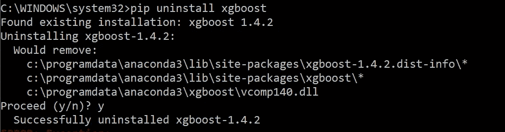
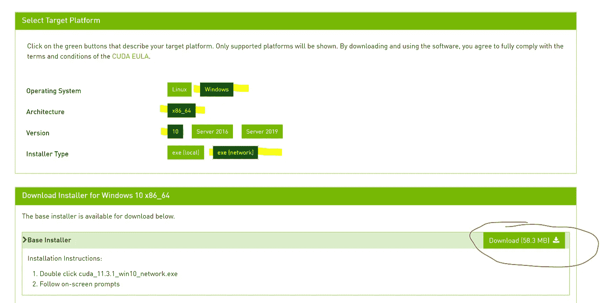
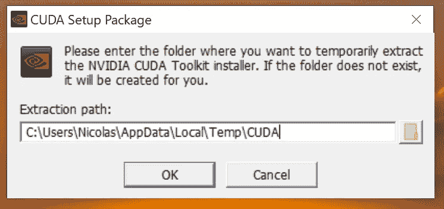
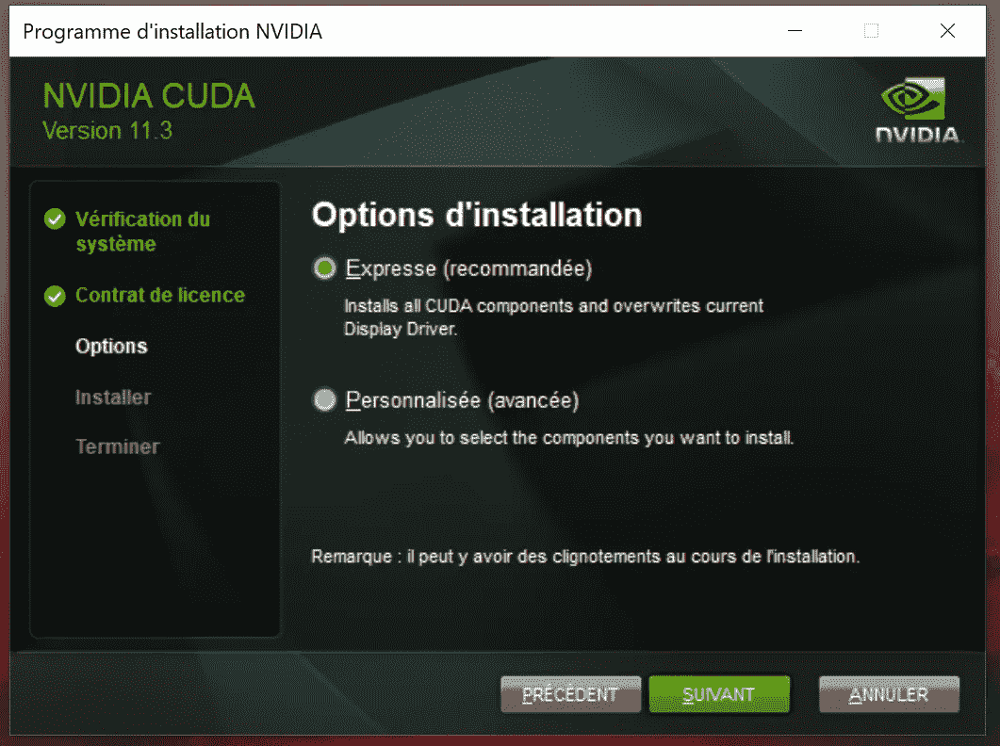

# 你用 XGBoost 吗？有一种快 200 倍的方法

> 原文：<https://towardsdatascience.com/do-you-use-xgboost-heres-how-to-make-it-200x-faster-16cb6039a16e?source=collection_archive---------8----------------------->

## [提示和技巧](https://towardsdatascience.com/tagged/tips-and-tricks)

## 在本文中，我将向您展示四种训练 XGBoost 的方法。与 XGBoost 默认设置相比，我们将实现 200 倍的速度提升。


[信用](https://pxhere.com/en/photo/910923)

作为数据科学家，我们喜欢进行许多耗时的实验。降低我们模型的训练速度意味着我们可以在相同的时间内进行更多的实验。此外，我们还可以通过创建更大的模型集合来利用这种速度，最终获得更高的准确性。

# 常规 XGBoost

[陈和 Guestrin(来自华盛顿大学)](https://arxiv.org/abs/1603.02754)发布 2016 年 XGBoost 日期。与常规梯度增强相比，它们实现了显著的加速和更高的预测能力([参见我的书进行比较](https://www.amazon.com/Data-Science-Supply-Chain-Forecast/dp/1730969437)，[参见 scikit-learn 进行常规梯度增强](https://scikit-learn.org/stable/auto_examples/ensemble/plot_gradient_boosting_regression.html))。这个新模型很快成为 Kaggle 上数据科学家的最爱。

让我们在一个 10M 行 30 列的虚拟数据集上运行 XGBoost‘vanilla’版本。

```
times_cpu = []
for trial in range(trials):
 start = time.time()
 XGB = XGBRegressor()
 XGB = XGB.fit(X,Y)
 print(time.time() — start)
 times_cpu.append(time.time() — start)
```

运行时间(在我的英特尔 i7–7700k CPU @ 4.20 GHz 计算机上)大约为 2000 秒。我只尝试了一次这个设置，因为它需要大约半个小时的运行时间。

# 使用 XGBoost 提升直方图

LGBM 由微软团队于 2017 年[发布。他们让训练更快的突破性想法是将连续特征(读取训练数据)存储在](https://papers.nips.cc/paper/2017/file/6449f44a102fde848669bdd9eb6b76fa-Paper.pdf)[离散箱](https://lightgbm.readthedocs.io/en/latest/Features.html#references)(直方图)中。

基于直方图的增强现在被认为是增强树的最佳实践。现在由 XGBoost、 [CatBoost](https://catboost.ai/news/catboost-enables-fast-gradient-boosting-on-decision-trees-using-gpus) 以及 [scikit-learn](https://scikit-learn.org/stable/modules/generated/sklearn.ensemble.HistGradientBoostingRegressor.html) 来实现。

在训练 XGBoost 时，可以通过设置 *tree_method = 'hist'* 来使用这种新的基于直方图的方法。

```
times_cpu_hist = []
for trial in range(trials):
 start = time.time()
 XGB = XGBRegressor(tree_method = “hist”)
 XGB = XGB.fit(X,Y)
 print(time.time() — start)
 times_cpu.append(time.time() — start)
```

现在平均跑步时间是 57.7 秒。我们刚刚实现了 35 倍的速度提升！

# GPU 上的 XGBoost

XGBoost 允许你使用你的 GPU 来训练模型。这通常比常规 CPU 运行得更快，并且可以很容易地激活。

要使用您的 GPU，请将 *tree_method* 更改为*‘GPU _ hist’*

```
times_gpu = []
for trial in range(trials):
 start = time.time()
 XGB = XGBRegressor(tree_method = “gpu_hist”)
 XGB = XGB.fit(X,Y)
 print(time.time() — start)
 times_gpu.append(time.time() — start)
```

运行时间现在约为 13.1 秒(使用 Nvidia GeForce GTX 1080)。比 CPU 快 4.4 倍。

以下是如何使用 GPU 在 windows 机器上运行 XGBoost 的方法。

> 如果已经可以在 GPU 上运行 XGBoost，可以跳过这一部分。

## 步骤 1:安装正确版本的 XGBoost

**如果你通过 conda/anaconda 安装了 XGBoost，你将无法使用你的 GPU** 。(如果您不确定如何在您的机器上获得 XGBoost，95%的可能性是通过 anaconda/conda 获得的)。

相反，我们将使用 pip install 来安装它。

打开控制台，键入以下两个提示

首先卸载 XGBoost。

```
pip uninstall xgboost
```



然后，重新安装。

```
pip install xgboost
```

## 步骤 2:安装 CUDA

Cuda 需要使用 Nvidia GPU 进行机器学习和深度学习。

在这里下载:[https://developer.nvidia.com/cuda-downloads](https://developer.nvidia.com/cuda-downloads)。



步骤 1:下载 CUDA

您需要使用标准过程(使用快速设置)来安装它—这里没有什么特别要做的。



步骤 2:启动安装程序。



第三步:使用快速推荐的设置(原谅我的法语！)

就是这样！

# XGBoost 采用单精度 GPU

您需要将'*single _ precision _ histogram*'设置为 True。

```
times_gpu_single = []
for trial in range(trials):
 start = time.time()
 XGB = XGBRegressor(tree_method = “gpu_hist”, single_precision_histogram=True)
 XGB = XGB.fit(X,Y)
 print(time.time() — start)
 times_gpu.append(time.time() — start)
```

跑步时间现在是 8.7 秒。与标准的 GPU 方法相比，这减少了大约 32%。

⚠️注意到单精度模式并不总是有效的。如果数据超出了单精度浮点数的限制，就会遇到问题。在跟踪预测模型的平方误差时，我遇到了这种情况:**平方**误差超过了单精度浮点数可以处理的最大限制。

# 结论

使用我们的 GPU(而不是 CPU)、直方图提升和单精度浮点数，我们为 XGBoost 实现了 228 倍的训练时间加速。

*   CPU: **2000** 秒
*   CPU 和直方图: **57.7** 秒
*   图形处理器和直方图: **13.1** 秒
*   GPU、直方图和单精度: **8.7** 秒

🚀您可以通过在 GPU 和 CPU 上并行运行实验来进一步加快实验过程。

⚠️🔬不要忘记本文使用的是虚拟数据集。数据集和机器上的结果可能不同。在选择**您最喜欢的**方法之前，您应该尝试一下 GPU、直方图和单精度。

您可能也会对本文感兴趣:

</read-excel-files-with-python-1000x-faster-407d07ad0ed8>  

# 关于作者

Nicolas Vandeput 是供应链数据科学家，专门研究需求预测和库存优化。他在 2016 年创立了自己的咨询公司 [SupChains](http://www.supchains.com/) ，并在 2018 年共同创立了 [SKU 科学](https://bit.ly/3ozydFN)——一个快速、简单、实惠的需求预测平台。尼古拉斯对教育充满热情，他既是一个狂热的学习者，也喜欢在大学教学:自 2014 年以来，他一直在比利时布鲁塞尔为硕士学生教授预测和库存优化。自 2020 年以来，他还在法国巴黎的 CentraleSupelec 教授这两门课程。他于 2018 年出版了 [*供应链预测的数据科学*](https://www.amazon.com/Data-Science-Supply-Chain-Forecasting/dp/3110671107)(2021 年第 2 版)，2020 年出版了 [*库存优化:模型与模拟*](https://www.amazon.com/Inventory-Optimization-Simulations-Nicolas-Vandeput/dp/3110673916) 。