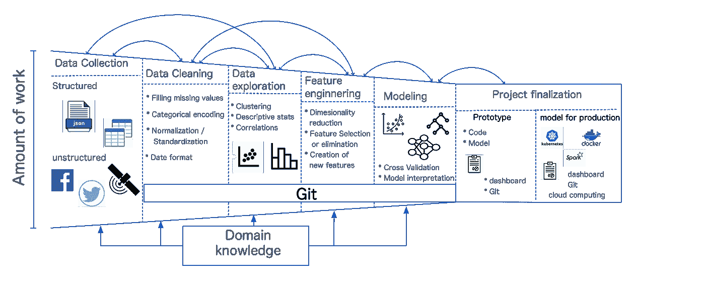

# 你想成为一名数据科学家吗？

> 原文：<https://towardsdatascience.com/do-you-want-to-be-a-data-scientist-411f71a220db?source=collection_archive---------27----------------------->

## *概述你可以追求的不同角色，以及如何在这个竞争激烈的领域表现出色*

[在过去的几年里，对数据科学家的需求一直在增长](https://www.ibm.com/downloads/cas/3RL3VXGA)。许多公司都在寻找有经验的人，他们可以为目前可用的大量数据赋予价值。对于许多学生来说，尤其是那些完成自然科学博士学位的学生，成为一名数据科学家是一个很好的机会，可以在开始行业职业生涯的同时应用在大学学到的许多技能。大约 5 年前，我是这些学生中的一员。在完成天文学博士学位的前一年，我决定离开学术界；但我不知道该做什么，也不知道如何开始在学术界之外工作。我非常困惑，直到一位密友给了我一本书，解释什么是数据科学以及如何进入这个奇妙的世界。这本书的结尾是宣传一门课程，声称可以帮助年轻学生成为优秀的数据科学家。大学毕业后，我参加了那门课程，这门课程给了我一些基本技能，帮助我在几个月后找到了第一份工作。

作为一名数据科学家工作了 4 年后，我回顾过去，我希望我能在这个行业的具体方面得到一些建议**。**这篇博客就是给你这样的建议；数据科学课程中没有解释的关键信息。比如，进入这个行业需要哪些知识？数据科学家在不同公司的职责相同吗？如何在这个竞争激烈的领域出类拔萃？我将根据我的经验回答这些问题，给你一些选择让你完全满意的工作的见解。

我假设你要么正在完成学业(博士或硕士)，要么已经博士后快结束了；也许你想改变你的职业。你想知道你是否想成为一名数据科学家。你可能会问:什么是数据科学？嗯，这可能是一个天真的问题；但实际上，这很重要！

根据维基百科的定义，数据科学是“*一个跨学科领域，它使用科学方法、流程和算法从许多结构化和非结构化数据中提取知识和见解*。要成为一名优秀的数据科学家，你需要具备分析思维，同时还要具备统计、数学和编程方面的良好知识。Josh Wills 对数据科学家做了一个很好的描述，他说*“数据科学家是一个比任何软件工程师更擅长统计，比任何统计学家更擅长软件工程的人*因此，如果你对这些领域有所了解，或者对其中任何一个领域感兴趣，你就会喜欢这个令人兴奋的领域。但是需要了解哪些编程、统计、数学方面的知识呢？首先，确保熟悉 Python 或 R 和 SQL，因为这些是数据科学家目前使用的编程语言。关于统计，完善你对概率、分布、统计参数和假设检验的理解。数学方面，线性代数和微分学会是你的朋友，让你了解机器学习和深度学习算法背后的逻辑。

这些话题听起来是否对你很有吸引力，以至于你想成为一名数据科学家？如果是的话，恭喜你，欢迎加入俱乐部！现在，接下来是什么？根据我的经验，学习数据科学课程是进入这个充满挑战的领域的最佳方式。一个原因是，这些课程从头到尾都在教你开展数据科学项目的基本技能。数据科学课程让你初次体验如何从数据中收集有用的见解；此外，你有机会开发一个可以在面试中展示的项目；这是在这个行业找工作时非常重要的一点。

一个数据科学项目是通过一系列步骤来实施的，我们称之为****数据科学生命周期。这些步骤是数据收集、数据清理、数据探索、特征工程和建模。在这里我简单的解释一下。****

****

**数据科学生命周期。作者制作的图像。**

****数据收集:**这一部分非常重要，因为这一步收集的数据质量决定了你的模型是否成功。数据收集也是项目中需要花费大量时间和精力的步骤之一。有时收集数据仅限于在您公司的数据仓库中搜索；在其他情况下，您需要浏览网站，并与您的领域知识同事密切合作，调查获得所需数据的最佳位置。**

****数据清理**:一旦你收集了数据，往往需要清理。清理数据的方式取决于您拥有的信息类型；但是，大多数情况下，您会估算缺失值，进行分类编码或者以正确的格式设置变量。在数据清理过程中，拥有领域知识或与拥有此类专业知识的同事合作非常重要，以确保信息可靠且有意义。**

****数据探索:**在这里你通过各种可视化的方式对数据进行第一次探索:散点图遇到变量之间的相关性；直方图或密度图来推断特征的分布。你甚至可以使用一些[聚类技术](/the-5-clustering-algorithms-data-scientists-need-to-know-a36d136ef68)来查看观察结果之间的相似之处，并找出数据中隐藏的关系。在数据探索过程中，您可能会意识到数据的质量并不好。如果是这种情况，你必须修改清理数据的过程，或者你甚至需要回去收集更多或更好的数据。**

****特性工程:**在我看来，这是数据科学周期中最激动人心的阶段之一。根据项目的目标，你需要提出在确定预测量时很重要的变量。也许您的数据中有许多相关变量，因此您必须减少要素的数量。为了确保正确的特性工程，您需要与在业务领域拥有专业知识的同事密切合作。**

****建模:**在这里，您应用最适合您的问题和您拥有的数据的机器学习或深度学习模型。最佳算法通常是基于贵公司定义的[关键绩效指标](https://en.wikipedia.org/wiki/Performance_indicator)(KPI)或基于贵团队定义的指标(即[)进行优化的。，RMSE](/what-does-rmse-really-mean-806b65f2e48e)；[f1-得分](https://en.wikipedia.org/wiki/F-score)。这个过程本身是迭代的，这意味着您可能希望先尝试不同的算法，然后优化模型的超参数。在数据建模期间，您还需要解释模型的结果；例如:模型选择什么特征，为什么？(即[特征重要性](https://machinelearningmastery.com/calculate-feature-importance-with-python/))；关于他们的预测指标，目标是如何变化的？(即[部分依赖图](https://christophm.github.io/interpretable-ml-book/pdp.html))。**

****项目完成:**大多数时候，数据科学家的工作都集中在开发需要上述步骤的数据驱动解决方案上。然而，根据你的具体工作，你可能会也可能不会参与项目的最终确定。例如，假设您是一名顾问，您的项目旨在探索开发一种代码的可能性，该代码可以在给定卫星数据的情况下预测城市的增长率。你同意你的客户有一个原型；也就是说，预处理数据和训练模型的代码以及总结您的分析的文档。在这种情况下，您既参与了代码的开发，也参与了项目的最终确定。现在，让我们假设原型是成功的，也就是说，你的模型是相当准确的，你的客户希望更经常地使用它。在这种情况下，项目包括将模型投入生产的管道的开发。如果您有模型部署的经验，您可能会参与这样的开发。**

**在前面的示例中，我想向您展示您在数据科学领域可以扮演的不同角色。这完全取决于你的抱负和你想掌握的技能。在这里，我将解释你可以追求的不同角色。**

## **顾问数据科学家:在有限的时间内研究各种主题**

**顾问数据科学家在不同行业的各种项目中持续工作；因此，您需要广泛的软技能，如分析思维、有效沟通、团队合作，以及快速学习所参与项目领域知识的意愿。由于你通常同时从事不同的项目，你也需要非常好的时间管理技能。**

**数据科学家顾问的工作有两种类型。第一个也是最常见的是在交付项目中工作。这意味着利用数据科学生命周期为不同的客户设计解决方案。大多数活动包括设计仪表板和向利益相关者传达见解。根据他们的技能，顾问数据科学家也可能参与模型产品化。**

**顾问数据科学家的另一种工作是开展业务开发和销售活动，这与数据分析师的工作密切相关。在这里，你要参与撰写建议书和向潜在客户进行技术演示。**

****这份工作的优势:****

*   **你有机会参与各种项目，这些项目需要处理不同类型的数据和不同的算法。因此，你可以从不同的行业获得很多知识。**
*   **你与你的利益相关者密切合作；这意味着你的关系网扩大了。**
*   **工资往往很高。**

****缺点:****

*   **短期项目时间有限；这意味着最终交付后，没有改进的空间。**
*   **大部分职位都是由大公司而不是科技公司发布的；这意味着工作文化可能具有挑战性。**
*   **工作量通常很大。**

**如果你有兴趣更多地了解咨询数据科学家的世界，你可以阅读以下博客:**

** [## 担任数据科学顾问

### 具有企业意识的数据科学家的职业战略

towardsdatascience.com](/working-as-a-data-science-consultant-e626669ab72b)  [## 2021 年的数据科学咨询与顾问:深度指南

### 正如您在上面看到的，在过去 5 年中，人们对数据科学的兴趣增长了 5 倍以上。据普华永道称，将会有更多…

research.aimultiple.com](https://research.aimultiple.com/data-science-consulting/#necessary-skills-for-data-science-consultants) 

## 科技公司的数据科学家:学习机器学习工程技能的机会

如果你是一个热爱编程的人，你可能想尝试在一家科技公司建立自己的事业。科技公司的数据科学家投入时间开发机器学习模型的原型，但他们也需要学习适当的工具来将这些原型转化为产品。

通常，数据科学家在 Jupyter 笔记本上构建原型(您将在任何数据科学入门课程中学习到这个工具——如果还没有——的话)。Jupyter 笔记本允许您通过在单个脚本中显示表格和图表来进行快速探索、分析和数据可视化。还可以训练、验证、测试机器学习模型。尽管 Jupyter 笔记本易于使用，但它们并没有提供合适的界面来开发用于生产的模型，原因很简单，因为 Jupyter 笔记本仅用于实验目的。

要将原型转换为生产使用的模型，有必要创建使数据科学生命周期自动化的管道。这包括扩展模型的培训和测试，并将其部署到前端使用。用于执行这些任务的一些工具是 Docker 和 Kubernetes。云计算知识(亚马逊网络服务(AWS))；谷歌云(GCP)或 Azure)也非常方便。

近年来，模型产品化已经成为进入数据科学世界的一条不同的职业道路，称为机器学习工程。如果你想了解这个令人兴奋的话题，你可以阅读这些博客:

 [## 但是这个“机器学习工程师”实际在做什么呢？

### 受到最近在 O'reilly 数据秀播客“机器学习工程师需要知道什么”的启发，我决定…

medium.com](https://medium.com/@tomaszdudek/but-what-is-this-machine-learning-engineer-actually-doing-18464d5c699)  [## ML Ops:作为工程学科的机器学习

### 随着 ML 从研究走向应用商业解决方案的成熟，我们是否需要提高其运营的成熟度…

towardsdatascience.com](/ml-ops-machine-learning-as-an-engineering-discipline-b86ca4874a3f) 

根据我自己和关系更密切的同事的经验，以下是科技公司数据科学的一些利弊:

**优点:**

*   科技公司的数据科学家有机会获得许多技能，丰富他们的投资组合。
*   项目期间开发的代码是可重用的，并且可以不断改进。
*   工作环境非常友好。

**缺点:**

*   根据公司的文化和规模，晋升的可能性可能是有限的。
*   与顾问数据科学家不同，了解不同行业的机会有限。与外部客户的联系也可能受到限制。
*   工资可以低于顾问数据科学家。

## 如何成为一名优秀的数据科学家，并且不会因为尝试而丧命

尽管对数据科学家的需求每年都在增加，但这一职业竞争相当激烈，尤其是在中高级水平。这就是为什么从一开始就有好的实践对于脱颖而出和专业成长至关重要。以下是我给你的建议，让你成为一名优秀的数据科学家，而不是死于尝试:

**Jupyter 笔记本不错，但是…不适合生产代码！**

我第一次使用 Jupyter 笔记本电脑是在数据科学课程中。从第一次开始，我就因为它们的易用性而喜欢上了它们。我能够在一个脚本中可视化表格并分析数据；这是完成我课程最后一个项目的完美工具。

我在一家科技公司担任数据科学家的第一份工作是继续使用 Jupyter 笔记本电脑；然而，我很快意识到，在这个工具中开发复杂的函数或类是很困难的，因为笔记本电脑没有允许纠正代码的功能。因此，我花费了大量的时间和精力进行调试。这非常有压力，因为我通常比预期晚交付结果；我开始觉得没有效率。我认为我是一个糟糕的数据科学家。

我决定开始用我的分析中使用的所有函数构建一个 python 库，首先是为了不重复代码，其次是为了更好地与我的数据科学家同事合作。我开始用纯 Python 代码编写这个库。后来，我的同事开始开发更多的功能，使这个库变得更好。代码版本化也允许我们改进我们的团队合作。随着图书馆的发展，我的工作，总的来说，更有成效；然而，创建预测模型的主要渠道仍然在 Jupyter 笔记本上。在我作为数据科学顾问的第二份工作中，我决定使用 Python 代码编辑器来更有效地执行我的项目。这种转变使我能够非常容易地调试代码，并拥有可以快速部署到生产中的原型。

Jupyter 笔记本很棒，但不是用于原型或代码版本控制，也不是用于生产代码。我建议你使用它们来探索你的数据，但是一旦你开始做一个项目，就使用代码编辑器；这会节省你大量的时间！有一些在数据科学社区广泛使用的代码编辑器，比如 [Spyder](https://www.spyder-ide.org/) 、 [PyCharm](https://www.jetbrains.com/pycharm/) 、 [Visual Studio](https://visualstudio.microsoft.com/) 、 [Rstudio](https://rstudio.com/products/rstudio/) (针对 R 爱好者)。由于您将进行大量编程，请确保也记录您的代码。对于您创建的每个函数或类，描述其属性、方法、输入和输出参数。这是必不可少的，尤其是在与其他数据科学家和机器学习工程师合作时。拥有良好的编程习惯是成为伟大的数据科学家的步骤之一。

永远记录你的工作！

我很幸运地从始至终执行项目；然而，有时我不得不接管其他同事的工作。在其中的一些机会中，我真的很高兴收到项目的适当文档，包括一个干净的和评论良好的代码；在其他情况下，我想自杀。黄金法则:记录你的工作，就像你要把它交给另一个同事一样。这种做法带来很多好处:你更容易记住你在一个项目中做了什么。此外，它允许其他数据科学家在你换工作的情况下接管你的开发。如何做好一个项目的文档？以下是一些建议:

*   不要使用被动语态。
*   描述缩写:当新同事阅读你的报告时，这特别有用。
*   从项目的目标开始:目标是什么？你想学什么？你的假设是什么？
*   保持心流，即不要跳入不同的想法；详细解释每一部分。

最后，将您的报告和代码一起保存在 Git 中。

**不要停止学习**

数据科学行业不断发展，很难跟上时代的步伐；然而，了解最新趋势的最佳方式是阅读博客、收听数据科学播客和订阅 YouTube 推广频道。跟踪某个特定主题的在线课程对于在这个领域的成长也是至关重要的。不要停止学习，因为这是保持竞争力的关键。

**迎接新挑战**

当我完成博士学位时，我害怕去那些我对其领域知识不感兴趣的公司工作。我必须说我大错特错了！所有的项目都非常有趣和具有挑战性。因此，我给你的最后一个建议是，害怕是正常的，但如果你乐于接受新的挑战，你会发现你的工作总是有回报和有吸引力的。

这篇文章旨在让你一瞥数据科学的世界；你对这个行业有什么期待，以及根据你的兴趣可以发展的不同工作。这个博客，当然，是基于我的个人经历。我希望这篇文章能帮助您更好地了解令人兴奋的数据科学世界。另一方面，如果你是一名资深的数据科学家，请在下面留下你的评论，谈谈你在这个领域的经历以及其他哪些技能让你成为了一名伟大的数据科学家。

感谢阅读！**