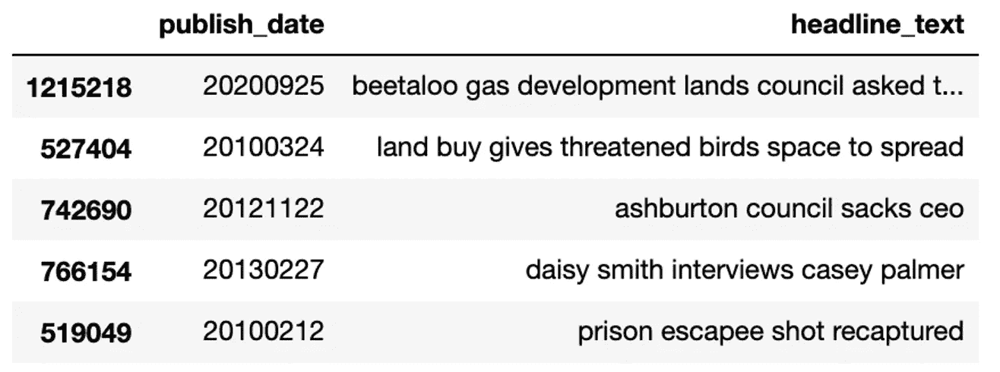
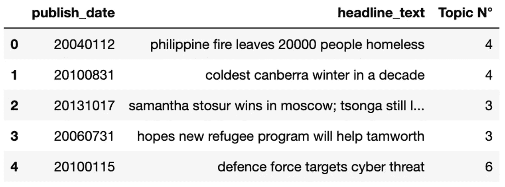
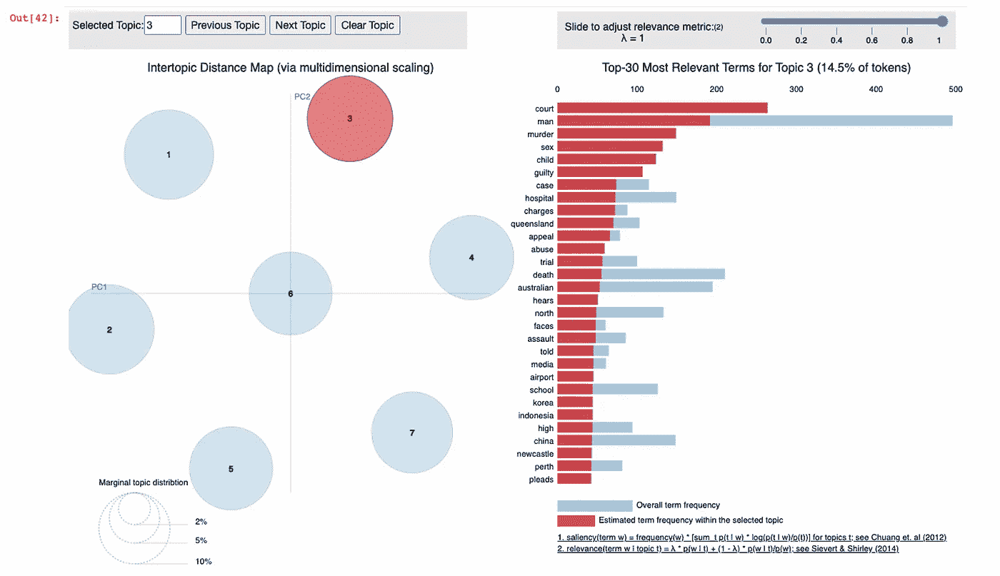

# 是否要对未标记的文本数据进行聚类？尝试主题建模

> 原文：<https://towardsdatascience.com/do-you-want-to-cluster-unlabeled-text-data-try-out-topic-modeling-235795ae7cb7?source=collection_archive---------10----------------------->

## 你将需要 5 分钟的时间来理解和实现 Python 中的 LDA


由 [Unsplash](https://unsplash.com/photos/o6GEPQXnqMY) 上的[Cup 先生/杨奇煜·巴拉](https://unsplash.com/@iammrcup)拍摄的照片

# 介绍

我们生活在一个被大量文本信息包围的时代，如调查回复、社交媒体评论、推文等。找到满足个人需求的合适信息是一项挑战，尤其是在处理大量不同的数据时。

感谢[主题建模](https://en.wikipedia.org/wiki/Topic_model)，一个自然语言处理的时代，用于通过将大量 ***未标记文本*** 数据分组/聚类成主题来有效地分析它们。我们将尝试用 python 来介绍一种叫做 LDA 的主题建模技术。

# LDA —它是如何工作的

LDA 代表潜在的狄利克雷分配。该技术试图通过使用基于以下假设的概率分布来从文档语料库中发现主题:

*   ***假设 1:*** 主题相似的文档使用相似的词组，意味着所有的文档都是潜在主题上的概率分布。
*   ***假设 2*** :潜在主题可以通过搜索跨语料库的文档中通常一起出现的词组来发现，意味着主题是词上的概率分布。

# LDA 的实施

## 主轴承轴瓦

*   选择固定数量的 K 个主题进行探索。
*   对于语料库中的每个文档，随机将文档中的每个单词分配给其中一个主题。这一步给出了所有文档的主题表示和所有主题的单词分布。
*   从上一步开始，遍历每个文档中的单词来改进这些主题
*   在这个过程的最后，每个文档将被分配一个主题

## 关于数据

*   这是澳大利亚广播公司八年来发布的新闻，可在 [Kaggle](https://www.kaggle.com/therohk/million-headlines) 上获得。该数据有两个主要列:
*   ***发布日期*** :文章以 yyyyMMdd 格式发布的日期。
*   ***headline _ text***:标题文字，英文
*   数据集具有

**数据加载和子集选择**

第 6 行显示(1226258，2)意味着 1226258 行和 2 列。由于我们有很多行，为了加快处理速度，我决定选择 20 000 行的子集。这个操作在第 9 行和第 10 行完成。如果愿意，您可以更改观察的数量。

第 13 行显示了所选样本中的 5 个随机行，如下所示



来自 sample_df 数据集的 5 个随机行(图片由作者提供)

## **LDA**数据准备

**建立文档 X 术语矩阵**

我们对 **publish_data** 列不感兴趣，因为我们将只使用 **headline_text** 数据。

如下定义**计数矢量器**对象，我们忽略:

*   在我们的文档语料库中出现超过 95%次的所有术语。因为`max_df` threshold (0.95)意味着出现次数超过该值的项不显著。这种具体情况下，大部分会是`stopwords`。
*   在整个语料库中出现少于三次(`min_df = 3`)的所有术语。

第 9 行显示了下面的输出，这意味着我们有 20.000 个文档和 6425 个不同的单词。

```
<20000x6425 sparse matrix of type '<class 'numpy.int64'>'
	with 89645 stored elements in Compressed Sparse Row format>
```

让我们看看从文档中提取的一些单词/特征。

第 5 行显示以下单词:

```
['zimbabwe', 'zimbabwean', 'zone', 'zones', 'zoo']
```

**建立 LDA 模型**

从我们的 DTM 矩阵，我们现在可以建立 LDA 模型，从下划线文本中提取主题。要提取的主题数量是一个超参数，我们将使用 7 个主题。
由于 LDA 是一种迭代算法，在我们的例子中，我们将有 30 次迭代，但默认值是 10。随机状态值可以是任何数字，其目的是再现相同的结果。

**显示每个主题的热门词汇**

从 LDA 模型中，我们现在可以从七个主题中的每一个中生成热门单词。

前面的代码生成以下输出。

```
THE TOP 10 WORDS FOR TOPIC #0
['weather', 'election', 'labor', 'urged', 'qld', 'act', 'council', 'nsw', 'new', 'govt']

THE TOP 10 WORDS FOR TOPIC #1
['report', 'indigenous', 'country', 'rural', 'charged', 'accused', 'new', 'health', 'calls', 'says']

THE TOP 10 WORDS FOR TOPIC #2
['queensland', 'charges', 'hospital', 'case', 'guilty', 'child', 'sex', 'murder', 'man', 'court']

THE TOP 10 WORDS FOR TOPIC #3
['face', 'england', 'years', 'win', 'australian', 'talks', 'wins', 'final', 'cup', 'world']

THE TOP 10 WORDS FOR TOPIC #4
['probe', 'dead', 'woman', 'killed', 'dies', 'car', 'crash', 'man', 'interview', 'police']

THE TOP 10 WORDS FOR TOPIC #5
['live', 'return', 'care', 'residents', 'test', 'australia', 'new', 'change', 'workers', 'day']

THE TOP 10 WORDS FOR TOPIC #6
['news', 'search', 'west', 'market', 'coronavirus', 'national', 'gold', 'farmers', 'sydney', 'coast']
```

**观察**:看起来像

*   主题 1 更加面向政府
*   主题 3 似乎更多的是关于体育而不是其他事情

将发现的主题标签附加到原始文档上

代码的 ***第 5 行*** 显示:(20000，7)，意味着 **final_topics** 包含对于我们的 20，000 个文档中的每一个，文档属于 7 个主题中的每一个的可能性的概率分数。

第 11 行显示了前 5 个文档及其相应的主题



文档及其相关主题(图片由作者提供)

根据我们的 LDA 模型:

*   第一和第二个文档属于第 4 个主题。
*   第三和第四个文档属于第四个主题。
*   第五个文档属于第 6 个主题。
*   等等。

**有些可视化**

从下面的可视化中，我们可以动态地得到每个主题相关的单词集。



这个面板在左边显示由圆圈代表的主题，在右边显示它们的单词集。在这个图表中，我们可以看到主题 3 由单词法庭、男人、谋杀、性、孩子、有罪等表示。从那些话中，我们可以推断出这个题目讲的是 ***戏剧性*** 的事情。

# 结论

你做到了！从无标签数据到创建最终模型，以图形方式将每个文档与一个主题相关联。使用主题建模，我们事先并不知道正确的主题，因此拥有能够帮助解释模型生成的单词的业务知识可能会更好。我希望你喜欢这篇文章，你可以从下面的资源中探索更多。

# 额外资源

[Github 代码](https://github.com/keitazoumana/lda-tutorial/blob/main/topic-modeling-with-lda.ipynb)

[利用非负矩阵分解和潜在狄利克雷分配的主题抽取](https://scikit-learn.org/stable/auto_examples/applications/plot_topics_extraction_with_nmf_lda.html)

[皮尔戴维斯](https://pyldavis.readthedocs.io/en/latest/readme.html)