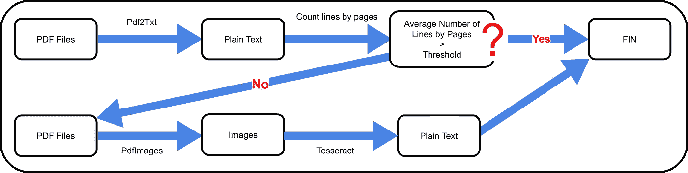
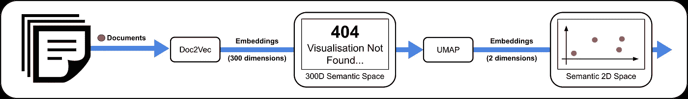
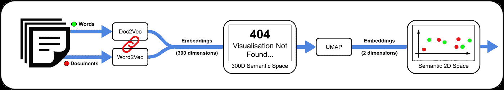
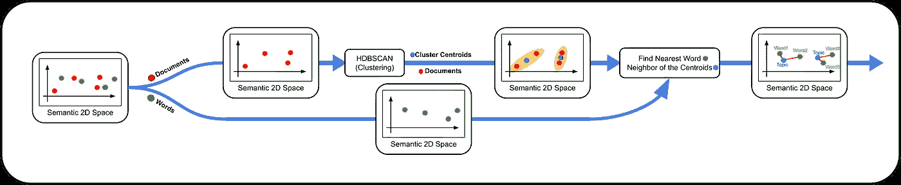
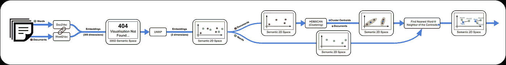
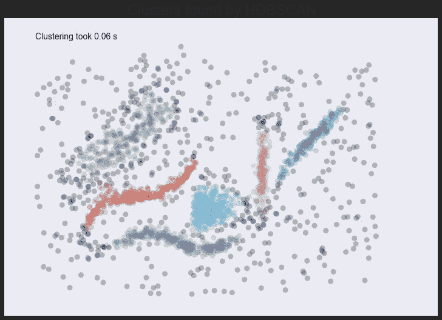
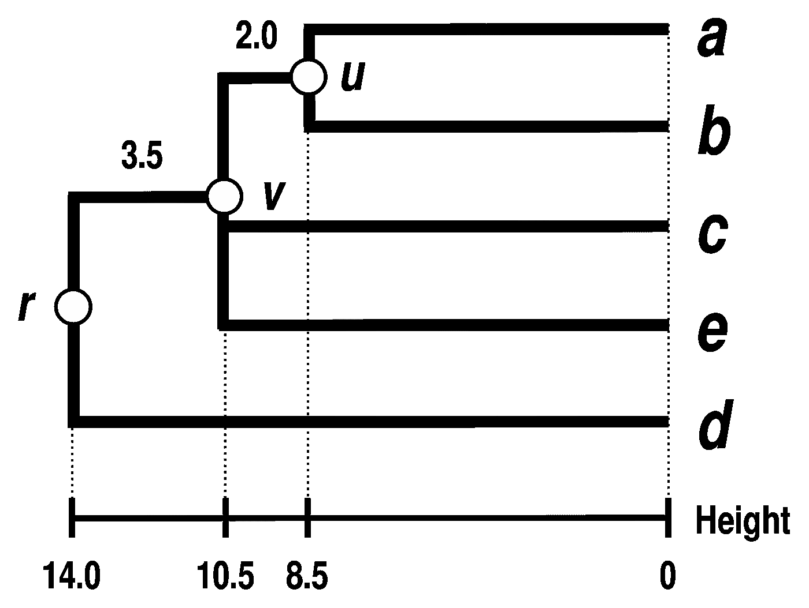
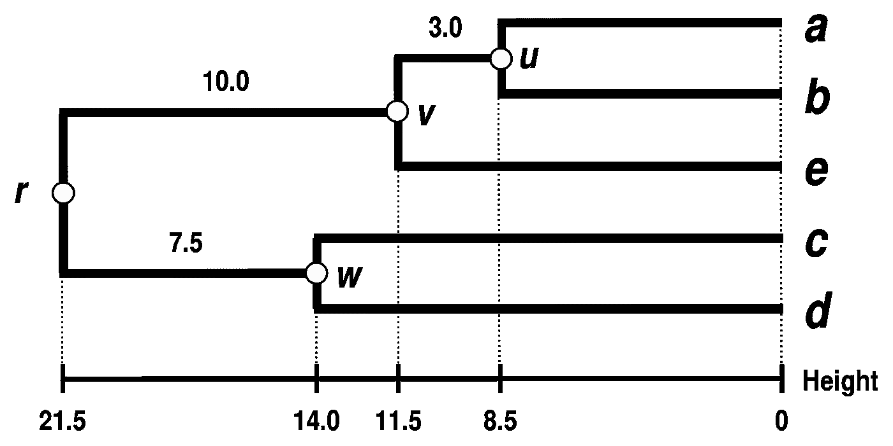
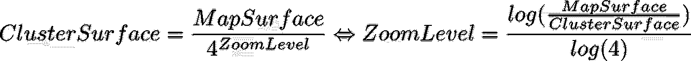
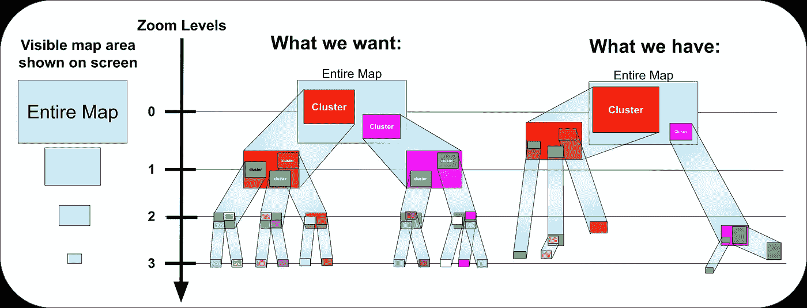

# Doc2Map:像在谷歌地图上散步一样浏览文档

> 原文：<https://towardsdatascience.com/doc2map-travel-your-documents-like-a-walk-on-google-map-1e8b827fdc04?source=collection_archive---------25----------------------->

## 为主题建模构建漂亮的交互式可视化

在 [Unsplash](https://unsplash.com/photos/3jBU9TbKW7o) 上由 [Aron 视觉](https://unsplash.com/@aronvisuals)拍摄的照片

作为一名数据科学家，你应该知道让你的成果大放异彩有多难。

在本文中，您将了解我在第一份工作中的经历，我想出的想法，我遇到的尝试和错误，最终成功地建立了一种直观的方式来有效地可视化数千个文档并与之交互。最后，你会看到你现在可以多么容易地重现这些形象，并使它们成为你自己的形象。

> [*在最后的结果*](#7316) 取一个偷峰

# 目录

–[第一份工作的旅程](#afd6)
–[读取异构文档](#9b50)
–[预处理](#7e85)
–[嵌入的力量](#a431)
–[添加粒度](#ee29)
–[新视野](#07f1)
–[选择好的聚类算法](#62ec)
–[精度 VS 信息困境](#a998)
–

> *这是一个关于 Doc2Map 的创建和工作的故事——如果你只是想使用 Doc2Map* 的话，这里有一个快速教程<https://medium.com/@louisgeisler3/doc2map-the-best-topic-visualization-library-tutorial-82b603d1d357>

# *第一份工作的旅程*

*作为一名数据科学学生，在没有任何经验的情况下找到第一份实习工作可能会非常复杂。但有时运气会有所帮助，这正是我的简历引起法国最高行政法院注意的原因。*

*行政法院要求我研究和开发一种工具，用于可视化和探索它收到的所有法律投诉(每年大约 250，0 00 起),以便找到可以一起处理的类似投诉，从而提高该机构的效率。*

**

*作者图片*

*因为这些文件是用法语写的，而且是保密的——有些案件甚至涉及到谷歌——它们将被一个来自 Kaggle 的[玩具维基百科数据集](https://www.kaggle.com/louisgeisler/simple-wiki)所取代。*

# *阅读 Heteroclite 文档*

*第一个问题是文档不是统一类型的 PDF 文件，(一些是放在 PDF 文件中的纯文本，而另一些只是纸质文档的图像扫描)，因此它们应该按照下图分别处理:*

**

*作者图片*

*如您所见，决定 PDF 文档是纯文本还是扫描图像的关键标准是一个文档每页平均行数的阈值。*

*根据我的测试，从 PDF 中提取文本和图像的最佳选择是 [Xpdf 命令行工具](https://www.xpdfreader.com/download.html) (Pdf2Txt 和 PDF images)——没有 python 的包装器是多么悲哀啊…*

*对于 OCR 图像， [Tesseract](https://opensource.google/projects/tesseract) 是最佳选择。*

***注意:** [Apache Tika](https://tika.apache.org/) 对于更广泛的文档格式来说可能是一个不错的选择，但是由于它是一个 java 应用程序，所以速度相当慢。因此，对于特定的使用情形来说，它不是最好的。然而，Doc2Map 的公共版本将使用 Tika 来处理任何类型的文档。*

# *预处理*

*奇怪的是，似乎有时候经典的 NLP 库并不总是简单任务的最佳选择。要删除停用词，您可能更喜欢使用[停用词-iso 库](https://github.com/stopwords-iso/stopwords-iso)，而对于词汇化，只需使用[词汇化-列表](https://github.com/michmech/lemmatization-lists)。*

*为什么不用 spaCy？因为默认情况下，它加载了很多无用的工具，会减慢进程。另一个原因是，它的 lemmatizer 似乎不能很好地将名词转换为单数词根。*

# *嵌入的力量*

*当问及如何可视化一个大的文档语料库时，你首先想到的一个想法可能是使用一种文档嵌入方法( **Doc2Vec )** 将单词转换成 300 维向量。然后，对向量应用任何降维技术(如**【UMAP】**)将它们投影到 **2D** 空间。*

**

*作者图片*

*通过一个好的库和一些调整，您可以显示一个漂亮的交互式可视化，甚至可以绑定事件，以便在单击某个点时打开文件或 URL:*

*[全屏/移动版](https://louisgeisler.github.io/Doc2Map/example/SimpleWikipedia/Doc2Map_Scatter.html) |用[创建 Plotly](https://plotly.com/) 和[简单的维基百科数据集](https://www.kaggle.com/louisgeisler/simple-wiki)*

*不幸的是，它似乎没有多大帮助。是的，你可以有一个全局视图，但是你缺乏粒度:你缺乏中间信息来理解文档的整体组织。*

*您可能会想象自己正在阅读一张未知世界的地图，在这张地图上，国家、州和城市的名称已经被删除，您只能看到不同的房屋(在我们的案例文档中)。*

*因此，我们现在有两个问题要解决:*

*   *如何增加地图的粒度？*
*   *如何找到有趣的名字作为中级信息添加？*

# *增加粒度*

*经过多次搜索，似乎最好的工具是[传单 javascript 库](https://leafletjs.com/)的 [MarkerCluster](https://github.com/Leaflet/Leaflet.markercluster) 插件。它有许多优点。首先，它类似于谷歌地图，是一个直观的工具。其次，它可能是最漂亮、最高效的图书馆:*

*[全屏/手机版](https://leaflet.github.io/Leaflet.markercluster/example/marker-clustering-realworld.388.html) |传单插件示例: [MarkerCluster](https://github.com/Leaflet/Leaflet.markercluster)*

# *新的愿景*

*发明国家、州和城市的名称并不是一件容易的事情——我们如何创造国家、州和城市的名称呢？我们如何通过集群来重组我们的文档呢？*

*简答: **Top2Vec** ，2020 年发布的全新话题建模方法。Top2Vec 根据这个方案巧妙的结合了扎实的方法:**word2vec⁴+doc2vec****umap****hdbscan⁵**。*

*让我们看看它是如何工作的:*

1.  *Word2Vec+Doc2Vec 项目**文档**和**单词**进入**同一个 300 维的语义空间**。*
2.  *UMAP 将这些向量投影到二维空间中。*

**

*作者图片*

*3.HDBSCAN 将通过查找密集区域并计算其质心来创建聚类。*

*4.这些质心将定义主题的位置，最近邻将定义该主题的主题。*

**

*作者图片*

*总而言之，Top2Vec 将在地图上找到文档簇的位置，并将它们与地图上最近的单词链接起来。*

**

*作者图片*

*注意:有一个小技巧，为了更简单的说明，我保守了秘密。事实上，一旦文档簇被创建，我们回到 300 维空间，只有在那里找到质心和最近的单词。维度越多，信息量越大。*

# *选择好的聚类算法*

*HDBSCAN 是一个很棒的聚类算法，它做得很好。然而，它有两个紧密相连的问题:*

*   *HDBSCAN 将不够密集的区域定义为噪声，并完全忽略它们:*

**

*[https://hdb scan . readthedocs . io/en/latest/comparising _ clustering _ algorithms . html](https://hdbscan.readthedocs.io/en/latest/comparing_clustering_algorithms.html)*

*   *HDBSCAN 使用单一链接树方法，其结果是创建一个不平衡的树。HDBSCAN 的核心思想与用集群和子集群划分地图的思想不相容，正如文档中所解释的:*

> *[与其将它视为一个分裂成两个新集群的集群，我们不如将其视为一个正在“丢分”的单一持久集群。](https://hdbscan.readthedocs.io/en/latest/how_hdbscan_works.html)*

*例如，HDBSCAN 会生成这样的树:*

**

*图片来自[维基百科](https://en.wikipedia.org/wiki/Single-linkage_clustering)*

*但是对于我们的地图，我们更喜欢像这样的信息量更大的树，有更多的子集群:*

**

*图片来自[维基百科](https://en.wikipedia.org/wiki/Complete-linkage_clustering)*

# *精确与信息的困境*

*在精确度和信息之间很难找到平衡。精确意味着拟合最佳的密集区，而信息意味着增加更多的聚类。*

*我们必须创建一个特殊的树(称为树状图),在 y 轴上为用户提供不同的缩放级别。使用下面的公式，我们可以根据它们的面积将缩放级别分配给我们找到的每个聚类:*

**

# ***连续与离散变焦级别***

*你可能已经猜到了这个问题:我们需要一个离散的整数缩放级别，而这个公式给了我们一个实数。更重要的是，两个或多个缩放级别之间可能没有聚类:*

**

*作者图片*

*此外，为了具有良好的可视化，如果一个集群的面积大于屏幕上可见的面积，则不应该显示该集群——只向用户显示一个集群是没有意义的。因此，如果我们用缩放级别指标替换面积指标，这意味着您不应该以高于公式计算的缩放级别来显示集群。(直观上是说在图上，集群只能往上走。)*

*为了解决这个具有许多约束的复杂问题，可能需要设计一种全新的聚类算法来解决寻找最佳折衷的问题，但这将是一个漫长而困难的任务。*

# ***病房联动***

*简单来说，似乎最符合我们标准的算法是[沃德链接层次聚类](https://en.wikipedia.org/wiki/Ward%27s_method)，它产生一个很好的平衡聚类，如下图所示。*

*让我们看看将这种方法应用到我们的维基百科玩具数据集会是什么样子，红点代表节点，蓝点代表树叶*(可点击)*:*

*[全屏/手机版](https://louisgeisler.github.io/Doc2Map/example/SimpleWikipedia/tree.html) |用[创建 Plotly](https://plotly.com/) 和[简单的维基百科数据集](https://www.kaggle.com/louisgeisler/simple-wiki)*

*正如你所看到的，这棵树非常平衡，但是它不在乎缩放比例。因此，我们将不得不强制集群仅定位在整数缩放级别。同样，有许多选择保留或删除集群的可能性。该树是通过实验测试不同的可能性得到的，所以我将跳过细节，直接看结果:*

*[全屏/移动版](https://louisgeisler.github.io/Doc2Map/example/SimpleWikipedia/simplified_tree.html) |用 [Plotly](https://plotly.com/) 和[简单维基数据集](https://www.kaggle.com/louisgeisler/simple-wiki)创建(蓝点可点击)*

*最后，我们得到一个根据缩放级别排序的平衡的树。因此，我们最终可以构建一个图，其中聚类根据用户选择的缩放级别而变化:*

*[全屏/移动版](https://louisgeisler.github.io/Doc2Map/example/SimpleWikipedia/PlotlyDocMap.html) |用[创建 Plotly](https://plotly.com/) 和[简单的维基百科数据集](https://www.kaggle.com/louisgeisler/simple-wiki)(点可点击，用底部光标缩放可选)*

*在下一步中，我们只需将聚类的缩放级别链接到地图的实际缩放级别，以创建我们的最终可视化。*

# *文档世界的地图*

*有了这个修剪过的层次树，您可以获得一个漂亮的可视化效果来轻松总结您的文档集，瞧:*

*[全屏/手机版](https://louisgeisler.github.io/Doc2Map/example/SimpleWikipedia/DocMap.html) |用[传单](https://leafletjs.com/)、 [MarkerCluster](https://github.com/Leaflet/Leaflet.markercluster) 、 [MarkerPreCluster(自己创建)](https://github.com/louisgeisler/Leaflet.MarkerPreCluster)和[简单维基百科数据](https://www.kaggle.com/louisgeisler/simple-wiki) t*

*为了创建这个版本，我必须创建自己的 javascript 插件，以显示预先聚集的数据:[https://github.com/louisgeisler/Leaflet.MarkerPreCluster](https://github.com/louisgeisler/Leaflet.MarkerPreCluster)*

# *结论*

*Doc2Map 将使您的工作在人们的眼中熠熠生辉，这要归功于一种新的可视化主题建模方式，这种方式增加了传统技术所缺乏的粒度，并允许您显示美丽的交互式视图，让人们使用并理解它的工作方式。*

*它使用了可靠且经过认可的技术，如 **Doc2Vec** 、 **UMAP、HDBSCAN** 。*

*库 Doc2Map 可以在 GitHub 上免费获得:[https://github.com/louisgeisler/Doc2Map](https://github.com/louisgeisler/Doc2Map)*

*而关于如何使用 Doc2Map 的教程正好在这里:[https://medium . com/@ louisgeisler 3/doc 2 map-the-best-topic-visualization-library-tutorial-82b 603d 1d 357](https://medium.com/@louisgeisler3/doc2map-the-best-topic-visualization-library-tutorial-82b603d1d357)*

# *远景*

*今天，机器学习似乎在网络上无处不在，但它还没有出现在我们的机器中。这就是为什么，我坚信在不久的将来，操作系统将直接包含 NLP 和机器视觉工具，作为显示和浏览文件和文件夹的一种方式。*

*[全屏/手机版](https://louisgeisler.github.io/Doc2Map/example/SimpleWikipedia/Doc2MapUbuntu.html) |很快，在下一个 Ubuntu 版本；-)*

*Doc2Map 也是一种全新的浏览网站的方式——你可以想象有一天所有的网站，如维基百科或 Medium，都会有一个 DocMap 来帮助人们获得内容的全局视图。*

*Doc2Map 还可以很容易地转换成“Image2Map”来组织和显示图像。事实上，您可以用图像自动编码器来替换 Word2Vec 和 Doc2Vec，而不是使用最接近质心的单词来描述聚类，您可以直接使用质心位置作为自动编码器解码器部分的输入，以生成概括一个聚类内容的图像。*

## ***参考文献***

*[1]米科洛夫·托马斯，*向量空间中单词表征的有效估计* (2013)，[https://arxiv.org/abs/1301.3781.pdf](https://arxiv.org/abs/1301.3781.pdf)*

*[2]麦金尼斯，L，希利，J， *UMAP:一致流形逼近与降维投影* (2018) *，*[https://arxiv.org/pdf/1802.03426.pdf](https://arxiv.org/pdf/1802.03426.pdf)*

*[3]https://arxiv.org/abs/2008.09470.pdf 莫迪安杰洛夫， *Top2Vec:主题的分布式表示*(2020)*

*[4]郭克勒，托马斯·米科洛夫，*分发陈述的句子和文件* (2014)，[https://arxiv.org/pdf/1405.4053.pdf](https://arxiv.org/pdf/1405.4053.pdf)*

*[5] Ricardo J.G.B. Campello，Davoud Moulavi 和 Joerg Sander，*基于分层密度估计的基于密度的聚类(2013)* ，[http://pdf.xuebalib.com:1262/2ac1mJln8ATx.pdf](http://pdf.xuebalib.com:1262/2ac1mJln8ATx.pdf)*