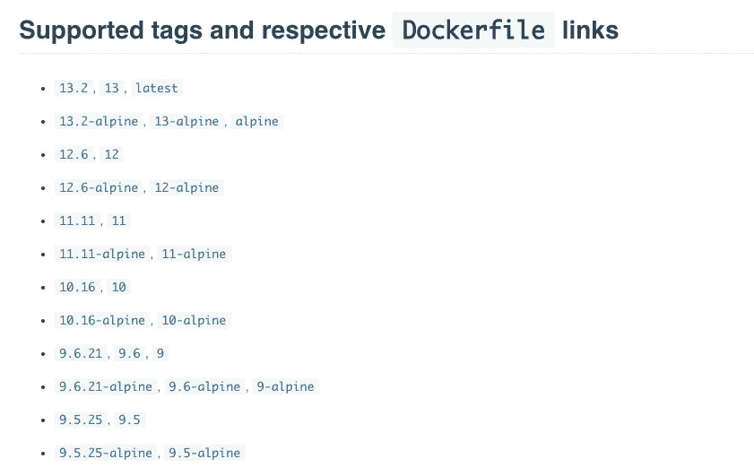
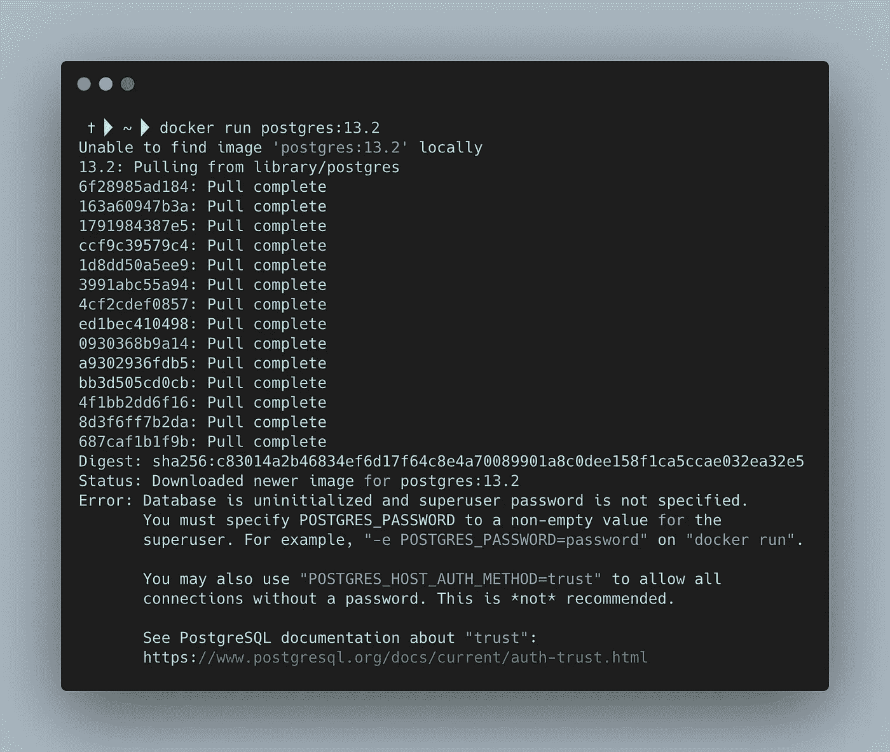
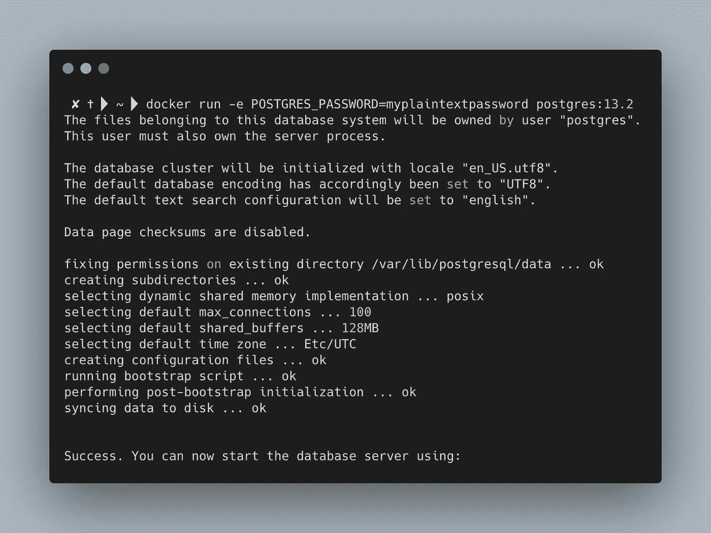
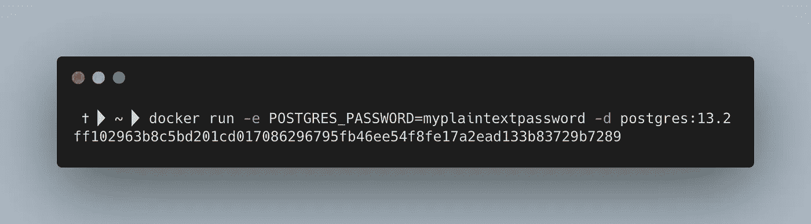
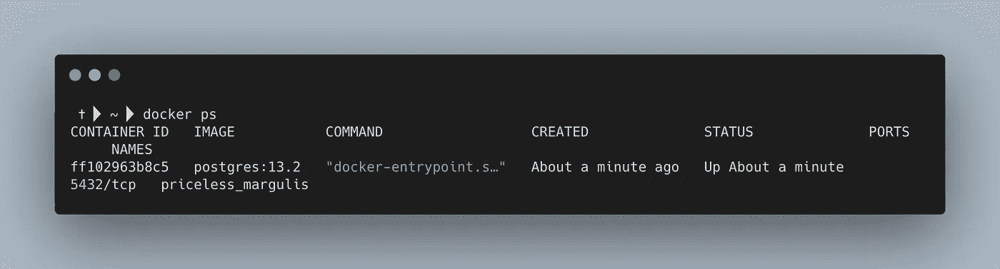
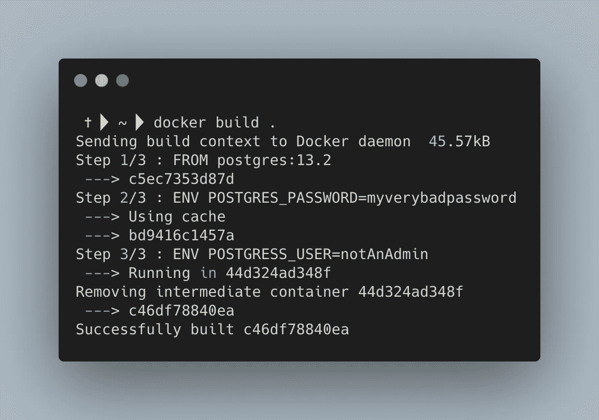
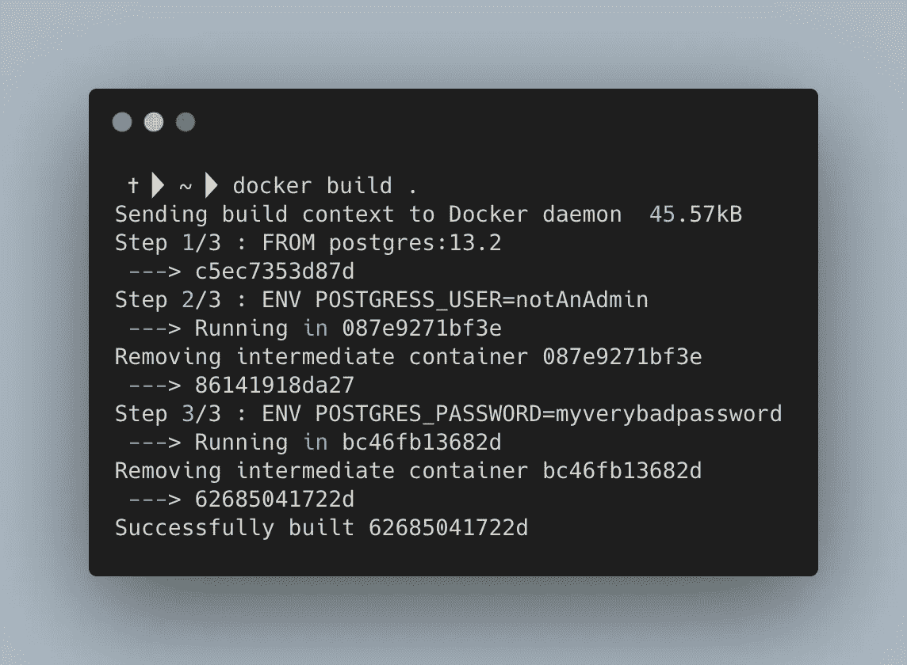
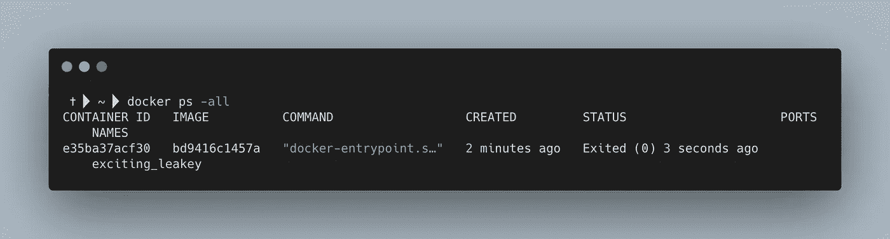
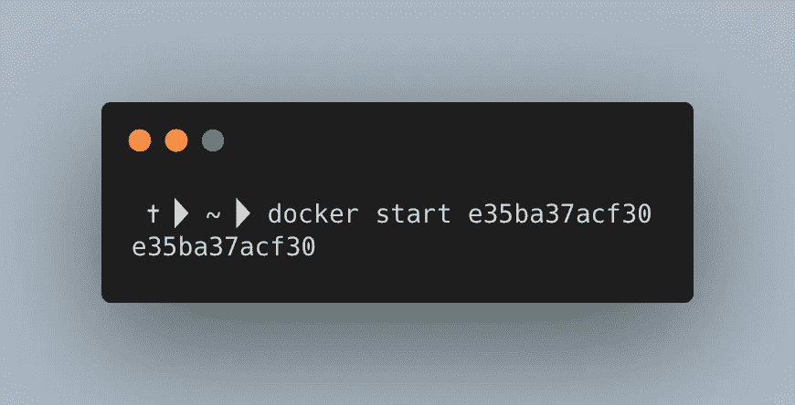
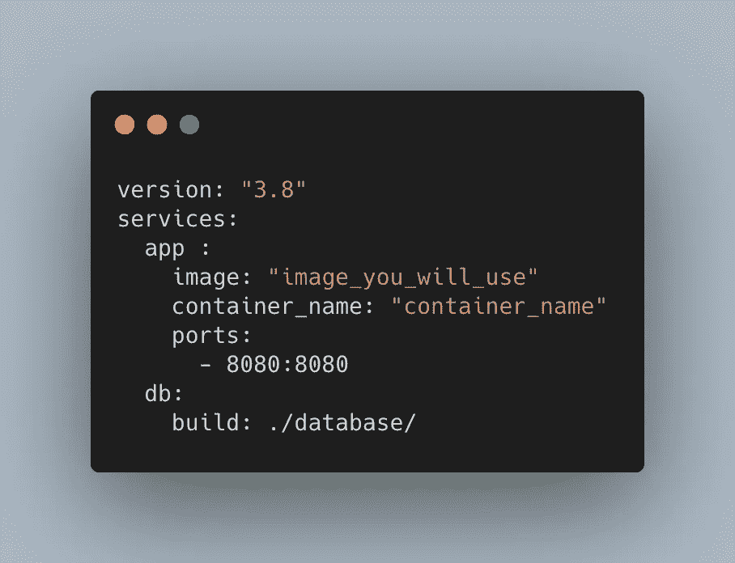

# 你听说过我们的救世主 Docker 吗？

> 原文：<https://towardsdatascience.com/docker-101-ee3d2b8ace11?source=collection_archive---------4----------------------->

## 使用 Docker 和创建自己的开发环境简介

# 介绍

在快速变化的环境中工作，越来越多的工具被开源，我的笔记本电脑变得一团糟。安装大量的应用程序，却忘记清理它们。类似地，我用 python 做了一些事情——没有虚拟环境，所以基本上，许多库可以在我的笔记本电脑上自由漫游。

最初的解决方案是从我的笔记本电脑中移除 Python 和所有其他杂乱的东西。但是后来我发现，如果我为一篇博客文章或与工作相关的事情进行 PoC，我会在同一个地方结束(虽然如果我转移到虚拟环境，就不会使用 python)。然后我找到了 Docker。我花了一段时间才明白那里发生了什么，以及我如何利用它来获得优势。

# 准备

如果你想继续下去，你应该:

*   Docker 来自[官方页面](https://www.docker.com/)
*   一些 IDE，或者你可以使用终端或 Jupyter 笔记本

# 了解什么是 docker

那么这个 docker 是什么？这位魔术师大师是如何解决我的问题的？

Docker 是一个平台。您可以创建一个特定的配置包，并在您自己的隔离环境中运行它，我们称之为容器。在某种程度上，容器实际上类似于虚拟机。你可以很容易地创建一个轻量级的容器，只需要一些相关的库和应用程序，并在上面运行你的代码。如果您决定与他人共享您的代码，您唯一需要共享的就是 docker 映像。

好，我提到的这个形象是什么？一堆指令来设置一个包含所有配置的容器，相关文件在你的工作目录中。

因为它是一个平台，我们有一个服务器-客户端的关系。

*   客户端——最有可能是与 docker-engine 交互的 CLI
*   服务器——在你的 docker-engine 中，是什么协调和映射了不同的东西
*   注册表 Docker 图像存储在其中，以后其他用户可以提取这些图像

好了，理论够了，我们去实践吧。

# 入门指南

好了，让我们从检查 docker 版本开始:

作者图片

如果我们看到我们有 docker(任何输出的版本)，我们就可以开始了，至少现在是这样！

如果您至少了解终端的一些基础知识，您可能会熟悉

```
ps
```

该命令列出了所有正在运行的进程及其 PID。幸运的是，我们为 docker 准备了类似的东西:

作者图片

我们可以看到，我有 0 个 docker 进程正在运行。我们如何让 docker 流程运行起来？

你说跑？这就是答案！

作者图片

让我们打破僵局:

**docker** —我们正在 docker 上执行

**运行** —创建/拉动并运行容器

**hello-world** —加载到容器中的图像

# Postgres 数据库

因此，假设我们需要在我们的机器上运行 Postgres DB 来进行一些 POC。为此，我们需要:

*   在 docker hub 中找到 docker 图像(或者如果你在那里有一些私人回购)
*   决定我们要用的版本
*   码头工人运行它

## 第一步

如果我们在谷歌上搜索 docker Postgres，我们会看到 docker hub [链接](https://hub.docker.com/_/postgres)到顶部的 Postgres 图片。在那里，我们可以看到大量关于图像及其用法的信息。

**第二步**



作者图片

好，这里我们看到 13.2，13，最新的，13-阿尔卑斯山。这是什么意思？

即 13.2 数字表示特定的 Postgres 版本。最新版——新版本，如果有新版本的话，会一直更新到新版本。最后但同样重要的是——阿尔卑斯山。Alpine 是应用程序运行的最基本的框架。Alpine 版本尽可能的轻便，只是因为它只有必需品，所以与其他版本相比，它的尺寸很小。使用 alpine 的好处——获得最少的东西，并且只添加相关的东西。你的 docker 容器将尽可能的小。易于移动和部署。

好吧，那我们选 13.2。

## 第三步

让我们做……

```
docker run postgres:13.2
```



作者图片

好的，它没有运行，但是我们看到了问题所在——我们需要为它传递一个密码，用-e. **-e** 表示环境变量



作者图片

我们看到终端处于运行进程模式，为了在同一个会话中做一些事情，我们需要终止 Postgres 进程。有一种方法可以让 Postgress docker 进程运行，并在同一个终端会话上做一些事情。我们可以使用 **-d** 来运行分离的流程。



作者图片

现在我们有了一些长绳子。这个字符串是我们的 docker 容器 ID。如果我们运行 **docker ps** ，我们会看到 docker 容器已经启动并正在运行:



作者图片

我们可以看到，docker ps 中的容器 id 与我们从 docker run 中获得的不一样，也不一样长。如果我们仔细观察，我们可以看到 docker ps one 是较长的一个子串。docker 很酷的一点是，它匹配你的容器 id 的开始，你不需要粘贴它的完整版本！

但是等等，我不是说过 docker 是一个隔离的环境吗？是的。我们不会对数据库做任何事情，因为我们没有暴露任何与它交互的端口。为此，我们需要使用 **-p**

```
docker run -e POSTGRES_PASSWORD=myplaintextpassword **-p HOST_PORT:DOCKER_CONTAINER** -d postgres:13.2
```

# Dockerfile 文件

好了，现在你可能会问自己，为什么这个人要向我解释，如何键入长命令来运行一些孤立的东西。重复，无聊。我该怎么分享？将命令发送给下一个人？效率不高…

没错，吊儿郎当是有道理的，但是营造环境，就不是了。这就是我们有 Dockerfile 的原因。

Dockerfile 基本上就是所有这些用环境变量映射出来的指令。所以对于我们的 Postgres，我们可以创建这样的:


作者图片

要构建它，请在 Dockerfile 的文件夹中运行:

```
docker build .
```

我们应该看到这样的东西

作者图片

bd9416c1457a —是新建的 docker 图像 id。我们现在可以像这样运行我们的容器:

作者图片

需要提到的一点是，当 docker 在每个步骤中构建您的 Dockerfile 时，它会创建一个新的 Docker 映像，并将其传递给下一个映像。所有这些变量都将放在缓存中，如果有地方可以重用的话，也就是说，在末尾添加一个新的环境变量:



作者图片

它的好处是，我们可以通过在底部添加更改来更快地构建映像。我们只需要从零开始构建新添加的部分！尽管如果我们交换密码和用户名的位置，我们将不得不再次构建映像:



作者图片

# 与容器交互

如果您决定优雅地关闭 docker 进程，您可以使用

```
docker stop CONTAINER_ID
```

或者你想杀了它

```
docker kill CONTAINER_ID
```

稍后，您可以使用以下命令检查停止的进程



作者图片

并恢复您的容器



作者图片

# 运行几个 docker 进程。

好吧，所以所有的都很容易与一个 docker 过程；我们创建一个 Dockerfile 文件并运行它。如果我需要一个额外的，我可以创建并运行它。但是在某些时候，它会很快失控，因为每次 docker 运行都需要设置端口和其他信息。

有一个解决方案— **docker-compose。**

## Docker 撰写

这是一个 YAML 文件，包含了更多关于构建什么以及不同 docker 文件如何一起播放的信息。



作者图片

让我们讨论一些事情:

*   版本—合成文件格式的版本。通过查看 [docker 文档](https://docs.docker.com/compose/compose-file/)来检查你的 docker 引擎是否与之兼容
*   app —应用程序/服务将使用一些预定义的 docker 映像(即气流), 8080 端口映射到我们的本地机器 8080
*   db—一个数据库应用程序，我们将使用 Dockerfile 对其进行容器化，该文件位于数据库目录中

好了，当我们准备好文件后，我们如何构建它呢？

如果您在目录中，您有文件:

```
docker-compose up -d --build
```

此外，您可以指定文件的完整路径:

```
docker-compose -f "PATH/YOU/HAVE/PUT/DOCKERCOMPOSE/FILE/docker-compose.yml" up -d --build
```

# 摘要

总而言之——Docker FTW。

这使得开发变得更加容易。创建一个图像，在其上运行你的应用程序，看看它是否有效。

我个人的原因是:

*   需要一个隔离的 ENV 用于基准测试/测试等。(使用 GitHub actions 和 Travis，您可以在 docker 映像中测试您的应用程序)
*   如果有问题，测试版本升级。
*   如果你弄乱了你的本地环境，而你又懒得去清理它

顺便说一下，代码以类似的方式保存在我的 [GitHub](https://github.com/TomasPel/workshops/tree/main/docker_101) 的一个 Jupyter 笔记本中，在那里你可以交互地运行它并看到结果。基本上是一个后续的机会，看看它在实践中如何工作。