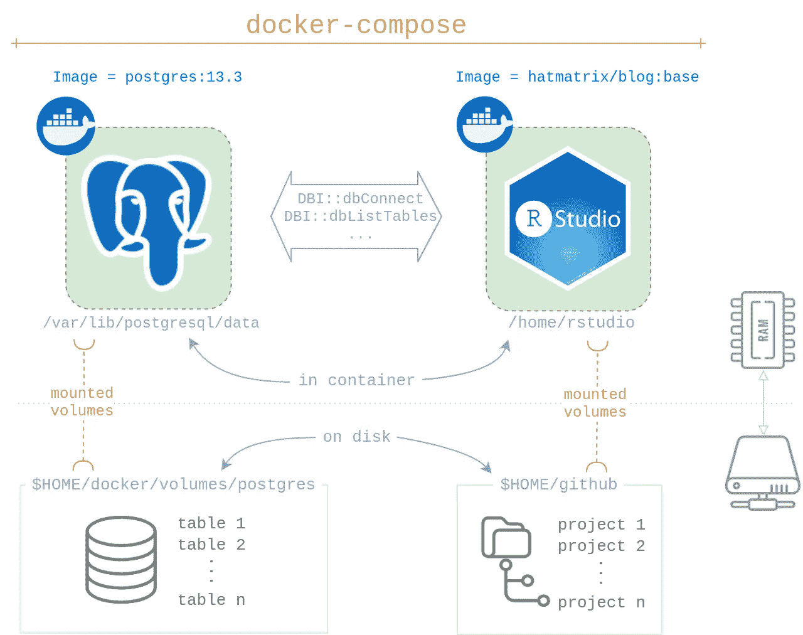

# 基于 Docker 的 RStudio 和 PostgreSQL

> 原文：<https://towardsdatascience.com/docker-based-rstudio-postgresql-fbeefe8285bf?source=collection_archive---------14----------------------->

## *这是与 Docker、PostgreSQL 数据库和异常数据集相关的两篇文章的第一部分。*

# 背景

在最近的 LinkedIn 帖子([原创](https://www.linkedin.com/posts/rahulsangole_rstats-datascience-analytics-activity-6824183826877698048-0ImA)和 [Rami](https://github.com/RamiKrispin) 的[转帖](https://www.linkedin.com/posts/rami-krispin_anomalydetection-data-timeseries-activity-6825126331672612864-MEks)和[推文](https://twitter.com/rsangole/status/1418418477329620993))中，我向互联网询问他们最喜欢的异常检测问题数据集，特别是在时间序列领域。我收到了很多回复，现在有了大量的数据可以处理，谢谢回复的人们。

为了处理这些数据，我需要一个比将数据保存为 CSV 文件、`qs`对象或 R 包更好的解决方案。我想要一个数据库来存储原始输入数据、我处理过的数据和算法结果。虽然我过去以传统方式设置数据库，但这次我希望整个代码库是可移植的&可复制的。

结果，我用 Docker 设置了所有的东西，它工作起来很流畅。如果你想了解如何做到这一点，请关注我的下一篇文章:

*   第一部分—(这篇文章)将教你如何为个人 PostgreSQL 数据库+ RStudio 代码开发建立一个简单的可重复的基于 Docker 的工作流
*   第二部分—(下一篇文章)将是异常数据的 ETL 管道

# 你为什么要读这个？

在本教程结束时，您将能够快速设置一个基于 Docker 的个人 PostgreSQL 数据库。您将学习如何使用`docker-compose`快速部署 PostgreSQL & RStudio。您将能够访问 R 中的数据库，并立即开始开发。最重要的是，整个过程将是完全可复制的，因为您继承了安装脚本和 Docker 的优点。

*本教程假设您熟悉 Docker 环境中的 Docker 和 RStudio。如果你不是，我推荐先阅读 R* *中的* [*可复制作品。*](https://rsangole.medium.com/reproducible-work-in-r-e7d160d5d198)

# 概观

您将启动两个 Docker 映像:

1.  PostgreSQL 图像。我选择`[postgres:13.3](https://hub.docker.com/_/postgres/)`
2.  RStudio 图像。我选择`[hatmatrix/blog:base](https://hub.docker.com/r/hatmatrix/blog/tags?page=1&ordering=last_updated)`

为了在容器寿命结束后永久存储数据，您将装入两个卷，每个容器一个卷。我选择了:

1.  对于 PostgreSQL: `$HOME/docker/volumes/postgres`
2.  对于 R 项目:`$HOME/github`



由作者创建的设置概述。从 flaticon.com 获得的图标。

除了容器内 PostgreSQL 之外，这些路径都不是特殊的；你可以根据自己的喜好定制其他的。默认情况下，`postgres:13.3`希望数据库位于`/var/lib/postgresql/data`。如果您选择另一个数据库，请相应地修改它。

我使用`docker-compose`同时启动 PostgreSQL 和 RStudio 服务。这很方便，同时也确保了 PostgreSQL 服务首先运行，然后是 RStudio。只需几个命令就可以轻松启动或停止所有服务。

# 首次设置

第一次设置 PostgreSQL 数据库时，需要运行这些步骤。我已经将这些步骤存储在`[00-postgres-init.sh](https://github.com/rsangole/postgres/blob/master/00-postgres-init.sh)` [中。](https://github.com/rsangole/postgres/blob/master/00-postgres-init.sh)

## 1-目录设置

您需要一个本地目录来存储 PostgreSQL 数据库。第 3-10 行为您处理这个问题。

## 2-PostgreSQL 设置

现在是设置数据库的时候了。您至少需要两步才能开始:

1.  一个新的“角色”(类似于登录)，有权创建新的数据库。
2.  至少要在一个数据库中工作。在我的脚本中，我做了两个:`work`和`anomaly`。

要操作数据库，需要运行 PostgreSQL 服务器来处理`psql`命令。您将使用`docker run`启动一个。您需要使用`-v`安装正确的卷。接下来，我们通过将`psql`命令传送到`docker exec`来创建角色和数据库。然后，我们停止集装箱

总之，现在我有了一个 PostgresSQL 数据库:

*   存储在`$HOME/docker/volumes/postgres`
*   有了新的角色`rahul`和密码`pass`
*   有两个数据库:`work`和`anomaly`

# 日常工作流程

## tldr:你是如何开始的？

1.  将`[docker-compose.yml](https://github.com/rsangole/postgres/blob/master/docker-compose.yml)`存储在本地目录中
2.  如果您更改了我选择的图像/目录，请对其进行修改
3.  在 shell 中，运行`docker-compose up -d`

*protip* :要启动一个浏览器(firefox for me)直接进入 RStudio，在你有`docker-compose.yml`的目录下运行这个命令:

```
docker-compose up -d; firefox localhost:8787
```

*pro-protip* :保存一个别名，通用化命令。`-f`参数指示`docker-compose`你想要使用哪个文件。现在可以在系统的任何地方运行。

## 崩溃

`[docker-compose.yml](https://github.com/rsangole/postgres/blob/master/docker-compose.yml)`里有什么？我们正在创建两个服务，一个叫做`db`，另一个叫做`rstudio`。⁴

先来看`db`。如果你熟悉`docker run` args，大多数参数看起来都很熟悉。这里的新特性是`restart: unless-stopped` arg，它告诉 Docker 只在 PostgreSQL 当前停止时才启动它。

第二个服务是`rstudio`。除了典型的参数之外，这里有趣的参数是`depends_on`，它告诉 Docker 只在数据库启动并运行之后运行这个映像*。太棒了。*

## 通过 R 连接

用于测试您的连接。运行你的`DBI::`命令，除了有一个关键的不同。

建立连接时，确保`host`的名称是您在`docker-compose.yml`中选择的数据库服务的名称。(在 docker 之外，您通常会使用`localhost`来连接本地 PostgreSQL 服务器)。

就是这样！你现在要去比赛了。像平常一样使用数据库

## 停止服务

您有两种选择:

1.  `docker-compose stop`将停止服务，您可以使用`docker-compose start`重新启动服务。
2.  `docker-compose down`将容器也取出。再次运行`docker-compose up`开始运行。

*8 月 8 日编辑:*我刚刚得知，我的[原始博客](https://rsangole.netlify.app/post/2021/08/07/docker-based-rstudio-postgres/)的脚注没有转到媒体上。他们在这里:

1.  我喋喋不休地谈论“个人”，因为我没有在工作环境中设置适当的角色、授权等。但是，它对我个人使用来说足够好了。
2.  这是我自己根据`[rocker/rstudio](https://hub.docker.com/r/rocker/rstudio)`拍摄的照片
3.  *属性:* DB 图标由[像素完善](https://www.flaticon.com/authors/pixel-perfect)
    文件夹图标由[图标极客 26](https://www.flaticon.com/authors/icongeek26)
    RAM 图标由 [Freepik](https://www.freepik.com/)
    存储图标由 [Smashicons](https://smashicons.com/)
4.  这些只是标签，你可以随便叫它们

*原载于*[*https://rsangole . netlify . app*](https://rsangole.netlify.app/post/2021/08/07/docker-based-rstudio-postgres/)*。*