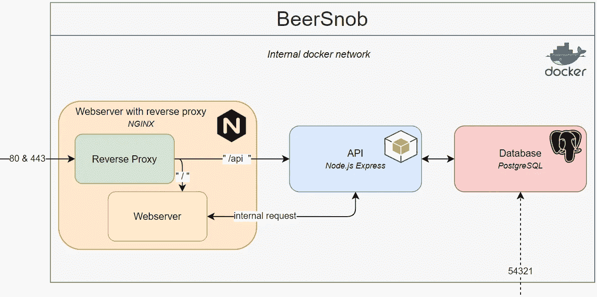
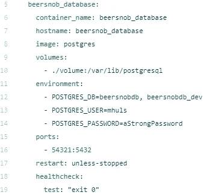
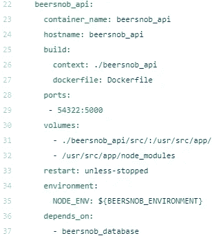

# Docker Compose 面向绝对初学者——它是如何工作的以及如何使用它(+示例)

> 原文：<https://towardsdatascience.com/docker-compose-for-absolute-beginners-how-does-it-work-and-how-to-use-it-examples-733ca24c5e6c?source=collection_archive---------0----------------------->

## 定义和运行多容器 Docker 应用程序

将你的容器演奏成一首美妙的交响乐(图片由[加布里埃尔·桑托斯](https://www.pexels.com/@gabrielsantosfotografia)在[像素](https://www.pexels.com/photo/man-performing-on-stage-2102568/)上提供)

在第 1 部分:Docker 的[基础知识](https://mikehuls.medium.com/docker-for-absolute-beginners-what-is-docker-and-how-to-use-it-examples-3d3b11efd830)中，我们着重于建立 Docker 形象。从该映像创建容器非常简单，只需执行一条命令。Docker-compose 进一步自动化了这一点。在本文中，我们将创建一个包含多个容器的运行配置的文件。然后，我们可以用一个命令构建所有的图像并运行所有的容器！

我们将借助一个多容器应用程序的详细示例来探索 compose。我们将旋转多个相互连接的容器。您可以将本演练用作自己项目的指南。在本文结束时，您将能够:

*   了解 Docker Compose 是什么以及它是如何工作的
*   了解 Docker Compose 为 Docker 增加了哪些优势，让您的生活更加轻松
*   了解何时使用 Docker 撰写
*   能够使用 Compose 启动和管理多个容器
*   能够吹嘘您的许多基础架构实现了自动化

在 [**这篇文章**](https://mikehuls.medium.com/docker-for-absolute-beginners-what-is-docker-and-how-to-use-it-examples-3d3b11efd830) 中，我们探讨了 Docker 的基础知识；如果对 Docker 不熟悉，建议先看一下。它详细介绍了如何创建 Docker 图像以及如何和何时使用这些图像。

首先，我们要看看 Compose 的优点；我们为什么需要这个工具，它能为我们提供什么？然后我们将有一个真实的代码示例，向您展示如何使用 Compose。

# 1.为什么使用 docker compose？

在这一部分，我们将讨论使用 Compose 的主要原因。

## 一个文件中的所有配置

Compose 围绕着一个名为`docker-compose.yml`的配置文件。在其中，我们定义了我们所有的服务。将服务视为应用程序的一部分；例如数据库或 API。我们所有的服务都依赖于我们用来创建容器的图像。旋转容器可以有多种选择；这些选项的配置方式将存储在 yml 文件中。

这些运行选项的一个例子是我们在[第 1 部分](https://mikehuls.medium.com/docker-for-absolute-beginners-what-is-docker-and-how-to-use-it-examples-3d3b11efd830)中定义的端口映射。我们不得不在我们的终端打电话给`docker run —publish 5000:5000 python-docker`。Compose 允许我们在一个文件中定义这些选项。稍后我们会看到一个这样的例子。

Compose 在容器中组织我们所有的服务(图片由 Tom Fisk 提供)

将我们所有的服务及其相应的构建选项放在一个文件中的另一个好处是，我们可以通过调用`docker-compose up`一次构建并运行我们所有的服务！

## 使用环境变量

使用环境变量可以更灵活地运行我们的容器。我们可以为`docker-compose up`命令提供一个包含一些环境变量的文件。这样，我们可以安全地提供密码，而不必将它们硬编码到配置文件中。

一个例子:我们将创建一个名为`.env`的文件，它包含`DBPASSWORD=secretpass`。然后我们可以使用 DBPASSWORD 作为`docker-compose.yml`中的变量。

为此，我们在调用 docker-compose: `docker-compose --env-file .env up`时指定我们的 env 文件。这使得我们的密码不在我们的库和 docker-compose.yml 中，而且它提供了更多的灵活性和更整洁的项目，因为我们的密码不再是硬编码的了。

## 共享集装箱网络

当我们使用 Compose 构建容器时，它定义了一个所有服务共享的网络。这意味着所有服务都可以在内部通信。

让我们用一个例子来说明这一点。假设我们将应用程序托管在 beersnob.com 上。当我们的 API 需要与我们的数据库通信时，它不需要通过 beersnob.com:5432 连接，而是可以在内部调用数据库。这对于安全性来说非常重要，因为这意味着只有我们的服务可以访问我们的数据库，客户端无法从应用程序外部访问服务。

## 可移植性和版本控制

因为我们把所有的配置都放在一个文件中，所以我们可以通过 Git 这样的版本控制系统轻松地共享这个文件。用户只需拉出 docker-compose.yml 和源代码，他们就可以运行所有的容器了！一个额外的好处是，我们保留了对我们的配置所做的所有更改的完整历史，以便我们可以随时恢复以前的版本。这也使得为这个应用程序建立 CI/CD 管道变得更加容易，我们将在以后的部分中讨论这一点。

## 灵活性

因为我们所有的服务都是彼此完全隔离的，所以我们可以很容易地添加新的服务。也许将来我们的应用程序需要一些缓存→只需旋转一个 Redis 容器！像我们的 API 这样的其他服务可以很容易地通过内部网络连接到新的 Redis 服务。

# 2.Docker 如何工作:创建我们的第一个容器

好了，说够了；让我们看看一些代码！为了真正理解 Compose 如何工作以及如何使用它，我们将构建一个容器化的应用程序。

## 2.1.目标

我们正在创建一个名为 **BeerSnob** 的应用程序；一个专门为喝优质啤酒的人建立的网站。它允许用户分享关于他们在特定场所喝的啤酒的评论；在提供价格和口味信息的同时，对场地和啤酒进行评级。

这个应用程序需要一个网站，一个 API 和一个数据库。在 [**这篇文章**](https://mikehuls.medium.com/version-control-your-database-part-1-creating-migrations-and-seeding-992d86c90170) 中，我们创建了一个具有迁移功能的数据库模型，在 [**这篇文章**](https://mikehuls.medium.com/version-control-your-database-part-2-migrations-and-seeds-for-table-relations-d4fb185d95d8) 中，我们为该应用创建了一个 API。现在让我们继续创建运行这些服务的基础设施。

## 2.2 概述

首先，我们将看看这张我们希望 BeerSnob 的建筑看起来是什么样的美丽图表:

我们的目标概述:我们在 Docker 中的应用(图片由[作者](http://mikehuls.medium.com)提供)

那么这一切意味着什么呢？首先要注意的是，我们现在有多个互连的服务运行在我们的单个服务器上。这本身就令人印象深刻，但它会变得更好。让我们先走过所有的街区:

我们将从包含所有其他内容的大**灰色块**开始。这是一个网络，在这个网络中，我们的所有服务(其他块)都位于我们的服务器上。请注意，只有两种方法可以进入我们的网络；通过端口 80 (http)、端口 443 (https)和端口 54321 从外部访问数据库。我们稍后会进入访问

**橙色块**:这是我们的 web 服务器和反向代理。
网络服务器保存我们的网站文件，并通过 http 和 https 向全世界发布；默认端口。
反向代理负责传递请求。例如，我们捕捉`beersnob.com/api`并将每个请求传递给蓝色块中的 API 服务，其他请求则传递给 web 服务器。

**蓝块**:我们的 API 负责我们的 web 服务器和数据库之间的通信。注意，我们的 web 服务器可以在内部执行请求；它不一定要调用`beersnob.com/api/users` 比如用`apicontainer/users`直接调用 API 容器就可以了。这提供了灵活性和安全性。

**红色块**:我们的数据库，保存着我们所有的数据。注意两件事:我们的 web 服务器和我们的数据库之间没有连接；这都是通过我们的 API 来处理的。第二件事是我们可以从网络外部访问我们的数据库。通过这种方式，我们可以连接到我们的数据库管理系统(例如 PgAdmin)中的数据库，并处理我们数据库中的数据，导出数据，导入数据或制作存储过程等。

查看本文 中关于如何容器化 Postgres 数据库的实用示例。

这个人非常想写一篇啤酒评论(图片由 [Cottonbro](https://www.pexels.com/@cottonbro) 在 [Pexels](https://www.pexels.com/photo/photo-of-man-drinking-whiskey-7265878/) 上提供)

## 3.创建 docker-compose.yml

我们将在 docker-compose.yml 中定义我们所有的服务和连接。

在这区区 50 多行代码中，Docker 编排了我们整个应用程序的所有容器。不过，我可以想象，如果你不熟悉作曲，可能会有点困惑，所以让我们从头到尾看一遍。您会看到定义了三个服务；一个数据库，API 和 web 服务器。让我们一个一个地过一遍。

## 3.1 数据库

查看我们的数据库容器的配置。

服务 1:我们应用程序的数据库

**container_name** :我们给容器起的名字。否则将生成一个随机名称

**主机名**:我们的容器可以通过这个主机名在内部网络上访问。请将此视为一种域名(http://beersnob_database)

**图片**:将要安装到容器中的软件。在这种情况下，它是默认的 Postgres 图像。

卷:卷是保存数据的一种方式。当我们运行这个映像时，Postgres 被构建在容器中。然后我们可以在里面放一些数据。如果我们移除容器，我们的数据也会消失。卷允许我们将容器中的数据复制到主机。卷也可以由多个容器共享。我们还可以将源代码放在卷中，这样当我们在主机上编辑代码时，更改就会反映在容器中。

**环境**:这些是容器的设置。这里我们提供了两个数据库名，一个用户名和一个密码，这样 Postgres 可以设置我们的第一个数据库和第一个用户

端口:默认情况下，我们无法访问容器中的数据库。通过这个端口映射，我们可以接入数据库。如果我们转到 localhost:54321，那么主机(Docker 运行的地方)将容器内的网络连接到端口 5432；我们的数据库就在那里运行。

**重启**:如果我们的容器崩溃了会怎么样？我们选择了“除非-停止”，但我们也可以“总是”重启、不重启(“否”)和“失败时”重启。

## 3.2 API

我们现在将检查 API 的所有配置，跳过我们已经在数据库中介绍过的部分。

构建:在数据库中，我们可以只传递一个图像，但是当涉及到我们的 API 时，我们必须做一些额外的工作。我们用包含 dockerfile 的**上下文**来引用名为“beersnob_api”的文件夹。在这个 docker 文件中，我们提取一个节点映像，安装我们的依赖项，并将我们的源代码复制到容器中。

**卷**:你可以看到我们将源代码(在`./beersnob_api/src`中)镜像到容器中。如果我们在宿主中修改了源代码，那么一旦我们重新运行它，这个修改就会反映在容器中。

**环境**:我们在 node 中的源代码需要用一个环境变量来调用(或者是“开发”或者是“生产”)。这是通过 env 文件完成的。在本文的后面部分会有更多的介绍。

**依赖于**:一旦数据库启动并运行，就启动这个 API 容器。

## 3.3 网络服务器

网络服务器将保存我们网站的源代码(通过卷)。还要注意，我们在这个容器中映射了 2 个端口:80 和 443 (http 和 https)。

## 3.4 内部集装箱网络

请注意，我们的容器化应用程序现在有了自己的内部网络，我们的服务可以用它来相互通信。想象一下，我们把应用程序放在 beersnob.com。我们的网站不必调用`http://beersnob.com/api/users`来从数据库中请求用户信息，相反，它可以只使用 API 的内部主机名(`http://beersnob_api/api/users`)。

我们的容器就像互相堆叠的积木(图片由[苏西·黑兹尔伍德](https://www.pexels.com/@suzyhazelwood)在 [Pexels](https://www.pexels.com/photo/conceptual-photo-of-word-play-spelled-by-wooden-blocks-1275235/) 上拍摄)

## 4.环境文件

还记得本文前面的环境文件吗？查看 docker-compose.yml 中的第 33 行；上面写着`NODE_ENV=${BEERSNOB_ENVIRONMENT}`。这意味着我们必须为 BEERSNOB_ENVIRONMENT 变量提供一个 env 文件。

## 5.旋转我们的容器

让我们旋转我们的容器！不用担心复制合成文件或没有所有数据；查看 [**这个链接**](https://github.com/mike-huls/beersnob_compose) ，在这里您可以克隆存储库并在您的机器上旋转容器。

导航到包含 docker-compose.yml 的文件夹并调用`docker-compose --env-file ./config/.env_dev up`。就是这样！这个命令提供了环境变量，复制了我们的源代码，安装了我们的依赖项，创建了所有的映像，最后启动了我们的网络和容器。让我们来测试一下！

*   去`[localhost](http://localhost:54322/api/test):54322/api/test`测试 API。
*   转到本地主机或`localhost:80`来测试 web 服务器
*   使用数据库管理系统(如 PgAdmin)通过 docker-compose.yml(第 12–14 行)中的凭证连接到我们在`localhost:54321`上的数据库

我们的容器像时钟中的齿轮一样一起工作(图片由 [Felix Mittermeier](https://www.pexels.com/@felixmittermeier) 在 [Pexels](https://www.pexels.com/photo/close-up-of-watch-against-black-background-325845/) 上拍摄)

# 结论

正如我们所见，Compose 增加了许多自动化、灵活性和标准化。就我个人而言，我认为以这样一种自动化的方式来处理基础设施是令人惊奇的。我们保持我们的服务解耦，我们的源代码隔离，我们的基础设施版本受控。希望这篇文章对您的应用程序容器化有所帮助。

Docker 提供了更多的功能。请继续关注下一部分，我们将在其中介绍在容器化应用程序中实现 CI/CD、实现 Docker Swarm 以及 Docker 提供的更多特性。[关注我](https://mikehuls.medium.com/membership)保持关注！

我希望这篇文章是清楚的，但如果你有建议/澄清，请评论，以便我可以做出改进。同时，请查看我的 [**关于各种编程相关主题的其他文章**](http://mikehuls.com/articles) ，例如:

*   [Docker 适合绝对初学者](https://mikehuls.medium.com/docker-for-absolute-beginners-what-is-docker-and-how-to-use-it-examples-3d3b11efd830)
*   [把你的代码变成一个真正的程序:使用 Docker 打包、运行和分发脚本](https://mikehuls.medium.com/turn-your-code-into-a-real-program-packaging-running-and-distributing-scripts-using-docker-9ccf444e423f)
*   [Python 为什么慢，如何加速](https://mikehuls.medium.com/why-is-python-so-slow-and-how-to-speed-it-up-485b5a84154e)
*   [Python 中的高级多任务处理:应用线程池和进程池并进行基准测试](https://mikehuls.medium.com/advanced-multi-tasking-in-python-applying-and-benchmarking-threadpools-and-processpools-90452e0f7d40)
*   [编写自己的 C 扩展来加速 Python x100](https://mikehuls.medium.com/write-your-own-c-extension-to-speed-up-python-x100-626bb9d166e7)
*   【Cython 入门:如何在 Python 中执行>每秒 17 亿次计算
*   [用 FastAPI 用 5 行代码创建一个快速自动归档、可维护且易于使用的 Python API](https://mikehuls.medium.com/create-a-fast-auto-documented-maintainable-and-easy-to-use-python-api-in-5-lines-of-code-with-4e574c00f70e)

编码快乐！—迈克

又及:喜欢我正在做的事吗？[跟我来](https://mikehuls.medium.com/membership)！

 [## 通过我的推荐链接加入媒体-迈克·赫斯

### 作为一个媒体会员，你的会员费的一部分会给你阅读的作家，你可以完全接触到每一个故事…

mikehuls.medium.com](https://mikehuls.medium.com/membership)