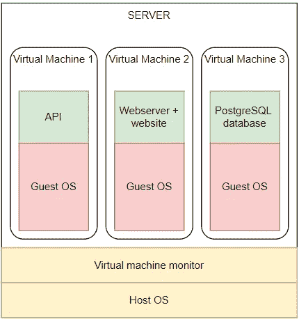
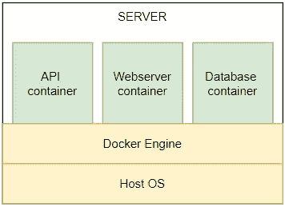

# 面向绝对初学者的 Docker——什么是 Docker 以及如何使用它(+示例)

> 原文：<https://towardsdatascience.com/docker-for-absolute-beginners-what-is-docker-and-how-to-use-it-examples-3d3b11efd830?source=collection_archive---------2----------------------->

## 像管理应用程序一样管理您的基础架构


我们今天装运集装箱！(图片由[像素](https://www.pexels.com/photo/business-cargo-cargo-container-city-262353/)上的[像素](https://www.pexels.com/@pixabay)拍摄)

Docker 是一个神奇的工具，它为我们提供了代码的标准化、生产率、效率、可维护性和兼容性，使我们的生活变得更加容易。它允许我们持续快速地部署和测试我们的代码，并且它是独立于平台的。

如果你不确定 Docker 是什么，用它做什么或者怎么用；这是给你的文章！对于 Docker 的新手，我会尽量给出一个尽可能清晰的解释。在本文结束时，您将:

*   使用 Docker 有很多好处
*   了解 Docker 是什么以及它是如何工作的
*   了解为什么使用 Docker:它能为您提供什么，以及它如何让您的生活更轻松
*   了解何时使用 Docker
*   能够使用 Docker 拉一个图像并旋转你的第一个容器

如果你觉得这篇文章的任何部分需要更多的解释，如果你有问题，或者如果你认为这篇文章可以在任何其他方面得到改善:请评论，让我知道！

我们先从 Docker 带给你的优势说起；为什么你应该首先使用它。我把它分成了几个部分，其中一些可能会有一点重叠。这是因为我试图尽可能简单地解释，以便让尽可能多的人可以使用 Docker。
在第一部分之后，你会完全相信你的生活中需要 Docker 现在我们在泥地里觅食。对于一个简单的例子——应用程序，我们将执行所有的基本步骤来启动并运行 Docker 容器。我们走吧！

# 1.为什么要用 Docker？

下面列出了使用 Docker 的主要原因。我会尽可能清楚地解释每一点。

## 虚拟化

数据中心到处都是服务器。这些都是功能强大的计算机，你可以通过互联网访问，可以用于各种事情。数据中心为客户提供租用部分服务器的选项；这叫做虚拟机；不是整个计算机，而是它的一部分，使*像一个完整的机器一样运行*。这被称为虚拟化，因为你的主机(主机*)就像是 3 个独立的机器(访客*)一样，如下图所示。**

****

**使用虚拟机托管我们的应用**

**您将看到服务器托管了 3 台虚拟机；一个用于我们的 API，一个用于 web 服务器，一个用于数据库。此外，它还拥有一些基础架构和一些服务来控制所有虚拟机。这里最重要的一点是，每个虚拟机都有自己的客户操作系统。这完全是多余的，占用了大量内存。**

**当你使用 Docker 时，你不需要虚拟机。您将应用程序打包在一个运行在机器上的容器中。这可以是服务器，也可以是您自己的笔记本电脑:**

****

**将我们的应用归档**

**请注意，我们节省了大量内存；我们的应用程序共享一个操作系统(至少是内核)，这使得它更加轻量级。查看下面的文章，这是一个关于如何将 Postgres 数据库容器化的很好的实用示例。**

**[](/getting-started-with-postgres-in-docker-616127e2e46d) [## Docker 中的 Postgres 入门

### 为初学者在 Docker 容器中创建 Postgres 数据库

towardsdatascience.com](/getting-started-with-postgres-in-docker-616127e2e46d) 

## 轻便

docker 文件不仅允许我们发布应用程序代码，还允许我们发布环境。我们不仅可以将应用程序的源代码推送到 git，还可以包含 docker 文件。当其他人提取我们的存储库时，他们可以在 Docker 容器中构建源代码，我们可以从 Docker 文件中创建。

## 版本控制和 CI/CD

就像在**可移植性**中描述的那样，我们可以跟踪 Docker 文件中的变化。通过这种方式，我们可以试验新版本的软件。例如，我们可以创建一个分支，在这个分支中我们可以试验 Python 的最新版本。

## 隔离

当您的代码在容器中运行时，它不会影响其他代码。它是完全孤立的。如果在更新全局安装的库之后，您的某个脚本出现了意外错误，您可能会意识到这个问题。

## 撰写容器

应用程序很少由一部分组成:大多数情况下，多个容器必须协同工作来创建所有的功能。一个例子:一个网站，API 和数据库必须连接在一起。这就是 Docker Compose 允许我们做的事情。我们可以创建一个定义容器如何相互连接的文件。我们可以使用这个文件一次性实例化所有容器的所有 docker 文件！** 

# **2.Docker 如何工作:创建我们的第一个容器**

**让我们动手做点什么，然后编码吧！你可以把 Docker 看作是一种把你的代码打包到一个漂亮的小容器中的方法，这个容器包含了运行它所需要的一切；它将你的代码容器化。好处是多方面的:容器是可伸缩的，有成本效益的，并且是相互隔离的。本部分重点介绍 docker 元素:**

*   ****Dockerfile:** 应该如何构建映像的规范**
*   ****图片:**像一张 CD:它包含了所有的代码，但还不能做任何事情。**
*   ****容器:**一个运行的图像。把它想象成你刚刚放入 CD 播放器的 CD。它正在执行图像。**

**[](/docker-for-absolute-beginners-the-difference-between-an-image-and-a-container-7e07d4c0c01d) [## 面向绝对初学者的 Docker:图像和容器的区别

### 了解 Docker 图像和容器的区别以及图像是不同的+实用代码示例

towardsdatascience.com](/docker-for-absolute-beginners-the-difference-between-an-image-and-a-container-7e07d4c0c01d) 

所有这些都将在下面解释并给出例子。


是时候开始打包这些容器了(图片由 [Kaique Rocha](https://www.pexels.com/@kaiquestr) 在[像素](https://www.pexels.com/photo/man-jumping-on-intermodal-container-379964/)上拍摄)

## 2.1 文档文件

我们将创建一组指令，告诉我们的机器如何建立我们的形象。在我们的例子中，我们想在 Flask 中创建一个简单的网站；一个 Python web 框架。查看下面的文档:

让我们一行一行地过一遍。

*   一号线。这告诉 Docker 安装一个安装了 Python 3.8 的 OS (Debian Slim Buster)
*   第三行。在 docker 容器中创建一个名为“app”的文件夹。我们所有的代码都存放在这里
*   第五行。将我们机器上的 requirements.txt 文件复制到 docker 容器上的工作目录中
*   第六行。这将下载并安装我们的应用程序所需的所有 Python 依赖项。在我们的情况下，这将安装烧瓶
*   第八行。将当前目录中的所有内容复制到工作目录中。这将移动我们所有的源代码
*   第 10 行:这通过调用安装的 Flask 模块并在本地主机上运行我们的应用程序来启动我们的应用程序。** 

## **2.2 码头工人形象**

**我们的 Dockerfile 被定义了，让我们用它来创建一个图像。奔跑**

```
**docker build --tag python-docker**
```

**该命令将获取 docker 文件并将其构建成一个映像。我们还会给它一个名为 python-docker 的标签。当映像建立后，我们可以执行`docker images`来找到它。**

**我们刚刚做了一个图像。把这个想象成一个游戏的光盘；它包含所有的资产，图形和代码，使其工作。我们现在可以在容器中旋转图像。**

## **2.3 码头集装箱**

**容器是我们图像的一个运行实例。如果图像像一个光盘，现在我们把图像放入我们的电脑，运行我们的游戏。在我们的类比中，跑步游戏是我们的容器。同样，我们可以使用以下命令运行我们的映像:**

```
**docker run --publish 5000:5000 python-docker**
```

**在这个命令中，我们告诉 docker 运行一个名为 python-docker 的映像。这就是我们在上一部分中标记图像的内容。我们还指定了`--publish 5000:5000`。这详细说明了我们希望如何在我们的笔记本电脑(主机)和 docker 容器之间连接端口。因为 Flask 默认运行在端口 5000 上，所以这个标志的第二部分需要是 5000。我们已经选择在我们的主机上的端口 5000 上访问容器。要看到这在行动中导航到`localhost:5000`，看看我们的 Flask 网站工作！**

**试着运行`docker run --publish 4331:5000 python-docker`，你会发现你必须导航到`localhost:4331`。**

# **结论**

**学会了如何提取图像和旋转容器，为自动化、部署和测试你的软件打开了许多大门。尽管如此，当谈到 Docker 提供的所有好处时，我们只是触及了皮毛。**

**在 [**的下一部分**](https://mikehuls.medium.com/docker-compose-for-absolute-beginners-how-does-it-work-and-how-to-use-it-examples-733ca24c5e6c) 中，我们将深入了解 Docker Compose 如何编排多个容器协同工作，并通过一个配置文件自动组装容器。稍后，我们将研究如何将 Docker 整合到 CI/CD 流程中，以及如何在 Docker 群中管理 Docker 引擎集群。感兴趣吗？[关注我](https://mikehuls.medium.com/membership)保持关注。**

**我希望这篇文章是清楚的，但如果你有建议/澄清，请评论，以便我可以做出改进。与此同时，请查看我的 [**其他关于各种编程相关主题的文章**](http://mikehuls.com/articles) ，例如:**

*   **[Docker 为绝对初学者编写](https://mikehuls.medium.com/docker-compose-for-absolute-beginners-how-does-it-work-and-how-to-use-it-examples-733ca24c5e6c)**
*   **[把你的代码变成一个真正的程序:使用 Docker 打包、运行和分发脚本](https://mikehuls.medium.com/turn-your-code-into-a-real-program-packaging-running-and-distributing-scripts-using-docker-9ccf444e423f)**
*   **[Python 为什么慢，如何加速](https://mikehuls.medium.com/why-is-python-so-slow-and-how-to-speed-it-up-485b5a84154e)**
*   **[Python 中的高级多任务处理:应用线程池和进程池并进行基准测试](https://mikehuls.medium.com/advanced-multi-tasking-in-python-applying-and-benchmarking-threadpools-and-processpools-90452e0f7d40)**
*   **[编写自己的 C 扩展来加速 Python x100](https://mikehuls.medium.com/write-your-own-c-extension-to-speed-up-python-x100-626bb9d166e7)**
*   **[cyt hon 入门:如何用 Python 执行>每秒 17 亿次计算](https://mikehuls.medium.com/getting-started-with-cython-how-to-perform-1-7-billion-calculations-per-second-in-python-b83374cfcf77)**
*   **[用 FastAPI 用 5 行代码创建一个快速自动归档、可维护且易于使用的 Python API](https://mikehuls.medium.com/create-a-fast-auto-documented-maintainable-and-easy-to-use-python-api-in-5-lines-of-code-with-4e574c00f70e)**

**编码快乐！—迈克**

**又及:喜欢我正在做的事吗？跟我来！**

**[](https://mikehuls.medium.com/membership) [## 通过我的推荐链接加入 Medium—Mike Huls

### 作为一个媒体会员，你的会员费的一部分会给你阅读的作家，你可以完全接触到每一个故事…

mikehuls.medium.com](https://mikehuls.medium.com/membership)**