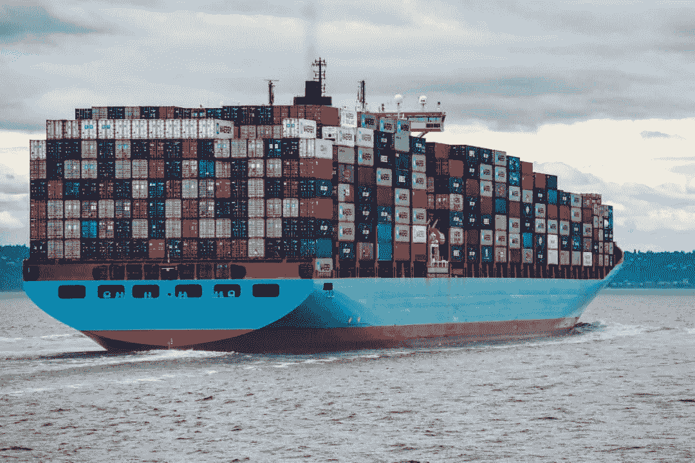
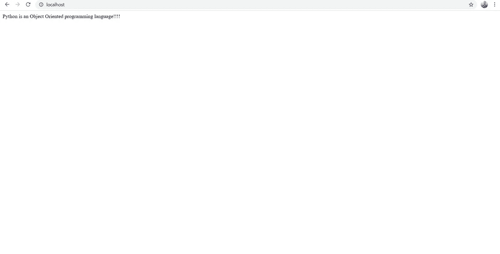
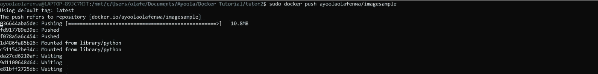
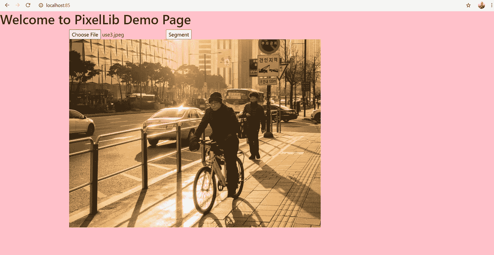
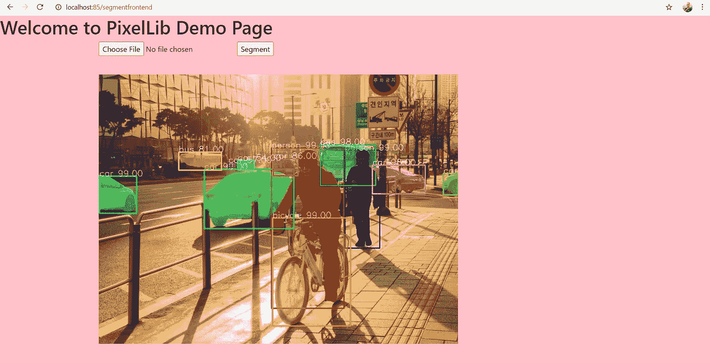
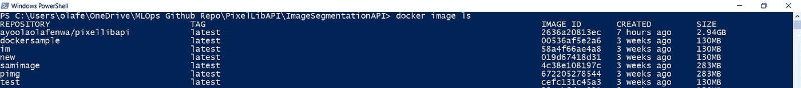
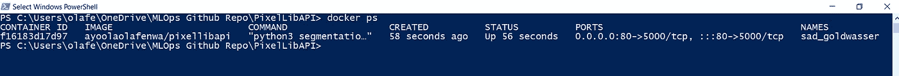
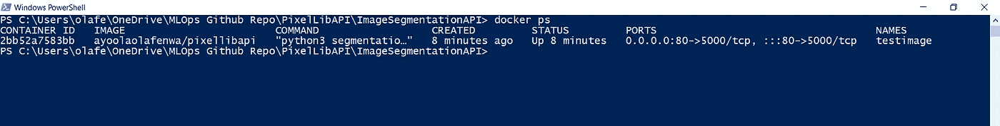

# 零碎的码头工人

> 原文：<https://towardsdatascience.com/docker-in-pieces-353525ec39b0?source=collection_archive---------6----------------------->

## 了解 docker 的基本概念、工作原理，以及如何使用 docker 构建机器学习 Rest APIs。



[来源](https://unsplash.com/photos/jOqJbvo1P9g)

## 目录

**1**[Docker 是什么，为什么有用](https://medium.com/p/353525ec39b0#281d)

**2** [**Docker 概念**](https://medium.com/p/353525ec39b0#ee54)

**3** [**用 Docker**](https://medium.com/p/353525ec39b0#5497) 构建机器学习 API

**4**[Docker 命令 ](https://medium.com/p/353525ec39b0#c34b)

# 什么是 Docker，为什么它有用

Docker 是一个工具，用于将软件应用程序代码及其依赖项组合成一个单独的包，可以在任何计算机环境中独立运行。Docker 是一个非常有用的 DevOps 工具，用于构建和打包软件应用程序，可以在软件工程中跨多个平台使用。开发的软件应用程序可能依赖于依赖性，并且由于诸如操作系统或不良环境设置的编码环境的差异，软件的依赖性可能无法安装。如果我们能够以这样一种方式隔离软件，使其独立于计算机的环境，那么依赖失败来使用软件的挫折感将会大大减少。这就是 docker 作为一个便捷工具的用武之地。docker 的目标是将软件代码及其依赖项组织成一个单独的包，可以在独立的环境中安装和使用。

我上面解释的一个真实的例子是这样的

python 中内置了一个机器学习软件应用程序，用于对图像和视频中的对象进行分类。工程师的目标是让每个人都可以使用这个软件。实际上，使用该软件需要安装深度学习库，如 tensorflow 或 pytorch，其他依赖项，如 opencv、numpy 和其他软件包。工程师可以使用 docker 轻松地将该软件的代码和依赖项打包成一个包。任何人都可以下载机器学习软件应用程序作为 dockerized 应用程序，并使用它，而不用担心安装其依赖项。

> 在本文中，我将详细解释 docker 的基本概念以及如何构建一个 docker 化的应用程序。

# 码头设备

## Linux 操作系统

按照这篇教程学习如何在 Linux 上安装 docker。

<https://docs.docker.com/engine/install/ubuntu/>  

## Windows 操作系统

请按照本教程学习如何在 Windows 上安装 docker

<https://docs.docker.com/desktop/windows/install/>  

## mac 操作系统

请按照本教程学习如何在 Mac OS 上安装 docker。

<https://docs.docker.com/desktop/mac/install/>  

# Docker 概念

首先，我们需要理解 docker 的一些基本概念，这些概念将使我们对用它构建软件的过程有一种直觉。一些最重要的概念包括:

*   **docker 主机:**这是我们安装 Docker 并运行 Docker 引擎的物理或虚拟机。它可以是您的笔记本电脑，也可以是云计算平台(如 Azure、AWS)上提供的虚拟机。
*   **docker 守护进程:**这是 Docker 引擎的一部分，控制 Docker 化应用的构建和运行。
*   **docker 客户端**:这是一个接口，用作与 Docker 引擎中的 Docker 守护进程通信的媒介，例如命令行接口。我们可以使用命令行界面输入命令来开始或结束 docker 守护进程中的操作。
*   **Docker 镜像:**这是在构建 Docker 应用程序期间由软件代码组件产生的一组只读层。它是通过打包软件代码及其依赖项而产生的包。它充当生成 docker 容器的模板。
*   **Docker 容器:**它是在运行映像时创建的。它是映像的运行状态。Docker 容器执行打包在 docker 映像中的代码。
*   **Docker 容器化:**在 Docker 容器中运行软应用代码的状态。
*   **容器注册处**:这是一个集中存放 docker 图片的地方。Docker hub 是 Docker 图片最受欢迎的注册表。像 Azure、AWS 和 Google cloud 这样的云计算平台都有自己的容器注册中心。Docker 图片从 dockerhub 上传和下载。

# **Docker 映像构建**

在这一部分中，我们将讨论将软件代码及其依赖项打包成 docker 应用程序或 docker 映像的过程。我将给出一个建立 docker 形象的简单指南。在每一个 docker 镜像构建过程中，都有一个非常重要的文件叫做 ***Dockerfile*** 控制着 docker 镜像构建的所有步骤。

## **码头形象建设规范**

**Python 代码**

这是我们想要打包到 docker 映像中的 python 代码。

**requirements.txt 文件**

这是包含我们想要构建的映像所需的依赖项的文件，对于我们简单的 docker 映像，唯一需要安装的是 flask。

```
flask
```

## **Dockerfile**

这个文件包含一组指令或命令，告诉 docker 守护进程如何构建 docker 映像。它有许多决定图像构建的命令。

## **Dockerfile 命令**

中的**:这是一个从容器注册表中提取或下载 docker 镜像的命令。该映像将作为构建自定义 docker 映像的基础映像。在上面这个例子中，使用的基础图像是***python:3.8-slim-buster***。**

**ENV:** 这是用于定义 docker 容器中使用的环境变量的命令。

**WORKDIR:** 该命令指定 docker 映像将被构建的目录，如果该目录不存在，它将被自动创建。

**运行**:该命令用于执行其他命令，如安装 docker 镜像的依赖项。

**COPY:** 该命令将构建 docker 映像所需的所有代码文件复制到工作目录中。

**EXPOSE:** 这是一个命令，它将为从 docker 映像创建的容器分配一个端口。

**CMD:** 这是执行从映像创建的容器的运行过程的命令。在这个示例中，我们只想运行 python 文件 ***app.py.*** 中的代码

**图像构建**

这是构建映像的 docker 命令。

```
docker build -t sampleimage .
```

*   这代表了给我们想要构建的图像的标签。默认标签是 latest，可以给它一个更合理的标签，如 v1，来表示映像构建版本。build 命令末尾的点表示映像的构建上下文。在这种情况下，映像是在当前工作目录中构建的。

**Docker 映像构建过程**

开始构建映像时，您会在 CLI 界面中看到如下日志:

```
Sending build context to Docker daemon  2.048kBStep 1/8 : FROM python:3.8-slim-buster3.8-slim-buster: Pulling from library/pythonb380bbd43752: Pull complete81c44d634db0: Pull complete9667f949f66d: Pull complete3e9f5c1d871e: Pull completeb181e9f84c74: Pull completeDigest: sha256:9e3036f6b032794efb662f3c579c4c35d0b678bc793590e3e2e217cb5bf1e11bStatus: Downloaded newer image for python:3.8-slim-buster---> 52c287c5a9a3
Step 2/8 : ENV language Python---> 3daefef935e9Step 3/8 : ENV type Object Oriented---> Running in 374baff80d4aRemoving intermediate container 374baff80d4a---> 5d093fcdd6baStep 4/8 : WORKDIR /app---> Running in 5925b551d682Removing intermediate container 5925b551d682---> 94fa4e3b33ddStep 5/8 : EXPOSE 5000---> Running in 3c3d1bdf6cbcRemoving intermediate container 3c3d1bdf6cbc---> 515acc697171Step 6/8 : COPY . /app---> 67f96e5cdf0bStep 7/8 : RUN pip3 install -r requirements.txt---> Running in eeee3ef25fc7Collecting flaskStep 8/8 : CMD ["python3", "app.py"]---> Running in e7df1dd83cceRemoving intermediate container e7df1dd83cce---> 7a9115cda945Successfully built 7a9115cda945Successfully tagged imagesample:latestdocker build -t imagesample .Sending build context to Docker daemon  2.048kB
```

**向 Docker 守护进程发送构建上下文:**当命令***Docker Build-t image sample。执行*** ，显示的第一个输出是发送构建上下文到 ***Docker 守护进程，*** 处理 Docker 映像的构建。命令行界面充当 **Docker 客户端**，它将输入的命令发送给 **Docker 守护进程**以构建映像。

```
Step 1/8 : FROM python:3.8-slim-buster3.8-slim-buster: Pulling from library/pythonb380bbd43752: Pull complete81c44d634db0: Pull complete9667f949f66d: Pull complete3e9f5c1d871e: Pull completeb181e9f84c74: Pull completeDigest: sha256:9e3036f6b032794efb662f3c579c4c35d0b678bc793590e3e2e217cb5bf1e11bStatus: Downloaded newer image for python:3.8-slim-buster---> 52c287c5a9a3
```

**第 1/8 步:**是命令的执行拉动基础镜像也就是***python:3.8-slim-buster***。

**注意:** Docker Pull 是从容器注册表下载图像的过程。

```
Step 2/8 : ENV language Python---> 3daefef935e9
Step 3/8 : ENV type Object Oriented---> Running in 374baff80d4a
```

**步骤 2/8 和 3/8:** 这些步骤为要在容器中使用的 docker 图像设置环境变量。

```
Step 4/8 : WORKDIR /app---> Running in 5925b551d682Removing intermediate container 5925b551d682---> 94fa4e3b33ddStep 5/8 : EXPOSE 5000
```

**步骤 4/8 和 5/8:步骤 4** 为 docker 镜像设置工作目录，而**步骤 5** 将运行 docker 镜像的端口 5000 公开为容器。

```
Step 6/8 : COPY . /app---> 67f96e5cdf0bStep 7/8 : RUN pip3 install -r requirements.txt---> Running in eeee3ef25fc7Collecting flaskStep 8/8 : CMD ["python3", "app.py"]
```

**步骤 6/8，7/8，8/8:步骤 6** 从工作目录中复制所有需要的文件。 **step8** 安装需求文件中提供的包。第 8 步构建运行 docker 镜像的容器层。

**成功建立形象**

```
Successfully built 7a9115cda945Successfully tagged imagesample:latest
```

这是最后一个日志输出，显示映像已成功构建，并且映像标记为 **imagesample:latest** 。

**注:**这个 docker 镜像构建过程有八个步骤，对应 ***dockerfile*** 中定义的八条指令。如果在 ***dockerfile*** 中定义了 20 个阶段，那么将有 20 个步骤来构建映像。

**Docker 镜像运行**

我们已经构建了映像，下一步是运行它。运行映像时，会自动从映像创建一个容器。容器将执行我们用来构建图像的代码。使用以下命令运行 docker 映像:

```
docker run -p 80:5000 imagesample
```

**-p 80:5000:** 这是用于运行通过运行映像创建的容器的端口分配。我们在***【docker file】***中暴露了端口 ***5000*** ，并将端口 ***80*** 映射到端口 ***5000*** 。

运行 docker 的输出将是:

```
Serving Flask app ‘app’ (lazy loading)
 * Environment: production
 WARNING: This is a development server. Do not use it in a production deployment.
 Use a production WSGI server instead.
 * Debug mode: off
 * Running on all addresses.
 WARNING: This is a development server. Do not use it in a production deployment.
* Running on [http://172.17.0.2:5000/](http://172.17.0.2:5000/) (Press CTRL+C to quit)
```

在您的浏览器中访问 localhost:80，这将是加载的页面！



作者图片

容器加载了一个简单的 web 页面，其中包含我们在图像构建中使用的 python 代码中的打印消息。

```
@app.route("/")
def home():    
   return f"{os.getenv('language')} is an {os.getenv('type')}      programming language!!!!"
```

**注意:**这个简单的 docker 映像用于解释 docker 映像构建背后的基本概念。在本文的后半部分，我们将讨论 docker 在构建 Rest API 中更实际的应用。

## **Docker 图像上传到容器注册表**

我们已经成功地建立了一个 docker 映像，但我们需要一个 docker hub 帐户来让每个人都可以下载和使用它。

**注册 DockerHub**

  

在 Dockerhub 上拥有帐户后，您可以使用您的帐户上传 docker 图片。

**Docker Push:**It**是将 Docker 映像上传到容器注册中心的过程。它遵循简单的程序:**

通过 CLI 界面登录您的 docker hub，

```
docker login
```

用你的 dockerhub 用户名标记你的图片，

```
docker tag yourimage yourdockerhubusername/yourimage
```

推送 docker 图片。

```
 docker push yourdockerhubusername/yourimage
```

样本 docker 图像推送。

```
docker tag imagesample ayoolaolafenwa/imagesample
docker push ayoolaolafenwa/imagesample
```



作者图片

# 用 Docker 构建机器学习 Rest API

***docker*** 最重要的贡献之一就是用它来构建 Rest APIs。Rest API 只是一个使用 HTTP 请求来访问和使用数据的 API。Rest API 是网站的支柱之一，它使我们能够轻松地在线使用和访问数据。你有没有想过在网站中如何使用人工智能模型，购物网站如何根据你以前的购买情况，在后台使用人工智能模型来进行产品推荐？我们能够通过 Rest APIs 在后台使用 AI 模型，这使得模型有可能接受用户的数据来做出正确的预测。在本教程的这一部分，我将展示 docker 在构建机器学习 REST API 中的实际使用。为此，我实现了一个图像分割 API，使用我的 python 库 **PixelLib** 进行图像分割。

**API 目标:**我使用 docker 将用于图像分割的代码及其依赖关系封装成一个单独的包来创建 Rest API。

## 为分段 API 构建 Docker 映像的代码

**图像分割 API 的 docker file**

我们定义了一个更复杂的 **dockerfile** ，它带有一种为了建立我们的映像而要安装的软件包的风格。此 docker 文件中安装的所有包都是 **PixelLib** 图像分割 API 所需的依赖项。这些包包含了很多用于 PixelLib 的**Linux**OpenCV 和 **pytorch** deeplearning 库的**包。**

**requirements.txt**

```
pixellibflaskpycocotools
```

requirements.txt 文件包含了我们分割 API 的附加依赖项，特别是用于执行图像分割的 **PixelLib、**库。

**分段 API 代码**

**Web API 的 Html 代码**

**注意:**由于构建映像时要安装大量的依赖项，构建此映像分段 API 将会耗费大量时间。我已经为图像分割 API 构建了这个 docker 图像，它可以在 Dockerhub 上获得，您可以使用以下命令轻松地从那里提取图像:

```
docker pull ayoolaolafenwa/pixellibapi
```

如果您想要构建镜像，请克隆[代码库](https://github.com/ayoolaolafenwa/PixelLibAPI):

```
git clone ayoolaolafenwa/pixellibapi
```

下载[point rende 泡菜分割模型](https://github.com/ayoolaolafenwa/PixelLib/releases/download/0.2.0/pointrend_resnet50.pkl)，放在***ImageSegmentationAPI***目录下。

```
cd ImageSegmentationAPI
docker build -t yourimagename
```

运行分段 API

```
docker run -p 80:5000 ayoolaolafenwa/pixellibapi
```

**注意:**我在本文中运行的图像示例使用了我推送到 dockerhub 的示例 docker 图像。如果您构建了自己的图像，请用您的图像名称替换它。

当我们运行图像时，我们可以使用 API 来检测任何图像中的对象。

**用于测试我们的 API 的示例图像**


[来源](https://unsplash.com/photos/SK8wJwW73BA)

**运行 API 的代码**

```
results = requests.post("http://localhost:80/segmentapi", files = {"image": open("sample.jpg", "rb")}).json()
print(results["outputs"])
```

我们使用 python requests 函数来接受我们正在运行的图像分割 API 的 url，即[**http://localhost:80/segment API**](http://localhost:80/segmentapi)**。**我们传递图像的路径，最后打印出分割 API 的输出。

该示例代码的输出是:

```
{'boxes': [[372, 158, 528, 504], [530, 163, 605, 374], [1, 219, 81, 299], [374, 309, 542, 542], [227, 204, 420, 332], [477, 151, 596, 239], [589, 195, 703, 257], [742, 213, 774, 259], [376, 181, 429, 218], [172, 167, 264, 206], [279, 190, 294, 200], [299, 185, 334, 205]], 'class_ids': [0, 0, 2, 1, 2, 5, 2, 2, 2, 5, 2, 2], 'class_names': ['person', 'person', 'car', 'bicycle', 'car', 'bus', 'car', 'car', 'car', 'bus', 'car', 'car'], 'mask_shape': [581, 774, 12], 'object_counts': {'bicycle': 1, 'bus': 2, 'car': 7, 'person': 2}, 'scores': [99, 99, 99, 99, 99, 98, 98, 97, 86, 81, 57, 54]}
```

输出包括关于图像中检测到的对象的许多细节，包括**框坐标值、类 id、类名、对象计数、分割掩模形状**和**预测分数**。我们已经成功地运行了一个图像分割 API。任何人都可以提取 docker 图像，将其作为一个容器运行，并执行图像分割，而不必担心有什么要求或依赖关系。这是一个机器学习后端 API 的基本例子。

**图像分割前端 API:** I 提供了一个简单的 web API，可以直接对图像进行测试，并将结果可视化。访问正在运行 API 的端口，例如 ***localhost:80*** ，执行简单的 web 图像分割。



作者图片

您可以选择任意一幅图像并按下*按钮，它将在几秒钟内显示一幅输出的分割图像。*

**

*作者图片*

# *Docker 命令*

***列出 Docker 图片***

*这是 docker 命令，用于列出计算机中可用的 docker 图像。*

```
*docker image ls*
```

*这个 docker 命令将在您的 CLI 中列出关于 docker 映像的所有信息，包括其****标签******映像 id、大小*** 和 ***创建日期*** 。下面是一个日志示例:**

****

**作者图片**

****检查码头集装箱状态****

**这是 docker 命令，用于检查计算机中正在运行的 docker 容器的状态。**

```
**docker ps** 
```

**它将打印出 ***容器 id*** ， ***图像*** ， ***命令*** 用于运行容器， ***日期*** 容器被创建， ***容器状态*** ，**容器名称**和 ***运行端口*** 下面是一个示例日志；**

****

**作者图片**

**你可以在运行 ***docker ps 命令时看到特定图像的 ***容器名*** 。*** 这使得可以与正在运行的容器进行交互，上面的示例日志显示了默认的容器名 ***sad_goldwasser。*****

***注意:**当你运行一个图像时，docker 会自动给从它创建的容器一个默认名称。您可以给它起自己的名字，使用这个修改过的命令来运行 docker 映像。*

```
*docker run -p 80:5000 --name testimage ayoolaolafenwa/pixellibapi*
```

*在上面的命令中，我们将正在运行的 docker 容器命名为 ***testimage*** 。*

*新日志将是:*

**

*作者图片*

***注意:**容器名是 ***testimage，*** 是我们运行 docker 镜像时给出的名字。*

***停止码头集装箱***

*使用此命令以 docker 容器的名称停止正在运行的 docker 容器。*

```
*docker stop container name*
```

*当 docker 容器名为 ***testimage*** 时，它将是:*

```
*docker stop testimage*
```

*或者如果没有给出名字，docker 停止使用 docker 给出的默认名字。*

```
*docker stop defaultname*
```

***移除 Docker 图像***

*使用此命令删除 docker 图像。*

```
*docker image rm yourimagename*
```

*访问 PixelLibAPI 存储库:*

*<https://github.com/ayoolaolafenwa/PixelLibAPI> *