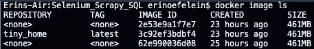
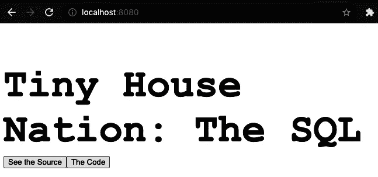

# 将你的 Dash 应用归档

> 原文：<https://towardsdatascience.com/dockerize-your-dash-app-1e155dd1cea3?source=collection_archive---------8----------------------->

## 让 Dash 为简单、现代的部署做好准备

由[爱德华·克鲁格](https://www.linkedin.com/in/edkrueger/)和[艾琳·欧菲琳](https://www.linkedin.com/in/erin-oefelein-3105a878/)


照片由[塞巴斯蒂安·佩纳·兰巴里](https://unsplash.com/@sebaspenalambarri?utm_source=unsplash&utm_medium=referral&utm_content=creditCopyText)在 [Unsplash](https://unsplash.com/s/photos/whale-shark?utm_source=unsplash&utm_medium=referral&utm_content=creditCopyText) 上拍摄

本文将研究如何对我们已经构建的 Dash 应用程序进行 Dockerize。理解应用程序的结构很重要，所以请在这里查看存储库[。如果你想了解更多的细节和解释，可以看看我们在这里详细介绍这个结构的文章:](https://github.com/edkrueger/dash-template)

</structuring-your-dash-app-e33d8e70133e>  

现在你已经根据我们的第一篇文章构建了你的 Dash 应用程序，你已经为你的应用程序做好了准备。

## Docker 是什么？你为什么要用它？

Docker 是一个提供容器的平台。像虚拟机(VM)一样，Docker 容器是一个打包的计算环境，它将各种软件组件与系统的其余部分隔离开来。两者的主要区别在于规模和可移植性。容器比虚拟机更轻量级，容器映像以兆字节而不是吉字节来度量。

Docker 容器解决了软件几十年来的一个痛点。跨不同平台管理软件非常耗时，因为每个平台都需要应用程序依赖、解释器、二进制文件等。Docker 提供了跨平台的一致性，简化了软件维护和部署。

难怪像 Google、Azure、AWS 和其他平台使用 Docker 来简化所有用户及其不同操作系统的应用部署。在这里，您将了解如何利用一项革命性的部署技术！

## 安装 Docker

要对你的应用进行 Docker 化，你首先需要安装 Docker。安装 Docker 对 Mac 用户来说很简单，但对 Windows 用户来说稍微复杂一点。如果不安装 Windows System for Linux (WSL2)并从该服务中运行 Docker，Windows 计算机将无法运行 Docker。我们在这里为那些希望使用这个选项的人链接了一个指南[。](https://www.hanselman.com/blog/how-to-set-up-docker-within-windows-system-for-linux-wsl2-on-windows-10)

一旦安装完毕，你需要在你的机器上初始化 Docker。除非服务在后台运行，否则 Docker 命令将不起作用。

## 编写 Dockerfile 文件

Dockerfile 是一组命令，告诉 Docker 如何构建你的容器。它包括关于 Docker 容器应该扩展什么样的基本映像的信息，需要的任何额外的安装或配置步骤，以及关于运行应用程序的说明。

我们在下面提供了我们的 docker 文件，因此您可以使用正确的规范轻松创建您的 docker 文件:

```
FROM python:3.9-slim
COPY requirements.txt ./requirements.txt
RUN pip install -r requirements.txt
COPY . ./
CMD gunicorn -b 0.0.0.0:80 app.app:server
```

关于这个 Dockerfile，有一点可能看起来令人困惑，那就是它分两个阶段复制文件。我们这样做是因为 Docker 分层构建容器，粗略地说，每一行对应一层。构建第一次运行时，它会缓存每个层。如果一个层不需要更改，我们可以使用 Docker 的缓存层来加快构建速度。

让我们仔细看看它的行为。在第一个`COPY`命令中，我们只将`requirements.txt`文件复制到容器中。

现在为`RUN`线。在一个构建中，如果`requirements.txt`没有被改变，那么下一层，即安装，可以被跳过。如果缓存了，Docker 就不会重新运行这个层，所以不需要重新安装 Python 依赖项。

在第二个`COPY`行中，我们将应用程序文件的剩余部分复制到容器中。自上次构建以来，一些应用程序代码可能已经更改，这意味着用于*之后的*层的缓存已经没有数据了。尽管如此，由于先前的*层已经被构建或从缓存中获取，这一行不会触发其他依赖项重新安装。*

如果我们一次复制所有的代码和依赖项，那么更改代码会使缓存无效，即使需求没有改变，依赖项也会被重新安装。

要深入了解优化容器，请查看 Sciforce 的这篇文章。

<https://medium.com/sciforce/strategies-of-docker-images-optimization-2ca9cc5719b6>  

## 构建 Docker 容器

要启动 Docker 容器构建，请运行:

```
docker build -t tiny_home .
```

t 标志“标记”我们的图像，并允许我们命名容器。标签是有帮助的，因为它允许我们用一个更容易理解的名字而不是机器语言来引用我们的容器。在这里，我们将容器命名为 *tiny_home* 。

这个命令使用我们的 Dockerfile 来构建一个新的容器映像。当 Docker 处理我们的 Docker 文件时，它从包含 Docker Python 映像的基本 Python 容器开始。

## Docker 图像

Docker 基础映像有多种类型。我们使用的是 Python 镜像的精简版本，当您希望安装运行 Python 所需的最小软件包时，这是最佳选择。后缀`-slim`表示容器应该只装必需品。对于许多基本映像，有精简版和完整版。slim 比完整版包含的少，所以图像更小，是处理空间限制的理想选择。对于大多数语言，也有一个维护的完整版本的图像。如果您不确定在应用程序中使用哪种类型，完整图像通常是最佳选择。如果你想阅读更多关于这个话题的内容，看看朱莉·紫苏·加西亚的这篇文章吧！

<https://medium.com/swlh/alpine-slim-stretch-buster-jessie-bullseye-bookworm-what-are-the-differences-in-docker-62171ed4531d>  

图像通常包括许多层。层可能包括系统库、工具、依赖项和其他文件。在我们的例子中，Python slim 映像从从 DockerHub 访问现有的 Python slim 容器开始。映像下载到本地后，就安装了 Debian/Linux OS 发行版和 Python 的最新稳定版本。最后，Docker 编译所有应用程序文件并安装应用程序需求。

在我们的设置中，我们通过在预提交钩子中运行`pipenv-to-requirements`，从我们的`Pipfile`生成`requirements.txt`和`requirements-dev.txt`。由于我们只引用`requirements.txt` Docker 永远看不到发展。仅使用在我们的容器中运行应用程序所必需的依赖项可以加快构建过程，减小容器的大小，并可能提高安全性。如果你还没有这样做，请参考我们的第一篇文章，运行这些钩子。这将使这个过程变得更加容易！

一旦构建了 Docker 容器，就可以通过运行以下命令来查看它:

```
docker image ls
```

然后您会看到 tiny_home 图像填充在这里:



由于我们已经成功构建了 docker 容器，该应用程序将通过端口 80 上的 gunicorn 运行。要访问我们的应用程序运行的地址，我们需要将它在 Docker 主机上运行的端口(端口 80)映射到本地主机上的一个端口。这里，我们将把我们的应用程序映射到端口 8080。要进行端口映射并同时运行我们的应用程序，请运行:

```
docker run -p 8080:80 tiny_home
```

当您访问 [http://localhost:8080/](http://localhost:8080/) (或 0.0.0.0:8080，取决于您的操作系统)时，您应该会看到您的应用程序在 Docker 容器中运行！对于那些不知道的，localhost 是 127.0.0.1 的别名，而 0.0.0.0 引用所有本地 IP 地址。



如果您得到一个错误，指示“绑定 0.0.0.0:8080 失败:端口已被分配”，您可以按照这个[堆栈溢出](https://stackoverflow.com/questions/24387451/how-can-i-kill-whatever-process-is-using-port-8080-so-that-i-can-vagrant-up/24388281)对话和提供的解决方案来终止任何正在使用端口 8080 的进程。

您的应用程序现在已被归档！

敬请关注我们下一篇关于将您的应用部署到 GCP 的云运行服务的文章！

我们希望你喜欢这篇文章！要获得更多关于数据科学、机器学习和开发的内容，请查看 [Edward 的 YouTube 频道](https://www.youtube.com/channel/UCmvdvjDaSjjMRIAxE5s7EZA)，并订阅我下面的邮件列表，成为第一个听到新文章的人！

<https://edkruegerdata.com/subscribe> [## 每当爱德华·克鲁格发表文章时，就收到一封电子邮件。

edkruegerdata.com](https://edkruegerdata.com/subscribe)