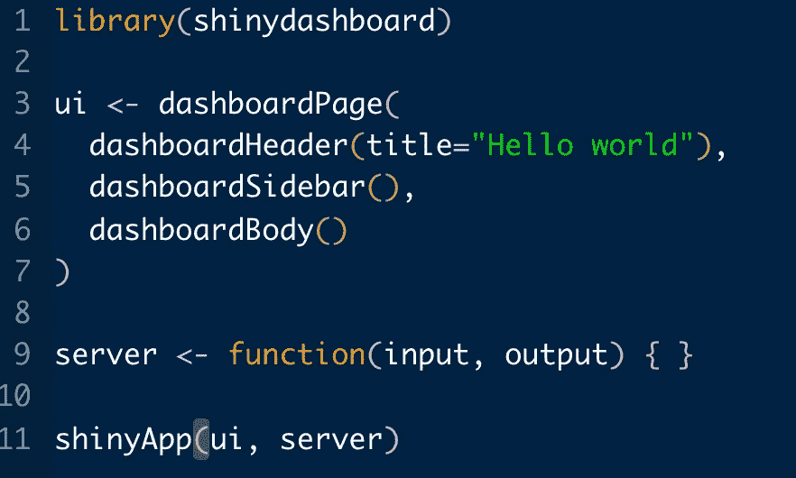
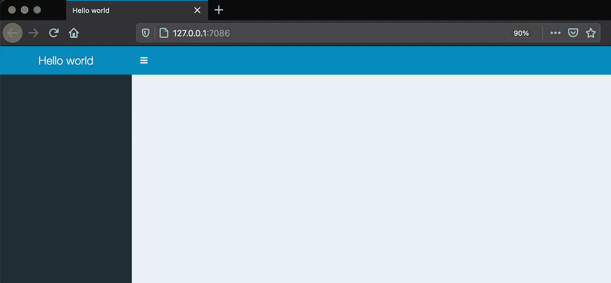
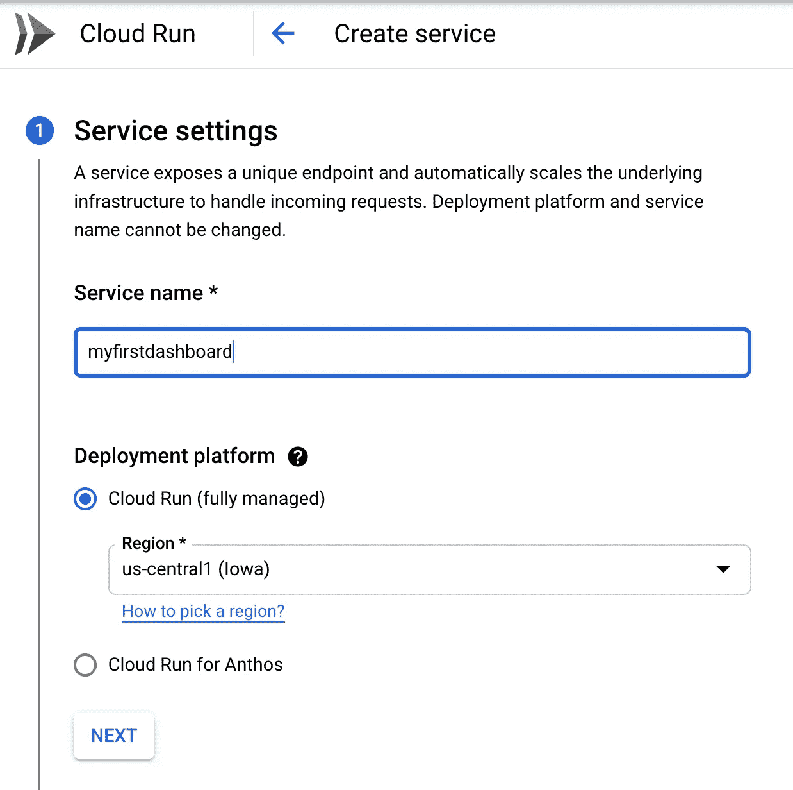
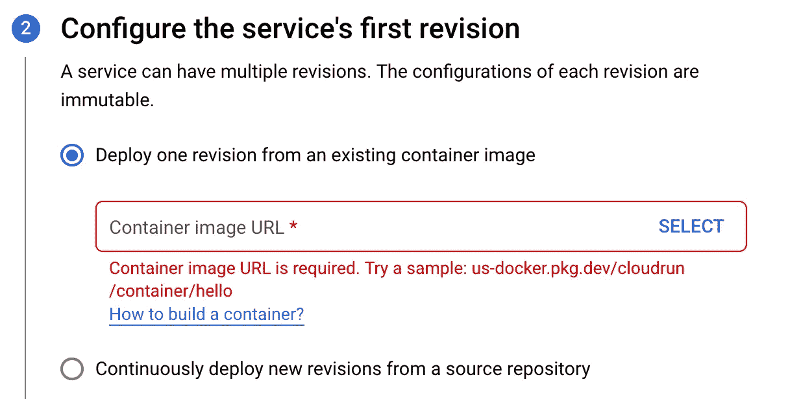
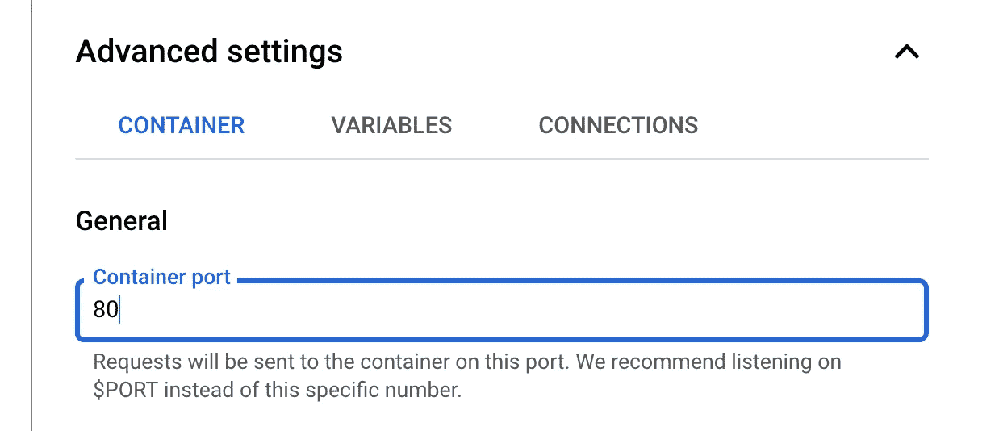
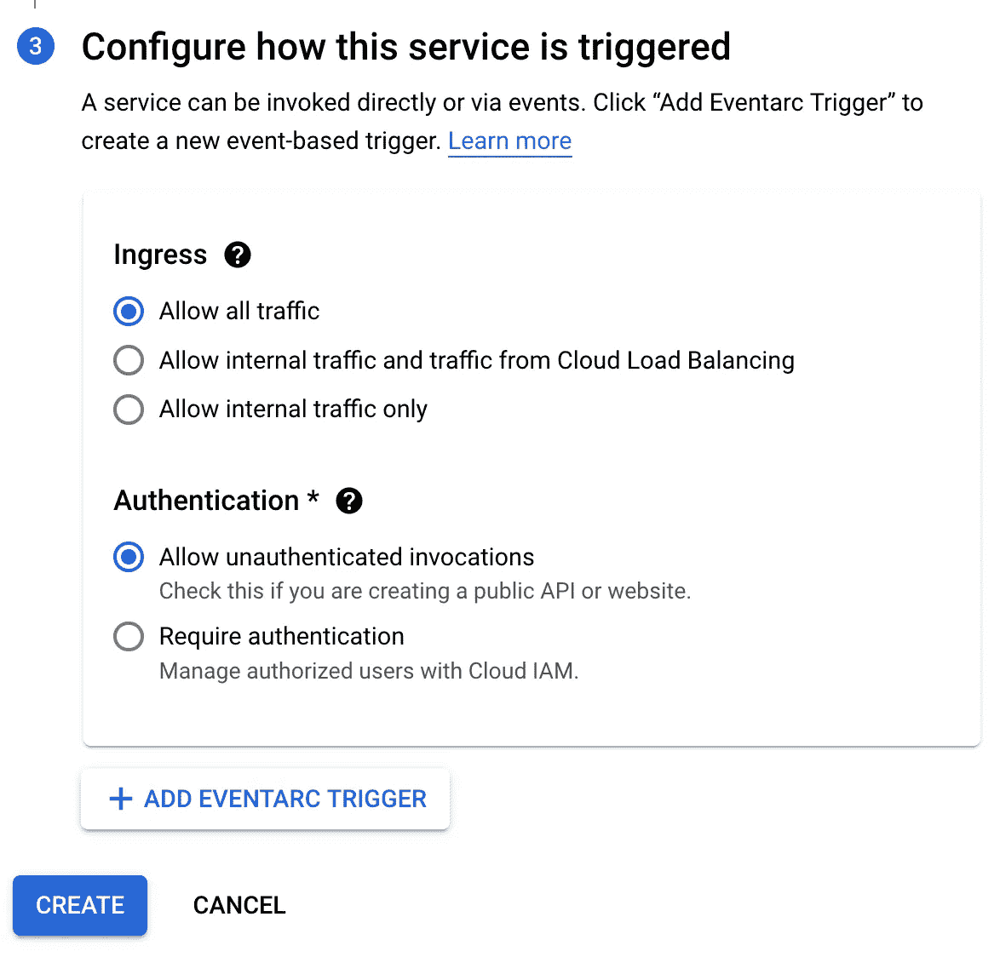

# 在谷歌云上对接和部署闪亮的仪表板

> 原文：<https://towardsdatascience.com/dockerizing-and-deploying-a-shiny-dashboard-on-google-cloud-a990ceb3c33a?source=collection_archive---------5----------------------->



作者图片

## 将 Shiny 引入云计算的分步指南

闪亮的应用程序和仪表板是高度通用的工具，允许最终用户以各种方式与数据进行交互，而应用程序功能由后台运行的 R 代码支持。然而，为了让其他人访问您的工作并从中受益，您需要考虑将您的应用程序部署到哪里。在某些情况下，无论是免费还是付费计划，直接从 RStudio 内部在 shinyapps.io 上部署您的工作可能会很方便。然而，这种选择有一些限制。例如，一些应用程序可能需要 shinyapps.io 不支持的各种系统依赖关系。在这种情况下，您需要使用 Docker 将您的应用程序容器化，并在其他地方寻找主机。

Docker 是一个功能强大且广泛使用的工具，它允许开发人员将代码、设置和依赖项捆绑和隔离在一起，以便应用程序能够在任何计算环境中以相同的方式运行。在本指南中，我们将在 Google Cloud Run 上整理和部署一个闪亮的仪表板。为了遵循本教程中的步骤，*你需要在你的机器上安装 R，RStudio 和 Docker 以及一个谷歌账户。*

# 第 1 部分:如何将闪亮的应用程序或仪表板分类

因为我们将重点关注 dockerization 和 deployment，所以我们将简单地构建一个空白的闪亮仪表板作为临时仪表板。按照这种方法，我们将需要以下文件和文件夹结构。

```
/myshinydashboardfolder
 ├── Dockerfile
 ├── app
 │   └── app.R
 ├── shiny-server.conf
 ├── shiny-server.sh
```

## app。稀有

我们可以使用下面几行 R 代码创建一个无内容的应用程序。

```
library(shinydashboard)ui <- dashboardPage(
 dashboardHeader(title=”Hello world”),
 dashboardSidebar(),
 dashboardBody()
)server <- function(input, output) { }shinyApp(ui, server)
```

如果您运行该应用程序，它应该看起来像下图。



作者图片

## Dockerfile 文件

Dockerfile 指定在构建 Docker 映像时要安装哪些依赖项和 R 包。在这种情况下，我们将使用摇滚/闪亮的基础形象。

```
# get shiny server plus tidyverse packages image
FROM rocker/shiny-verse:latest# system libraries of general use
RUN apt-get update && apt-get install -y \
    sudo \
    pandoc \
    pandoc-citeproc \
    libcurl4-gnutls-dev \
    libcairo2-dev \
    libxt-dev \
    libssl-dev \
    libssh2-1-dev# install R packages required 
# (change it depending on the packages you need)
RUN R -e "install.packages('shinydashboard', repos='[http://cran.rstudio.com/'](http://cran.rstudio.com/'))"# Copy configuration files into the Docker image
COPY shiny-server.conf  /etc/shiny-server/shiny-server.conf
COPY /app /srv/shiny-server/
RUN rm /srv/shiny-server/index.html# Make the ShinyApp available at port 80
EXPOSE 80# Copy further configuration files into the Docker image
COPY shiny-server.sh /usr/bin/shiny-server.shRUN ["chmod", "+x", "/usr/bin/shiny-server.sh"]CMD ["/usr/bin/shiny-server.sh"]
```

与 docker 文件不同，我不需要对 shiny-server.conf 和 shiny-server.sh 文件进行任何修改。

## 闪亮服务器. conf

```
# Define the user we should use when spawning R Shiny processes
run_as shiny;# Define a top-level server which will listen on a port
server {
  # Instruct this server to listen on port 80.
  listen 80;# Define the location available at the base URL
  location / {# Run this location in 'site_dir' mode, which hosts the entire directory
    # tree at '/srv/shiny-server'
    site_dir /srv/shiny-server;

    # Define where we should put the log files for this location
    log_dir /var/log/shiny-server;

    # Should we list the contents of a (non-Shiny-App) directory when the user 
    # visits the corresponding URL?
    directory_index on;
  }
}
```

## 闪亮服务器. sh

```
#!/bin/sh# Make sure the directory for individual app logs exists
mkdir -p /var/log/shiny-server
chown shiny.shiny /var/log/shiny-serverexec shiny-server >> /var/log/shiny-server.log 2>&1
```

现在我们已经把文件整理好了，是时候构建 Docker 映像了！步骤如下:

1.  在 RStudio 中打开一个 shell。这将自动从项目文件夹(“myshinydashboardfolder”)开始。
2.  键入以下命令来构建映像。请注意，`mydashboard`将是使用`-t`选项标记图像的应用程序的名称。

```
docker build -t mydashboard .
```

3.使用以下命令，在分离模式下使用端口 80，验证应用程序是否正常运行，或者什么也不做。

```
docker run -d -p 80:80 mydashboard
```

# 第 2 部分:如何在 Google Cloud 上设置项目和容器注册中心

假设我们已经设置了一个帐户，我们现在需要完成以下步骤来创建应用服务:

1.  在谷歌云平台上创建一个新项目，并选择一个合适的名称，例如“shinyapps”。记下项目 ID。
2.  确保您位于项目目录中，打开云 shell 并通过输入以下命令启用容器注册表。

```
gcloud services enable containerregistry.googleapis.com
```

然后会要求您授权此步骤。瞧啊！现在，您可以从 Docker Hub 中提取图像，并将图像推送到您的容器注册表中。在我们的例子中，我们将使用 gcloud CLI 工具，直接从本地机器推送映像。

# 第 3 部分:如何将 Docker 映像推送到容器注册中心

正如 Google Cloud 文档中所解释的，将 Docker 映像放入容器注册表有不同的方法。按照建议的方法，我们需要执行以下操作:

1.  在您的本地机器上安装[云 SDK](https://cloud.google.com/sdk/docs/install) ，并按照说明进行操作。
2.  首先运行命令，使用您的用户凭据登录，然后按照步骤操作。

```
gcloud auth login 
```

3.通过运行以下命令，将 Docker 配置为使用 gcloud CLI 进行身份验证。

```
gcloud auth configure-docker
```

4.用注册表名称标记您的图像。这里的`gcr.io`是主机名称，您可能希望在名称前加上您的首选位置，例如`eu.gcr.io`将在欧盟托管映像。

```
docker tag mydashboard gcr.io/YOUR-PROJECT-ID/mydashboard
```

5.现在，您可以使用以下命令最终推送映像:

```
docker push gcr.io/YOUR-PROJECT-ID/mydashboard
```

之后，您应该能够在容器注册表中检查您的映像。您甚至可以从这里直接启动部署。

# 第 4 部分:如何使用 Google Cloud Run 部署您的 dockerized 应用程序

快到了。现在，我们只需要导航到 Google Cloud Run，创建一个名为“myfirstdashboard”的新服务，并指定一个所需的区域。



作者图片

在下一页，我们只需单击“选择”来选择我们之前已推送到容器注册表中的图像。



作者图片

打开高级设置并选择容器端口 80 很重要，这是我们在 docker 文件中指定的。



作者图片

在最后一步，我们做出以下选择:



作者图片

过一会儿，你应该可以看到我们闪亮的新仪表板部署！该链接将显示在我们新创建的服务的仪表板中。

# 后续步骤

我们的应用程序显然是非常无用的，但我希望这个指南将帮助你根据你的使用情况来整理和部署更高级的闪亮应用程序和仪表板。尽管我们在这里没有涉及到这一点，但是您可能也希望为自动化构建和持续部署建立管道。

感谢 Ivana Hybenová帮助我开始使用 Dockering 闪亮的应用程序。