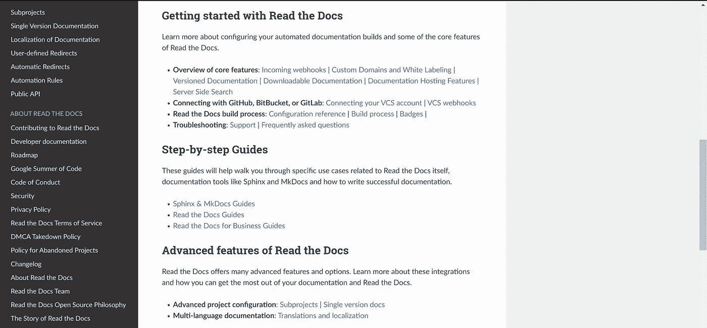
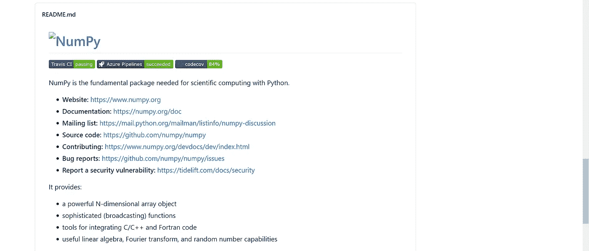
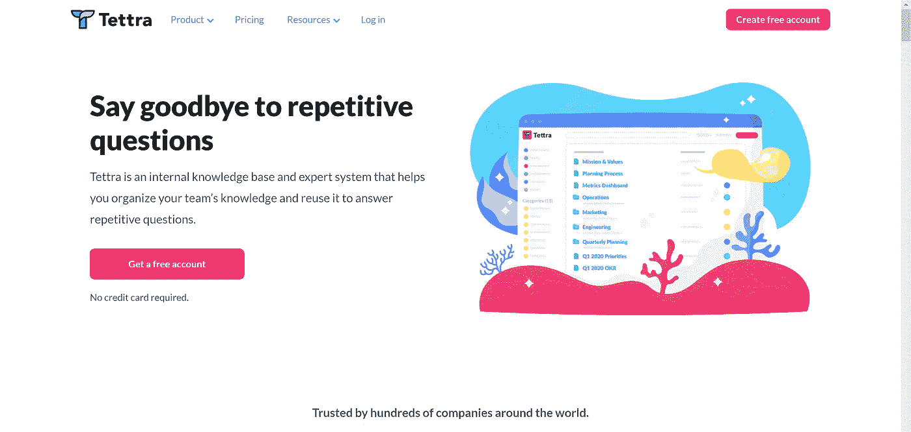
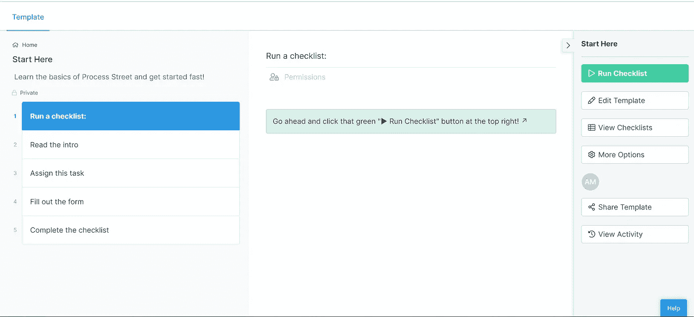

# 文档 101: 5 帮助你创建更好文档的工具

> 原文：<https://towardsdatascience.com/documentation-101-5-tools-to-help-you-create-better-docs-9d9cea03069b?source=collection_archive---------30----------------------->

## 消除繁重的负担，专注于内容

照片由[西格蒙德](https://unsplash.com/@sigmund?utm_source=medium&utm_medium=referral)在 [Unsplash](https://unsplash.com?utm_source=medium&utm_medium=referral) 拍摄

编写文档可能是程序员最害怕的任务之一。我的意思是，我们是程序员，不是作家。众所周知，程序员是伟大的，他们写代码，但不擅长解释它的思维过程。

我相信这就是我们如此讨厌写文档的原因，因为那时，我们需要用文字来解释我们的思维过程，以便他人理解。这从来都不是一个有趣的任务。

不管怎样，所有程序员都知道写得好的文档的重要性，以及它对任何编码项目的成功是多么重要，无论它是打算用于开源还是作为团队中的一个提供项目。

当需要添加/删除新特性时，记录编写代码的步骤和一些设计决策的合理性对使用代码的人和编写代码的人都是有益的。

在本文中，我们将介绍 5 种工具，它们可以帮助您生成文档的大纲，让您不必担心小细节，而不必专注于向他人解释您的代码及其用法。

# №1:阅读文档

谈到文档工具，我们不能不提到[阅读文档](https://docs.readthedocs.io/en/stable/)。我喜欢称之为阅读文档，在一个文档仙境中。这个工具在开源社区中非常有名的原因是 read docs 不仅是一个帮助你编写文档的工具，而且它还可以帮助你保持所有内容与版本同步，最重要的是，它还可以托管你的文档以便于访问。

图片为作者截图。

阅读文档的另一个好处是，它是一个记录良好的文档工具——看到我在那里做了什么吗？。它的入门指南是你开始写文档所需要知道的，而不需要考虑托管服务器或文档设计。

对于新程序员来说，阅读文档是学习和磨练文档写作技能的绝佳选择。

# №2: Github 页面

无论您是开源程序员、在公司工作，还是刚刚开始您的学习之旅，您都有机会在 Github 上看到一些项目，并看到一些开发人员如何使用项目的存储库来提供简单的代码文档。

图片是作者拍摄的 Numpy repo 自述文件截图。

如果你没有创建一个独立的文档站点，并且希望所有的东西都在同一个位置，你可以使用[Github**readme**文件来编写你的代码的文档。你需要熟悉*降价*的格式，并接受简单的单页文档。](https://github.com/numpy/numpy)

如果您想要扩展您的文档并拥有多页文档，那么您可以使用 [Github pages](https://pages.github.com/) 来记录您的代码并将其连接到您项目的 Git 资源库。

图片为作者截图

# №3:泰特拉

到目前为止，我们遇到的两个选项允许您编写和托管您的公共使用文档。但是，如果您想编写仅供内部使用的文档，该怎么办呢？这意味着只有公司或团队内部的人才能访问这些文档。那你的选择是什么？

如果您希望托管仅供内部使用的文档，那么 [Tettra](https://tettra.com/) 可以成为您的文档平台选择。

图片为作者截图。

Tettra 最初是用来建立公司的 wikis，以便新加入的人可以找到他们适应新工作环境所需的所有信息。然而，它可以用来记录任何东西，并在局域网内使用。

# №4:收纳盒纸

另一个可以用来创建内部文档的工具是 [Dropbox Paper](https://www.dropbox.com/paper) 。Dropbox Paper 是创建公司 wiki 和在局域网内共享信息的另一个好选择。

图片为作者截图。

它允许您在文档工具中添加代码块、图像和所有您可能需要的信息。它还允许文档的主要作者批准或拒绝协作者对文档内容的编辑。

# №5:工艺街

如果你是软件开发的新手，或者想把所有项目的所有文档都放在同一个地方，那么 [Process Street](https://app.process.st/templates/Start-Here-h_vwfVF6XkWawxh5SThGpQ/view/tasks/jgYumoKUhxrO8L46xUFEmQ) 就是你要走的路。

图片为作者截图。

您可以使用此工具创建一个清单，列出您需要添加到文档中的所有必要的详细信息(部分),并对您拥有的所有文档进行保存和排序，以便您的团队或公司中的所有人都可以公开并轻松访问这些文档。

# 最后的想法

记录您的代码是可能使您的项目成功或失败的一个方面。尽管大多数程序员和开发人员编写文档并解释使他们的代码完美完成任务的魔力，但没有人能否认拥有好的文档是多么重要。

如果您是编写供他人使用的软件领域的新手，或者是开发团队的一员，文档可能——起初——看起来是必要的。但是，正如我们所有人逐渐意识到的那样，有时记录代码可能非常关键。

想象一下，有一个包含数千或数百万行代码的代码库，要求您添加新功能或删除现有功能。如果代码没有被很好地记录，你会怎么做呢？

您可能需要阅读大部分代码，试图找出在不破坏代码的情况下完成任务所需的所有连接。

听起来很糟糕，不是吗？

这是当你写任何一段代码时，不管它有多复杂，你都应该记住文档的主要原因之一。

在本文中，我们介绍了 5 个工具，您可以使用它们来简化创建和编写文档的过程。请记住，拥有写得好、容易获取的文档可以改变你的项目，也许还能让你得到梦想中的工作。