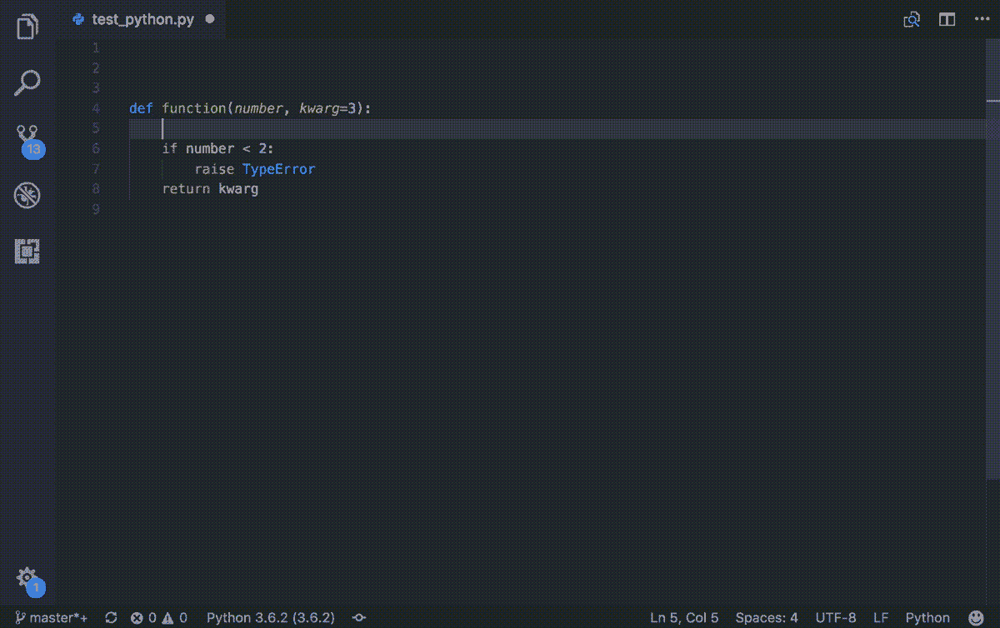

# 记录您的 Python 代码

> 原文：<https://towardsdatascience.com/documenting-your-python-code-9e69671f046a?source=collection_archive---------19----------------------->

## 正确记录 python 代码需要练习的 3 件事


照片由 [Unsplash](https://unsplash.com?utm_source=medium&utm_medium=referral) 上的 [Azharul Islam](https://unsplash.com/@azhar93?utm_source=medium&utm_medium=referral) 拍摄

我相信你们都已经了解了编写代码文档的重要性。作为一名数据科学家，我通常在开发过程中使用 Jupiter 笔记本，那里的笔记对我来说已经足够了。

但是，老实说，当我几周后回到 it 部门，将代码转移到产品中时，我不得不绞尽脑汁很多次，尽管我不愿意承认。此外，当你在一个团队中工作或把它移交给另一个团队时，这可能是一个挑战。😅

正是那些你忘了记在笔记本上的小事，会引起最大的头痛。

在这篇文章中，我将涵盖你需要知道/实践的 3 件事，以尽可能地完善你的文档。

# 1.评论

尽可能在代码中添加相关的注释。注意不要在任何事情上添加评论。最好的注释是那些你不必写的注释，因为代码非常清楚。

一般来说，评论分单行和多行两种。在 Python 中，注释通常是在注释前使用标签符号(#)来完成的。

但是，对于多行注释，您也可以使用多行字符串文字(''' ''')方法。由于字符串没有被赋给任何变量，Python 解释器会忽略它；因此充当评论。

多行注释应该使用 hashtag 样式还是 string literal 样式？选一个风格坚持就好了。就我个人而言，我喜欢标签，因为我是一个容易出错的人😅。

如果您不小心使用字符串文字注释样式，您可能会不小心将注释变成文档字符串，这只会使文档变得混乱。


Python 中注释的各种方式。(来源:作者)

你如何决定什么时候需要添加一些评论？我用这个简单的引用来自[杰夫](https://blog.codinghorror.com/code-tells-you-how-comments-tell-you-why/)的话作为北极星。

> 代码只能告诉你程序是如何工作的；评论可以告诉你为什么有效。——[杰夫·阿特伍德](https://blog.codinghorror.com/code-tells-you-how-comments-tell-you-why/)

当决定添加注释时，问问自己代码是否解释了其背后的原因。如果“为什么”含糊不清或者很难一目了然，那么它可能是一些不错的旧时尚评论的好选择。👍

# 2.显式打字

尽可能明确你的代码。这将大大有助于消除任何歧义。我相信你们所有人对变量的声明都很清楚明确，但是没有几个人对函数的定义很明确。

下图是定义函数时显式键入的一个例子。


显式定义函数的参数类型、默认值和返回类型。(来源:作者)

从上面函数定义的签名中，由于显式类型化，我们可以知道很多关于函数输入和输出的信息。例如:

```
The function has 3 inputs:
1\. A variable called **Dimensions** of type **List**.
2\. A variable called **shape** of type **string**.3\. A variable called **unit_type** of type **string** with default value  called '**metric**'.The function also has a return value of type **float**.
```

看到这有多有用了吗？😄只要看一下那个签名，我们就能知道很多关于这个功能的信息。

# 3.文档字符串

在文档方面，Docstrings 是您最好的朋友。它们提供了一种标准化的方法来定义整体效用、参数、异常等等。

如果您使用的是 [Visual Studio 代码](https://code.visualstudio.com/)，请安装[Python Docstrings Generator](https://marketplace.visualstudio.com/items?itemName=njpwerner.autodocstring)扩展。这将使记录变得更加容易！



VS 代码 Python 文档字符串生成器的运行。(来源: [VS 代码扩展市场](https://marketplace.visualstudio.com/items?itemName=njpwerner.autodocstring))

你所要做的就是在一个函数下键入`"""`，然后按下 Shift 键。然后，它将生成一个模板 docstring，并使用输入信息自动填充 docstring 的各个部分。

**Pro-tip:** 完成函数后，执行文档字符串。这样它会尽可能自动填充，包括返回类型、异常等。

作为一个例子，让我们将 docstrings 应用于我们在上一节中使用的函数定义。


在 VS 代码中使用 docstrings 扩展。(来源:作者)

看看 VS 代码中的 docstrings 扩展如何使用来自函数签名的信息自动生成一些文档。它还突出显示了您的文档需要检查的部分。

一旦你为这个项目完成了 docstrings，你就可以使用 [mkdocs](https://www.mkdocs.org/) 把它变成一个简单优雅的静态网站。改天再说吧。

*PS:忽略返回值卷下的波浪线。它的出现是因为我没有在函数中声明一个可变体积。*T13*😅*

# 最后的想法

记录你的可以走很长的路。它不仅帮助其他人理解代码做什么，而且通过让你重新思考你的代码，迫使你在所有文件中应用一些标准化，让你成为一个更好的沟通者，让你成为一个更好的开发者。

起初，记录可能感觉像一些额外的挑战。但是，如果您实践了本文中提到的要点，并在 IDE 中使用了一些扩展，过一段时间后，它就会变得简单并成为您的第二天性。😃

我希望这篇文章对你有用。如果你有任何问题或者你认为我能帮忙，请联系我。

*随时和我联系* [*推特*](https://twitter.com/_saedhussain) *也一样。*😄

*你可能也会喜欢我的这些文章:*

</how-to-schedule-a-serverless-google-cloud-function-to-run-periodically-249acf3a652e>  </machine-learning-model-as-a-serverless-app-using-google-app-engine-b760de59156>  </machine-learning-model-as-a-serverless-endpoint-using-google-cloud-function-a5ad1080a59e>  <https://python.plainenglish.io/the-only-data-science-machine-learning-book-i-recommend-4fc23b947dfe>  <https://medium.com/codex/3-simple-side-hustles-to-make-extra-income-per-month-as-a-data-scientist-7470030fbf43> 