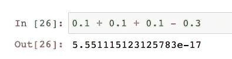

# 避开激光——来自谷歌招聘挑战的奇妙问题

> 原文：<https://towardsdatascience.com/dodge-the-lasers-fantastic-question-from-googles-hiring-challenge-72363d95fec?source=collection_archive---------14----------------------->

## 算法解释

## 谷歌有一个名为 Foobar 的秘密招聘挑战。我喜欢这些问题，因为它们让我再次使用数学。


图片由来自 [Pixabay](https://pixabay.com/?utm_source=link-attribution&utm_medium=referral&utm_campaign=image&utm_content=1825450) 的 [Javier Rodriguez](https://pixabay.com/users/javier-rodriguez-15911/?utm_source=link-attribution&utm_medium=referral&utm_campaign=image&utm_content=1825450) 拍摄

# 序幕

我最近写了一篇文章，讲述了我在谷歌名为 Foobar 的秘密招聘挑战中的经历。这个挑战包括五个关卡，设定在一艘虚构的宇宙飞船上，由一个叫 Lambda 指挥官的恶棍操纵。每个级别包含一到三个相当复杂的问题，通常需要一些大学水平的数学知识才能解决。挑战将在第三级后询问成功的参与者是否愿意与谷歌招聘人员分享他们的详细信息。然后，招聘人员通常会联系开发人员。

你可以在这里找到关于 Foobar 的所有细节:

[](https://betterprogramming.pub/google-has-a-secret-hiring-challenge-called-foobar-14625bfcea7a) [## 谷歌有一个名为 Foobar 的秘密招聘挑战

### 这是它如何让我进入，为什么我喜欢这些问题

better 编程. pub](https://betterprogramming.pub/google-has-a-secret-hiring-challenge-called-foobar-14625bfcea7a) 

# 躲避激光

写完我使用 Foobar 的经历后，我意识到我仍然可以要求新的挑战。于是我照做了。即使我已经解决了所有五个级别，它给了我一个新的问题和 22 天来解决它。

## 问题是

```
*Dodge the Lasers!
=================* Oh no! You've managed to escape Commander Lambda's collapsing space station in an escape pod with the rescued bunny workers - but Commander Lambda isnt about to let you get away that easily. Lambda sent an elite fighter pilot squadron after you -- and they've opened fire!

Fortunately, you know something important about the ships trying to shoot you down. Back when you were still Lambda's assistant, the Commander asked you to help program the aiming mechanisms for the starfighters. They undergo rigorous testing procedures, but you were still able to slip in a subtle bug. The software works as a time step simulation: if it is tracking a target that is accelerating away at 45 degrees, the software will consider the targets acceleration to be equal to the square root of 2, adding the calculated result to the targets end velocity at each timestep. However, thanks to your bug, instead of storing the result with proper precision, it will be truncated to an integer before adding the new velocity to your current position.  This means that instead of having your correct position, the targeting software will erringly report your position as sum(i=1..n, floor(i*sqrt(2))) - not far enough off to fail Commander Lambdas testing, but enough that it might just save your life.

If you can quickly calculate the target of the starfighters' laser beams to know how far off they'll be, you can trick them into shooting an asteroid, releasing dust, and concealing the rest of your escape.  Write a function solution(str_n) which, given the string representation of an integer n, returns the sum of (floor(1*sqrt(2)) + floor(2*sqrt(2)) + ... + floor(n*sqrt(2))) as a string. That is, for every number i in the range 1 to n, it adds up all of the integer portions of i*sqrt(2).

For example, if str_n was "5", the solution would be calculated as
floor(1*sqrt(2)) +
floor(2*sqrt(2)) +
floor(3*sqrt(2)) +
floor(4*sqrt(2)) +
floor(5*sqrt(2))
= 1+2+4+5+7 = 19
so the function would return "19".

str_n will be a positive integer between 1 and 10^100, inclusive. Since n can be very large (up to 101 digits!), using just sqrt(2) and a loop won't work. Sometimes, it's easier to take a step back and concentrate not on what you have in front of you, but on what you don't.
```

好吧，让我们仔细分析一下。

## 目标

我们应该**计算 2 的平方根的整倍数的和**

## 初步意见:

*   输入可以很大(最多 101 位)
*   我们需要一个半解析的解决方案，不能简单地强行实施
*   精确度很重要
*   “有时候，后退一步，不要把注意力放在你面前的东西上，而是放在你没有的东西上，会更容易。”

# 解决方案

看完问题，我只是让它沉几天，思考一下我们解决问题会需要的相关概念。

## 2 的平方根的近似值

我最初认为我可能需要一个 2 的平方根的好的近似值来简化表达式。原来有一个[近似](https://proofwiki.org/wiki/Sequence_of_Best_Rational_Approximations_to_Square_Root_of_2#:~:text=%E2%88%9A2%3D%5B1%2C%E2%9F%A8,1%2C%E2%9F%A82%E2%9F%A9%5D.)。但这并没有让我有所收获。

## 地板的属性

我的第一个想法是检查地板的属性。也许有办法简化这个等式。然而，这被证明是一个死胡同。我找到了一些属性，但是没有一个可以用来简化表达式。

## 发现重复模式

所以我想也许我们可以对这个系列本身做些什么来简化表达。我最初认为，有可能存在一种模式来计算该系列的块，并证明另一个块将是第一个块的倍数。我尝试了一些方法，但都不太有希望。

## 数学解决方案

我想起了那个提示:

> 有时候，后退一步，不要把注意力放在你面前的东西上，而是放在你没有的东西上，会更容易

因此，也许这意味着有一个表达式，是由我们的原始系列隐含的有用的属性。这是我偶然发现 [**比蒂序列**](https://en.wikipedia.org/wiki/Beatty_sequence) **的时候。我们手头的序列是一个 Beatty 序列，这意味着存在一个具有有用性质的互补序列(根据 Rayleigh 定理)。**

关于 Beatty 序列及其互补序列的有用之处在于，它们划分了自然数([瑞利定理](https://en.wikipedia.org/wiki/Beatty_sequence#Rayleigh_theorem))。这意味着我们可以将问题的解决方案表达为一个递归语句:

## 浮点运算和精度

快好了。我们找到了问题的递归解决方案。然而，我们还没有处理这些巨大的数字。这些数字几乎肯定会导致浮点运算方面的问题(当乘以 2 的平方根时)。你可能在做浮点数的基本运算时见过这种现象。



作为十进制浮点近似的结果，与 0 的微小差异

很明显，这些差异开始累积，扭曲了正确的结果，尤其是与一百位数相乘时。Python 实现浮点使用 C double 类型，实现了 [IEEE 754 双精度二进制浮点](https://en.wikipedia.org/wiki/Double-precision_floating-point_format)。这意味着默认情况下，十进制表示将精确到 15 到 17 位有效数字。

幸运的是，Python 有一个名为`decimal`的标准库，它可以确保数学按照我们期望的那样在任意精度水平上运行。我们所要做的就是将精度设置到期望的水平(即 101)，计算我们的`r`、`s`，以及该精度范围内的辅助变量。

## 最终解决

综合以上所有因素，得出:

当我开始解决这个问题时，我不会想到最终的解决方案会如此简洁明了。但通常情况下，当你真正思考一个问题时，它可以被简化很多。我就是喜欢数学。❤️

今天到此为止。您学习了 Python 中的 Beatty 序列、浮点运算和高精度计算。如果你想聊天，可以随时在 LinkedIn 上联系。我可能会等几天再请求下一次挑战。但请放心，还会有更多。