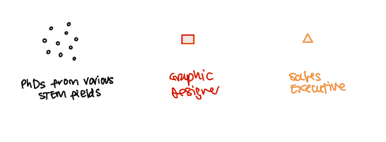
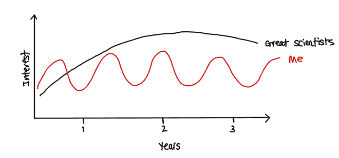
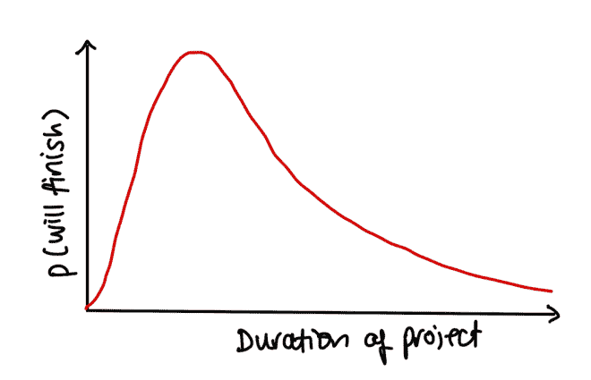
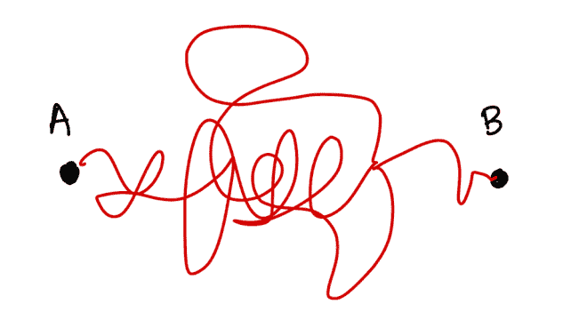
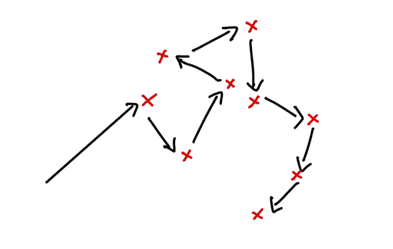

# 从学术界向工业界过渡时避开陷阱

> 原文：<https://towardsdatascience.com/dodging-pitfalls-when-transitioning-from-academia-to-industry-9f9367e7b563?source=collection_archive---------21----------------------->

## 办公时间

## 如何成功地完成这一步，并向面试官证明你会是一名优秀的员工

2016 年，我完成了神经科学博士学位，转到了科技领域。从那以后，我在几家公司做过数据科学家和产品经理。我还花了很多时间筛选和面试数据科学职位的候选人。

我经常收到关于如何成功完成这一转变的问题。这篇文章试图总结我的建议。我从许多也经历过这种转变的人那里得到了帮助。特别是，我认为[教师奖学金](https://faculty.ai/fellowship/)推动了我在工业界的职业生涯，如果你在英国，我强烈建议你去看看。

# 跳下去的好理由

过渡还有很多其他原因，但我认为这两个是**好的**原因。

## 你喜欢和与你截然不同的人一起工作

实验室各不相同，但学术科学通常是一种相对孤独的体验。

即使是合作，你也倾向于和与你有相似观点和技能的人合作。当然，也许你对前扣带皮层知道的稍微多一点，而他们更像是基底神经节的家伙，但是在事物的大格局中，你们基本上是相同的。

如果你喜欢和观点完全不同的人一起工作，工业界可能是个不错的选择。图片作者。

工业界成功的数据科学家与许多与自己截然不同的人互动，最优秀的人喜欢这样。如果你喜欢和技能和观点与你完全不同的人(设计师、销售人员、软件架构师)在一起，那么你可能会喜欢在工业界工作。

相反，如果你发现没有博士学位的人很无聊，很烦人，那你最好还是呆在一个每个人都有博士学位的世界里。

## 你的注意力持续时间不到一年

我有一个非常多产的博士学位(大量的论文，大量的引用)，但是我没有做很多我真的真的很自豪的科学。这是因为我的注意力持续时间比进行深度原创、彻底的神经科学研究的时间要短。

有些人可以多年保持对项目的兴趣。如果你不是他们中的一员，你可能更适合工业或创业环境。图片作者。

我认为人们有不同的智力波长。我擅长执行耗时 1 到 6 个月的项目。我真正钦佩的科学家擅长执行耗时 1 至 6 年的项目。

快速移动和打破东西的能力在工业界受到高度重视，但在学术界会引起与实验室经理的争论。如果你认为自己有“行动偏好”，或许还伴有“短暂的注意力持续时间”，那么你可能更适合在行业中任职。

# 阻碍学者转向数据科学的事情

拥有博士学位的人通常都很聪明，所以我认为你不应该把重点放在向面试官证明这一点上。相反，我认为避免一些共同的问题更重要。

当你经历的时候，试着想清楚你如何向我证明我不应该担心这些事情。一旦你认识到了这种需要，就应该不难发现如何提高这些技能。毕竟你有博士学位。

完全披露:我遭受了许多这样的缺陷，可能现在仍然如此。

## 1.难以理解的交流

在公司工作比学术界更需要协作，如果不能交流就很难协作。图片作者。

许多学科并不鼓励清晰的交流。相反，由于其他人从使用复杂的词汇和复杂的语法中得出积极的推论，学者们经常被鼓励沉溺于冗长和模糊的交流中(见我在那里做的)。

如果没人能理解你在说什么，你几乎不可能被聘用到数据科学岗位。

## 2.没完没了的项目，经常被放弃

如上所述，学术波长通常比工业波长长很多。学术项目可以在投资多年后失败，这没什么。此外，学者们有时会嘲笑这种想法，即尝试规划项目、估计时间或量化不确定性可能是值得的(“这是科学，笨蛋，它天生就是不确定的”)。

一个完全未经证实的项目不完全模型。根据我的经验，在一个短暂的启动窗口之后，事情没有完成的时间越长，就越有可能永远拖下去。图片作者。

当评估来自不同领域的候选人时，很难说一个项目是否被迅速执行。但是你仍然可以从某人是否完成了某件事情中学到一些东西。

即使是科学上的失败也应该产生一些有用的成果(这通常涉及到交流，见上文)。如果有人做了一堆没有成功的实验，但他们拔掉了插头，写了一些东西，然后继续前进，那很好。

如果他们花了 4 年的时间才意识到有些事情是行不通的，我担心在激烈的行业竞争中，他们将很难有效地分配时间，并产生对组织其他部分很重要的产出。

## 3.对简单问题寻找复杂解决方案的倾向

弯弯曲曲可能很有趣，但如果你是那种总是用弯弯曲曲的方法来解决直线问题的人，你最终会激怒你的同事，浪费他们的时间。图片作者。

我博士的第一批主要论文之一依赖于“不确定环境下学习的分层贝叶斯模型”。如今，我倾向于避免“贝叶斯”和“分层”这两个词，我非常喜欢“线性”和“回归”这两个词。

你可以通过用复杂的方法解决一个简单的问题来发表论文。你不能通过这样做来赚钱。拥有花哨的博士学位的人有时会忽略简单的解决方案，可能是出于认知失调(“我真的很聪明，如果我正在研究这个问题，它肯定是一个困难的问题，因此有一个复杂的解决方案”)。

在工业中，你和你的组织要为不必要的复杂性付出数倍的代价。这里有几种方法:

*   做这项工作要花你更多的时间
*   验证工作是否正确更加困难
*   向其他人传达这项工作更加困难
*   人们更难处理您的输出(例如 10GB 神经网络与 100MB 随机森林)
*   你消耗更多的计算资源

诸如此类。

## 4.受好奇心或美学的驱使，而不是结果

强烈的审美欲望加上强烈的好奇心是优秀科学家的典型特征。但是在一个行业环境中，过分纵容他们往往会导致非常长的项目(第 2 点)充满了不必要的复杂解决方案(第 3 点)。

这通常表现为不愿意做让项目上线所需的脏活(“恐怕我不会清理 10，000 行数据，但我会很乐意将这个自动编码器转换成一个变化的自动编码器”)。这可能会激怒并危及项目，但对那些最终做了象牙塔里的人拒绝做的所有繁重工作的同事来说也是不公平的。

文森特在 [koaning.io](https://koaning.io) 有许多其他好内容

## 5.糟糕的编码和协作实践

众所周知，学者们倾向于写糟糕的代码，这也不是他们的错，因为靠自己的力量真的很难写出好的代码。高度可复制的开放科学的激励机制(还)没有安排好(但是许多[优秀的人正在为之努力](https://www.nature.com/articles/s41562-019-0560-3))。

许多学生将学习编程作为他们博士学位的一部分，从博士后和教授那里收集旧的代码片段和不可靠的实践，他们自己从来没有真正花时间学习任何软件工程。

在工业界，有时你如何工作和你做什么一样重要。图片作者。

这可能会在工业环境中产生问题。现代软件实践依赖于将工作很好地分割成小块，这些小块可以分布在整个团队中，合理地快速完成，然后拼凑回一起。

这既需要一些软件工程方面的技能，也需要愿意将你的工作提交给其他人审查(通常比你希望的要早)。将雄心勃勃的事情分解成可管理的步骤是很难培养的。

## 6.不能容忍不断变化的需求

学术界的目标多年来都是一样的:发表论文，获得终身职位。尽管学术科学有很多不确定性，但关于什么是好的结果，很少有模糊不清的地方。自然报纸就是自然报纸，而且非常棒。

在工业环境中(尤其是在初创企业中)，目标经常发生变化。图片作者。

不幸的是，在工业领域，情况并非如此。最终目标(“赚钱”)是稳定的，但它离你的日常生活太远，无法成为一个忠实的指路明星。组织对如何实现这个目标的看法——以及你应该花时间做什么——经常会发生变化。

这可能是乐趣的一部分，但是如果你习惯了非常长时间的项目，这可能会令人难以置信地紧张和沮丧。如果你不能容忍这些不断变化的需求，你会经常对你的上司感到不安和愤怒。作为一个没有太多商业经验的技术人员，很难理解为什么昨天的热门项目变成了今天的堆肥。这会导致愤世嫉俗和对组织其他部分失去信心。

# 如何证明你很适合这个行业

我认为**副业**是证明你胜任工业职位的最佳方式。对我来说，拥有几个优秀项目的优秀 GitHub 档案是你在商业组织中成功的最强有力的标志。

一个好的开源项目可以展示:

1.  沟通和协作能力
2.  完成事情的能力
3.  可靠的编码实践
4.  愿意做自己不喜欢做的事情(例如开发工作)
5.  发现问题并制定解决方案的能力

奖励积分:

1.  写得很好
2.  获得一些你不认识的用户或贡献者
3.  得到任何形式的宣传

根据你的性格，你可能不会发现开始自己的副业是最合适的。为现有的开源软件做贡献也是一个很大的好处，尽管它没有表现出像执行自己的软件那样多的主动性和“完成本能”。

与具有互补技能的人合作——一个需要有数据能力的人的设计师或软件工程师——也是你在行业中取得成功所需要的跨学科合作的极好证明。

非常具体地说，我鼓励你从事以下项目:

1.  是用 Python 或 Javascript 编写的(不仅仅是在笔记本上)
2.  包括部署一些东西，例如 [Heroku](https://devcenter.heroku.com/articles/getting-started-with-python) 或 [AWS](https://docs.aws.amazon.com/elasticbeanstalk/latest/dg/create-deploy-python-flask.html)
3.  依靠格式良好的[提交](https://chris.beams.io/posts/git-commit/)，拉请求和[代码审查](https://mtlynch.io/code-review-love/)
4.  都经过了很好的测试，测试是自动运行的
5.  依靠[数据库](https://devcenter.heroku.com/articles/heroku-postgresql)

# 包扎

不同的人在进行这种转变时会有不同的挣扎。很难规定采取什么步骤来增加你得到你喜欢的角色的机会。希望试着从面试官的角度审视自己能帮助你理解你需要打磨哪些粗糙的边缘来最大化你的成功机会。

如果你觉得这篇文章发人深省，你可能也会喜欢[不要自称程序员](https://www.kalzumeus.com/2011/10/28/dont-call-yourself-a-programmer/)，这是一篇精彩的“职业自述文件”,鼓励工程师更全面地思考他们的角色。

如果您有具体的问题，或者想要关于您的简历、申请材料或 Github 个人资料的反馈，请随时联系我 [@archydeb](https://twitter.com/ArchydeB) 。

如果你觉得这很有趣，你可能也会喜欢这些:

*   [避免 ML 中的新手错误(或“如何不搞砸”)](/rookie-errors-in-machine-learning-bc1c627f2789)
*   [组织应用 ML 研究](http://deberker.com/archy/organizing-applied-machine-learning-research/)
*   [了解初创公司的科学技术](https://medium.com/swlh/seeing-the-science-in-startups-db64bc414f77)

【http://deberker.com】原载于 2021 年 2 月 20 日**。**