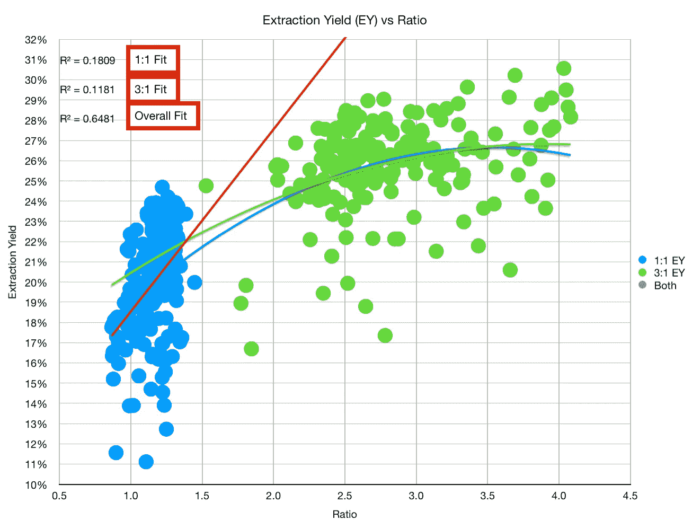
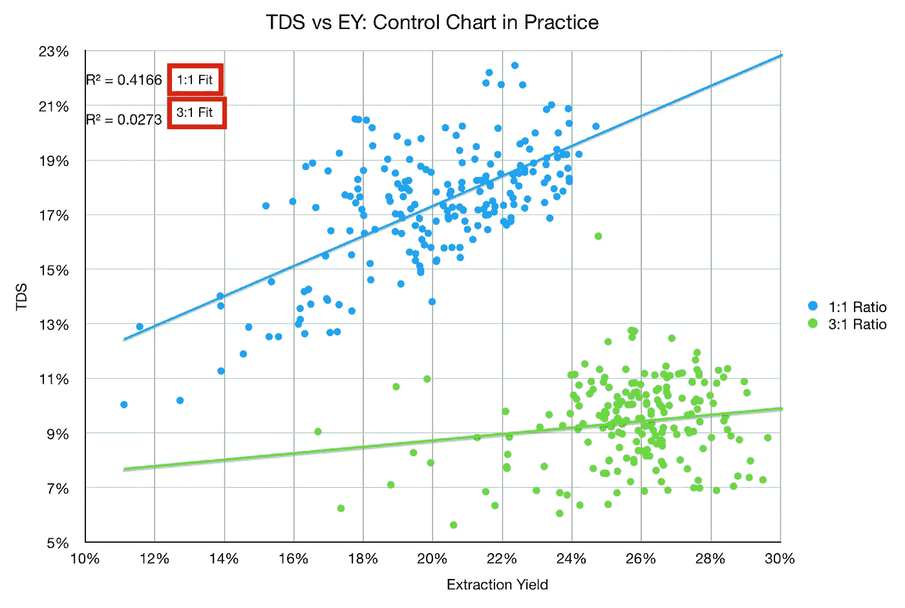
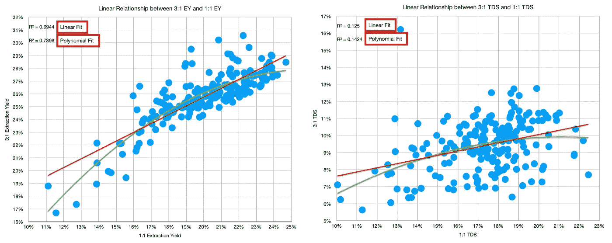
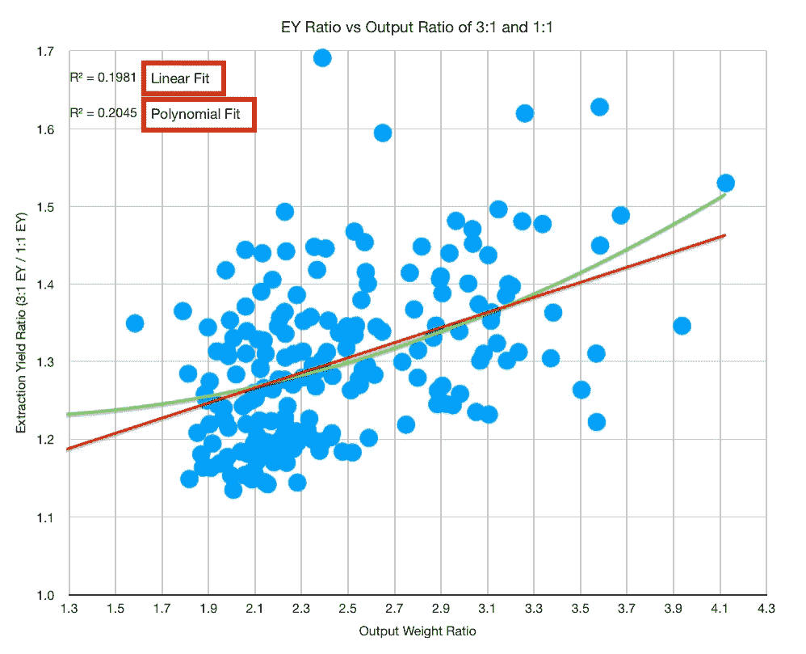
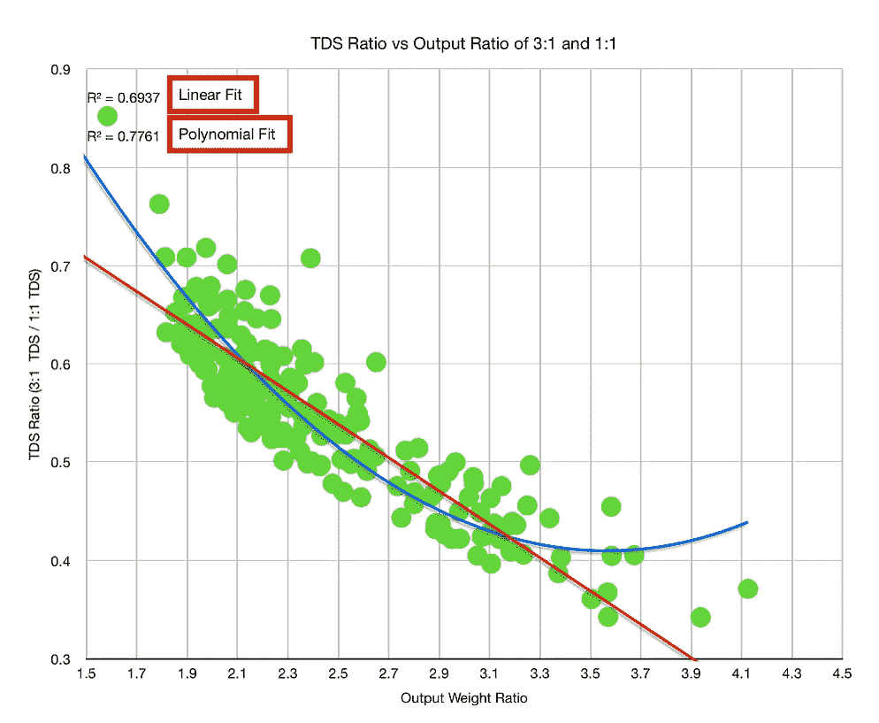

# 好的短镜头预示着好的 Lungo 浓缩咖啡吗？

> 原文：<https://towardsdatascience.com/does-a-good-short-shot-predict-a-good-lungo-espresso-7f97d2faf75b?source=collection_archive---------40----------------------->

## 咖啡数据科学

## 利用周围的一些数据

我喜欢一杯又短又浓的意大利浓缩咖啡。然而，当我看到其他人拉更长的镜头时，我想知道就提取率而言，我的镜头与他们的相比如何(EY)。对我来说，EY [与](/extraction-over-the-life-of-the-coffee-bean-f777f017718a)有很好的相关性，通常，EY 被用来量化浓缩咖啡的质量。我想知道，如果 EY 从镜头的前半部分很好地预测了最终的 EY 会是什么。幸运的是，我有一些数据。

我收集总溶解固体(TDS ),用于计算 EY，有一段时间，我收集我喜欢的镜头和其余镜头的测量值。这后半个镜头是我的杠杆机器没有三通阀的结果，所以即使你拿走杯子，还是会有更多的咖啡流出来。这让我有两个数据点来比较技术，并从我投出的球的后半部分获得一些信息。

通常，我会在 1:1 的输出与输入比和 1:5 之间进行选择。最近，我已经确定了大约 1.3:1 的比例，所以对于 19 克的咖啡渣，我可以得到大约 25 克的液体咖啡。我无法控制后半部分，当与前半部分结合时，等于 2:1 到 4:1 之间的比率。

这个数据的警告是，这些镜头中的大多数是[断奏](https://rmckeon.medium.com/a-summary-of-the-staccato-lifestyle-dd1dc6d4b861)或断奏篡改镜头。所以它们已经比典型的照片具有更高的 ey。我想假设任何学到的东西都可以应用到非分层的镜头，但事实可能并非如此。然而，我要用我所拥有的去工作。

# 数据

让我们先来看看 EY 与比率，我拟合了一条 2 次多项式曲线。显示了 R^2(表示曲线与数据的拟合程度，越高越好)，但它似乎并没有显示出很好的拟合。然而，这些照片也有其他变量，这可能是为什么所有的数据有更强的拟合。

我还看了 TDS 和 EY 的控制图。1:1 拍摄的 TDS 趋势稳定，但 3:1 拍摄的 TDS 趋势不稳定。我怀疑部分原因是这些镜头的后半部分没有压力脉动。我只是在拉了第一个 1:1 后让水跑了。

现在我们应该直接对比一下。它们似乎对 ey 遵循良好的线性和多项式拟合，但对 TDS 则不然。

这些镜头中有许多并不完全是 1:1 或 3:1，但是我们可以检查 EY 与输出重量的比率。这有助于将差异标准化。在这种情况下，EY 没有很好的拟合，但 TDS 比率有。

这个数据强烈表明，如果你拍摄的前半部分有很高的提取率，你的总提取率也应该更高。然后，通过线性或多项式外推法，就 EY 而言，可以将较短的浓缩咖啡与较长的浓缩咖啡进行比较。

如果你愿意，可以在 Twitter 和 YouTube 上关注我，我会在那里发布不同机器上的浓缩咖啡视频和浓缩咖啡相关的东西。你也可以在 [LinkedIn](https://www.linkedin.com/in/robert-mckeon-aloe-01581595?source=post_page---------------------------) 上找到我。也可以在[中](https://towardsdatascience.com/@rmckeon/follow)和 [Patreon](https://www.patreon.com/EspressoFun) 上关注我。

# [我的进一步阅读](https://rmckeon.medium.com/story-collection-splash-page-e15025710347):

[浓缩咖啡系列文章](https://rmckeon.medium.com/a-collection-of-espresso-articles-de8a3abf9917?postPublishedType=repub)

[工作和学校故事集](https://rmckeon.medium.com/a-collection-of-work-and-school-stories-6b7ca5a58318?source=your_stories_page-------------------------------------)

[个人故事和关注点](https://rmckeon.medium.com/personal-stories-and-concerns-51bd8b3e63e6?source=your_stories_page-------------------------------------)

[乐高故事启动页面](https://rmckeon.medium.com/lego-story-splash-page-b91ba4f56bc7?source=your_stories_page-------------------------------------)

[摄影飞溅页](https://rmckeon.medium.com/photography-splash-page-fe93297abc06?source=your_stories_page-------------------------------------)

[使用图像处理测量咖啡研磨颗粒分布](https://link.medium.com/9Az9gAfWXdb)

[改善浓缩咖啡](https://rmckeon.medium.com/improving-espresso-splash-page-576c70e64d0d?source=your_stories_page-------------------------------------)

[断奏生活方式概述](https://rmckeon.medium.com/a-summary-of-the-staccato-lifestyle-dd1dc6d4b861?source=your_stories_page-------------------------------------)

[测量咖啡磨粒分布](https://rmckeon.medium.com/measuring-coffee-grind-distribution-d37a39ffc215?source=your_stories_page-------------------------------------)

[咖啡萃取](https://rmckeon.medium.com/coffee-extraction-splash-page-3e568df003ac?source=your_stories_page-------------------------------------)

[咖啡烘焙](https://rmckeon.medium.com/coffee-roasting-splash-page-780b0c3242ea?source=your_stories_page-------------------------------------)

[咖啡豆](https://rmckeon.medium.com/coffee-beans-splash-page-e52e1993274f?source=your_stories_page-------------------------------------)

[浓缩咖啡用纸质过滤器](https://rmckeon.medium.com/paper-filters-for-espresso-splash-page-f55fc553e98?source=your_stories_page-------------------------------------)

[浓缩咖啡篮及相关主题](https://rmckeon.medium.com/espresso-baskets-and-related-topics-splash-page-ff10f690a738?source=your_stories_page-------------------------------------)

[意式咖啡观点](https://rmckeon.medium.com/espresso-opinions-splash-page-5a89856d74da?source=your_stories_page-------------------------------------)

[透明 Portafilter 实验](https://rmckeon.medium.com/transparent-portafilter-experiments-splash-page-8fd3ae3a286d?source=your_stories_page-------------------------------------)

[杠杆机维护](https://rmckeon.medium.com/lever-machine-maintenance-splash-page-72c1e3102ff?source=your_stories_page-------------------------------------)

[咖啡评论和想法](https://rmckeon.medium.com/coffee-reviews-and-thoughts-splash-page-ca6840eb04f7?source=your_stories_page-------------------------------------)

[咖啡实验](https://rmckeon.medium.com/coffee-experiments-splash-page-671a77ba4d42?source=your_stories_page-------------------------------------)