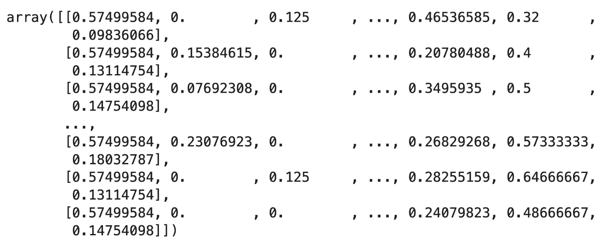
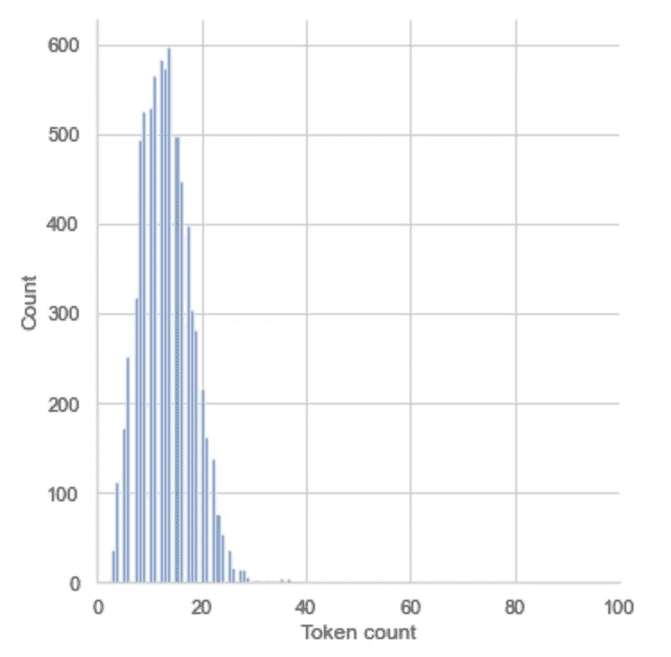
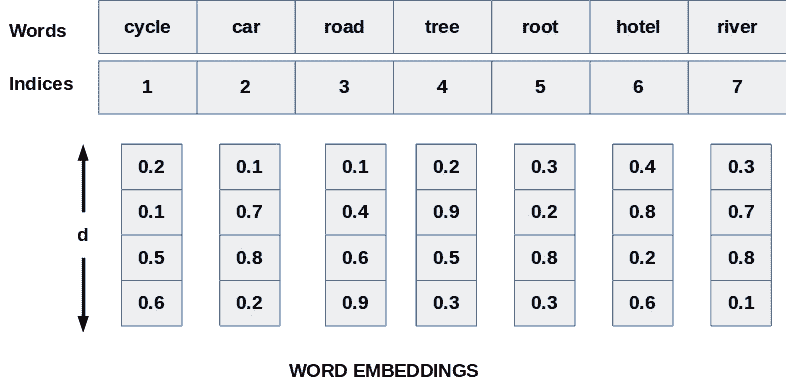
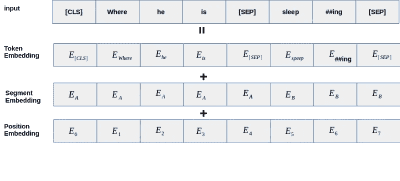
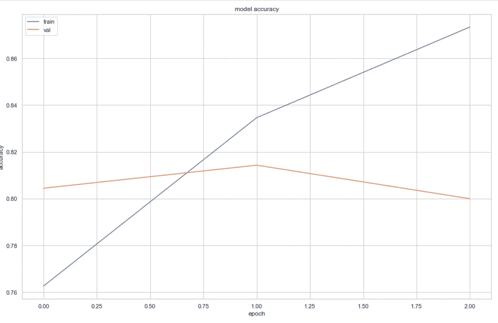
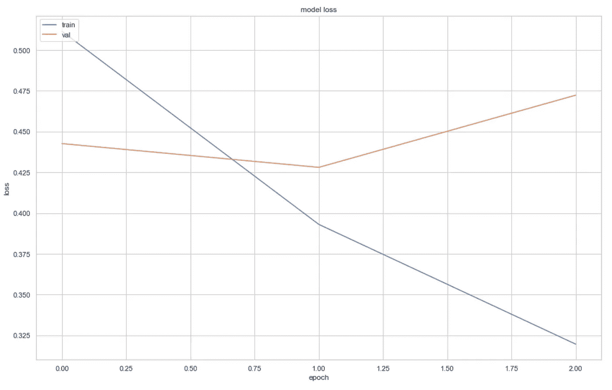
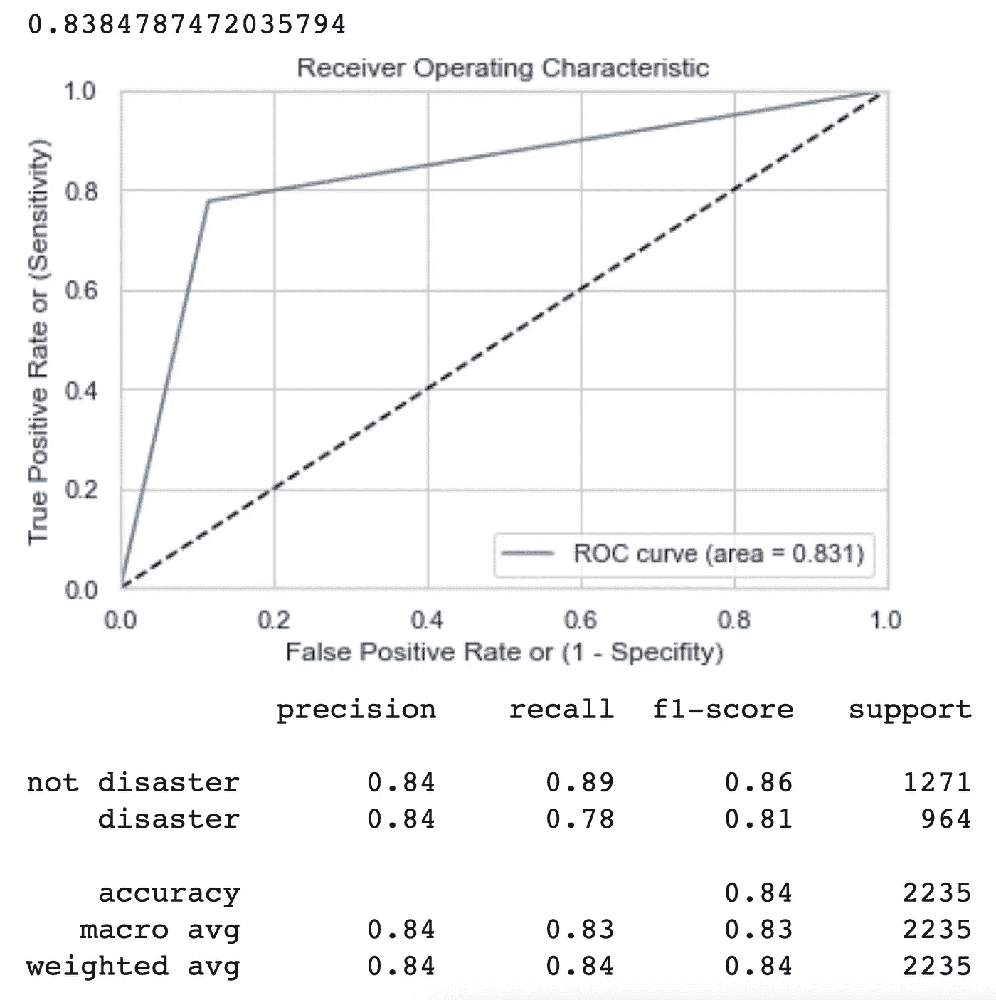
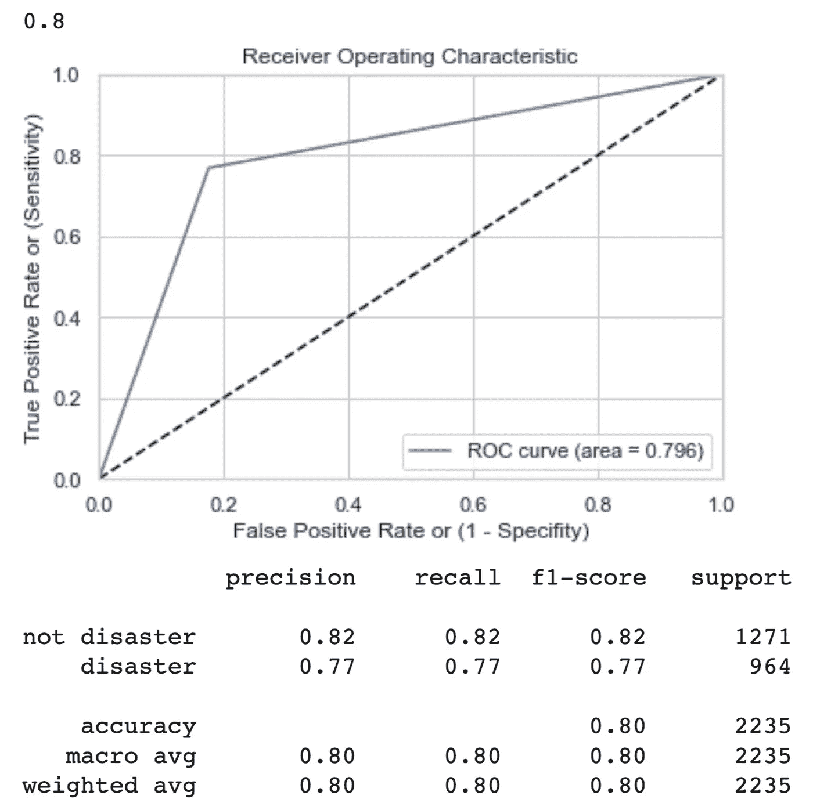

# BERT 需要干净的数据吗？第二部分:分类。

> 原文：<https://towardsdatascience.com/does-bert-need-clean-data-part-2-classification-d29adf9f745a?source=collection_archive---------6----------------------->


火山是非常疯狂的灾难。我想知道是否有人曾经将一首说唱歌曲描述为“火山”……照片由 [Unsplash](https://unsplash.com?utm_source=medium&utm_medium=referral) 上的 [Yosh Ginsu](https://unsplash.com/@yoshginsu?utm_source=medium&utm_medium=referral) 拍摄。

## **现在是有趣的事情。轻清洗，重清洗，还是根本没有语言模型？为 BERT 寻找清理数据的最佳方法。**

到本文结束时，你应该能够在 [NLP 灾难推文 Kaggle 竞赛](https://www.kaggle.com/c/nlp-getting-started/overview)中获得前 50 分(84%的准确率)！


我在排行榜上是 63。然而，前 20 名提交的答案被作弊的人占据了，他们只是提交了比赛的答案。图片作者。

请记住，我们正在尝试对一条推文是否指明了一场灾难(如飓风或森林火灾)进行分类。这项任务的难度在于某些单词的上下文含义不同(例如，将鞋子描述为“火”)。

正如在[第 1 部分](https://medium.com/@Alexander.Bricken/part-1-data-cleaning-does-bert-need-clean-data-6a50c9c6e9fd)中提到的，一旦完成标准文本清理，我们需要决定我们想要使用什么机器学习模型，以及输入数据应该是什么样子。本文的目标是比较使用神经网络的元特征学习、BERT 之前强度较低(较轻)的文本预处理和 BERT 之前强度较高(较重)的文本预处理。

除此之外，我还将概述 BERT，它是如何工作的，以及为什么它是目前领先的语言模型之一。

在开始之前，我们只需要阅读第 1 部分的泡菜！

```
# download the pickles saved from part 1
train_df = pd.read_pickle("../data/pickles/clean_train_data.pkl")
test_df = pd.read_pickle("../data/pickles/clean_test_data.pkl")
```

现在，让我们从预测灾难的第一种方法开始:使用元特征和深度神经网络。

# 元特征学习

在这里，我们只使用元特征数据来预测灾难推文。这是一种正在测试的替代方法。我的假设是，它不会像 BERT 模型中的一个那样好，但是，观察它的表现仍然很有趣。此外，也许为了在未来改进 BERT，可以包括这种类型的数据，所以我们应该测试我们的元功能如何帮助区分灾难和非灾难推文。

## **标准化**

为了将我们的元特征整合到我们的建模中，我们需要规范化我们的列。规范化用于将数据集中的整数列更改为使用通用比例，而不会扭曲值范围的差异或丢失信息。我们通过使用`MinMaxScaler()`进行归一化，这允许我们将数据保持在[0，1]的范围内。



MinMaxScaler 之后我们的数据是什么样的。图片作者。

## 列车测试分离

在运行我们的深度神经网络之前，我们需要一种分离数据的方法，以便我们可以在之前没有在训练数据中看到的测试数据集上评估模型。为此，我们使用 sci-kit learn 的`train_test_split()`函数。

```
# train test split
X_train, X_test, y_train, y_test = train_test_split(final_train_df, train_labels, test_size=0.3, random_state=42)
```

现在，我们有了一个训练数据集、一个带标签的测试数据集和一个未带标签的提交测试数据集，我们可以生成我们的模型，根据训练数据拟合它，并根据我们的测试数据测试结果，然后在将提交上传到 Kaggle 之前，对提交数据运行最终模型。

## 使用深度神经网络生成分类概率

我通过使用序列函数生成深度神经网络，允许我逐层构建 DNN。这里的“深”意味着 NN 连接得很深，如同密集层一样，这些层接收来自前一层的所有*神经元的输入。我添加了具有不同密度的 5 个层，使用了 3 个 ReLu 激活函数(修正的线性激活-该激活函数在神经网络中工作良好)和最终的 sigmoid 函数，该函数允许我输出输入行是灾难或非灾难的相关概率。*

```
# create NN
model = Sequential()
model.add(Dense(90, input_dim=9, activation='relu'))
model.add(Dense(120, activation='relu'))
model.add(Dense(100))
model.add(Dense(20, activation='relu'))

model.add(Dense(1, activation='sigmoid'))

# adam optimizer
optimizer = tf.keras.optimizers.Adam(lr=1e-4)

# compile and summarise
model.compile(loss='binary_crossentropy', optimizer=optimizer, metrics=['accuracy'])
model.summary()

# first fit is history1
history = model.fit(X_train, y_train, epochs=100, batch_size=35, validation_data=(X_test, y_test), verbose=1)
```

在继续进行模型评估之前，可以显示其他模型的构造，模型评估在模型之间具有相同的方法。然后，可以在模型评估部分中进行跨模型的比较。

# 轻型和重型数据清理

为了优化 BERT 的性能，一些文本清理可能是必要的，但是我们的 Tweets 的功能的删除量是有争议的。因为 BERT 是使用单词的上下文的模型，该上下文提供了单词在句子中相对于所有其他单词的位置，所以通常会建议保存这样的信息。然而，在某些情况下，如果数据被修剪到更高的程度，BERT 可能会优于。在此部分中，完成了轻重文本清理。然后，我们可以在模型评估部分测试这两种方法的性能。

## 正则表达式文本清理

下面是一些文字清理。代码分为重码和轻码两部分。在重清洗中，进行所有替换。在灯光清洗中，只制作灯光(根据需要编辑该功能)。

```
# function taken and modified 
# from https://towardsdatascience.com/cleaning-text-data-with-python-b69b47b97b76

stopwords = set(STOPWORDS)
stopwords.update(["nan"])

def text_clean(x):

    ### Light
    x = x.lower() # lowercase everything
    x = x.encode('ascii', 'ignore').decode()  # remove unicode characters
    x = re.sub(r'https*\S+', ' ', x) # remove links
    x = re.sub(r'http*\S+', ' ', x)
    # cleaning up text
    x = re.sub(r'\'\w+', '', x) 
    x = re.sub(r'\w*\d+\w*', '', x)
    x = re.sub(r'\s{2,}', ' ', x)
    x = re.sub(r'\s[^\w\s]\s', '', x)

    ### Heavy
    x = ' '.join([word for word in x.split(' ') if word not in stopwords])
    x = re.sub(r'@\S', '', x)
    x = re.sub(r'#\S+', ' ', x)
    x = re.sub('[%s]' % re.escape(string.punctuation), ' ', x)
    # remove single letters and numbers surrounded by space
    x = re.sub(r'\s[a-z]\s|\s[0-9]\s', ' ', x)

    return x
```

我们以下列方式应用该函数:

```
train_df['cleaned_text'] = train_df.text.apply(text_clean)
test_df['cleaned_text'] = test_df.text.apply(text_clean)
```

## Lemmatisation(用于重度清洁)

仅仅为了大量的清理，我们增加了一个步骤:lemmatisation。在这里，一个词库被用来去除单词的屈折词尾，使它们回到基本形式，这就是所谓的引理。例如，我们将只得到“运行”，而不是“运行”或“运行”。

这有时可以帮助模型更好地解释句子，所以我们在这里测试它。

```
train_list = []
for word in train_text:
    tokens = word_tokenize(word)
    lemmatizer = WordNetLemmatizer()
    lemmatized = [lemmatizer.lemmatize(word) for word in tokens]
    train_list.append(' '.join(lemmatized))

test_list = []
for word in test_text:
    tokens = word_tokenize(word)
    lemmatizer = WordNetLemmatizer()
    lemmatized = [lemmatizer.lemmatize(word) for word in tokens]
    test_list.append(' '.join(lemmatized))
```

## 标记化和嵌入

对于轻清洗和重清洗，我们最终需要标记我们的文本数据，并创建适当的嵌入，作为将文本数据包括到机器学习模型中的一种方式。

记号化将一段文本分成记号。这些记号是单词。嵌入标记化的句子可以将文本数据转化为机器学习模型可以阅读的数字。我们用拥抱脸变形金刚库来做这个。

```
# we use a pre-trained bert model to tokenize the text
PRE_TRAINED_MODEL_NAME = 'bert-base-uncased'
tokenizer = BertTokenizer.from_pretrained(PRE_TRAINED_MODEL_NAME)
```

因为 BERT 使用固定长度的序列，所以我们需要选择序列的最大长度来最好地表示模型。通过存储每条推文的长度，我们可以做到这一点，并评估覆盖范围。

```
token_lens = []
for txt in list(train_list):
    tokens = tokenizer.encode(txt, max_length=512, truncation=True)
    token_lens.append(len(tokens))sns.displot(token_lens)
plt.xlim([0, 100])
plt.xlabel('Token count')
plt.show()
```



输出条形图。从这个图中，我们看到密度在 40 以上下降。因此，我们将 max_length 设置为 40，并重新运行标记器。图片作者。

但是 BertTokenizer 到底在做什么呢？

对于正常的单词嵌入，我们给每个单词分配一些数值。嵌入是分配给每个索引的 d 维向量。更多信息见[此处](https://www.analyticsvidhya.com/blog/2021/09/an-explanatory-guide-to-bert-tokenizer/)。



基本单词嵌入:每个单词都有一个唯一的索引和一个嵌入向量。图片由 P. Prakash 拍摄(2021)。

作为 BERT 构建基础的 transformer 的新颖之处在于使用正弦位置编码作为单词嵌入的位置索引。通过将正弦和余弦波用于标记化句子中的偶数和奇数索引，相同的单词可以在不同长度的句子中具有相似的嵌入。这为我们的嵌入提供了没有词序的概念，并消除了重复的嵌入值。


使用正弦和余弦的位置编码公式。

对于 BERT 嵌入，这个想法与仅仅一个转换器略有不同。相反，该模型在训练阶段学习位置嵌入，并利用单词片段标记器，其中一些单词被分成子单词。因此，不只是将词汇表外(OOV)的单词标记为包含所有标记，而是将未知的单词分解为模型为其生成嵌入的子单词和字符标记。这保留了原始单词的一些上下文含义。



您可以看到[CLS]标记，它总是出现在文本的开头，特定于分类任务。还有，[SEP]是一种分句的方式。最后，' ##ing '是一个子词嵌入。图片由 P. Prakash 拍摄(2021)。

```
def bert_tokenizer(text):
    encoding = tokenizer.encode_plus(
    text,
    max_length=40,
    truncation=True,
    add_special_tokens=True, # Add '[CLS]' and '[SEP]'
    return_token_type_ids=False,
    pad_to_max_length=True,
    padding='max_length',
    return_attention_mask=True,
    return_tensors='pt',  # Return PyTorch tensors
    )

    return encoding['input_ids'][0], encoding['attention_mask'][0]
```

我们在训练和测试数据集上使用该函数:

```
# train data tokenization
train_tokenized_list = []
train_attn_mask_list = []
for text in list(train_list):
    tokenized_text, attn_mask = bert_tokenizer(text)
    train_tokenized_list.append(tokenized_text.numpy())
    train_attn_mask_list.append(attn_mask.numpy())

# test data tokenization
test_tokenized_list = []
test_attn_mask_list = []
for text in list(test_list):
    tokenized_text, attn_mask = bert_tokenizer(text)
    test_tokenized_list.append(tokenized_text.numpy())
    test_attn_mask_list.append(attn_mask.numpy())
```

然后可以将它们保存为数据帧，以显示我们现在所处的位置。

最后，我们对清理后的数据进行另一次训练测试分割(无论是重度清理的数据还是轻度清理的数据)。

```
# train test split
X_train, X_test, y_train, y_test, train_mask, val_mask = train_test_split(train_tokenised_text_df, train_labels, train_attn_mask_list, test_size=0.3, random_state=42)
```

## 伯特建模

那么，到底什么是 BERT 模型，为什么我们如此大惊小怪地以不同的方式正确清理我们的数据？

虽然这篇文章中有许多技术细节我可以深入探讨，但我还是要让你参考一下谷歌的文章。BERT 做了首字母缩略词描述的事情:它以双向方式训练变压器。通过使用屏蔽语言模型，在简单的意义上是“留一个”任务或完形填空删除，从句子中删除一个单词，该模型尽最大努力预测该单词会是什么。通过这样做，并在左右上下文的条件下，BERT 模型学习文本的特征，从而能够区分我们推文的共同特征，而不仅仅是 TF-IDF。它还使用了单词的上下文和位置。


“BERT 聪明的语言建模任务屏蔽了输入中 15%的单词，并要求模型预测缺失的单词。”图片和说明来自 https://jalammar.github.io/illustrated-bert/。

这里我们使用一个预训练的 BERT 模型。这样做是一个好主意，因为这个模型的嵌入已经在大量的文本数据上进行了训练，超出了我们可以用这个小数据集完成的任务。因此，它更加高效和准确。

```
num_classes = len(train_labels.unique()) # this is just 2

bert_model = TFBertForSequenceClassification.from_pretrained('bert-base-uncased', num_labels=num_classes)

checkpoint_path = "../models/light_tf_bert.ckpt"
checkpoint_dir = os.path.dirname(checkpoint_path)

model_callback = tf.keras.callbacks.ModelCheckpoint(filepath=checkpoint_path,
                                                 save_weights_only=True,
                                                 verbose=1)

print('\nBert Model', bert_model.summary())

loss = tf.keras.losses.SparseCategoricalCrossentropy(from_logits=True)
metric = tf.keras.metrics.SparseCategoricalAccuracy('accuracy')
optimizer = tf.keras.optimizers.Adam(learning_rate=2e-5,epsilon=1e-08)

bert_model.compile(loss=loss,optimizer=optimizer,metrics=[metric])
```

然后我们拟合模型。在 10 个时期(这花费了很长时间)上测试该模型之后，显示出在第二个时期之后过度拟合。因此，作为早期停止的度量，历元的数量被限制为 2。有多种方法可以做到这一点，但是对于这个预先训练好的模型来说，约束历元的数量是最方便的方法。

```
history=bert_model.fit(X_train,
                       y_train,
                       batch_size=32,
                       epochs=2, # in heavy cleaning we use 3 epochs
                       validation_data=(X_test, y_test),
                       callbacks=[model_callback])
```

# 模型评估

为了对模型进行相互评估，有许多技术可以使用。与任何机器学习模型一样，最佳做法是检查准确性、损失、val 准确性和 val 损失。我们可以通过下面的代码做到这一点:

```
### Accuracy
plt.figure(figsize=(16, 10))
plt.plot(history.history['accuracy'])
plt.plot(history.history['val_accuracy'])
plt.title('model accuracy')
plt.ylabel('accuracy')
plt.xlabel('epoch')
plt.legend(['train', 'val'], loc='upper left')
plt.show()

### Loss
plt.figure(figsize=(16, 10))
plt.plot(history.history['loss'])
plt.plot(history.history['val_loss'])
plt.title('model loss')
plt.ylabel('loss')
plt.xlabel('epoch')
plt.legend(['train', 'val'], loc='upper left')
plt.show()
```



精确度图表的输出示例。图片作者。

这些图表有助于理解模型是过拟合、欠拟合还是良好拟合。假设我们使用预训练的 BERT 模型，我们需要很少的历元来训练该模型(参见[朱，J](https://web.stanford.edu/class/archive/cs/cs224n/cs224n.1194/reports/default/15708284.pdf) )。



损失图输出示例。图片作者。

在用重清洁和轻清洁测试了我的模型之后，很明显，较少的时期对于防止过度拟合更好。随着精度的不断提高，这一点是显而易见的，但是随着更多时期的运行，val 精度下降，val 损失增加。

最后，如果我们对我们的模型满意，我们可以使用我们的测试数据集生成我们的预测，并将准确性与我们的测试数据集标签进行比较。通过这样做，我们找到最强的模型，然后使用该模型对 Kaggle 测试数据进行预测，并提交给 Kaggle。

## 预言

我们可以通过运行以下代码来预测任何模型:

```
# predictions
test_pred = model.predict(X_test)
print(test_pred)
```

如果预测的输出是概率，我们可以使用这段代码将输出概率转换为预测的二进制值 0 和 1。我们把概率分成 0.5。任何高于 0.5 的预测都被标记为灾难，低于 0.5 的预测为非灾难。

```
# this checks if the probability of 
# disaster is above 0.5\. If so, we label 1.

test_pred_bool = test_pred.copy().astype(int)
for index in range(len(test_pred)): 
    if test_pred[index]>0.5:
        test_pred_bool[index]=1
    else:
        test_pred_bool[index]=0

final_predictions = test_pred_bool.flatten()
```

然后对于我们的任何模型，我们可以使用一个函数来评估它们的准确性，通过输入我们对测试标签的预测。

```
# model test function
def eval_model(predictions):
    print(accuracy_score(y_test, predictions))
    # Compute fpr, tpr, thresholds and roc auc
    fpr, tpr, thresholds = roc_curve(np.array(y_test), np.array(predictions))
    roc_auc = auc(fpr, tpr)

    # Plot ROC curve
    plt.plot(fpr, tpr, label='ROC curve (area = %0.3f)' % roc_auc)
    plt.plot([0, 1], [0, 1], 'k--')  # random predictions curve
    plt.xlim([0.0, 1.0])
    plt.ylim([0.0, 1.0])
    plt.xlabel('False Positive Rate or (1 - Specifity)')
    plt.ylabel('True Positive Rate or (Sensitivity)')
    plt.title('Receiver Operating Characteristic')
    plt.legend(loc="lower right")
    plt.show()
    print(classification_report(y_test, np.array(predictions), target_names=["not disaster", "disaster"]))

eval_model(final_predictions)
```


DNN 元特征结果。图片作者。



轻数据清理 BERT 模型结果。图片作者。



大量数据清理 BERT 模型结果。图片作者。

顶部打印的数字是以浮点数表示的精度。然后是 ROC 曲线，最后是分类报告，给出了各种指标的细节，比如精度、召回率和 f-1 分数。

我们可以从上面的图表和输出中看到，light BERT 模型在各种指标中表现最佳。ROC 曲线最向左上方，表明假阳性率低，真阳性率高。这反映了更高的精确度和召回分数，意味着该模型更经常地，在它预测为阳性的那些中，得到真正的阳性，并且在那些阳性中，它得到大部分预测基本正确(分别是精确度和召回)。

f1 分数是精确度和召回率的调和平均值。这是一个很好的方法来校准我们的分类水平。然而，它在公式中平衡了精确度和召回率。在我们实际检测灾害发生的情况下，我们更害怕假阴性(第二类错误),因为我们宁愿标记更多的灾害，而不是更少的灾害，尤其是当人的生命受到威胁时。


如何计算 f1 分数？图片来自[https://en.wikipedia.org/wiki/F-score](https://en.wikipedia.org/wiki/F-score)。

Light Data Cleaning BERT 模型的总体测试集准确率为 84%，这是一个强有力的指标，表明它在未知的 Kaggle competition 测试数据集上的表现如何。

# Kaggle 提交

为了在 Kaggle Competition 数据集上测试模型，我们预测了未提供标签的干净测试数据的标签。

```
# actual test predictions
real_pred = bert_model.predict(test_tokenised_text_df)
# this is output as a tensor of logits, so we use a softmax function
real_tensor_predictions = tf.math.softmax(real_pred.logits, axis=1)
# this outputs the related probabilities of being disaster vs. non-disaster

# so we then use an argmax function to label
real_predictions = [list(bert_model.config.id2label.keys())[i] for i in tf.math.argmax(real_tensor_predictions, axis=1).numpy()]
```

终于可以提交预测了！找到从 Kaggle 下载的提交文件，我们可以用我们自己的预测覆盖它:

```
# use utils function to get submission file in folder
utils.kaggle_submit(real_predictions, 'submission-light.csv')
```

为了提交，我们使用 Kaggle API 并键入以下内容:

`kaggle competitions submit -c nlp-getting-started -f submission-light.csv -m "YOUR OWN MESSAGE"`

# 结论

从 [Part 1](https://medium.com/@Alexander.Bricken/part-1-data-cleaning-does-bert-need-clean-data-6a50c9c6e9fd) 到这一部分，我们经历了一个清洗文本数据，从中提取特征，使用典型的预处理方法，最后测试不同的机器学习方法对灾害和非灾害进行分类的过程。结果证明了预训练的 BERT 模型在使用包含在文本数据中的上下文信息方面的能力。具体来说，我们发现，当输入到 BERT 模型中时，大量清理文本数据实际上效果更差，因为这些上下文信息丢失了。最重要的是，通过遵循本文中的步骤，任何人都可以朝着理解如何在 Kaggle 竞争中取得竞争结果迈出第一步。

为了进一步提高准确性，应该尝试进一步调整预训练的 BERT 模型，也许使用大的 BERT，并且可以考虑将元特征数据实现为模型中的附加层，以提供训练数据的另一个维度。

如果你喜欢这篇文章，请在[推特](https://twitter.com/abrickand)上关注我！我每天都在建造。

感谢阅读！

# 文献学

A.[什么是标记化？](https://www.analyticsvidhya.com/blog/2020/05/what-is-tokenization-nlp/)，(2020)，分析维迪亚

G.Evitan， [NLP 与灾难推特:EDA，cleaning 和 BERT](https://www.kaggle.com/gunesevitan/nlp-with-disaster-tweets-eda-cleaning-and-bert) ，(2019)，Kaggle 笔记本

G.Giacaglia，[变形金刚如何工作](/transformers-141e32e69591)，(2019)，走向数据科学

I A. Khalid，[用 Python 清理文本数据](/cleaning-text-data-with-python-b69b47b97b76)，(2020)，走向数据科学

J.Devlin 和 M-W. Chang，[谷歌人工智能博客:开源 BERT](https://ai.googleblog.com/2018/11/open-sourcing-bert-state-of-art-pre.html) ，(2018)，谷歌博客

J.朱，[班底模型对比](https://web.stanford.edu/class/archive/cs/cs224n/cs224n.1194/reports/default/15708284.pdf)，(未注明)，斯坦福大学

Kaggle 团队，[自然语言处理与灾难推文](https://www.kaggle.com/c/nlp-getting-started/overview) (2021)，Kaggle 竞赛

页（page 的缩写）Prakash，[BERT token izer 的解释性指南](https://www.analyticsvidhya.com/blog/2021/09/an-explanatory-guide-to-bert-tokenizer/)，(2021)，分析 Vidhya

南蒂勒，[使用预训练手套向量的基础知识](https://medium.com/analytics-vidhya/basics-of-using-pre-trained-glove-vectors-in-python-d38905f356db)，(2019)，分析 Vidhya

维基百科， [F 分数](https://en.wikipedia.org/wiki/F-score)，(未注明)，维基百科