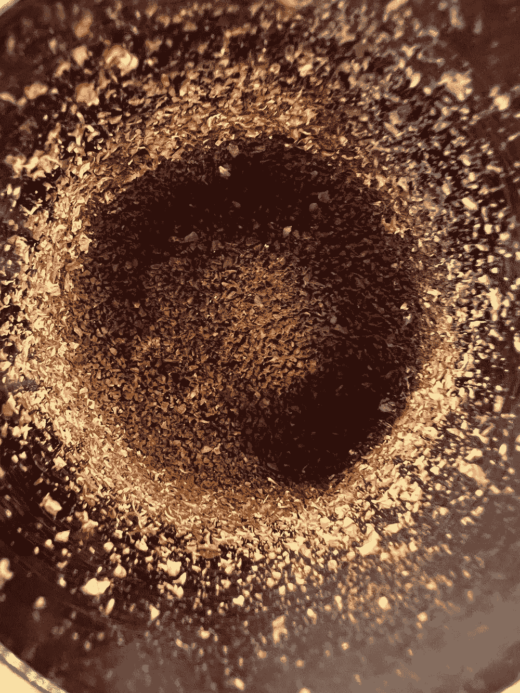
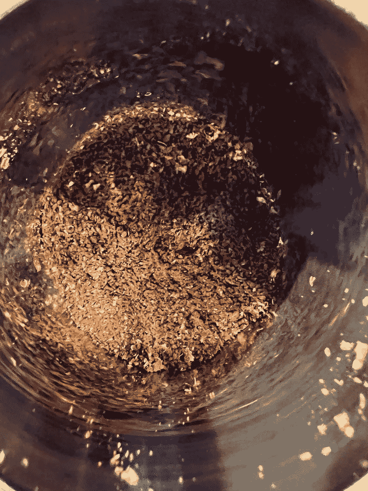
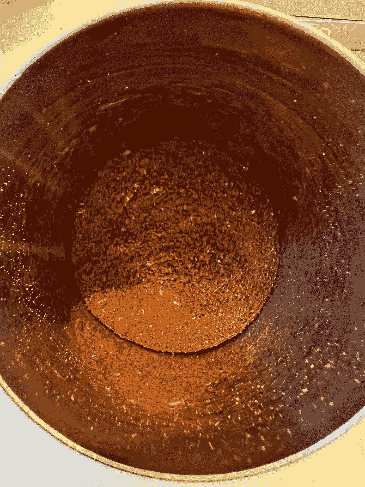
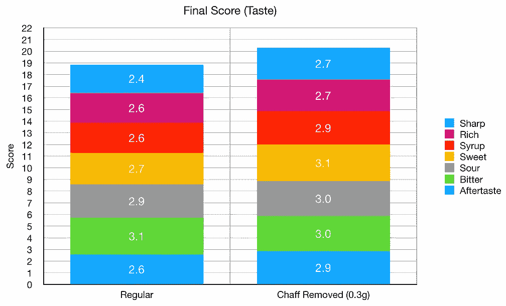
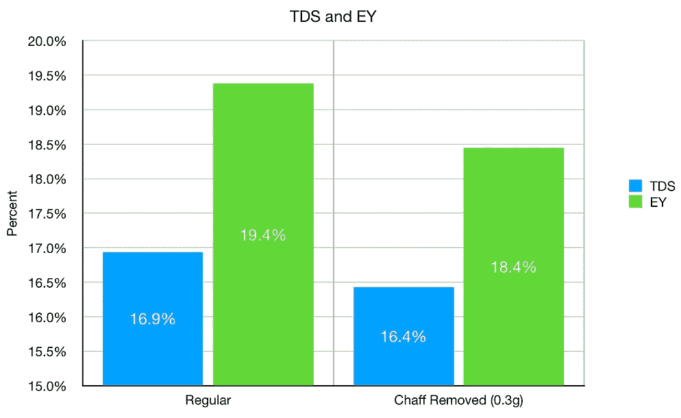
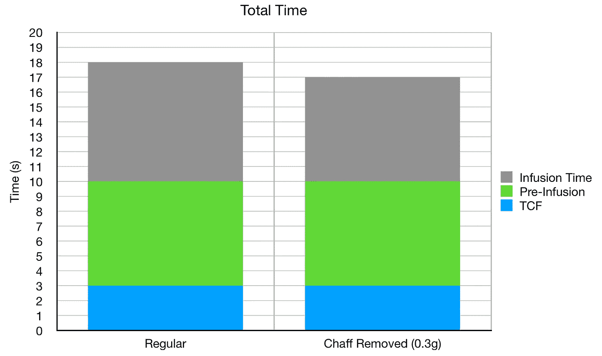

# 糠会影响浓缩咖啡的味道吗？

> 原文：<https://towardsdatascience.com/does-chaff-impact-taste-in-espresso-d2c2b0b4f938?source=collection_archive---------23----------------------->

## 咖啡数据科学

## 短暂的研磨实验

我想探索谷壳是如何影响味道的，因为我经常磨得很细，以至于我都没有注意到里面有多少，但是当我磨得更粗时，我肯定会注意到。为了探索这种可能性，我双研磨去除糠，这改善了味道。

首先，我使用研磨设置 50 对小生境零是非常粗糙的。这使得谷壳大部分被分离。然后，我去除了干扰，并在设置 13 重新研磨一切。对于对照组，我做了同样的过程，但没有去除干扰物。我去掉了 0.3 克谷壳。

在研磨设置 50 处去除谷壳之前和之后。所有图片由作者提供。

当谷壳被磨碎并混合在一起时，这就是地面通常的样子。很难看到它，因为它也被磨得很细。

# 绩效指标

我使用两个指标来评估技术之间的差异:最终得分和咖啡萃取。

[**最终得分**](https://towardsdatascience.com/@rmckeon/coffee-data-sheet-d95fd241e7f6) 是评分卡上 7 个指标(辛辣、浓郁、糖浆、甜味、酸味、苦味和回味)的平均值。当然，这些分数是主观的，但它们符合我的口味，帮助我提高了我的拍摄水平。分数有一些变化。我的目标是保持每个指标的一致性，但有时粒度很难确定。

# 设备/技术

浓缩咖啡机:金特快

咖啡研磨机:利基零

咖啡:中杯家庭烘焙咖啡(第一口+ 1 分钟)

镜头准备:[断奏夯实](/staccato-tamping-improving-espresso-without-a-sifter-b22de5db28f6)

输液:[压力脉动](/pressure-pulsing-for-better-espresso-62f09362211d)

过滤篮:20g VST

其他设备:Atago TDS 测量仪，Acaia Pyxis 秤

# 表演

谷壳影响味道和提取。味觉的影响是显而易见的，但只有在比较时间相近的照片时。我怀疑是否有人能从一次射击中看出有很多干扰。对提取率也有轻微的影响。

就拍摄时间而言，他们有相似的时间。覆盖过滤器(TCF)的时间基本不受影响，拍摄本身相对较快。

去除渣滓可以在常规的基础上提高浓缩咖啡的质量，但这有点费力，因为双重研磨并不是设置的一部分。然而，对我来说有趣的是，如此小的东西，21g 的子弹 0.3g(重量的 0.14%)会有如此大的影响。

一个警告是，这个测试是一个快速的测试，我甚至不知道我是否去除了所有的干扰。我从咖啡渣杯边上刮下来的。很有可能我可以用粗磨和筛子去除更多。

在[树场附近有一种叫做 Kirimai](https://youtu.be/tRyH60SCTm4) 的研磨机即将问世，它使用双研磨机来清除地面上的谷壳，所以这应该很有趣。

如果你愿意，可以在[推特](https://mobile.twitter.com/espressofun?source=post_page---------------------------)、 [YouTube](https://m.youtube.com/channel/UClgcmAtBMTmVVGANjtntXTw?source=post_page---------------------------) 和 [Instagram](https://www.instagram.com/espressofun/) 上关注我，我会在那里发布不同机器上的浓缩咖啡照片和浓缩咖啡相关的视频。你也可以在 [LinkedIn](https://www.linkedin.com/in/robert-mckeon-aloe-01581595?source=post_page---------------------------) 上找到我。也可以在[媒](https://towardsdatascience.com/@rmckeon/follow)和[订阅](https://rmckeon.medium.com/subscribe)关注我。

# [我的进一步阅读](https://rmckeon.medium.com/story-collection-splash-page-e15025710347):

[我未来的书](https://www.kickstarter.com/projects/espressofun/engineering-better-espresso-data-driven-coffee)

[浓缩咖啡系列文章](https://rmckeon.medium.com/a-collection-of-espresso-articles-de8a3abf9917?postPublishedType=repub)

工作和学校故事集

[个人故事和关注点](https://rmckeon.medium.com/personal-stories-and-concerns-51bd8b3e63e6?source=your_stories_page-------------------------------------)

[乐高故事启动页面](https://rmckeon.medium.com/lego-story-splash-page-b91ba4f56bc7?source=your_stories_page-------------------------------------)

[摄影启动页面](https://rmckeon.medium.com/photography-splash-page-fe93297abc06?source=your_stories_page-------------------------------------)

[改良浓缩咖啡](https://rmckeon.medium.com/improving-espresso-splash-page-576c70e64d0d?source=your_stories_page-------------------------------------)

[对断奏生活方式的总结](https://rmckeon.medium.com/a-summary-of-the-staccato-lifestyle-dd1dc6d4b861?source=your_stories_page-------------------------------------)

[测量咖啡研磨分布](https://rmckeon.medium.com/measuring-coffee-grind-distribution-d37a39ffc215?source=your_stories_page-------------------------------------)

[浓缩咖啡中的粉末迁移](https://medium.com/nerd-for-tech/rebuking-fines-migration-in-espresso-6790e6c964de)

[咖啡萃取](https://rmckeon.medium.com/coffee-extraction-splash-page-3e568df003ac?source=your_stories_page-------------------------------------)

[咖啡烘焙](https://rmckeon.medium.com/coffee-roasting-splash-page-780b0c3242ea?source=your_stories_page-------------------------------------)

[咖啡豆](https://rmckeon.medium.com/coffee-beans-splash-page-e52e1993274f?source=your_stories_page-------------------------------------)

[浓缩咖啡用纸质过滤器](https://rmckeon.medium.com/paper-filters-for-espresso-splash-page-f55fc553e98?source=your_stories_page-------------------------------------)

[浓缩咖啡篮及相关主题](https://rmckeon.medium.com/espresso-baskets-and-related-topics-splash-page-ff10f690a738?source=your_stories_page-------------------------------------)

[意式咖啡观点](https://rmckeon.medium.com/espresso-opinions-splash-page-5a89856d74da?source=your_stories_page-------------------------------------)

[透明 Portafilter 实验](https://rmckeon.medium.com/transparent-portafilter-experiments-splash-page-8fd3ae3a286d?source=your_stories_page-------------------------------------)

[杠杆机维修](https://rmckeon.medium.com/lever-machine-maintenance-splash-page-72c1e3102ff?source=your_stories_page-------------------------------------)

[咖啡评论和想法](https://rmckeon.medium.com/coffee-reviews-and-thoughts-splash-page-ca6840eb04f7?source=your_stories_page-------------------------------------)

[咖啡实验](https://rmckeon.medium.com/coffee-experiments-splash-page-671a77ba4d42?source=your_stories_page-------------------------------------)