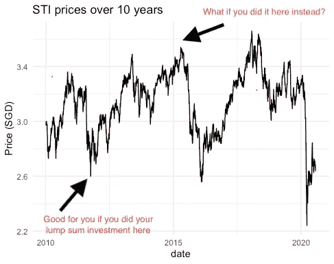
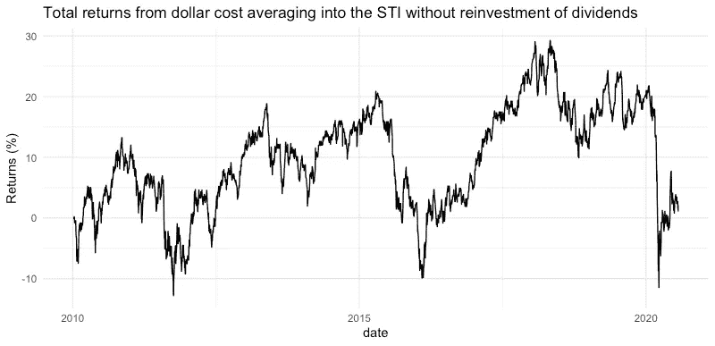
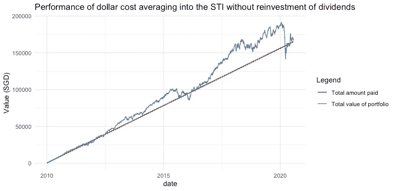
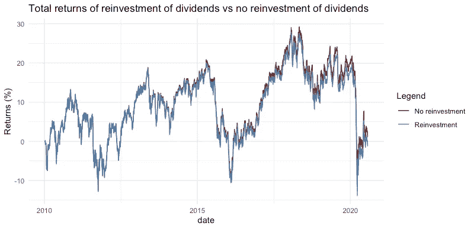
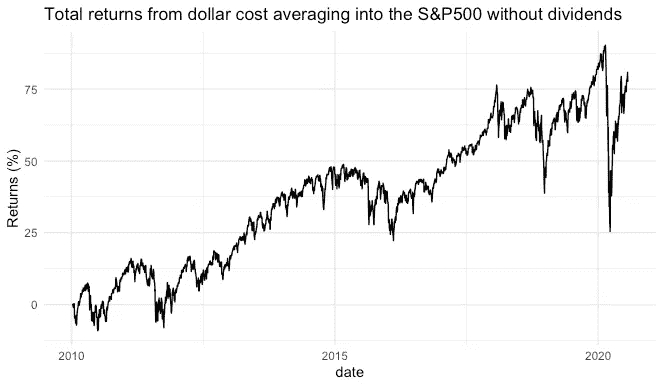
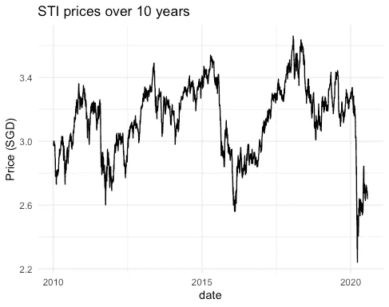
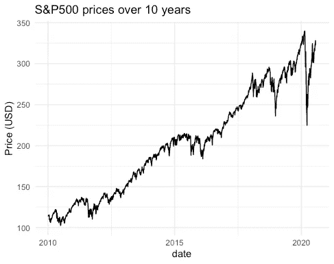

# 美元成本平均法有用吗？

> 原文：<https://towardsdatascience.com/does-dollar-cost-averaging-work-dcb74f293098?source=collection_archive---------24----------------------->

## 我调查了从 2010 年到 2020 年 10 年间新加坡海峡时报指数(STI)和标准普尔 500 的美元成本平均回报率。

科技日报在 [Unsplash](https://unsplash.com?utm_source=medium&utm_medium=referral) 上拍摄的

*免责声明:我在业余时间进行这个小小的回溯测试研究，完全出于个人兴趣，这不应该作为任何形式的财务建议！*

当我第一次开始研究投资时，我遇到的一个推荐给初学者的投资策略是平均成本法。这个概念听起来相当简单——每个月留出一笔固定金额购买交易所交易基金(ETF)，这意味着如果价格高，你就购买较少的单位，而当价格低时，你就购买更多的单位。这种策略的一个巨大优势是不需要把握市场时机，如果你选择一次性投资，这是你需要做的事情(非常容易产生压力)。

用一次性投资把握市场时机这一令人焦虑的现实。

也就是说，如果有些事情听起来好得不像是真的，我们可能应该更加谨慎地对待它——在我们的情况下，平均成本真的有效吗？带着满满一卡车的热情(或者至少是在#mondayblues 即将来临的周日晚上所能聚集的热情)和 10 年的数据，我试图回溯测试这个问题的答案。顺便说一下，这项研究中使用的代码可以在我的 GitHub 上找到[这里](https://github.com/meredithwan/DCA)。

# 设置背景

由于我住在新加坡，我想到的第一个 ETF 是海峡时报指数。海峡时报指数是一个市值加权指数，由在新加坡交易所上市的前 30 家公司组成。有两个 ETF 可供选择，SPDR 提供的 ES3 和日光 AM 提供的 G3B。这两只 ETF 非常相似，因此为了简单起见，我们将查看 ES3 从 2010 年 1 月 1 日到 2020 年 7 月 26 日期间的历史价格和股息。我们假设每月留出 1300 美元用于 ES3 的平均成本，我们使用的经纪人是 FSMone，除了通常的清算和交易费用之外，它还收取 0.08%的佣金(最低佣金为 1 美元)。

作为美元成本平均策略的一部分，一个常见的考虑因素是是否将股息再投资于 ETF。简单地说，如果你在本月底收到 100 美元的股息，你可以保留这些股息(或许可以好好犒劳一下自己)，或者在下个月用这些股息购买更多的 ETF 单位。通常，前者受到鼓励，因为它有助于增加你的回报。为了完整起见，我们将回测有和没有股息再投资的美元平均成本。

# 在不进行股息再投资的情况下，将美元成本平均计入 STI

要评估多年期投资策略的绩效，我们可以考虑以下几点:

*   总回报——投资组合价值(市场价格乘以拥有的单位数量)加上收到的总股息
*   内部收益率——这给出了当涉及多个时间段的多个现金流(在我们的例子中是投资金额和收到的股息)时的年化收益率

## 总回报

如上图所示，在没有股息再投资的情况下，平均投入 STI 的美元成本的总回报往往会随着时间的推移在正值和负值之间波动，但似乎平均在 10%左右，这不是一个很好的迹象，因为这些回报不是按年计算的。

投资组合的总价值包括在每个时间点收到的累积股息

为了正确看待总回报，我绘制了每个时间点的投资价值与累计支付金额的关系图。乍一看，回报看起来不太大，但让我们保留我们的意见，直到我们计算出年化回报，好吗？

## 内部收益率

内部回报率为 3.66%，如果我们假设每年的通胀率为 2%左右，那么实际年化回报率约为 1.66%。

# 通过股息再投资将美元成本平均计入 STI

如果我们将收到的股息进行再投资，回报会更高吗？剧透:不尽然。

## 总回报

无论你是否将股息进行再投资，总回报似乎都非常相似。事实上，看起来你的红利再投资确实会导致稍微低一点的回报，尤其是在 2015 年以后。

## 内部收益率

内部收益率为 2.9%，这比你选择不将股息进行再投资时的内部收益率要低得多。

# 那么，将美元成本平均化到 STI 中的回报被认为是好的吗？

虽然平均投入 STI 的美元成本的回报似乎不太令人兴奋，但为了进行公平的评估，我们需要对 STI 的回报和投资其他替代资产的回报进行粗略的比较。

## 与 10 年期新加坡政府债券相比

与 STI 相比，新加坡政府债券被认为是风险低得多的投资。作为替代(尽管假设一次性投资于政府债券会使比较有点不公平)，如果我们投资于 2011 年发行、2021 年到期的 10 年期债券，该债券的票面利率为 2.25%，低于 STI 的年化回报率。

## 与标准普尔 500 的平均美元成本进行比较

如果我们的美元成本被平均纳入美国市场指数呢？由于我的工作地点在新加坡，我需要缴纳 30%的股息预扣税。我将做一个简化的假设(部分是因为这是一个周日晚上，我开始有点饿了)，我将只根据资本收益来计算我的回报。换句话说，我假设没有支付股利。

我们将基于 iShares 提供的 IVV 进行回溯测试，因为这将是我们为 S&P500 选择的 ETF。为了公平比较，我们将使用相同的时间段(2010 年 1 月 1 日至 2020 年 7 月 26 日)，并假设每月投资 1000 美元(大约 1300 新加坡元)。收取的佣金费用仍为 0.08%，最低佣金为 1 美元。

**总回报**

这张总回报图看起来确实与 STI 图有很大不同——有明显的上升趋势，即使在新冠肺炎疫情引发的抛售期间，总回报也没有跌入负区。

**内部收益率**

内部收益率为 11.23%，这似乎表明 S&P500 的表现远远超过了 STI！

但是为什么回报如此悬殊呢？

如果我们看一下这两个市场指数过去 10 年的历史价格，我们会发现非常不同的趋势。

STI 的价格(左边的图表)几乎一直在横向移动，而 S&P500 的价格在过去十年中一直在快速增长。因此，对于一种价格呈横向趋势的资产，无论你是选择美元成本平均法还是设法把握好市场时机进行一次性投资，回报都不会太大。

## 这项研究的注意事项

然而，对这项研究的发现有一些警告。首先，在评估平均计入标准普尔 500 的美元成本回报时，没有考虑汇率波动——所有计算都是在美元基础上进行的。其次，虽然标准普尔 500 的回报一直高于 STI，但我们也应该注意到，标准普尔 500 往往比 STI 更不稳定，因此我们需要能够承受与该市场指数相关的更快速的价格波动。最后，过去的表现并不代表未来的表现。我们不知道未来十年可能会发生什么(就像我们从未预料到新冠肺炎带来的股市崩盘一样)，因为我们所知道的是，我们可能会看到投资者情绪从美国市场转移，甚至会遇到 STI 成分的调整。

***注来自《走向数据科学》的编辑:*** *虽然我们允许独立作者根据我们的* [*规则和指导方针*](/questions-96667b06af5) *发表文章，但我们不认可每个作者的贡献。你不应该在没有寻求专业建议的情况下依赖一个作者的作品。详见我们的* [*读者术语*](/readers-terms-b5d780a700a4) *。*