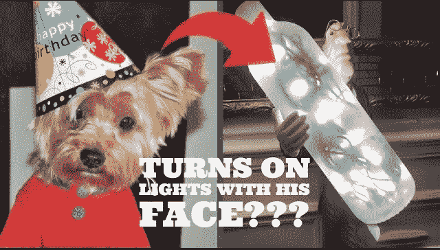
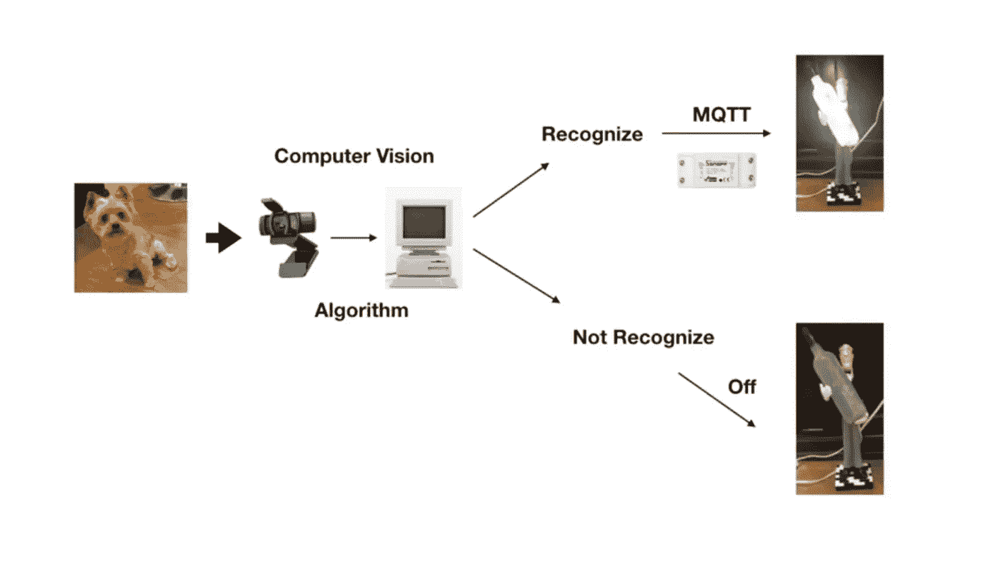
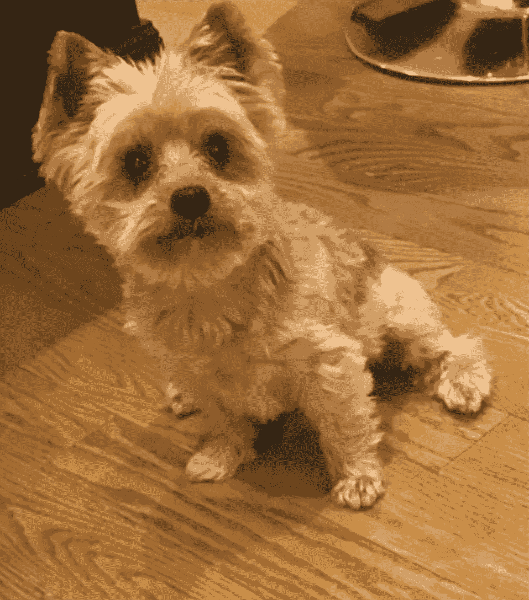
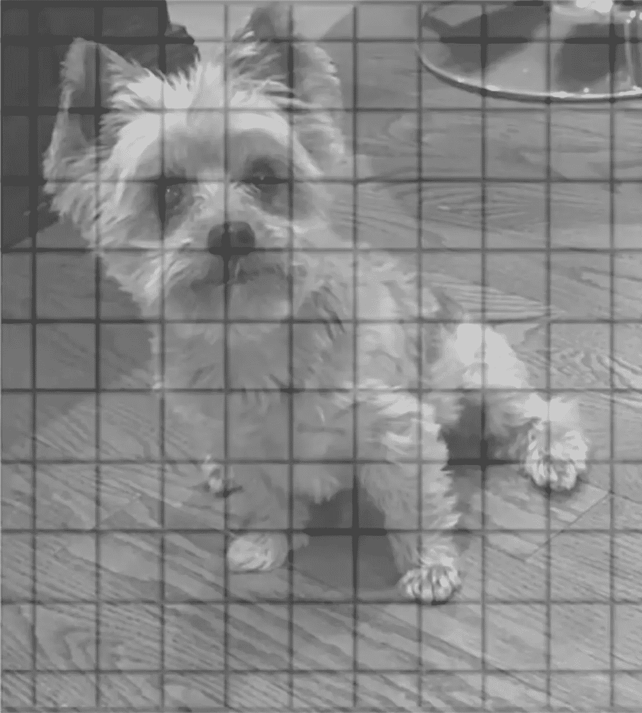

# 面部识别对狗有效吗

> 原文：<https://towardsdatascience.com/does-facial-recognition-work-on-dogs-ca8853dc0961?source=collection_archive---------57----------------------->

## OpenCV 简化和解释



作者图片

毫无疑问，面部识别无疑已经成为数据科学领域的一个热门话题，但鉴于隐私问题，它也带来了相当大的争议。然而，这项技术正变得越来越普遍，无论是用于用面部解锁手机，还是出于安全原因(如安全摄像头)检测人和/或图像。在这篇文章中，我想把这个概念更进一步，那就是你是否真的可以训练技术来识别狗的脸。

适用性非常有限，但我的动机更多的是为了科学利益和理解，而不是现实世界的应用。我试图解决的难题是，我能否训练一个计算机算法来识别我的狗的脸，如果可以，就开灯，否则就关灯。下图展示了事件的顺序和所需的设备，最重要的是我可爱的狗。我使用了 Python 和 cv2 包以及专门针对狗的 cascade XML 文件。



作者图片

现在，在我们进入测试的实际结果之前，让我们后退一步，了解计算机视觉是如何工作的。以下面我的狗的图片为例。当计算机显示一幅图像时，它实际上并不知道一幅图像中是否包含一只狗、一个罐子或其他设备。它只看到一堆用来渲染图像的数据。那么计算机是如何识别一只狗的呢？好的..让我们开始吧



作者图片

首先，图像本身被转换成灰度图像，只是因为它比使用彩色图像更快。这在很大程度上是因为灰度图像相对于彩色图像的像素维数(详见下文)。灰度像素范围从 0(黑色)到 255(白色)，而彩色图像是多维的，因此有术语 RGB。r、G、B 有它们自己的像素比例，混合其中任何一种来呈现特定的颜色。为了这个项目的目的，我不太关心背景的颜色或他的皮毛，而是组成一只狗的特征，也可以用灰度来表现。现在我们有了灰度图像，图像被分解成更小的方块，计算机开始分析和处理。



作者图片

现在，这些方块中的每一个都有称为像素的东西，每个像素中有一个独特的数据组合，代表一种特定的颜色(在这种情况下是黑色和白色之间的阴影)。每个像素的数据在与其相邻像素的上下文中被存储和记忆。这就是计算机如何确定重要事物的方法，比如一张脸的边缘或者一只狗的鼻子。现在，为了利用机器学习，你需要向算法输入成千上万张狗和其他动物的图像，以便它可以学习狗和猫的区别，甚至更具体地学习狗的鼻子和猫的鼻子的区别。一旦你给它足够多的带有标签数据的图像，它就能够从它所学习的一切中引用回来，并提供算法认为图片包含什么的概率，如下图所示。


作者图片

在上面的例子中，算法认为图像有 75%的可能性包含一只狗，20%可能是一只猫，5%可能是一只狐狸。可以肯定地说，在 75%的情况下，算法可能是正确的。现在，您可以随时在它对图像进行分类之前设置您的最小阈值。例如，我可以告诉算法拒绝图像，不给它任何分类，除非它 85%确定它是一个或另一个。

那么我的经历是怎样的呢？嗯，一开始很难让我的狗保持不动，上下看看。我不得不用一些奶酪贿赂他来引起他的注意。我也意识到我没有在足够多的图片上训练它的脸，所以我进入我的小狗图片海洋，找到了大约 100 张最近的图片。一旦我把它加载到训练集中，预测就好了很多。如果你想看代码演练，但更重要的是想看我的狗用他的脸开灯和关灯，你可以在这里看看。

```
[https://youtu.be/ofh27VwCoLE](https://youtu.be/ofh27VwCoLE)
```

我在这个项目上真的度过了一段快乐的时光，也展示了通过一点点尝试和错误，你可以做一些非常棒的事情。最后，我会说这个项目对我的研究来说是成功的，尽管我不期望它已经为主流做好了准备。还有更复杂的方法来执行面部识别，例如使用 YOLO、面部识别甚至 pytorch 中的功能。我可能会对这些库中的一些进行基准测试，以确定分类器能够标记正确图像的程度。希望你喜欢这篇文章。