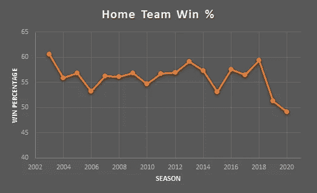
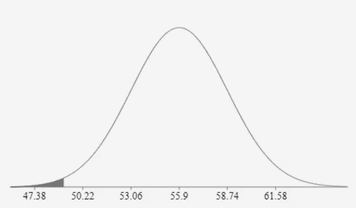
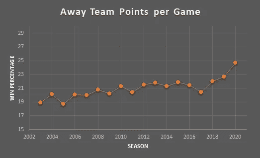
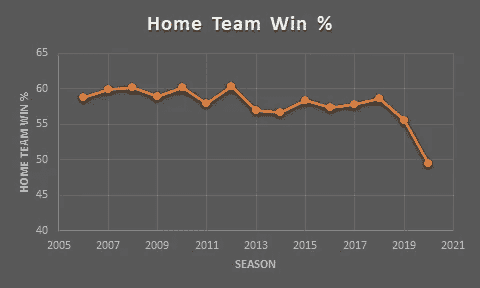

# 没有球迷，主场优势还重要吗？

> 原文：<https://towardsdatascience.com/does-home-field-advantage-still-matter-without-fans-4dbde8dd62cc?source=collection_archive---------42----------------------->

## [实践教程](https://towardsdatascience.com/tagged/hands-on-tutorials)

## 用数字来证明粉丝确实有所作为

来源:https://unsplash.com/photos/GB9XKDZWwp0

在大多数国家，人们不再被允许进入体育场，至少不能以正常身份进入。

任何体育运动的粉丝都会告诉你，没有粉丝看比赛是不一样的。有一个缺失的元素。

虽然景象可能不一样，但这种不太可能的情况让我们看到了一件事。球迷不在，主场优势还重要吗？

通过多年的观察，我们知道主场优势在任何运动中都是真实存在的。看看任何一个联赛，你会发现绝大多数时候，球队在主场比客场有更好的数据。

但这是为什么呢？是因为旅游吗？对体育场/更衣室/条件的熟悉程度？粉丝支持？还是纯粹精神上的？回答这个问题实际上一直是不可能的。但是，今年，我们可以看到球迷对主场优势的影响。

## NFL 中主队的胜率

整个 2020 年 NFL 赛季都是闭门比赛，或者球迷人数非常有限。这对本赛季主队的表现有什么影响？一张图表胜过千言万语。

在 2003 年至 2019 年期间，主队平均赢得了 55.9%的比赛，标准差为 2.84%。本赛季，这个千年来第一次，主队赢了不到一半的比赛(准确的说是 49.09%)。

在赛季初，假设正态分布，如此小比例的主场获胜的概率估计如下。

来源:自制图片

那个灰色的小部分？就是这样。它稳定在 0.82%。这意味着什么？嗯，简而言之，如果所有事情都保持不变，主队如此小的胜率真的不太可能发生。当然，事情并没有保持平等，因为球迷不在那里。

## NFL 中每场比赛的客场积分

让我们看看另一个数据。作为一个长期的球迷，我已经听过几百次了，远离家乡的进攻是困难的。玩家之间无法轻松交流，这让每个人的生活都很困难。一些像西雅图和堪萨斯城这样的体育场以特别吵而闻名，那些球迷基地为此感到自豪！

如果移除风扇会发生什么？

本赛季，客场球队每场比赛得到 24.69 分，比以往任何时候都多。2003 年至 2019 年的平均场均得分为 20.8 分。如果一切保持不变，赛季前发生这种情况的可能性估计为 0.27%。

这些统计数据清楚地表明，与近几年相比，NFL 的主场优势已经不一样了。

## NBA 主场胜率

在北美四大联赛中，NBA 以拥有最大的主场优势而闻名。球队通常会赢得 57%到 60%的比赛，这个胜率会上升到 60 年代中期的季后赛。

这一季呢？再说一遍，一张图片胜过千言万语。

在 NBA，赛季还很年轻，所以事情仍然可以改变。然而，到目前为止，自从我可以回顾以来，第一次，主场球队赢了不到 50%的比赛(49.5%)。这意味着他们赢得的比赛比 2019 年至 2006 年间少了约 8%。

在足球或曲棍球中可以观察到非常相似的数字。在许多联赛和体育项目中，客场球队从来没有做得更好。套用伊恩·弗莱明(詹姆斯·邦德小说的作者)的话:

> 一次是机会。两次是巧合。三次是一种模式。

所有这些都是为了说明，在某些时候，我们可以从观察到的东西中得出结论。显然，“主场优势”的优势部分，粉丝的作用很大。当球迷们最终可以回到体育场时，看看事情会发生怎样的变化将会很有趣。在那之前，让我们尽情享受游戏吧。

感谢阅读！