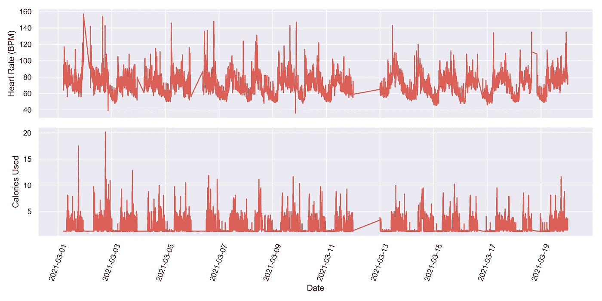
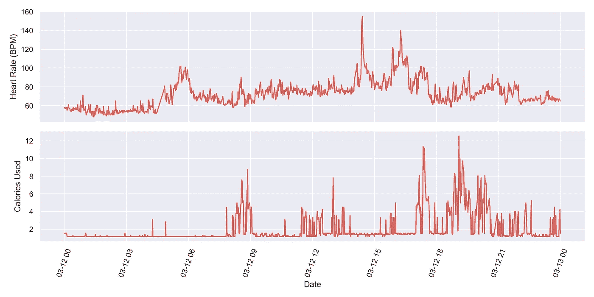
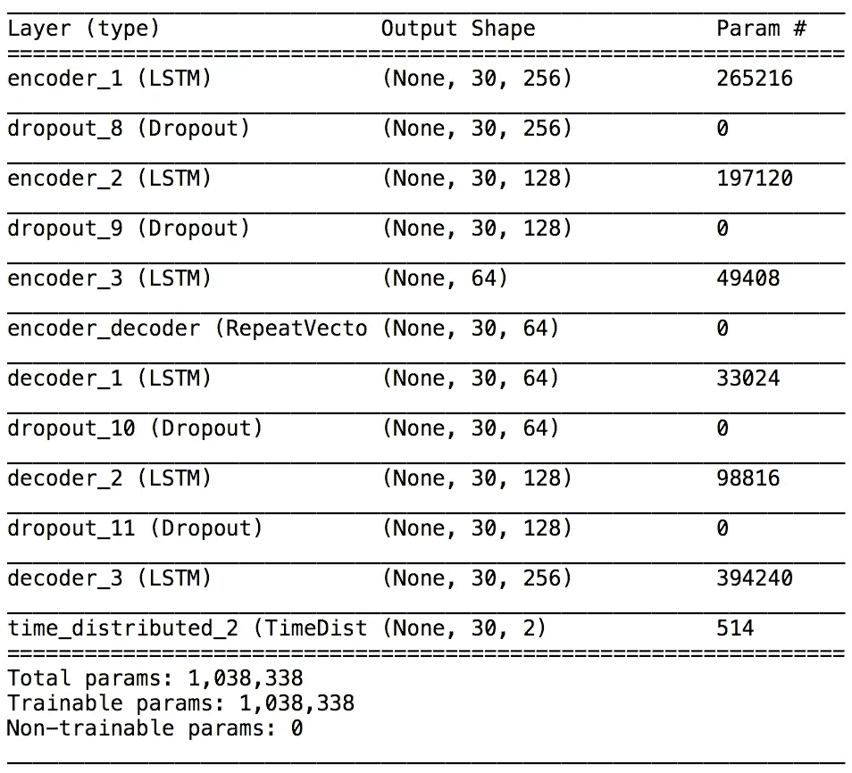
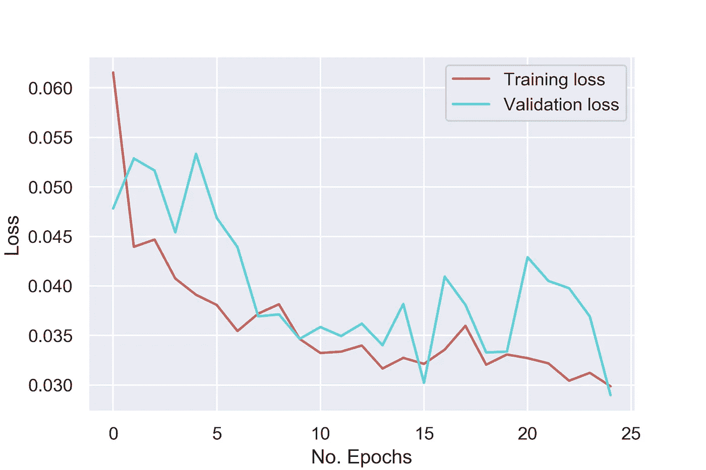
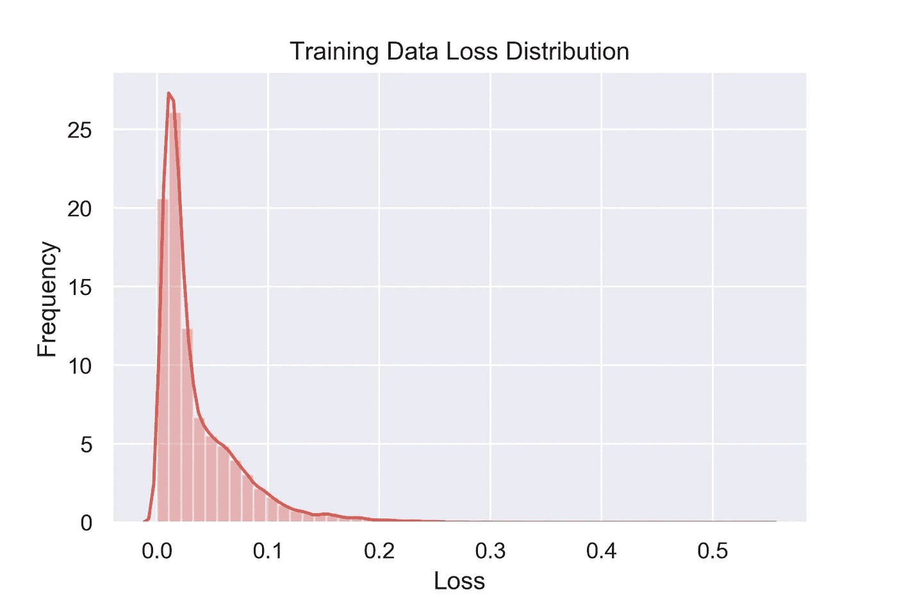
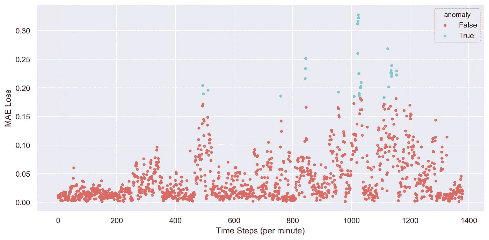
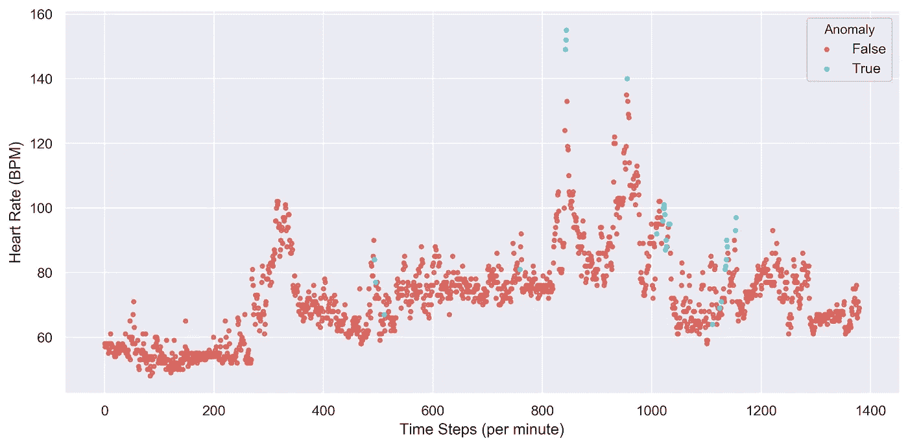
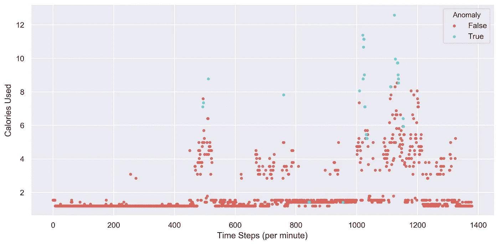

# 机器学习知道我什么时候害怕吗？可穿戴健康数据中的异常检测

> 原文：<https://towardsdatascience.com/does-machine-learning-know-when-im-scared-anomaly-detection-in-wearable-health-data-72f537dd4370?source=collection_archive---------20----------------------->

## 利用真实的 Fitbit 测量在 Keras 中构建自动编码器的机会。


作者图片

像 Fitbit 这样的可耳听健康设备提供了大量关于我们健身和日常活动的信息。这提供了一个**处理大型数据集的绝佳机会**，其中个人信息可用于更深入地了解实际现实世界的机器学习应用，而不仅仅是像[人类活动识别](https://archive.ics.uci.edu/ml/datasets/human+activity+recognition+using+smartphones)数据集这样的例子。

本文中使用的数据集来自我的个人 [Fitbit](https://www.fitbit.com/global/us/home) 设备，其中的卡路里和心率数据被记录为近三周的时间序列。目标是使用 Keras 建立和使用自动编码器模型**来识别基于心率和卡路里随时间变化的异常**。

# **工作总结:**

我们将开始加载数据集，并查看心率和卡路里在我们的样本期间如何变化。

我们还将检查包含异常的数据集，以帮助我们了解潜在的异常可能是什么样子。一旦我们开始评估模型的性能，这将变得非常有用。

数据将被清理、缩放和整形，以与我们的 autoencoder 模型兼容。

我们的模型将被建立和评估，以确定预测误差，这将在以后被用来确定是否存在异常。

最后，我们将研究检测到的异常现象，试图解开它们可能发生的原因。

# **加载和可视化:**

数据集是从我的个人 Fitbit 账户下载的，文件以 JSON 格式导出。关于下载自己数据的信息可以在[这里](https://help.fitbit.com/articles/en_US/Help_article/1133.htm)找到。在导入所有相关模块后，我们可以使用 Pandas 加载这些文件来生成心率和卡路里的数据帧，它们都是时间序列数据:

```
#Importing the relevant modules
import glob
import numpy
import os
import pandas as pd
import numpy as np
import seaborn as sns; sns.set()
import matplotlib.pyplot as plt
from tensorflow import keras
from sklearn.preprocessing import MinMaxScaler
sns.set_palette(“hls”, 2)#Loading in the heart rate and calories data
heart = pd.DataFrame()
calories = pd.DataFrame()
datasets = [‘heart_rate-2021–03-*.json’, ‘calories-2021–02-*.json’]
for datatype in datasets:
    file_list=[]
    path = ‘/Physical Activity/’
    os.chdir(path)
    for file in glob.glob(datatype):
        file_list.append(file)
    dfs = []
    for file in file_list:
        data = pd.read_json(path + file)
        print(‘Reading: ‘ + str(file))
        dfs.append(data)
    concatenated = pd.concat(dfs, ignore_index=True)
    concatenated[“value”] = concatenated[“value”].apply(str)
    if concatenated[‘value’].str.contains(“bpm”).any():
        heart = pd.concat([heart, concatenated], axis = 1)
    else:
        calories = pd.concat([calories, concatenated], axis = 1)
```

让我们看一下数据，看看我们可能需要做什么样的清洁:

```
print(heart.head(5))
print(calories.head(5))dateTime value
0 2021–03–08 21:00:07 {‘bpm’: 57, ‘confidence’: 3}
1 2021–03–08 21:00:17 {‘bpm’: 56, ‘confidence’: 3}
2 2021–03–08 21:00:32 {‘bpm’: 56, ‘confidence’: 3}
3 2021–03–08 21:00:42 {‘bpm’: 57, ‘confidence’: 3}
4 2021–03–08 21:00:57 {‘bpm’: 58, ‘confidence’: 3}dateTime value
0 2021–02–18 00:00:00 1.19
1 2021–02–18 00:01:00 1.19
2 2021–02–18 00:02:00 1.19
3 2021–02–18 00:03:00 1.19
4 2021–02–18 00:04:00 1.19
```

心率以每分钟心跳数(BPM)来衡量，并以 10-15 秒的不规则间隔进行采样。卡路里数据测量使用的卡路里量，这是使用一个人的[基础代谢率(BMR)和活动率](https://help.fitbit.com/articles/en_US/Help_article/1141.htm#:~:text=How%20does%20my%20Fitbit%20device%20calculate%20calories%20burned%3F,to%20estimate%20your%20calories%20burned.)的组合来计算的。我们可以改变心率数据的采样频率，以便两个数据集都记录每分钟的观察值。值列也应该删除文本，以便作为浮点数读取:

```
#Cleaning the training data
heart = heart.sort_values(by="dateTime")
heart = heart.set_index('dateTime')
heart["value"] = heart["value"].apply(str)
heart["value"] = heart["value"].str.split("{'bpm':").str[1]
heart["value"] = heart["value"].str.split(",").str[0]
heart["value"] = heart["value"].astype(int)
heart = heart.resample('1Min').mean()
heart['value'] = heart['value'].round(0)
calories = calories.sort_values(by="dateTime")
calories["value"] = calories["value"].astype(float)
calories.columns = ['time', 'value']
calories = calories.set_index('time')
```

现在，我们可以将心率和卡路里合并在一起，创建一个涵盖样本期的时间序列数据的单一数据框架。创建一个包含覆盖我们的采样周期的 DateTimeIndex 的空 DataFrame 会使事情变得更加方便:

```
#Merge the datasets together
empty = pd.DataFrame(pd.date_range(start='2021-03-01', end='2021-03-20', freq='1min'))
empty.columns = ['datetimeindex']
empty = empty.set_index('datetimeindex')
from functools import reduce
df = reduce(lambda left,right: pd.merge(left,right,left_index=True, right_index=True), [heart, calories, empty])
df.columns = ['Heart Rate (BPM)', 'Calories Used']
df = df.dropna()
```

我们的训练数据将来自连续的样本期。测试数据大约来自我们样本中间的一天，因此我们可以假设影响心率和卡路里数据的条件有一定的连续性:

```
#Splitting the test day
df_test = df.loc[(df.index > '2021-03-12 00:00:00') & (df.index <= '2021-03-12 23:59:59')]
df = df.loc[(df.index < '2021-03-12 00:00:00') | (df.index > '2021-03-12 23:59:59')]
```

我们现在处于最终可视化 Fitbit 数据的阶段，将从训练数据开始。训练数据中的差距代表我们之前提取的测试日:

```
#Visualising training and testing data
datasets = [df, df_test]
for dfs in datasets:
    fig, axs = plt.subplots(nrows=2, ncols=1, figsize=(12,6))
    axs[0].plot(dfs['Heart Rate (BPM)'])
    axs[1].plot(dfs['Calories Used'])
    plt.setp(axs[0].get_xticklabels(), visible=False)
    axs[0].tick_params(axis='x', rotation=70)
    axs[1].tick_params(axis='x', rotation=70)
    axs[0].set(ylabel='Heart Rate (BPM)')
    axs[1].set(ylabel= 'Calories Used', xlabel="Date")
    plt.tight_layout()
    plt.show
```

最后来点图！



一段时间内心率和消耗卡路里的训练数据集

数据集显示了心率和卡路里循环趋势；两个数据集都在早上增加，在白天保持相当稳定，然后在晚上逐渐减少。这是一个预期的趋势，因为它与起床、白天工作、晚上睡觉前放松相关。

转到将用于验证是否检测到异常的测试数据集。这些数据涵盖了一天的时间，我们可以根据我们在培训数据中看到的内容来猜测潜在的异常情况:



一段时间内心率和消耗卡路里的测试数据集

有趣的是，这一天的测试数据有两个峰值，心率在下午显著增加，这与卡路里的增加无关。这表明心率的**增加可能与锻炼的变化**无关。处理个人数据的额外好处是我知道这一天发生了什么；去医院一趟。作为一个不太喜欢去医院的人，我的 Fitbit 清楚地捕捉到了我的紧张情绪，这使它成为我们稍后将试图识别的异常现象的一个极好的例子。

我们可以在心率和卡路里之间做一个简单的相关矩阵，看看它们之间的关系:

```
#Make a correlation coefficient
print(df.corr()) Heart Rate (BPM)  Calories Used
Heart Rate (BPM)     1.000000       0.102251
Calories Used        0.102251       1.000000
```

心率和消耗的卡路里之间有一个略微正相关的关系。根据 Fitbit 的[文档](https://help.fitbit.com/articles/en_US/Help_article/1141.htm#:~:text=How%20does%20my%20Fitbit%20device%20calculate%20calories%20burned?,to%20estimate%20your%20calories%20burned.)关于卡路里的计算方式，心率影响卡路里的计算方式，因此我们观察到的正相关是可以预期的。

# **预处理:**

回到代码，我们现在需要调整我们的数据，以便我们可以减少训练数据中任何离群值的影响，这些离群值可能会妨碍模型检测异常的能力。我们将使用 MinMaxScaler，因为这将使心率和卡路里数据在 0 和 1 之间变化，这在我们稍后计算预测误差时非常重要。

```
#Scale the data
scaler = MinMaxScaler()
scaler = scaler.fit(df)
scale_train = pd.DataFrame(scaler.transform(df))
scale_test = pd.DataFrame(scaler.transform(df_test))
```

现在数据已经被缩放，我们需要**重塑**以兼容我们的自动编码器模型。我们模型的输入将是一个三维数组，其形状取决于样本的数量、序列的长度和特征的数量。我们将使用 30 个时间步长(也称为半小时时间间隔)的序列，因为我们假设异常是短暂的。

```
# reshape to [samples, time_steps, n_features]
def create_dataset(X, y, time_steps=1):
    Xs, ys = [], []
    for i in range(len(X) - time_steps):
        v = X.iloc[i:(i + time_steps)].values
        Xs.append(v)
        ys.append(y.iloc[i + time_steps])
    return np.array(Xs), np.array(ys)time_steps = 30
X_train, y_train = create_dataset(scale_train, scale_train, time_steps)
X_test, y_test = create_dataset(scale_test, scale_test, time_steps)
print(X_train.shape, y_train.shape)
```

这将生成一个形状为(23333，30，2) (23333，2)的训练和测试集。

# **模型构建:**

我们的数据已经成功整形，现在可以构建我们的 autoencoder 了。本文不会深入讨论自动编码器和 LSTMs 的细节，但是我强烈建议查看以下信息:

[](/anomaly-detection-using-autoencoders-5b032178a1ea) [## 使用自动编码器的异常检测

### 使用 TensorFlow 中的自动编码器执行欺诈检测

towardsdatascience.com](/anomaly-detection-using-autoencoders-5b032178a1ea) [](/lstm-for-time-series-prediction-de8aeb26f2ca) [## 时间序列预测的 LSTM

### 用 PyTorch 训练长短期记忆神经网络并预测比特币交易数据

towardsdatascience.com](/lstm-for-time-series-prediction-de8aeb26f2ca) 

自动编码器将由分成编码器和解码器的 LSTM 层组成。首先，模型会将数据的输入序列编码成其关键特征的**简化表示，然后解码器会学习如何将该简化表示转换回其原始输入状态。使用自动编码器方法允许我们**在数据集**内创建“正常”特征的表示。因此，当输入异常序列时，模型将不能重建其简化表示，这将导致较高的模型误差。**

由于我们的输入使用两个特征，来自组合预测的误差(即来自心率和卡路里序列重建的误差)将被用作我们检测异常的方法。

我们的模型架构在编码器和解码器中使用多个 LSTM 层，由 RepeatVector 层分隔，repeat vector 层重复由最后一个编码器 LSTM 层给出的简化表示。在解码器末端的最终时间分配将输入重建回其原始形状。

```
#model building
model = keras.Sequential()
model.add(keras.layers.LSTM(256, input_shape=(X_train.shape[1], X_train.shape[2]), return_sequences=True, name='encoder_1'))
model.add(keras.layers.Dropout(rate=0.2))
model.add(keras.layers.LSTM(128, return_sequences=True, name='encoder_2'))
model.add(keras.layers.Dropout(rate=0.2))
model.add(keras.layers.LSTM(64, return_sequences=False, name='encoder_3'))
model.add(keras.layers.RepeatVector(n=X_train.shape[1], name='encoder_decoder'))
model.add(keras.layers.LSTM(64, return_sequences=True, name='decoder_1'))
model.add(keras.layers.Dropout(rate=0.2))
model.add(keras.layers.LSTM(128, return_sequences=True, name='decoder_2'))
model.add(keras.layers.Dropout(rate=0.2))
model.add(keras.layers.LSTM(256, return_sequences=True, name='decoder_3'))
model.add(keras.layers.TimeDistributed(keras.layers.Dense(units=X_train.shape[2])))
model.compile(loss='mae', optimizer='adam')
model.summary()
```



模型摘要

该模型将使用 Adam 优化器，并测量平均误差损失。我们将使模型适合我们的训练数据；*注意，在拟合我们的模型*时，训练数据同时用于输入和标签。256 的批量将用于 25 个时期的训练持续时间。

```
#fitting on training data
history = model.fit(X_train, X_train, epochs=25, batch_size=256,
                    validation_split=0.1,verbose=1,shuffle=False)
#plotting loss
fig=plt.figure()
plt.plot(history.history['loss'], label='Training loss')
plt.plot(history.history['val_loss'], label='Validation loss')
plt.ylabel('Loss')
plt.xlabel('No. Epochs')
plt.legend()
plt.show()
```



培训期间的培训和验证损失

我们现在将使用训练数据和预测之间的 MAE 来显示损失的分布，这将作为我们定义**异常**的方式。MAE 是根据心率和卡路里数据的组合按时间步长计算的。

```
#predicting on test data
X_pred = model.predict(X_train)
X_pred_2d = pd.DataFrame(X_pred[:,0,:]).astype(float)
X_pred_2d.columns = ['HR Pred', 'Calories Pred']
X_train_2d = pd.DataFrame(X_train[:,0,:]).astype(float)
X_train_2d.columns = ['HR Test', 'Calories Test']#Plot the test data together
fig, axs = plt.subplots(4, figsize=(12,6))
axs[0].plot(X_pred_2d['HR Pred'])
axs[1].plot(X_train_2d['HR Test'])
axs[2].plot(X_pred_2d['Calories Pred'])
axs[3].plot(X_train_2d['Calories Test'])
plt.setp(axs[0].get_xticklabels(), visible=False)
plt.setp(axs[1].get_xticklabels(), visible=False)
plt.setp(axs[2].get_xticklabels(), visible=False)
axs[0].tick_params(axis='x', rotation=70)
axs[1].tick_params(axis='x', rotation=70)
axs[0].set(ylabel= 'HR Prediction')
axs[1].set(ylabel= 'HR Training')
axs[2].set(ylabel= 'Calories Prediction')
axs[3].set(ylabel= 'Calories Training', xlabel= 'Time Step (per minute)')
plt.tight_layout()#calculate error
predictions = pd.concat([X_pred_2d['HR Pred'], X_pred_2d['Calories Pred']], axis = 1)
train_inputs = pd.concat([X_train_2d['HR Test'], X_train_2d['Calories Test']], axis = 1)anomaly = pd.DataFrame(np.abs(predictions.values - train_inputs.values))
anomaly = anomaly.mean(axis=1)ax = sns.distplot(anomaly, bins=50, kde = True)
ax.set_title('Training Data Loss Distribution')
ax.set_xlabel('Loss')
ax.set_ylabel('Frequency')
fig = ax.get_figure()
```



训练数据丢失分布

在查看损失分布后，我们可以看到存在具有较高损失值的长尾，这表明模型难以重建输入序列的时间。为了定义用于判断预测是否异常的损失阈值，我们将在第 99 百分位的**找到训练数据中的损失。**

```
thres = round(numpy.quantile(anomaly, 0.99),3)
print('99th percentile loss value from training: ' + str(thres))99th percentile loss value from training: 0.177
```

# **预测:**

现在我们已经建立了模型，并且**定义了 0.177** 的损失阈值，我们可以继续测试我们的模型，看看它是否能够检测到我们之前在测试数据中发现的异常。我们将重新使用我们的模型和先前重新整形的测试数据，并重复相同的过程来计算预测损失。

```
#Predicting
X_pred = model.predict(X_test)
X_pred = pd.DataFrame(X_pred[:,0,:]).astype(float)
X_pred.columns = ['HR Pred', 'Calories Pred']
X_test_data = pd.DataFrame(X_test[:,0,:]).astype(float)
X_test_data.columns = ['HR Test', 'Calories Test']
```

我们使用先前定义的损失阈值作为将数据点定义为异常的分界点。为了更好地可视化我们的异常点，我们将异常列与原始测试数据集相结合，以帮助将事情放入上下文中。

```
difference = pd.DataFrame(np.abs(X_pred.values - X_test_data.values))
difference['mae loss'] = difference.mean(axis=1)
difference['threshold'] = thres
difference['anomaly'] = difference['mae loss'] > difference['threshold']
difference['index'] = difference.indexX_pred['index'] = X_pred.index
X_test_data['index'] = X_test_data.index
X_test_data = X_test_data.join(difference['anomaly'])
```

使用之前制作的定标器可以将心率和卡路里数据恢复到原始刻度，这将有助于我们更好地理解我们的结果:

```
X_test_data_original = pd.DataFrame(scaler.inverse_transform(X_test_data[['HR Test','Calories Test']]))
X_test_data = pd.concat([X_test_data, X_test_data_original], axis = 1)
X_test_data.columns = ['HR Test', 'Calories Test', 'Index', 'Anomaly', 'Heart Rate (BPM)', 'Calories Used']
```

我们最后的步骤将集中在可视化的预测结果。我们将从绘制每个数据点的平均损失开始，根据是否发现异常进行颜色编码:

```
plt = sns.lmplot(x='index', y='mae loss', data=difference, 
           fit_reg=False, hue='anomaly', scatter_kws={"s": 10}, legend=True, legend_out=False, height=5, aspect=2)
plt.set(xlabel='Time Steps (per minute)', ylabel='MAE Loss')
```



一段时间内的预测平均绝对误差

如我们所见，我们之前定义的异常截止点已用于**检测异常数据点**。

在我们的测试数据中查看模型损失在一天中的分布，很明显，在清晨发生异常的可能性极小，因为数据点在 500 分钟以下(也就是上午 08:30)的损失一直很低。这是有道理的，因为我睡着了，显然不会在半夜去健身房。

然而，在一天的其余时间里，情况略有不同，损失分布变得更大，一些数据点被标记为异常。下午(也就是 720-1140 分钟)损失的更大分布可能归因于我下午时间表的变化。

异常点分布在多个时间间隔中。为了理解这些异常事件发生的原因，我们可以看看心率和卡路里数据集:

```
plt = sns.lmplot(x ='Index', y='Heart Rate (BPM)', scatter_kws={"s": 10}, data=X_test_data, 
           fit_reg=False, hue='Anomaly', legend=True, legend_out=False, height=5, aspect=2)
plt.set(xlabel='Time Steps (per minute)', ylabel='Heart Rate (BPM)')
```



由检测到的异常着色的心率测试数据集

心率数据已通过在之前的损失图中检测到的异常进行了颜色编码。我们可以看到，明显的异常是当我的心率异常高时，达到每分钟 140 次以上，在 800-1000 分钟之间形成两个峰值。这与我之前提到的去医院的时间非常吻合。

有趣的是，我们可以看到异常也发生在正常心率期间(基于相邻的心率值)。我们的模型使用了心率和卡路里，这表明这些异常可能与消耗的卡路里有关。我们需要研究卡路里数据以获得更多信息:

```
plt = sns.lmplot(x ='Index', y='Calories Used', scatter_kws={"s": 10}, data=X_test_data, 
           fit_reg=False, hue='Anomaly', legend=True, legend_out=False, height=5, aspect=2)
plt.set(xlabel='Time Steps (per minute)', ylabel='Calories Used')
```



使用的卡路里测试数据集通过检测到的异常进行着色

我们的卡路里数据显示，在峰值期间检测到异常，通常超过每分钟 6 卡路里，这可能是在我走路的时候。当我们观察与高卡路里相关的异常时，我们看到它们发生在心率被认为正常的时候。这种关系，**高卡路里但平均心率**，可以被认为是异常的，因为通常大多数卡路里将在心率较高时被使用(心率和卡路里之间的正相关性也支持这一点)。

当心率高而卡路里数据低时，观察到相反的关系，表明心率高是由于与身体活动无关的原因。**由于这是我自己的数据，我知道下午我去了医院，由于害怕打针，我的心率非常高。这是异常现象的一个很好的例子，也是我选择这一天作为测试数据集的原因。**

# **结论:**

我们已经学会了如何**使用 LSTM 网络**开发一个自动编码器模型来检测健康时间序列数据中的异常。我们使用我们的模型来学习什么被认为是正常行为，并使用它来**检测潜在异常**。该模型在一天的异常数据上进行了测试，并正确识别了心率和卡路里之间的一些有趣趋势，这些趋势与自发散步和去医院的可怕旅程有关！

这个项目有望突出处理个人数据的乐趣，让我们将模型结果解释到比一些经典的现成数据集更高的水平。感谢阅读！