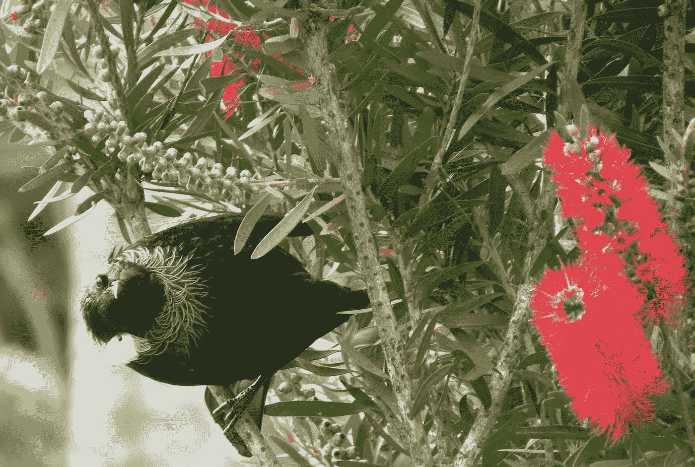
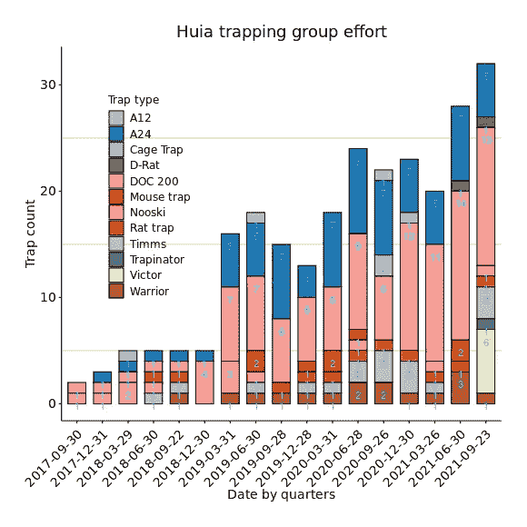
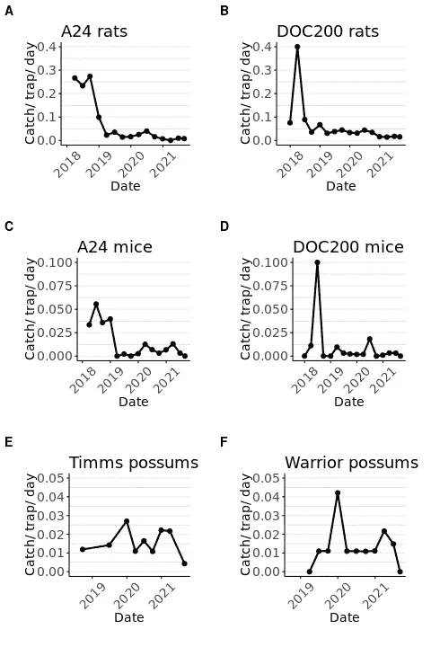
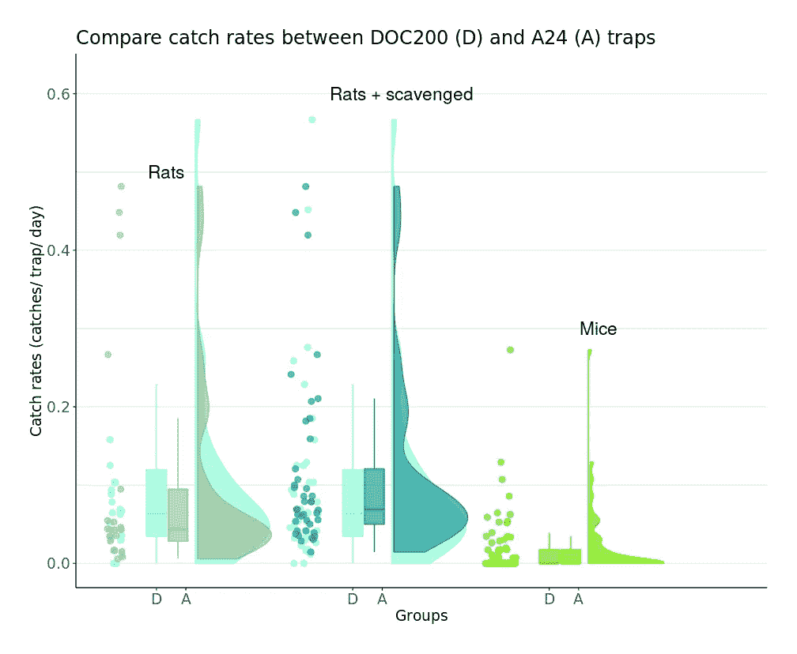

# 邻居陷阱有效吗？

> 原文：<https://towardsdatascience.com/does-neighbourhood-trapping-work-18c8d8deb92c?source=collection_archive---------19----------------------->

## 你怎么知道？



澳大利亚瓶刷中的新西兰 tui。作者照片。

许多新西兰人每周至少一次，甚至更频繁地在他们的社区诱捕线工作。这包括参观一系列为啮齿动物、刺猬、鼬鼠或负鼠设置的陷阱，看看是否有新的猎物。他们这样做是作为一种社区服务，帮助新西兰摆脱外来的破坏本地动植物的哺乳动物掠食者。他们的努力现在包括在一项由政府资助的名为[Predator Free New Zealand 2050](https://blog.doc.govt.nz/2017/07/25/predator-free-2050-one-year-on/)的特别倡议中(参见“[改善鸟类的世界](/improving-the-world-for-birds-3ab0ecbdbe21)”及其参考文献)。

一个重要的问题是这些邻里诱捕努力的效果如何？尽管许多社区组织向数据库如[陷阱提供公民科学数据。NZ](https://trap.nz/find-projects) 和 [CatchIT](https://www.stat.auckland.ac.nz/~fewster/CatchIT/) ，似乎对公民科学数据集的科学分析相对较少。在这篇文章中，我研究了新西兰奥克兰西部 Waitakere Ranges 区域公园所包围的 Huia 社区诱捕组的数据。威塔克里有许多诱捕的努力(见[无捕食者威塔克里牧场联盟](https://www.pfwra.org.nz))。我们的社区努力，Huia 诱捕组开始于四年前，在撰写本文时提供了超过 1100 个捕食者的数据。

## 邻域诱捕努力

在这篇文章中，我首先从陷阱部署的数量和陷阱设置的类型方面研究了我们的邻居陷阱是如何演变的。在过去的四年里，Huia 的邻居诱捕工作大大增加了(图 1)。努力从 2018 年任何给定季度部署的 2 到 5 个陷阱增加到 2021 年部署的 30 多个陷阱。随着时间的推移，陷阱的多样性也在增加。我们最常用的捕鼠器是传统的 DOC200 和自动 A24 捕鼠器，目标是老鼠和刺猬。今年我们增加了捕鼠夹和捕鼠夹。我们还有针对负鼠的 Timms、Warrior 和 Trapinator 陷阱。



图 1:过去四年在怀塔克里山脉的 Huia 的诱捕努力。图例中显示了所用的陷阱类型。A24、DOC200 D-Rat、Victor 和 Rat 捕鼠器捕捉大白鼠和小白鼠，捕鼠器和 nooski 捕鼠器捕捉小白鼠，而 Timms、Warrior 和 Trapinator 捕鼠器则捕杀刷尾负鼠。在标记日期结束的 3 个月期间内，对部署的至少捕获一次的陷阱进行计数。在一个季度内没有捕获任何东西的陷阱不包括在内，这是陷阱的一个限制。新西兰公民科学记录。(作者配图)

## 邻域陷印的有效性

随着努力的增加，将部署的陷阱数量纳入任何捕获率分析中是很重要的。我们还需要根据陷阱类型、目标动物和陷阱位置对数据进行分层。这是因为陷阱类型、动物行为和不同邻居的栖息地之间的差异可能会使分析结果产生偏差。我们缺乏关于有多少次陷阱没有捕捉到猎物，有多少次陷阱被检查后发现是空的，或者有多少次捕食者接近但没有与陷阱接触的数据。

这些限制使得不可能从公民科学数据中计算陷阱效率或遭遇概率。虽然其他对照研究解决了这些问题，但一些公民科学陷阱数据的优势在于它们跨越了更长的时间段。

我按陷阱类型检查了渔获量的时间趋势，以确定渔获量是否随时间而变化。在这个分析中，我假设捕获率的变化反映了目标动物当地密度的变化。如果捕获率最初很高，然后急剧下降，我们可以推断诱捕正在减少附近捕食者的数量。

通过计算捕获率，我们可以确定我们的邻居诱捕努力是否有效果。两种最常见的捕鼠器(DOC200s 和 A24s)的捕鼠率在捕鼠活动的第一年达到峰值(图 2)。2018 年后，捕获率下降，并围绕更低的值波动(图 2)。这表明诱捕在第一年降低了大鼠和小鼠的数量(图 2)，随后随着我们诱捕努力的增加，数量仍然受到抑制(图 1)。我们还可以看到，A24 捕鼠器对大鼠的初始捕获率几乎比小鼠高一个数量级(图 2A & C)。大鼠的 DOC200 捕获率最初约为小鼠的四倍(图 2B 和 D)。



图 2:近四年来怀塔克里山脉 Huia 的大鼠、小鼠和刷尾负鼠的捕获率，说明在更积极的诱捕的第一年，大鼠和小鼠被击倒。A24 是 Goodnature A24 自动捕集阱，DOC200 是传统的盒装 snap 捕集阱。提姆是装在地上的，战士是装在树上的负鼠陷阱。(作者配图)

对于负鼠，我们没有观察到同样的击倒效果(图 2E 和 F)。负鼠的捕获率低于大白鼠或小白鼠，而且在使用捕鼠器的第一年也没有出现高峰。这可能与负鼠的地盘性有关。雄性比雌性活动范围更广，负鼠可能需要长达 8 周或更长时间才能重新占据先前居住者被困的栖息地。

## 比较传统陷阱和自动陷阱的捕获率

新技术有可能减少检查陷阱和更换诱饵的劳动。我们最常用的两种捕集阱是传统的 [DOC200](https://www.doc.govt.nz/documents/conservation/threats-and-impacts/animal-pests/doc200-predator-trap.pdf) 盒式捕捉阱和 [Goodnature A24](https://youtu.be/zlTHmSVW94I) 自动捕集阱。在一个一周检查几次陷阱的社区环境中，自动陷阱的捕获率是否高于 DOC200 等传统陷阱？或者，有证据表明自动陷阱不如传统陷阱有效吗？

我使用简单的探索性数据分析比较了 DOC200 和 A24 陷阱的捕获率。图 3 显示了散点图、箱线图和每种诱捕器的捕获率分布图，将大鼠和小鼠的捕获情况分开。数据来自单个相邻属性，以减少空间可变性。当没有发现尸体时，拾到的渔获记录了自动 A24 陷阱的攻击。这通常意味着在检查捕鼠器之前，捕获物被猫或老鼠移走了。

两种陷阱类型的捕获率非常相似(图 3)。这两种陷阱类型的数据是高度倾斜的，因为在某些月份捕获率要高得多。这在老鼠身上比在老鼠身上更明显。两种陷阱类型的中值(方框图中的水平线)非常接近，DOC200 和 A24 陷阱的四分位数范围(方框)重叠。我们没有发现自动 A24 捕集阱比传统 DOC200 捕集阱更有效或更无效的证据。这些发现表明，自动陷阱的好处可能主要来自这样一个事实，即它们不需要经常检查，减少了所涉及的劳动。



图 3:两种不同类型的捕鼠器(A24 为 Goodnature A24 自动捕鼠器，DOC200 为传统的盒装 snap 捕鼠器)对大鼠和小鼠的捕获率的比较。(作者配图)

人们可能不愿意采用新技术，并怀疑新方法行不通。A24 捕集阱的价格也是 DOC200s 的三倍左右。不经常检查陷阱的代价是，猎物更有可能被另一个捕食者吃掉，比如家猫或野猫、白鼬或另一只老鼠。节省劳动力的好处在一定程度上被降低的信心所抵消，因为人们对捕获是真实的，而不仅仅是不准确的捕杀计数器的人工制品。诱捕器的成本也是一个考虑因素，特别是对于邻里诱捕来说，劳动是自愿的，因此不需要成本，而昂贵的诱捕器的成本由邻居承担。

## 结论

我们可以回答“邻居陷阱有效吗？”，至少在我们的 Huia 附近。第二个问题的答案；“我们怎么会知道？”对像 [Trap 这样的数据库中的公民科学数据的分析。NZ](https://trap.nz) 或 [CatchIT](https://www.stat.auckland.ac.nz/~fewster/CatchIT/#tryitout) 可以提供证据。

从这种对单个诱捕组的有限分析中，证据表明我们的邻居诱捕对大鼠和小鼠的捕获率有影响，并由此推断对大鼠和小鼠的局部密度有影响。如果没有将数据输入数据库的捕捉器所提供的数据，这将很难检测到。另一种监测方法是使用鸟鸣监测器(见我的 [TDS 文章](/dawn-chorus-morepork-owls-and-predator-control-107e5ca38fd))，但这也需要公民科学家的努力。

邻里诱捕的另一个好处是社区为了一个共同的合作目标而参与进来。我们维护一个邮件列表，用于更新和信息传播给所有诱捕组成员。我们还有一个面向最活跃成员的 WhatsApp 群组，人们可以在这里提问并分享他们的经验。这是获得帮助的好方法，也有助于保持动力。你还可以了解你的邻居，加强合作。

## 密码

数据从[陷阱中导出。作为 ascii 文件的 Huia 补漏白组](https://trap.nz/node/1106292)的 NZ 站点。使用 [R tidyverse](https://trap.nz/node/1106292) 包，数据文件被导入，字符日期被转换为类日期，变量被排序、选择和重命名，随后的数据帧被转换为时间表。

```
## import_trapnz_function.R
# Usage:  
# source the function
# trapnz <- import.trapnz()# Note: Data were exported from Trap.NZ using menus: Reports/ Trap reports/ Trap records for the full date rangeimport.trapnz <-
  function(data.dir = "/mnt/data/dynamic_data/projects/projects2021/trapping/data/",
           exported.file = "TrapNZ_export_29_Sept_2021.csv")
  {
   # load libraries
    library(tidyverse)
    library(tibbletime)
    library(lubridate)
    library(readr)
    library(tidyr)
    # load exported trap.nz data
    dat <- paste(data.dir, exported.file, sep = "")
    trapnz <- read_csv(dat)
    # convert character date to a date object
    trapnz <- mutate (trapnz,
                       Date.new = as.Date(Date, format = "%d %b %Y - %H:%M"))
    # order, select and rename variables
    trapnz <- arrange(trapnz, Date.new, "Recorded by", Trap)
    trapnz <- trapnz %>%
      select(Date.new, "Recorded by", Trap, "Trap type", Strikes, "Species caught")
    colnames(trapnz) <-
      list("date.new", "line", "trap", "traptype", "strikes", "species")
    # convert tibble to tibble time
    trapnz <- as_tbl_time(trapnz, index = date.new)
    # print some summary info
    print("########################")
    print(paste("Directory: ", data.dir))
    print(paste("Exported Trap.NZ file: ", exported.file))
    # print(head(trapnz))
    # print(tail(trapnz))
    trapnz
  }
```

我用下面的代码准备了数据(prepare _ TrapNZ _ catch _ and _ traptype _ data。r)。加载库之后，使用上面的函数(import_trapnz_function)加载数据。r)，在使用 source()将其加载到环境中之后。根据[整理数据](https://tidyr.tidyverse.org)的原则，从物种特征变量中创建新变量。自动捕鼠器的多次捕获，通常是在一个晚上杀死两只老鼠，是通过将捕获单位类别乘以攻击次数来计算的。在连续的季度(3 个月)期间，我按物种对捕获量求和，并计算每种类型的独特陷阱的数量。

```
## prepare_TrapNZ_catch_and_traptype_data.R# load libraries #################
library(tidyverse)
library(tibbletime)
library(lubridate)
library(readr)
library(tidyr)# load data ###########
### load, sort, subset trap.nz data
source(
  "/mnt/data/dynamic_data/projects/projects2021/trapping/r/import_trapnz_function.R"
)
trapnz <- import.trapnz()# create new variables for catches by species ################
series2 <- trapnz
series2 <- mutate (
  series2,
  # Date.new = as.Date(Date, format = "%d %b %Y - %H:%M"),
  rat_catch = ifelse (series2$species %in% c ("Rat", "Rat - Ship", "Rat - Norway"), 1, NA),
  mouse_catch = ifelse (series2$species == "Mouse", 1, 0),
  possum_catch = ifelse (series2$species == "Possum", 1, 0),
  hedgehog_catch = ifelse (series2$species == "Hedgehog", 1, 0),
  stoat_catch = ifelse (series2$species == "Stoat", 1, 0),
  scavenged_catch = ifelse (series2$species == "Unspecified", 1, 0)
)
# adjust for multiple catches by A24 traps
series2$rat_catch <- series2$rat_catch * series2$strikes
series2$mouse_catch <-  series2$mouse_catch * series2$strikes# quarterly summation of catches by species and number of unique traps
series2 <- arrange(series2, date.new, line, traptype, trap)# group catch data into time bins ########################
quarterly_catches <- collapse_by(series2, "quarter") %>%
  dplyr::group_by(date.new, traptype) %>%
  dplyr::summarise_if(is.numeric, sum, na.rm = TRUE)
quarterly_catches <- arrange(quarterly_catches, date.new, traptype)# group numbers of individual traps into time bins
quarterly_traptype <- collapse_by(series2, "quarter") %>%
  dplyr::group_by(date.new, traptype) %>%
  dplyr::summarise(trap_count = length(unique(trap)))
quarterly_traptype <- arrange(quarterly_traptype, date.new)# save the data  ####################
Huia_results = list(quarterly_catches,  quarterly_traptype)
save(Huia_results, file = "/mnt/data/dynamic_data/projects/projects2021/trapping/data/tidy_catch_traptype_TrapNZ.dat")
```

使用下面的代码(trapping _ effort _ over _ time _ stacked _ bar plot)将这些数据用于创建图 1。r)。加载库之后，我使用了几个主题选项来改善情节。上面的代码保存的数据(prepare _ TrapNZ _ catch _ and _ traptype _ data。r)已加载。然后，我使用 ggplot 绘制了一个堆积条形图，为分类数据手动指定了调色板，调整显示以显示倾斜的 x 轴标签，并显示每个堆积条形图段中陷阱数量的计数。

```
### trapping_effort_over_time_stacked_barplot.R# libraries #######
library(tidyverse)
library(tibbletime)
library(lubridate)
library(gridExtra)
library(ggpubr)
library(RColorBrewer)
library(colorspace)
# custom theme settings ##########
theme_smcc <- function() {
  # theme_bw() +
  theme(
    text = element_text(family = "Helvetica Light"),
    axis.text = element_text(size = 14),
    axis.title = element_text(size = 14),
    axis.line.x = element_line(color = "black"),
    axis.line.y = element_line(color = "black"),
    panel.border = element_blank(),
    panel.grid.major.x = element_blank(),
    panel.grid.minor.x = element_blank(),
    panel.grid.minor.y = element_line(colour = "grey80"),
    plot.margin = unit(c(1, 1, 1, 1), units = , "cm"),
    plot.title = element_text(
      size = 18,
      vjust = 1,
      hjust = 0.5
    ),
    legend.text = element_text(size = 12),
    legend.position = c(0.2, 0.6),
    legend.key = element_blank(),
    legend.background = element_rect(
      color = "black",
      fill = "transparent",
      size = 2,
      linetype = "blank"
    )
  )
}theme_angle_xaxis <- function() {
  theme(axis.text.x = element_text(
    angle = 45,
    hjust = 1,
    vjust = 0.95
  ))
}# load data ###################
load(file = "/mnt/data/dynamic_data/projects/projects2021/trapping/data/tidy_catch_traptype_TrapNZ.dat")quarterly_trap_type <- as.data.frame(Huia_results[2])
quarterly_trap_type <- arrange(traps, date.new, trap_count)# plot ###############
png(
  "/mnt/data/dynamic_data/projects/projects2021/trapping/figures/trapping_effort_over_time_stacked_barplot.png",
  width = 580,
  height = 580
)quarterly_trap_type$date_char <-
  as.character(quarterly_trap_type$date.new) # to allow bar width adjustmentmypalette <- brewer.pal(12, "Paired")
legend_title = "Trap type"trapping_effort_over_time_stacked_barplot <-
  ggbarplot(
    data = quarterly_trap_type,
    x = "date_char",
    xlab = "Date by quarters",
    y = "trap_count",
    ylab = "Trap count",
    label = TRUE,
    lab.pos = "in",
    lab.col = "cyan1",
    fill = "traptype",
    title = "Huia trapping group effort"
  ) +
  scale_fill_manual(legend_title, values = mypalette) +
  theme_smcc() +
  # x-axis adjustment
  theme_angle_xaxis()# save the plot
print(trapping_effort_over_time_stacked_barplot)
dev.off()
```

图 2 中按陷阱类型和物种分列的捕获率时间序列如下。上面的代码保存的数据(prepare _ TrapNZ _ catch _ and _ traptype _ data。r)已加载。为了节省空间，我将加载库的代码段和之前显示的自定义主题折叠起来。在按渔获量/诱捕器/天计算渔获量比率之前，按诱捕器类型过滤季度渔获量和诱捕器数量。然后，在将它们组合成面板图之前，创建了六个单独的图。

```
## explore_multiple_catches.R# load libraries #######
...# custom theme settings #############
...# load data ###################
load(file = "/mnt/data/dynamic_data/projects/projects2021/trapping/data/tidy_catch_traptype_TrapNZ.dat")catches <- as.data.frame(Huia_results[1])
catches <- arrange(catches, date.new, traptype)traps <- as.data.frame(Huia_results[2])
traps <- arrange(traps, date.new, trap_count)# traps ######################
# filter by trap type
# A24
catches_a24 <- filter(catches, traptype == "A24")
traps_a24 <- filter(traps, traptype == "A24")catches_and_traps_a24 <-
  select(catches_a24, c(date.new, traptype, rat_catch, mouse_catch))interval <- c(NA, diff(catches_and_traps_a24$date.new))catches_and_traps_a24 <- mutate(
  catches_and_traps_a24,
  trap_count = traps_a24$trap_count,
  .after = traptype,
  rat_catch_rate = rat_catch / trap_count / interval,
  mouse_catch_rate = mouse_catch / trap_count / interval
)
head(catches_and_traps_a24)# DOC200
catches_doc200 <- filter(catches, traptype == "DOC 200")
traps_doc200 <- filter(traps, traptype == "DOC 200")catches_and_traps_doc200 <-
  select(catches_doc200, c(date.new, traptype, rat_catch, mouse_catch))interval <- c(NA, diff(catches_and_traps_doc200$date.new))catches_and_traps_doc200 <- mutate(
  catches_and_traps_doc200,
  trap_count = traps_doc200$trap_count,
  .after = traptype,
  rat_catch_rate = rat_catch / trap_count / interval,
  mouse_catch_rate = mouse_catch / trap_count / interval
)# Mouse trap
catches_mouse_trap <- filter(catches, traptype == "Mouse trap")
traps_mouse_trap <- filter(traps, traptype == "Mouse trap")catches_and_traps_mouse_trap <-
  select(catches_mouse_trap, c(date.new, traptype, mouse_catch))interval <- c(NA, diff(catches_and_traps_mouse_trap$date.new))catches_and_traps_mouse_trap <-  mutate(
  catches_and_traps_mouse_trap,
  trap_count = traps_mouse_trap$trap_count,
  .after = traptype,
  mouse_catch_rate = mouse_catch / trap_count / interval
)# Timms trap
catches_timms_trap <- filter(catches, traptype == "Timms")
traps_timms_trap <- filter(traps, traptype == "Timms")catches_and_traps_timms_trap <-
  select(catches_timms_trap, c(date.new, traptype, possum_catch))interval <- c(NA, diff(catches_and_traps_timms_trap$date.new))catches_and_traps_timms_trap <- mutate(
  catches_and_traps_timms_trap,
  trap_count = traps_timms_trap$trap_count,
  .after = traptype,
  possum_catch_rate = possum_catch / trap_count / interval
)# Warrior trap
catches_warrior_trap <- filter(catches, traptype == "Warrior")
traps_warrior_trap <- filter(traps, traptype == "Warrior")catches_and_traps_warrior_trap <-
  select(catches_warrior_trap, c(date.new, traptype, possum_catch))interval <- c(NA, diff(catches_and_traps_warrior_trap$date.new))catches_and_traps_warrior_trap <-
  mutate(
    catches_and_traps_warrior_trap,
    trap_count = traps_warrior_trap$trap_count,
    .after = traptype,
    possum_catch_rate = possum_catch / trap_count / interval
  )# plots ############################
png(
  "/mnt/data/dynamic_data/projects/projects2021/trapping/figures/explore_multiple_catches.png",
  width = 480,
  height = 720,
)a24_rats <-
  ggline(
    catches_and_traps_a24,
    x = "date.new",
    y = "rat_catch_rate",
    title = "A24 rats",
    size = 1,
    # add = "loess",
    conf.int = TRUE,
    xlab = "Date",
    ylab = "Catch/ trap/ day"
  ) +
  theme_smcc() +
  theme(axis.text.x = element_text(
    angle = 45,
    hjust = 0.5,
    vjust = 0.5
  ))
a24_rats <- ggpar(a24_rats, ylim = c(0, 0.4))doc200_rats <-
  ggline(
    catches_and_traps_doc200,
    x = "date.new",
    y = "rat_catch_rate",
    title = "DOC200 rats",
    size = 1,
    # add = "loess",
    conf.int = TRUE,
    xlab = "Date",
    ylab = "Catch/ trap/ day"
  ) +
  theme_smcc() +
  theme(axis.text.x = element_text(
    angle = 45,
    hjust = 0.5,
    vjust = 0.5
  ))
doc200_rats <- ggpar(doc200_rats, ylim = c(0, 0.4))a24_mouse <-
  ggline(
    catches_and_traps_a24,
    x = "date.new",
    y = "mouse_catch_rate",
    title = "A24 mice",
    size = 1,
    # add = "loess",
    conf.int = TRUE,
    xlab = "Date",
    ylab = "Catch/ trap/ day"
  ) +
  theme_smcc() +
  theme(axis.text.x = element_text(
    angle = 45,
    hjust = 0.5,
    vjust = 0.5
  ))
a24_mouse <- ggpar(a24_mouse, ylim = c(0, 0.1))doc200_mouse <-
  ggline(
    catches_and_traps_doc200,
    x = "date.new",
    y = "mouse_catch_rate",
    title = "DOC200 mice",
    size = 1,
    # add = "loess",
    conf.int = TRUE,
    xlab = "Date",
    ylab = "Catch/ trap/ day"
  ) +
  theme_smcc() +
  theme(axis.text.x = element_text(
    angle = 45,
    hjust = 0.5,
    vjust = 0.5
  ))
doc200_mouse <- ggpar(doc200_mouse, ylim = c(0, 0.1))timms_possum <-
  ggline(
    catches_and_traps_timms_trap,
    x = "date.new",
    y = "possum_catch_rate",
    title = "Timms possums",
    size = 1,
    # add = "loess",
    conf.int = TRUE,
    xlab = "Date",
    ylab = "Catch/ trap/ day"
  ) +
  theme_smcc() +
  theme(axis.text.x = element_text(
    angle = 45,
    hjust = 0.5,
    vjust = 0.5
  ))
timms_possum <- ggpar(timms_possum, ylim = c(0, 0.05))warrior_possum <-
  ggline(
    catches_and_traps_warrior_trap,
    x = "date.new",
    y = "possum_catch_rate",
    title = "Warrior possums",
    size = 1,
    # add = "loess",
    conf.int = TRUE,
    xlab = "Date",
    ylab = "Catch/ trap/ day"
  ) +
  theme_smcc() +
  theme(axis.text.x = element_text(
    angle = 45,
    hjust = 0.5,
    vjust = 0.5
  ))
warrior_possum <- ggpar(warrior_possum, ylim = c(0, 0.05))# panel plot
explore_multiple_catches <-
  ggarrange(
    a24_rats,
    doc200_rats,
    a24_mouse,
    doc200_mouse,
    timms_possum,
    warrior_possum,
    labels = c("A", "B", "C", "D", "E", "F"),
    ncol = 2,
    nrow = 3
  )print(explore_multiple_catches)
dev.off()
```

对于最后一个图，数据准备涉及已经包括的内容，例如加载数据，按陷阱类型子集化以选择 A24 和 DOC200 陷阱，以及在本例中按月而不是按季度对捕获量进行分组。唯一新颖的部分是为[雨云情节](https://www.cedricscherer.com/2021/06/06/visualizing-distributions-with-raincloud-plots-and-how-to-create-them-with-ggplot2/)创建阵列。

```
# # prepare data format for raincloud plot (packing doc200 arrays to match A24 length)
df_plot <- data_2x2(
  array_1 = c(gdata_doc200$rat_catch_eff, NA, NA, NA),
  array_2 = gdata_a24$rat_catch_eff,
  array_3 = c(gdata_doc200$rats_plus_scavenged_catch_eff, NA, NA, NA),
  array_4 = gdata_a24$rats_plus_scavenged_catch_eff,
  array_5 = c(gdata_doc200$mouse_catch_eff, NA, NA, NA),
  array_6 = gdata_a24$mouse_catch_eff,
  labels = c("DOC200", "A24"),
  jit_distance = 0.075,
  jit_seed = 321,
  spread_x_ticks = TRUE
)# save the data for raincloud plot
save(df_plot, file = "/mnt/data/dynamic_data/projects/projects2021/trapping/data/tidy_catch_raincloud.dat")
```

图 3 中的 raincloud 是使用之前保存的数据通过这段代码创建的。

```
## compare_catch_rates_A24_DOC200_by_raincloud.R# load libraries
library(tidyverse)
library(tibbletime)
library(lubridate)
library(gridExtra)
library(ggthemes)
library(ggpubr)
library(ggrepel)
library(readr)
library(raincloudplots)# custom theme settings
...# load saved tidy_catch_raincloud data
load(file = "/mnt/data/dynamic_data/projects/projects2021/trapping/data/tidy_catch_raincloud.dat")# raincloud plots
# colours
col1 = "aquamarine"
col2 = "darkseagreen"
col3 = "darkcyan"
col4 = "chartreuse3"
col5 = "chartreuse"plot_catches <- raincloud_2x3_repmes(
  data = df_plot,
  colors = (c(col1, col2, col1, col3, col4, col5)),
  fills = (c(col1, col2, col1, col3, col4, col5)),
  size = 2.5,
  # data dot size
  # line_alpha = 0, # make lines fully transparent
  alpha = 0.6  # transparency
  ) +
  scale_x_continuous(
    breaks = c(1.25, 1.4, 2.25, 2.4, 3.25, 3.4),
    labels = c("D", "A", "D", "A", "D", "A"),
    # labels = c("DOCC200", "A24", "DOCC200", "A24", "DOCC200", "A24"),
    limits = c(1, 4.2)
  ) +
  # scale_y_continuous() +
  scale_y_continuous(limits = c(0, 0.62)) +
  xlab("Groups") +
  ylab("Catch rates (catches/ trap/ day)") +
  labs(title = "Compare catch rates between DOC200 (D) and A24 (A) traps") +annotate(geom = "text", 
           label = "Rats", 
           x = 1.3, y = 0.5,
           size = 6) + 

  annotate(geom = "text", 
           label = "Rats + scavenged", 
           x = 2.5, y = 0.6,
           size = 6) + 

  annotate(geom = "text", 
           label = "Mice", 
           x = 3.5, y = 0.3,
           size = 6) + 

theme_smcc()plot_catches
```

## 下载访问

代码、数据和图表都可以通过这个[共享链接](http://u.pc.cd/fAmctalK)下载。