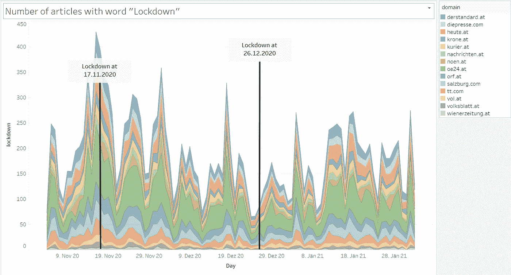
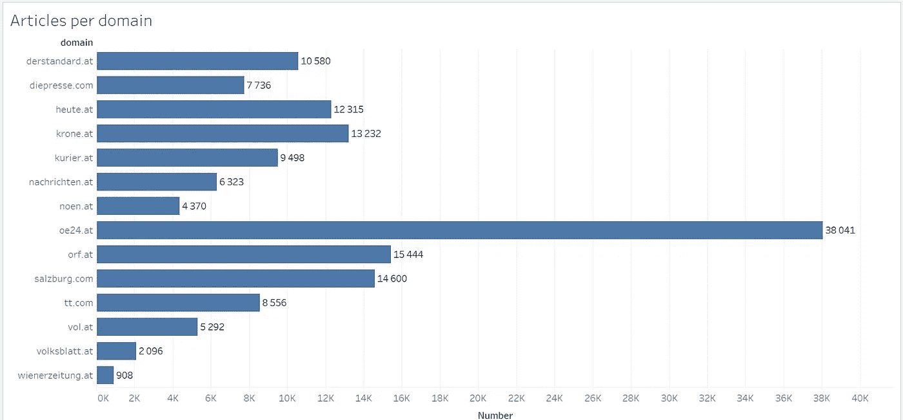
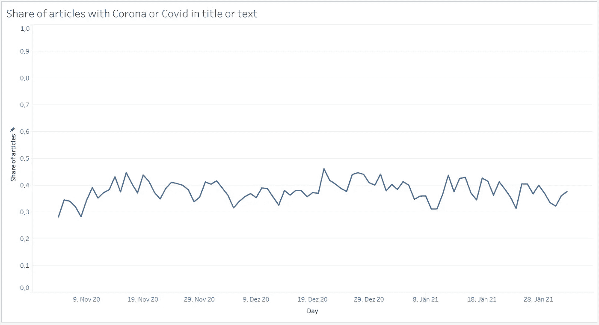
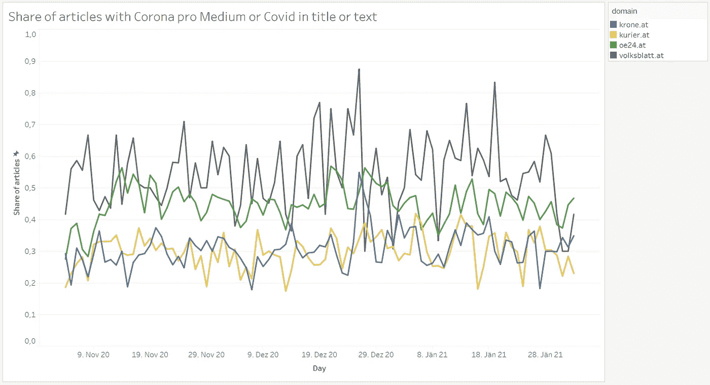
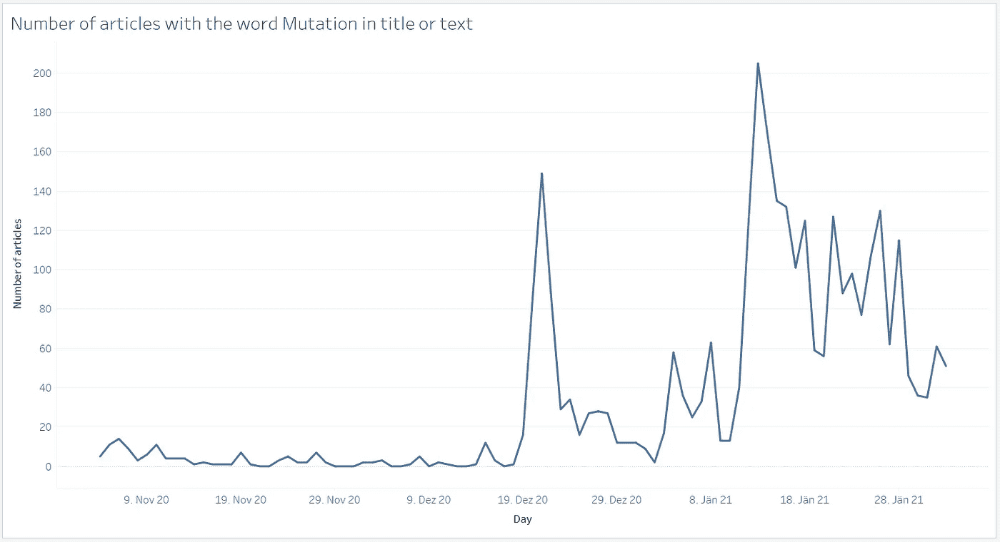
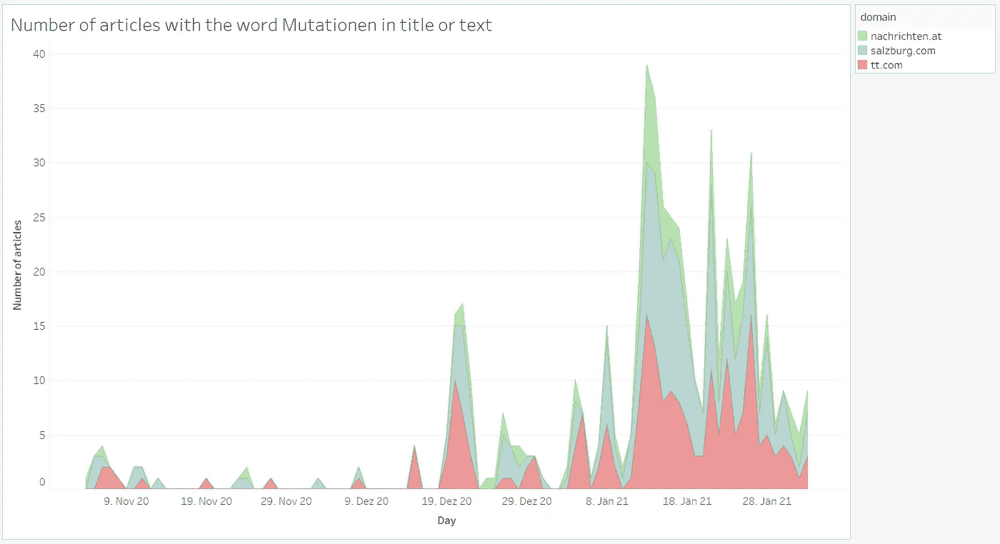
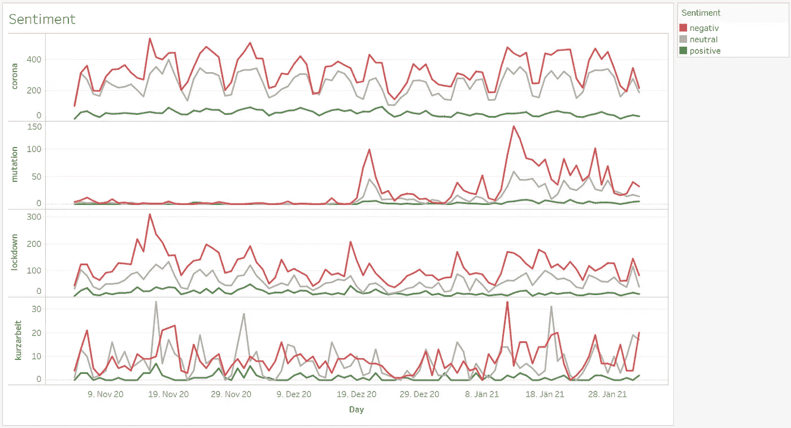

# 媒体现在只报道 COVID19 疫情了吗？

> 原文：<https://towardsdatascience.com/does-the-media-only-report-about-the-covid19-pandemic-anymore-84b219408138?source=collection_archive---------33----------------------->

## 奥地利在线新闻报道的数据分析

过去三个月的报道/作者提供的图片

由于 COVID19 疫情的广泛报道，很容易让人产生没有其他报道的印象。在这篇文章中，我想在数据的基础上检验这种主观印象是否符合现实。我还将看看不同主题的报道在过去几个月里是如何发展的。还将讨论区域差异和新闻报道的基调，即新闻报道是积极的还是消极的。

## 数据

为了进行分析，我收集并评估了 2020 年 11 月 4 日至 2021 年 2 月 2 日奥地利媒体在线发表的总共 148，991 篇文章。

考虑了来自以下媒体的文章:
-ORF/[http://ORF . at](http://orf.at)
-泰洛勒日报/【http://tt.com】
-上奥地利新闻/[http://nachrichten . at](http://nachrichten.at)
-下奥地利新闻/[http://noen . at](http://noen.at)
-福拉尔贝格在线/ [http://vol.at](http://vol.at)
-斯特赖希 [http://diepresse.com](http://diepresse.com)
-Kronen Zeitung/[http://krone . at](http://krone.at)
-Der Standard/[http://Der Standard . at](http://derstandard.at)
-Heute/[http://Heute . at](http://heute.at)
-Neues Volksblatt/[https://Volksblatt . at](https://volksblatt.at)
-维纳 Zeitung/[http://t](http://wienerzeitung.at)

这几乎完整地描述了奥地利媒体在日常新闻方面的情况。(不幸的是，我无法获得“Kleine Zeitung”/[的数据。](http://kleine-zeitung.at)

## 分析

每篇文章的标题、出版文本和出版商都与出版日期一起存储。我的数据集中的文章数量在发布服务器之间的分布如下:

按作者列出的每个出版商/图片的文章数量

文章搜索了与疫情报道相关的特定关键词。例如，术语“covid”、“corona”以及“kurzarbeit”、“lockdown”和“mutation”这些帖子还接受了[情绪分析](https://de.wikipedia.org/wiki/Sentiment_Detection)，并注明是正面、中立还是负面的报道。

## “corona”或“covid”这两个词在文章中出现的比例是多少？

如果我们观察文本中至少有两个关键词之一的文章的比例，在每种情况下按天进行总结，并绘制在时间轴上，当我们总结所有媒体时，会出现下面的图片。

一段时间内“covid”文章的百分比/按作者分类的图片

因此，在整个期间，大约 30-40%的报告是关于这个主题的。这证实了人们的印象，即“只有”关于疫情的报道，虽然不是字面上的，但已经是非常大的比例了。这在整个 3 个月的时间里几乎是不变的。

关于出版商的分歧呢？

一些出版商的“covid”文章百分比/按作者分类的图片

这里已经存在明显的差异，oe24 .几乎达到 50%,“Volksblatt”甚至远高于此，而“Krone”和“Kurier”仅达到 30%或更低。

## “突变”的存在呢？

为了做到这一点，我们查看了文本中带有“突变”一词的文章的绝对数量，并绘制了时间图。

一段时间内带有“突变”一词的文章数量/作者图片

这个话题在圣诞节前突然出现在新闻中，然后在一段时间内又显著下降。它从一月中旬开始回升，并一直伴随着我们。如果我们单独看一下地方报纸上的报道，就会发现一个更加不同的画面。

某些出版商的带有“突变”一词的文章数量/按作者分类的图片

在圣诞节，这个话题已经在西方报纸《泰洛勒日报》和《萨尔茨堡新闻报》上出现。在上奥地利(“nachrichten.at”)，要到 1 月中旬。这表明了“东西方的分歧”。

## 关于封锁的问题呢？

下图显示了出现“锁定”一词的文章的绝对数量，按来源分列。

一段时间内带有“锁定”一词的文章数量/作者图片

可以看出，在第一次封锁的当天，在报告中也有一个明显的“峰值”。圣诞节假期后开始的封锁没有显示出明显的高峰。然而，总的来说，该主题以某一周为周期贯穿整个时期。在每种情况下，“OE24.at”(绿色)对峰有很大贡献。

## 文章的调性(情调)怎么样？

在疫情的主题领域，人们会期待负面的报道。让我们用数字来看整个事情，并且也根据不同的术语来分解时间过程。

作者对不同术语/图像的文章的情感

该图显示了包含相应术语的文章数量的时间顺序，并按音调进行了分解。关于这些话题的正面文章数量之少令人吃惊，这是可以理解的。特别是，关于“突变”和“锁定”的文章主要带有负面情绪。其他两个术语至少有与负面新闻几乎相似的中性报道比例。

该分析通过具体数字表达了我们在日常新闻消费中的感受，其中很大一部分涉及疫情，而且大多带有负面语气。然而，我们也可以看到一些不同的来源，主题领域和时间段。

## 我其他一些关于媒体报道的文章:

</what-information-is-hidden-in-online-news-articles-f5695eae38fd>  <https://medium.com/datadriveninvestor/topics-in-online-news-before-the-austrian-elections-2019-d981facbd0dd>  <https://medium.com/datadriveninvestor/on-the-media-coverage-of-political-parties-e1b1933f0810>  <https://medium.com/datadriveninvestor/newstrace-a-method-to-analyze-the-impact-of-news-articles-on-stock-prices-2e866c16a9f> 