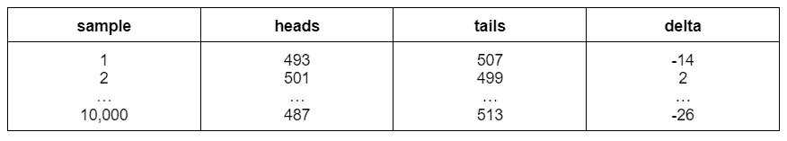
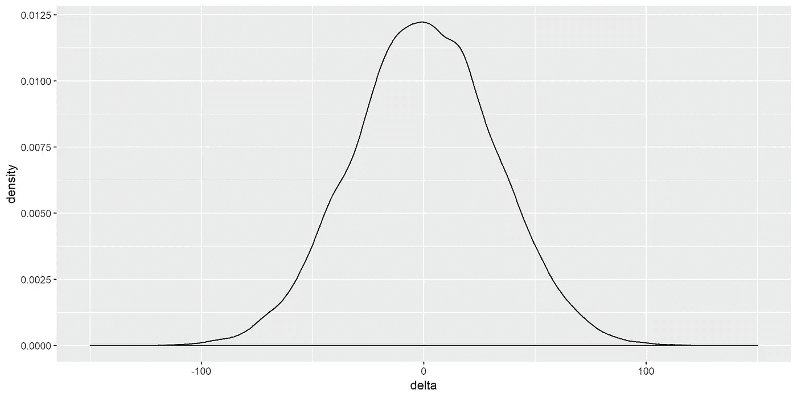
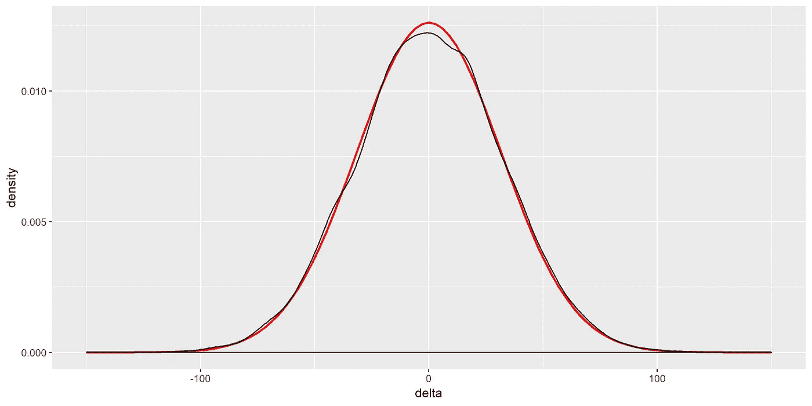
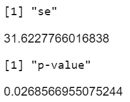
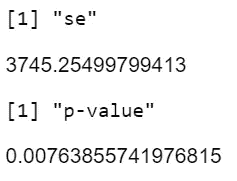

# 你的 A/B 考试是否遭遇了分配失衡？

> 原文：<https://towardsdatascience.com/does-your-a-b-test-have-an-assignment-bias-8b2a5a83b817?source=collection_archive---------9----------------------->

来源:https://burst.shopify.com/photos/scales-of-justice?q=scale

最近，我的团队进行了一项实验来测试一种新产品推荐算法的性能。在收集了几周的数据后，看起来我们的新算法获得了巨大的成功；这个实验将我们的主要成功指标(每个用户的订单数)提高了 3%。这相当于我们团队在整个上半场的目标*。*

这些结果好得令人难以置信。我们正要在每周实验回顾中宣布这些结果的成功，这时我们决定暂停一下，再一次检查实验的基本原理。下面是我们看到的关于用户分配的情况:

*   控制:7，018，463 个用户
*   待遇:7 008 472 名用户

与对照组相比，处理组(新产品推荐算法)分配的用户少了 9，991 个。所以我们开始回答两个问题:

## 1.这种差异可以用随机抽样变异来解释吗？

## 2.如果不是，是什么导致了偏差？

# 观察到的差异可以用随机抽样变异来解释吗？

这个问题相当于[检查一个硬币是否公平](https://en.wikipedia.org/wiki/Checking_whether_a_coin_is_fair)。考虑以下场景——我们投掷硬币 1000 次，观察以下结果:

*   人头:465
*   反面:535

用一枚公平硬币观察到这个结果(相差-70)的概率是多少？我们可以通过构造一个抽样分布来回答这个问题。在 R 中，我们可以通过模拟创建这个分布:

这会产生以下结果:

并且采样分布简单地是增量值的密度图:

模拟分布

原来，标准误差( ***SE*** )由下式给出:

其中:

*   ***n****=每个样本的观察总数(1000)*
*   ****p*** =正面概率*

*代入这些值，我们得到 SE = 31.62。既然我们知道了如何计算 ***SE*** ，我们就可以不用模拟来重新创建抽样分布了。我们简单地构造一个均值= 0，标准差= 31.62 的正态分布:*

**

*计算分布(红色)与模拟分布(黑色)*

*回到我们的问题，如果我们掷一枚硬币 1000 次，那么观察到 465 次正面和 535 次反面的概率是多少？*

*如果我们将观察到的-70 的δ除以 ***SE*** ，那么我们可以利用标准正态分布来回答我们的问题，如下所示:*

*这产生了:*

**

*所以如果硬币是公平的，只有 2.69%的机会观察到这个结果。*

*类似地，回到我们最初的问题，给定 50/50 的实验分割，那么观察到的概率是多少:*

*   *控制:7，018，463 个用户*
*   *待遇:7 008 472 名用户*

*我们以同样的方式回答这个问题:*

*这产生了:*

**

*所以只有 0.76%的机会观察到这个结果，如果事实上实验任务是无偏的。*

## *是什么导致了这种偏见？*

*仅仅随机抽样的变化不可能解释观察到的用户分配的差异:*

*   *控制:7，018，463 个用户*
*   *待遇:7 008 472 名用户*

*我们将这一发现带给了设置实验的机器学习工程师，并要求他们重新检查分配标准。在深入研究代码之后，他们意识到偏见确实被引入了:*

*   *控制:所有登录的用户都被分配*
*   *处理:所有登录**并在过去 180 天**内至少有 2 个订单的用户都被分配*

*因此，治疗有一个额外的分配标准，意味着我们分配的用户比对照组少。此外，与对照组相比，被分配到治疗组的用户更有可能参与其中。因此，我们的主要成功指标(每用户订单数)显示，治疗组比对照组好得多。*

## *摘要*

*最后，我们简单地重新开始了实验，这次对两个变量使用了相同的赋值标准。我们现在也监控所有实验中作业数量的差异。使用本文概述的方法，您也可以做到！😃*