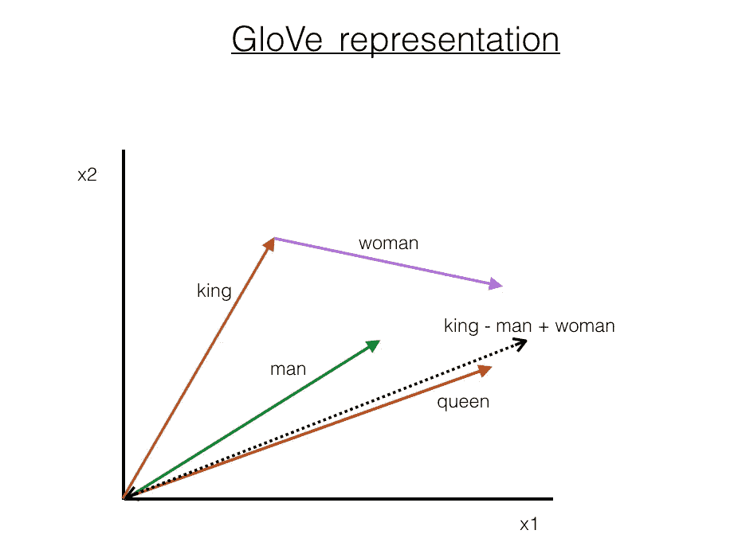
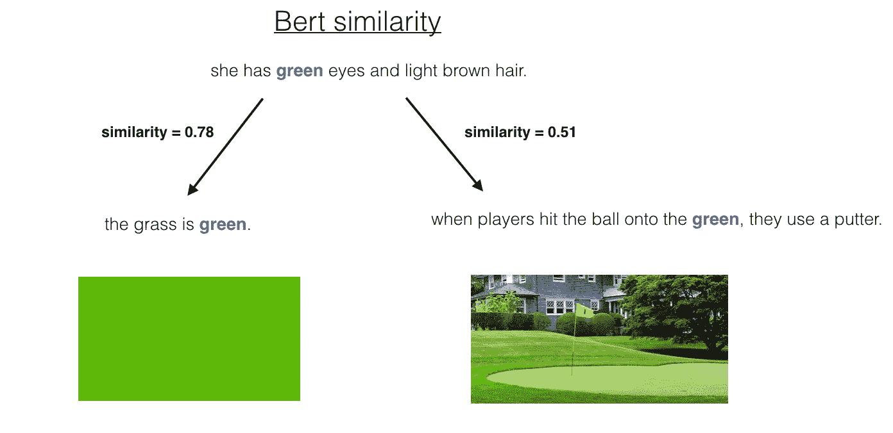
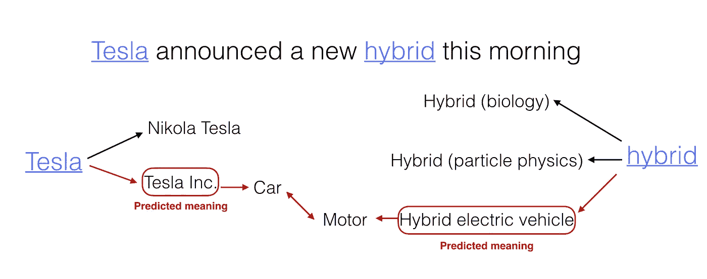
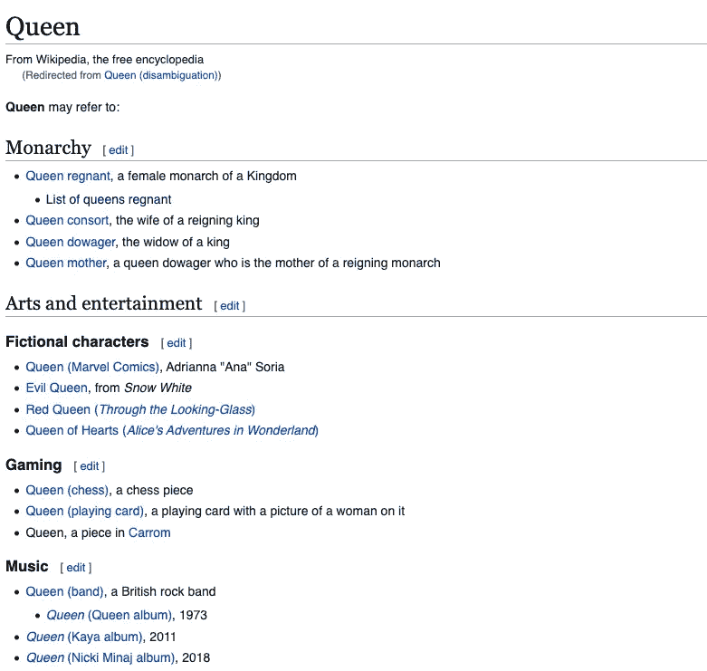
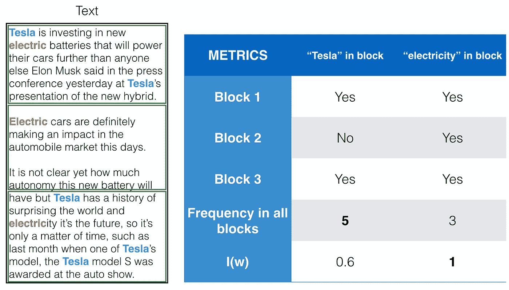
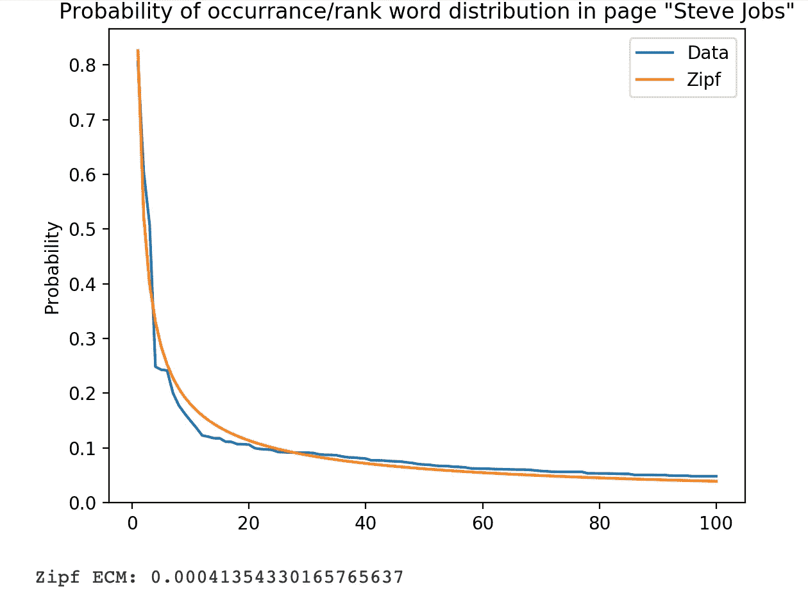
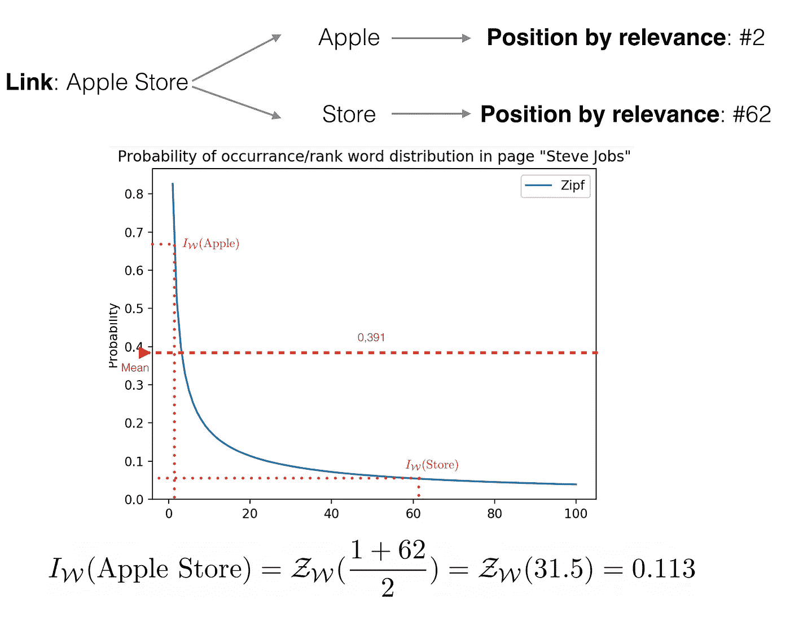

# 你的电脑理解你吗？

> 原文：<https://towardsdatascience.com/does-your-computer-understand-you-27620490dd35?source=collection_archive---------25----------------------->

## [思想和理论](https://towardsdatascience.com/tagged/thoughts-and-theory)

## 用上下文森林模型消除语言歧义

由[卢卡斯·范·奥尔特](https://unsplash.com/@switch_dtp_fotografie?utm_source=unsplash&utm_medium=referral&utm_content=creditCopyText)在 [Unsplash](https://unsplash.com/s/photos/tree-branches?utm_source=unsplash&utm_medium=referral&utm_content=creditCopyText) 上拍摄

对话中的消歧过程几乎和说话本身一样自然。在许多情况下，人类的语言会令人惊讶地含糊不清，然而我们却可以非常轻松地成功地相互交流，而不用特意去思考消除歧义的词语。在过去的五年里，科学界已经将计算语言学模型的能力推向了一个无人能想象的水平。然而，尽管现代计算机拥有强大的计算能力，但它们明白自己在说什么吗？

这篇文章解释了上下文森林背后的主要思想，这是我在我的学士论文期间开发的无监督语言消歧模型。该模型在 Python 中的实现可在 [Github](https://github.com/DanielGuzmanOlivares/ContextualForests) 上获得。

像许多其他 NLP(自然语言处理)模型一样，上下文森林在一个单词(即句子中的其他单词)的上下文可以完全确定其含义的假设下运行。考虑到本质上这是我们人类相互交流时所做的事情，这一假设似乎是合理的。

不幸的是，在许多情况下，即使使用最先进的技术，也很难弄清楚这种情况。这个困难存在于上下文所具有的基于知识的成分中；让我们用一个例子来说明这一点。考虑下面的句子:

“最佳女王歌曲重新定义了摇滚。”

现在让我们把注意力集中在*女王*和*摇滚*这两个词上。对于我们人类来说，如果熟悉 70 年代的摇滚，这是一个直截了当和几乎自动的过程，以承认我们在谈论英国摇滚乐队*皇后*和*摇滚*是一种音乐流派。相反，对于一个语言模型来说，这可能会呈现出一个复杂得多的情况，因为作为独立的单词， *Queen* 和 *rock* 可以指代相当多的不同事物(例如，一个女君主和一个固体矿物集合体)。

那么语言模型是如何处理这个问题的呢？其中一个关键点就是这些词一起出现在同一个句子里。从概率上来说，在例句中，我可能在谈论英国的女王伊丽莎白二世，但这似乎不太可能，因为我也在谈论由单词 rock 代表的一些概念，这些概念在统计上与女王伊丽莎白二世的上下文没有关联。

从这一点来看，很自然会想知道语言模型是如何分配这些概率和关联统计的。根据对这个问题的回答，我们可以将语言模型大致分为两种类型:

*   **上下文无关模型**，如 [Word2Vec](https://arxiv.org/pdf/1301.3781.pdf) 或 [GloVe](https://nlp.stanford.edu/pubs/glove.pdf) ，是基于在单词和向量之间创建 1:1 的映射(通常称为单词嵌入)。尽管实现中的细节可能不同，但该模型的总体思想在于在大型文本语料库上训练神经网络，以获得捕捉语义属性的表示。比如我们考虑向量 **k** 、 **w** 、 **m** 分别对应“王”、“女”、“男”三个词。那么向量**q**=(**k**—**m**)+**w**与赋给“皇后”这个词的向量非常接近。这些代数性质在许多 NLP 问题中是期望的，但是用这些模型解决 WSD(词义消歧)问题是复杂的，因为每个单词的嵌入是唯一的并且独立于上下文。

手套嵌入表示(图片由作者提供)

*   **像[埃尔莫](https://arxiv.org/pdf/1802.05365.pdf)、[伯特](https://arxiv.org/pdf/1810.04805.pdf)和[罗伯塔](https://arxiv.org/pdf/1907.11692.pdf)这样的动态嵌入模型**基于一种叫做“变形金刚”的架构，自从它们在 2018 年左右首次出现以来，它们一直处于 NLP 世界的顶端。这些模型与上下文无关模型的区别在于嵌入关联过程。动态模型将根据上下文中的其他单词分配嵌入，而不是固定的嵌入，这意味着同一个单词可以根据句子有不同的嵌入。他们还需要一个大规模的训练语料库和比上下文无关模型大得多的计算能力，但另一方面，WSD 问题的结果要好得多。

不同上下文中“绿色”的 BERT 嵌入的相似性(图片由作者提供)

尽管动态嵌入模型在 WSD 问题中具有明显更好的性能，但是它们在训练过程中与上下文无关模型共享一个关键方面；他们都需要大量的文本语料库。拥有这个巨大的训练语料库意味着，有了足够的计算能力和一些花哨的架构，人们可以完全基于从训练数据中推断的统计数据建立一个相当不错的模型，而无需理解语言所代表的概念。

那么，当我们面对最先进的模型时，我们在看什么呢？语言理解还是统计推断？答案介于两者之间；很明显，语言模型已经掌握了语言的句法规则，但要理解复杂语义环境中的微妙之处，它们还有很长的路要走(参见和 Kao 的文章[)。](https://aclanthology.org/P19-1459.pdf)

在思考人们如何在日常对话中解决 WSD 问题时，我得出结论，消除歧义不可能是一个基于记忆的过程。在前面的例子中，我们不知道 *Queen* 是英国摇滚乐队，因为一天晚上，当我们在酒吧讨论音乐时，我们听到一个朋友的朋友在同一个句子中使用了 *Queen* 和 *rock* 这两个词。我们知道 *Queen* 是一个英国摇滚乐队，而 *rock* 是一个音乐流派，因为从所有的可能性来看，这两个词的含义是考虑到句子中其余单词的最一致的选项。具体来说，当我们读到前三个词(*最佳皇后*)时，直到下一个词，在我们的脑海中，皇后可以意味着许多事情，但当我们读到单词*歌曲*时，我们知道我们在谈论音乐，所以这个*皇后*一定是摇滚乐队。这种关联正是上下文森林模型背后的思想。

# 上下文森林

所以我想通过语义联系建立一个消歧系统，使用一个句子中单词的不同可能上下文。我认为使用上下文来建立联系以找到单词含义之间的共同点听起来很像在图中搜索算法中的跨越节点，所以我决定将这个消歧过程建模为不同的**树**(一个树代表一种可能的含义)试图彼此建立联系。给定一个初始单词，我需要以类似于图表的结构组织的可能含义的上下文，以使模型工作，所以我决定使用维基百科。遗憾的是，维基百科只提供关于名词(物体、人、事件等)的文章。)，所以由于这种僵局和时间限制，上下文森林的实现版本只对消除名词歧义有效。然而，如果找到另一种资源来覆盖更多的单词，这个过程是很容易扩展的。

背景森林理念(作者图片)

# 它是如何工作的？

首先，在确定一个句子中的名词后，有必要为每个名词找出所有可能的含义。这个要求可能是一个问题，因为许多单词可能有与历史事件或歌曲相关的含义，而这些含义不会出现在标准词典中。幸运的是，维基百科有专门为这项任务设计的页面:

女王(消歧)维基百科页面(截图来自[维基百科](https://en.wikipedia.org/wiki/Queen))

值得一提的是，一个普通的维基百科页面有相对大量的链接，递归扩展会导致计算上不可行的搜索问题。出于这个原因，算法需要的下一件事是一个“相关性函数”，它可以评估扩展哪些链接以快速找到树之间的联系(在计算机科学中，这被称为启发式函数)。这个启发式函数需要表示两篇维基百科文章有多接近。起初，我以为只是找到页面之间的共享链接，但事实证明，两个完全不相关的维基百科页面共享一些链接并不罕见:

维基百科页面“土豆”和“微软”之间的常见链接(作者要点)

这个想法的基础是正确的，但需要一些改进。不考虑所有的链接，人们可以通过只考虑**相关链接**进行计算来更好地捕捉两个维基百科页面的相似性。

那么我们如何定义一个相关的链接呢？为了弄清楚这一点，我们需要确定哪些词在维基百科页面上是语义相关的。我将相关单词与那些均匀分布在文本中的单词区分开来(注意，相关单词不一定意味着非常频繁的单词)。

单词相关性示例(图片由作者提供)

之后，我将链接相关性定义为组成链接标题的单词的平均相关性。这种方法被证明作为相关性度量是无效的，因为使用非加权平均值可能对离群值非常敏感，导致偏向于将最相关的词作为标题的一部分的链接。为了解决这个问题，我研究了相关性分数的分布，我意识到它可以近似为 Zipf 分布。

符合 Zipf 分布(图片由作者提供)

我没有将链接相关性计算为简单的平均值，而是将其定义为排名位置平均值的逆图像，捕捉得分值的递减因子以纠正偏差。

史蒂夫·乔布斯维基百科页面中“苹果商店”链接的相关性(图片由作者提供)

最后，通过使用**树**，我们有了所有必要的工具来用这种非监督技术消除上下文的歧义

# 结论

请注意，该算法远非完美，有时可能无法消除一些单词的歧义。尽管如此，这些结果证明了一种潜在的替代方法，通过挖掘基于图的结构(知识图)中的特定信息并模拟推理过程，而不是用数百万个示例进行训练并从中学习消歧所需的统计信息，来成功地消除上下文歧义。在我看来，如果有一天我们想要建造最终能像人类一样推理的模型，那么这种致力于*模型如何学习而不是*模型能力有多大的想法是值得考虑的。**

感谢您的阅读，请随时提问！