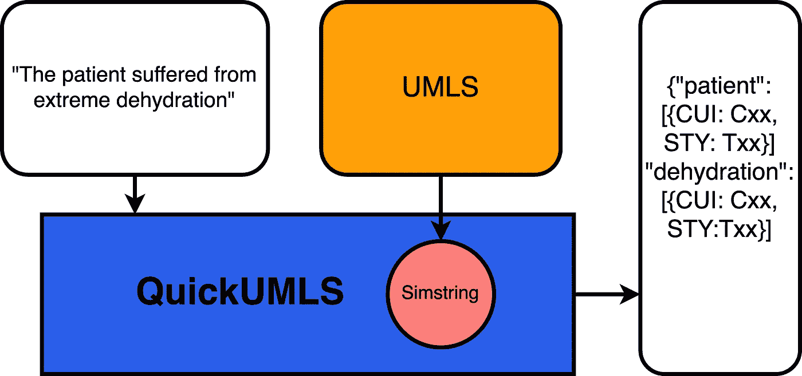
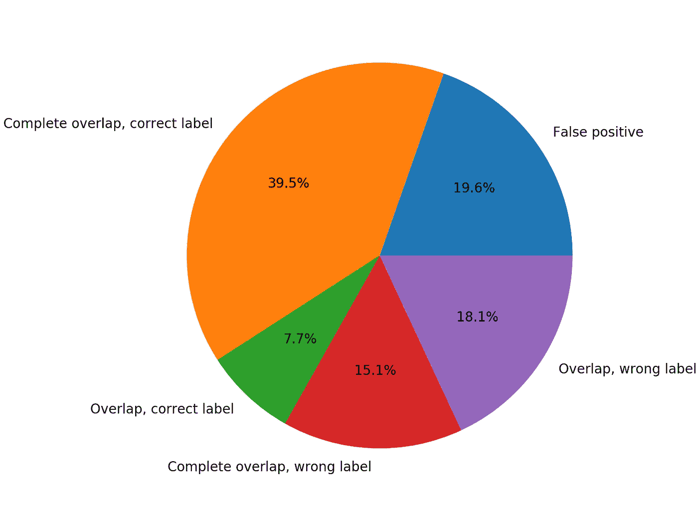

# 事半功倍:生物医学命名实体识别案例研究

> 原文：<https://towardsdatascience.com/doing-almost-as-much-with-much-less-a-case-study-in-biomedical-named-entity-recognition-efa4abe18ed?source=collection_archive---------19----------------------->


疾控中心在 unsplash 上拍摄的照片

## [思想和理论](https://towardsdatascience.com/tagged/thoughts-and-theory)

## **一个简单的字符串匹配方法能和一个大的监督模型竞争吗？**

在任何新的 R&D 项目开始时，我都会寻找最合适的解决方案来解决手头的问题。虽然有一些非常令人兴奋的大型模型可用，但我最大的担忧之一是将解决方案投入生产，而不影响我想要支持的结果。我最近的一个问题是，在生物医学命名实体识别(NER)任务中，一种简单的字符串匹配方法——加上一些简单的优化——是否可以与监督模型竞争。我已经将这两种方法进行了面对面的测试。

在字符串匹配系统方面，我利用了 QuickUMLS 分类器。QuickUMLS**【1】**—作为字符串匹配系统—将字符串作为输入(例如，包含医学概念的论文或论文摘要)，并输出文档中匹配统一医学语言系统(UMLS)概念的所有范围。然后，这些概念可以在其他设置中重用，或者作为其他机器学习系统的输入。出于这个原因，QuickUMLS 可以被看作是一个方便的预处理工具，用于从临床和生物医学文本中获取相关概念。然而，在这篇博文中，我们将重点关注使用 QuickUMLS 作为具有挑战性的 MedMentions 数据集上的分类器。**【2】**



图一。QuickUMLS 工作原理的示意图。给定一个字符串，一个 UMLS 数据库转换成一个 simstring 数据库，该模型返回最佳匹配，它们的概念 id 和语义类型。作者图。

## **关于生物医学 NER 需要了解的一些关键事项**

在我们深入到我们试图解决的问题之前，描述一下生物医学 NER 的一些特质是有用的。一般来说，NER 的问题是找到命名实体(例如，著名的地点、人、组织等。)在正文里。正如您可能猜测的那样，许多这些实体可以通过上下文找到。例如，在“山姆和德鲁去了罗马圆形大剧场”这样的句子中，我们可以推断罗马圆形大剧场是一个地点，因为你通常会去地点。类似地，我们也可以推测“Sam”是一个专有名词，因为处于“to go”主语位置的非常用词往往是人名。

相比之下，生物医学 NER 是关于从文本中发现和消除感兴趣的生物医学术语，如疾病、药物名称，以及通用术语，如“医院”、“ICU 病房”或“酒精”。这是一个重要的区别，因为很少有上下文信息来决定一个给定的词是否具有医学重要性。举一个有趣的例子，考虑“病人喝了很多酒”这句话中的“酒精”这个词。这一发现的严重程度取决于它是指酒精如啤酒或葡萄酒，还是纯酒精，如外用酒精。要更全面地了解 NER 生物医学的艺术水平，请看我在更苗条的人工智能公司的同事西布伦·詹森的博客文章。

在没有大量训练数据的情况下，很难了解哪些概念具有医学重要性，而训练数据通常不容易获得。因此，许多系统使用统一医学语言系统(UMLS)，这是一个包含许多不同概念及其字符串表示和其他信息的大型本体。请注意，概念不同于字符串，因为许多字符串可以引用多个概念。例如，字符串“酒精”可以指外用酒精或酒精饮料。

在 UMLS 中，每个概念都由一个概念唯一标识符(CUI)和一个语义类型(STY)来描述，CUI 是任何给定唯一概念的符号 ID，STY 是将具有相似特征的概念分组的族标识符。UMLS 有用但也很难使用的一个原因是它巨大的体积；UMLS 的 2020AB 版本，也就是我们将在下面使用的版本，有超过 300 万个独特的英语概念。这些概念的相当大一部分不太可能出现，即使是在大型的带注释的数据集中。

## **利用医疗提及数据集**

一个这样的数据集是 MedMentions。由 2016 年的 4392 篇 Pubmed 论文(标题和摘要)组成；用来自 UMLS 的 352K 个概念(CUI IDs)和语义类型进行注释。这些论文有大约 34K 个带注释的独特概念，这仍然只占 UMLS 中概念总数的大约 1%。这表明注释 UMLS 提及是一项具有挑战性的任务，不一定能使用监督机器学习来解决。

在这方面特别感兴趣的是，MedMentions 语料库包括测试集中不在训练中出现的 Cui。然而，总的来说，通过使用 UMLS 概念的语义类型作为标签，该任务仍然被视为受监督的机器学习任务。由于 UMLS 有 127 种语义类型，这仍然导致了很大的标签空间。MedMentions 数据集还有一个较小的版本，即 st21pv 数据集，它由与常规数据集相同的文档组成，但只注释了 21 种最常见的语义类型。

一个半马尔可夫基线在实体层面上得到了大约 45.3 的 F 分。**【2】**测试了其他方法，包括 blue Bert**【3】**和 BioBERT**【4】**，并使用实体级别的精确匹配将分数提高到 56.3。**【5】**注意，所有这些方法都是受监督的，因此在概念上依赖于训练集和测试集之间的一定量的重叠。如果一个概念或标签在训练中从未出现过，有监督的机器学习方法将很难对其进行正确分类。在下文中，我们将使用 MedMentions 数据集的语义类型作为标签。

## **QuickUMLS:无监督和基于知识的**

与 BERT 相比，QuickUMLS 本质上是一种无监督的方法，这意味着它不依赖于训练数据。更准确地说，QuickUMLS 是一种基于知识的方法。这意味着该模型依赖于外部知识库来预测标签，而不是用参数来告诉它预测什么。这意味着两件事:

1.  模型的质量受到知识库质量的限制。该模型无法预测知识库中不包含的内容。
2.  该模型可以超越带注释的数据进行归纳。一般来说，在训练期间没有看到特定标签的监督模型不能准确地预测这些事情。这个规则的一个例外是零射击学习方法。

根据这两个事实，我们认为基于知识的方法非常适合 MedMentions 数据集。关于第一点，MedMentions 数据库是使用 UMLS 概念注释的，因此知识库和数据集之间的映射是精确的映射。关于第二点，MedMentions 数据集包含训练集中不存在的测试中的概念。

## ***QuickUMLS 模型架构***

作为一个模型，QuickUMLS 很简单。它首先使用解析器 [spacy](https://spacy.io/) 解析文本。然后，该模型基于词性标签模式和停用词表来选择单词 ngrams，即单词的连续序列。简而言之，这意味着如果某些单词包含不需要的标记和标点符号，模型将丢弃它们。这些规则的细节可以在原始文件中找到。**【1】**在选择了所有候选单词 ngram 之后，在整个 UMLS 数据库中查询与单词 ngram 部分匹配的概念。因为在如此庞大的数据库上进行精确匹配是低效和困难的，所以作者使用 simstring 执行近似的字符串匹配。**【6】**当给定一个文本时，QuickUMLS 返回 UMLS 中的概念列表，以及它们与查询字符串的相似性和其他相关信息。例如，文本“患者有出血”使用(默认)字符串相似性阈值 0.7 返回以下候选项:

对于单词 patient:

```
{‘term’: ‘Inpatient’, ‘cui’: ‘C1548438’, ‘similarity’: 0.71, ‘semtypes’: {‘T078’}, ‘preferred’: 1},
{‘term’: ‘Inpatient’, ‘cui’: ‘C1549404’, ‘similarity’: 0.71, ‘semtypes’: {‘T078’}, ‘preferred’: 1},
{‘term’: ‘Inpatient’, ‘cui’: ‘C1555324’, ‘similarity’: 0.71, ‘semtypes’: {‘T058’}, ‘preferred’: 1},
{‘term’: ‘*^patient’, ‘cui’: ‘C0030705’, ‘similarity’: 0.71, ‘semtypes’: {‘T101’}, ‘preferred’: 1},
{‘term’: ‘patient’, ‘cui’: ‘C0030705’, ‘similarity’: 1.0, ‘semtypes’: {‘T101’}, ‘preferred’: 0},
{‘term’: ‘inpatient’, ‘cui’: ‘C0021562’, ‘similarity’: 0.71, ‘semtypes’: {‘T101’}, ‘preferred’: 0}
```

对于出血这个词:

```
{‘term’: ‘No hemorrhage’, ‘cui’: ‘C1861265’, ‘similarity’: 0.72, ‘semtypes’: {‘T033’}, ‘preferred’: 1},
{‘term’: ‘hemorrhagin’, ‘cui’: ‘C0121419’, ‘similarity’: 0.7, ‘semtypes’: {‘T116’, ‘T126’}, ‘preferred’: 1},
{‘term’: ‘hemorrhagic’, ‘cui’: ‘C0333275’, ‘similarity’: 0.7, ‘semtypes’: {‘T080’}, ‘preferred’: 1},
{‘term’: ‘hemorrhage’, ‘cui’: ‘C0019080’, ‘similarity’: 1.0, ‘semtypes’: {‘T046’}, ‘preferred’: 0},
{‘term’: ‘GI hemorrhage’, ‘cui’: ‘C0017181’, ‘similarity’: 0.72, ‘semtypes’: {‘T046’}, ‘preferred’: 0},
{‘term’: ‘Hemorrhages’, ‘cui’: ‘C0019080’, ‘similarity’: 0.7, ‘semtypes’: {‘T046’}, ‘preferred’: 0}
```

如您所见，单词“patient”有三个匹配的正确语义类型(T101)，两个匹配的正确概念(C0030705)。出血一词也有多余的匹配，包括“不出血”的概念。然而，如果我们按照相似性来看，排名最高的候选人在两种情况下都是正确的。

在 QuickUMLS 的默认应用程序中，我们只保留首选项，即 preferred 为 1 的项，然后按相似性排序。然后，我们将排名最高的候选项的语义类型(即 semtype)作为预测——我们称之为*基线模型*。我们使用了 [seqeval](https://github.com/chakki-works/seqeval) 和一个严格的匹配范例，与之前的工作相当。**【5】**

```
╔═══╦══════╦═══════╗
║   ║ BERT ║ QUMLS ║
╠═══╬══════╬═══════╣
║ P ║  .53 ║   .27 ║
║ R ║  .58 ║   .36 ║
║ F ║  .56 ║   .31 ║
╚═══╩══════╩═══════╝
Table 1: baseline performance
```

没什么印象，对吧？不幸的是，基线并没有为特定的任务进行优化。因此，让我们使用简单的试探法来优化基线。

# 用一些简单的优化改进 QuickUMLS

除了最初的性能之外，还有几种方法可以改进 QuickUMLS。首先，我们注意到 QuickUMLS 使用的标准解析器是默认的 spacy 模型，即 [en_core_web_sm](https://spacy.io/models/en) 。鉴于我们正在处理生物医学文本，我们最好使用生物医学语言模型。在我们的例子中，我们将模型换成了 scispacy**【7】**模型， [en_core_sci_sm](https://allenai.github.io/scispacy/) 。这已经稍微提高了性能，而且没有任何成本。

```
╔═══╦══════╦═══════╦═════════╗
║   ║ BERT ║ QUMLS ║ + Spacy ║
╠═══╬══════╬═══════╬═════════╣
║ P ║  .53 ║   .27 ║     .29 ║
║ R ║  .58 ║   .36 ║     .37 ║
║ F ║  .56 ║   .31 ║     .32 ║
╚═══╩══════╩═══════╩═════════╝
Table 2: adding scispacy
```

通过使用来自训练语料库的一些信息，可以获得其他改进。虽然这确实将 QuickUMLS 从一个纯无监督的方法变成了一个有监督的方法，但是仍然不依赖于大量的特定注释。换句话说，在特定的语料库上没有明确的“适合”步骤:我们将要进行的改进也可以使用一小组注释或医生的先验知识来估计。

## ***优化 QuickUMLS 阈值***

QuickUMLS 的默认设置包括阈值 0.7 和一组指标。该度量决定了如何计算字符串相似性，可以设置为“Jaccard”、“余弦”、“重叠”和“骰子”。我们对指标和不同的阈值进行网格搜索。最好的结果是 0.99 的阈值，这意味着我们只使用 SimString 和“Jaccard”度量来执行精确匹配，这在速度和分数方面优于所有其他选项。如你所见，我们离伯特的表现越来越近了。

```
╔═══╦══════╦═══════╦═════════╦════════╗
║   ║ BERT ║ QUMLS ║ + Spacy ║ + Grid ║
╠═══╬══════╬═══════╬═════════╬════════╣
║ P ║  .53 ║   .27 ║     .29 ║    .37 ║
║ R ║  .58 ║   .36 ║     .37 ║    .37 ║
║ F ║  .56 ║   .31 ║     .32 ║    .37 ║
╚═══╩══════╩═══════╩═════════╩════════╝
Table 3: Grid searching over settings
```

## ***增加先验的好处***

回想一下上面的内容，我们只是根据它是否是首选字符串以及它们的相似性来选择最佳匹配候选项。然而，在许多情况下，不同的概念将具有相同的字符串表示，例如在前面提到的“酒精”示例中。这使得在没有消歧模型的情况下很难选择最佳候选项，这需要上下文，并且再次将学习问题变成了受监督的问题，或者至少是需要术语出现的上下文示例的问题。解决这个难题的一个简单方法是，在其他条件相同的情况下，一些语义类型更有可能，因此在给定的语料库中更有可能。这也叫做*在先*。

在我们的例子中，我们通过训练集来估计类别先验，就像你在著名的[朴素贝叶斯分类器](https://en.wikipedia.org/wiki/Naive_Bayes_classifier)中所做的那样。然后，对于我们为每个候选集提取的每个语义类型，我们取最大相似度，然后将其与先验相乘。在神经网络术语中，你可以认为这是类级别的最大池。这也意味着我们忽略任何候选人的首选术语状态。

```
╔═══╦══════╦═══════╦═════════╦════════╦══════════╗
║   ║ BERT ║ QUMLS ║ + Spacy ║ + Grid ║ + Priors ║
╠═══╬══════╬═══════╬═════════╬════════╬══════════╣
║ P ║  .53 ║   .27 ║     .29 ║    .37 ║      .39 ║
║ R ║  .58 ║   .36 ║     .37 ║    .37 ║      .39 ║
║ F ║  .56 ║   .31 ║     .32 ║    .37 ║      .39 ║
╚═══╩══════╩═══════╩═════════╩════════╩══════════╝
Table 4: adding priors
```

不幸的是，这是我们在 QuickUMLS 中使用简单系统所能达到的极限。假设我们最终使用的阈值是. 99，这意味着我们根本没有使用 QuickUMLS 的近似匹配功能。去除近似匹配也将极大地加速整个系统，因为算法的大部分时间现在都花在 QuickUMLS 中的匹配上。

# **深入错误分析:我们的解决方案适合这项工作吗？**

当我们在进行命名实体识别任务时，我们可能会犯几类错误。首先，我们可以提取正确的跨度，但是错误的类。当我们找到一个正确的术语，但给它一个错误的标签时，就会发生这种情况，例如，当它指的是消毒剂时，我们认为“酒精”指的是饮料。第二，我们也可以提取部分跨度，但仍然匹配正确的标签。在这种情况下，我们可以将匹配视为“部分匹配”。在我们的评分中，我们只将精确的匹配视为正确。这方面的一个例子是，当黄金标准是“麻醉剂”时，提取“轻度麻醉剂”。我们也可能完全遗漏跨度，例如，因为 UMLS 不包含该术语，或者提取不符合黄金标准提及的跨度。下图显示了我们的系统会出现哪些类型的错误:



图来源:作者

这表明 QuickUMLS 产生的错误不属于某一特定类别。它提取了太多的项目，但是，当它提取项目时，它也经常给那些项目分配错误的标签。这表明 QuickUMLS 可以用作预提取系统，之后可以使用消歧系统来分配正确的标签。

# **结论**

从结果中可以看出，现成的术语提取系统无需培训即可用作高效且有效的 NER 系统。获取特定用例的训练数据通常是一个耗时的过程，阻碍了 R&D 的速度。我们构建的 QuickUMLS 分类器表明，我们可以用很少的训练样本走很长的路。通过明智地使用我们的资源，我们在 NER 生物医学的 R&D 进程中节省了大量时间。我们修改过的 QuickUMLS 分类器可以在 [github](https://github.com/stephantul/quickumls_pred) 上试用。这种方法的好处可能意味着解决方案足够健壮，易于开发和测试，并且足够小，易于在产品开发中实现。

# **参考文献**

**【1】**l . Soldaini 和 N. Goharian。Quickumls:一种快速、无监督的医学概念提取方法，(2016)，MedIR 研讨会，SIGIR

**【2】**s . Mohan，D. Li，Medmentions:用概念标注的大型生物医学语料库，(2019)，arXiv 预印本 arXiv:1902.09476

**【3】**彭，陈，陆，多任务学习在生物医学文本挖掘中的实证研究，(2020)，arXiv 预印本 arXiv:2005.02799

**【4】**j . Lee，W. Yoon，S. Kim，D. Kim，S. Kim，C.H. So，和 J. Kang，BioBERT:用于生物医学文本挖掘的预训练生物医学语言表示模型，(2020)，生物信息学，36(4)

**【5】**k . c . Fraser，I. Nejadgholi，B. De Bruijn，M. Li，A. LaPlante 和 K.Z.E. Abidine，使用通用和特定领域深度学习模型从医学文本中提取 UMLS 概念，(2019)，arXiv 预印本 arXiv:1910.01274。

**【6】**n . Okazaki 和 J.I. Tsujii，《简单有效的近似词典匹配算法》(2010 年 8 月)，载于《第 23 届国际计算语言学会议论文集》(2010 年科林)

**m . Neumann，D. King，I. Beltagy，W. Ammar，Scispacy:生物医学自然语言处理的快速鲁棒模型，(2019)， *arXiv 预印本 arXiv:1902.07669* 。**