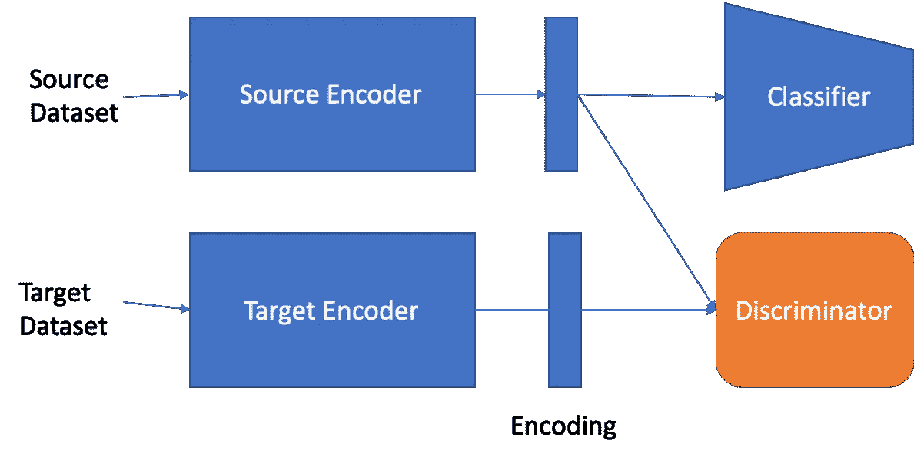
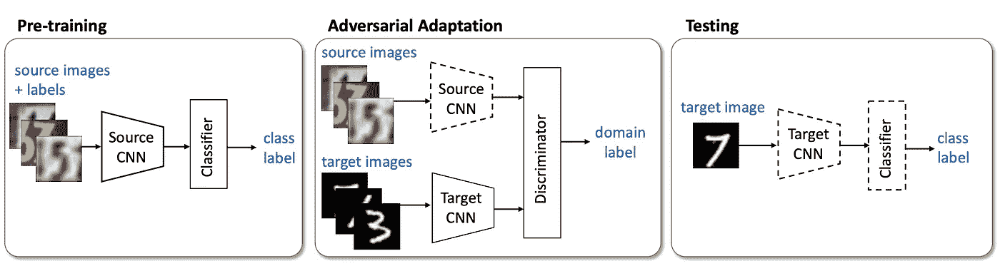
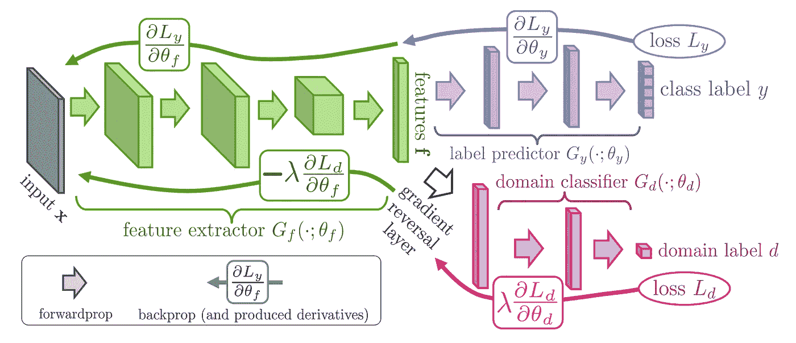
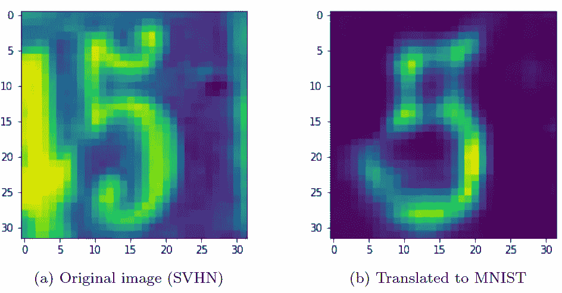
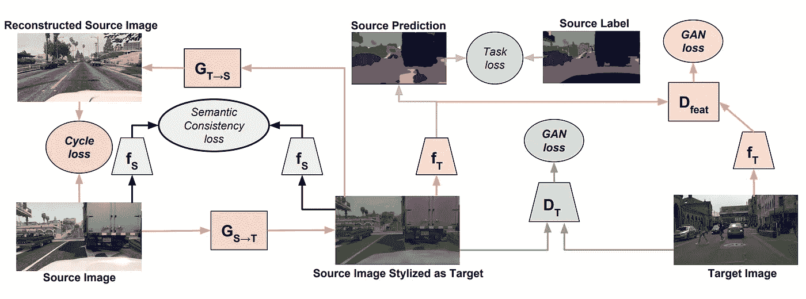

# 领域适应

> 原文：<https://towardsdatascience.com/domain-adaptation-ml-for-multiple-datasets-3634af3c1a1b?source=collection_archive---------39----------------------->

## [行业笔记](https://towardsdatascience.com/tagged/notes-from-industry)

## 机器学习的性能取决于它接受训练的数据集。数据集是不完美的，所以数据中的问题会影响模型。一种类型的问题是域转移。

这意味着，被训练来学习一个数据集上的任务的模型，可能无法在稍微不同的数据集上执行相同的任务。

比方说，你训练一个模型在公园这样的户外环境中探测狗。它可能在户外场所的狗的测试图像上表现得非常好。然而，当试图检测室内的狗时，该模型可能不会很好地发挥作用，尽管任务本身是相同的。这是一个问题，因为图像的背景并不重要，因为你只是想检测狗。

我们将探讨解决这个问题的四篇不同的研究论文。

# 词汇

有两个数据集:源数据集和目标数据集。为模型定型的数据集是源数据集。目标数据集是将对其进行测试的数据集。

对于类似问题的领域概化，目标数据集在训练期间不可用。网络在源数据集上进行训练，以避免过度适应特定于域的要素。

在域自适应中，源数据集和目标数据集在训练期间都是可用的，但是目标数据集的标签并不总是可用的。对于无监督的域自适应，在训练期间没有可用于目标数据集的标签。半监督域自适应涉及来自目标数据集的一些标记的例子。使用监督域自适应，来自源数据集和目标数据集的所有数据都有标签。

无监督的领域适应是最普遍研究的问题，因为它有最多的应用。当您有一个已标注的数据集，但它太小而不能直接在其上训练时，有监督的 DA 会很有用。

这些方法可以应用于许多 ML 问题。然而，一个常见的应用是图像分类。我将集中讨论两个常用基准数据集上的图像分类:MNIST 和 SVHN。在手写数字(MNIST)上训练的模型通常在打印的门牌号数字(SVHN)上表现不佳。

# 对抗方法

领域适应方法的最常见的方法遵循对抗方法。对于一些背景，我建议阅读关于[生成性敌对网络(GANs)](/understanding-generative-adversarial-networks-gans-cd6e4651a29) 。

对抗性领域适应框架(图片由作者提供)

有两个编码器，它们学习产生每个输入的矢量表示。有一个用于对输入进行分类的分类器和一个用于区分数据集的鉴别器。目标是消除编码领域中的差异。这类似于 GAN 目标，因为我们希望编码器通过生成难以区分的编码来欺骗鉴别器。但是，这需要这样做，以便分类器对两个数据集都有效。然后可以将相同的分类器应用于两个数据集。

有许多不同的训练方法、架构和损耗的方法。高层目标一致。我们希望编码器生成包含分类所需的有用信息的编码，但消除域中的转换。

许多算法之间的关键区别在于鉴别器是什么以及它是如何被训练的。在简单的情况下，它只是一个额外的损失项。例如，[最大平均差异](https://arxiv.org/abs/1502.02791) (MMD)测量源数据集和目标数据集编码之间的差异。在最小化差异的同时训练网络可以减少域转移。这对于简单的 DA 问题可能是有用的，但是对于较大的差异就不好用了。

## [阿达](https://arxiv.org/abs/1702.05464)

ADDA 的步骤([来源](https://arxiv.org/abs/1702.05464))

对抗性区分域自适应(ADDA)将一种简单的方法应用于区分性 DA。源数据集和目标数据集之间只共享一个编码器。网络分两步训练。

1.  编码器和分类器首先被训练以在源数据集上实现高分类准确度。
2.  编码器用鉴别器来训练，以失去域的可鉴别性。鉴别器被训练来分类具有对抗性损失的两个域。编码器用这种损失的否定来训练，因为它相对于鉴别器是不利的。这种否定是通过梯度反转完成的，这意味着在反向传播中，梯度在到达编码器之前被否定。

这种方法的一个主要缺点是在自适应步骤中分类性能可能会丢失或被遗忘。这是因为在这个步骤中没有使用标签。

## [丹恩](https://arxiv.org/abs/1505.07818)

DANN ( [来源](https://arxiv.org/abs/1505.07818))

神经网络的领域对抗训练(DANN)非常类似于 ADDA。域鉴别器与分类器一起训练，而不是有一个单独的适应步骤。使用梯度反转层是因为域鉴别器和分类器具有相反的损失函数。这允许分类和区分一起被训练，并且避免网络忘记任务。

# 图像翻译

解决领域差距的另一种方法是将示例从一个领域转换到另一个领域。这方面的一个例子是将街景数字(SVHN)转换成手写的 MNIST(数字)。在此转换之后，您可以应用 MNIST 训练的图像分类器。这些体系结构更加复杂，因为除了主要任务(图像分类)之外，网络还必须在源域和目标域之间来回转换图像。

将街景图像(SVHN)转换为手写图像(MNIST)的示例(图片由作者提供)

## [图像到图像的翻译](https://arxiv.org/abs/1712.00479)

I2I 网络和损失([来源](https://arxiv.org/abs/1712.00479)

像对抗方法一样，图像到图像翻译(I2I)旨在学习图像的域不变编码(Z)。在这个架构中有六个网络:源编码器、源解码器、目标编码器、目标解码器、域鉴别器和任务网络(例如:分类器)。解码器旨在从编码中重建图像。这也包括与域鉴别器的对抗学习。

基于六种不同损失的加权组合来训练网络。本文研究了哪种损失组合能产生最佳性能。

1.  Qc 是源域上的分类损失。我们无法获得目标域的这一损失，因为没有标签。然而，如果标签存在，损失可以扩展到包括目标域。
2.  Qid 是对图像进行编码并将其解码回相同域的损失。将图像编码到 Z 中并将其解码回原始域在理想情况下应该返回相同的图像。这种损失可以是原始图像和解码图像之间的差异的 L1 范数。
3.  Qz 是域鉴别器的损耗。这类似于 ADDA，因为它试图确定编码的域。我们希望这种损失随着编码的改进而增加。
4.  Qtr 是另一种鉴别损失，其中图像在进入域鉴别器之前被转换到另一个域。
5.  Qcyc 是循环一致性损失。这个损失和 Qid 差不多。不同之处在于，图像在原始域中被编码和解码之前，在另一个域中被解码。来自源域的图像被编码成 z。这被解码成目标域并被编码回 z。这然后被解码成源域并与原始图像进行比较。源和目标交换时的损耗也适用。这旨在确保不同域中相似图像的编码具有相似的编码。
6.  Qtrc 类似于 Qcyc，但不是解码回原始域，而是对编码进行分类。与 Qcyc 不同，这是不对称的，因为它涉及标签。来自源域的图像被翻译到目标域，然后被分类。

## [苏铁](https://arxiv.org/abs/1711.03213)

苏铁网络和损失([来源](https://arxiv.org/abs/1711.03213)

苏铁类似于 I2I。许多 I2I 损耗和网络在这里都有对应的部分。主要区别在于目标图像没有被转换到源域。此外，GAN 损耗可以应用于图像和编码。

源图像被转换到目标域。它们被转换回源域以应用循环一致性损失(与原始图像的 L1 差异)。

fs 网络在源域中的监督学习任务上被训练。语义一致性损失确保来自该网络的特征在翻译到目标域之前和之后保持接近。这确保图像在翻译后保留语义信息。

然后，将 GAN 损失应用于转换后的图像和目标图像的图像和特征(来自 fT)。这种损失是训练翻译与目标域相似所必需的。存在两个 GAN 损耗，以确保图像和特征是相似的。

最后，将任务损失应用于翻译后的图像。这将任务应用于原始目标图像。

## 其他领域

图像分类是用来测试领域适应方法的主要问题。然而，域自适应也可以应用于其他计算机视觉问题，如图像分割。它还可以应用于不同的研究领域，如自然语言处理(NLP)。

领域适应的一个特别有趣的应用是自动驾驶汽车和机器人。使用来自模拟环境的数据来为这些应用训练深度神经网络是常见的做法。在模拟环境中收集大量数据比在现实世界中容易得多。然而，为了使根据模拟数据训练的模型在现实环境中发挥作用，通常需要进行领域调整以实现良好的性能。

这个问题也有许多变体，包括少量领域适应、领域一般化和多类领域适应。

## 结论

领域适应有几种方法，但它们通常有一些共同的特征。领域歧视网络的对抗性学习是常见的。也有很多使用图像到图像翻译的工作，其中有循环一致性损失。将领域适应应用于新问题可能会涉及到这些组件的某种组合。

# 参考

[1]龙，，等.“用深度适应网络学习可转移特征”*机器学习国际会议*。PMLR，2015 年。

[2] Eric Tzeng 等，“对抗性判别域适应”。IEEE 计算机视觉和模式识别会议论文集。2017 年，第 7167–7176 页。

[3]雅罗斯拉夫·加宁和维克托·伦皮茨基。“通过反向传播的无监督域适应”。载于:arXiv 预印本 arXiv:1409.7495 (2014 年)。

[4] Zak Murez 等人，“用于领域适应的图像到图像翻译”。IEEE 计算机视觉和模式识别会议论文集。2018，第 4500–4509 页。

[5] Hoffman，Judy，等《苏铁:周期一致的对抗性域适应》。载于:arXiv 预印本 arXiv:1711.03213 (2017)。