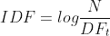
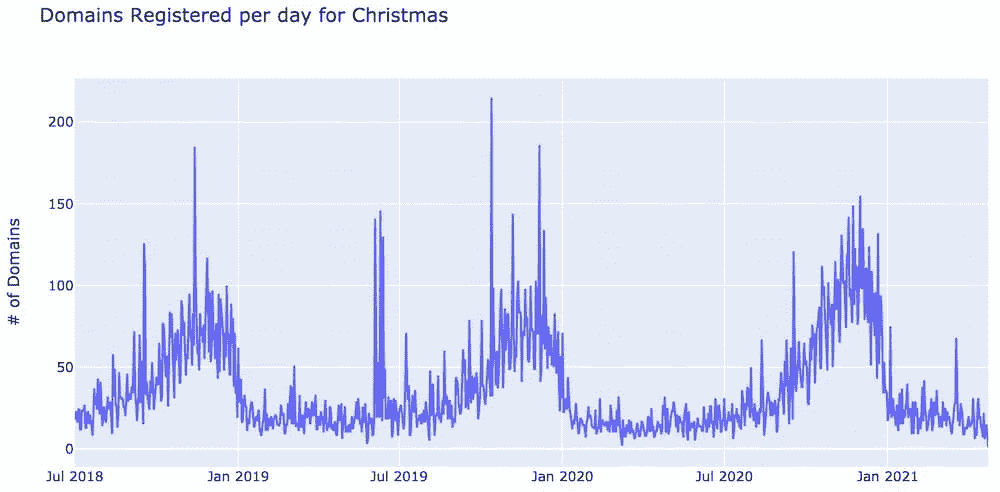
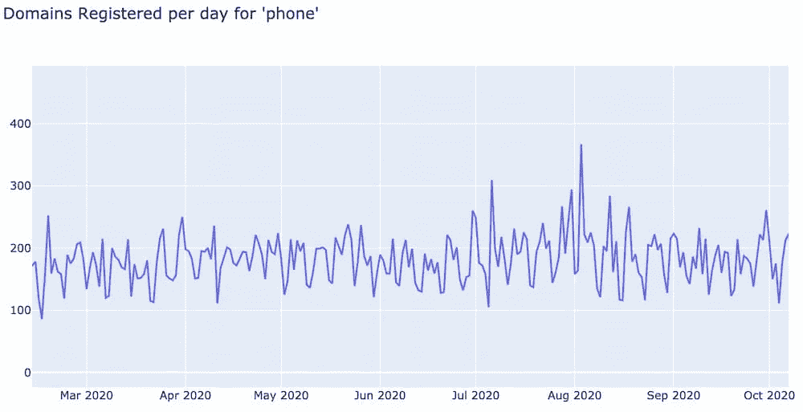
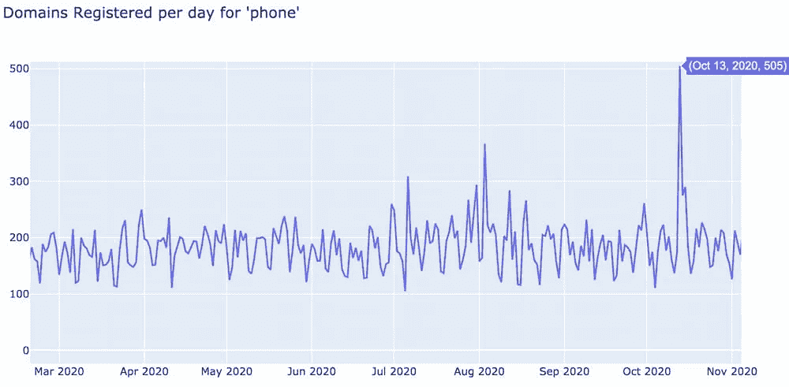
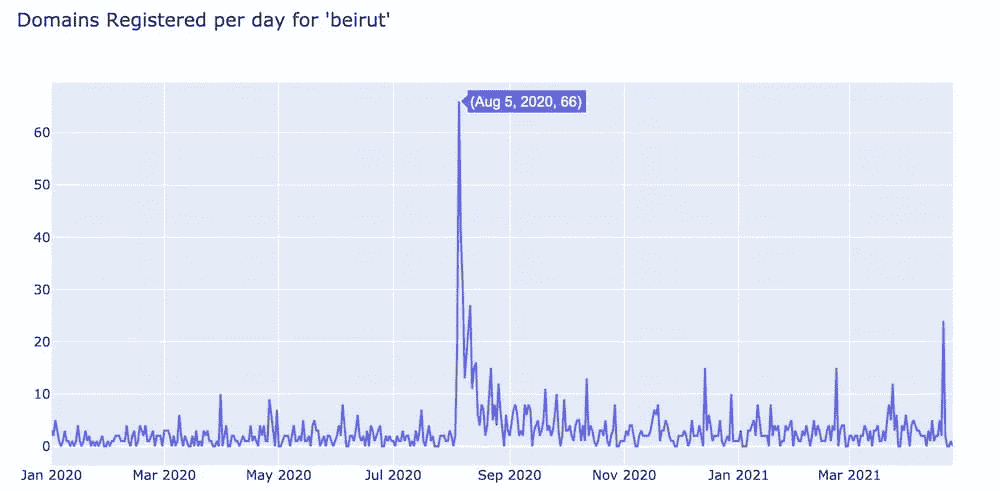
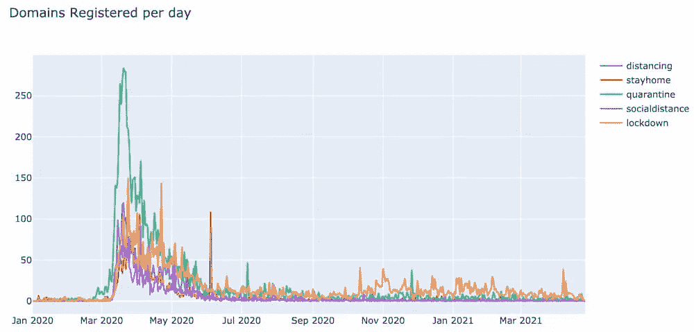

# 域名激增:识别威胁参与者针对的域名主题

> 原文：<https://towardsdatascience.com/domain-blooms-identifying-domain-name-themes-targeted-by-threat-actors-70942fe506d4?source=collection_archive---------47----------------------->

## 如何映射对世界事件的在线响应，以识别新的恶意活动

# 摘要

威胁行为者可以毫无顾忌地利用世界上任何他们可以利用的危机。无论是飓风、政治动荡，甚至是疫情，威胁行为者都会试图融入世界在线响应，创建欺诈性基础设施，以便赚钱、窃取 PII，甚至引发内乱。规划对不同世界事件的在线反应是能够识别威胁行为者在任何给定时间针对什么主题的第一步。

DomainTools 对我们称之为“域名激增”的现象进行了研究，旨在识别正在注册的域名中的新主题和趋势主题，并强调哪些威胁参与者是其恶意活动的潜在目标。

*为了深入分析 2020 年期间发生的一些更值得注意的域名激增，请看一下* [*《域名工具报告:2021 年春季版*](https://www.domaintools.com/resources/domaintools-reports/domain-blooms-new-method-of-detecting-trending-bad-domains) *。*

# 背景

早在 2020 年 2 月，当新冠肺炎迅速获得国际知名度时，威胁行为者正在积极利用这一形势，每天注册数百个恶意的新冠肺炎相关域名。DomainTools 安全研究小组每天都在扫描新注册的新冠肺炎相关域名，并运行冠状病毒应用程序。]网站，该网站声称有一款[实时冠状病毒追踪器应用](https://www.domaintools.com/resources/blog/covidlock-mobile-coronavirus-tracking-app-coughs-up-ransomware)可供下载。

安全研究人员[拆除了 Android 应用](https://www.domaintools.com/resources/blog/covidlock-update-coronavirus-ransomware)，去镇上将其拆开，发现这实际上是一个勒索软件应用，它会锁定受害者的手机，并要求 100 美元的比特币才能重新访问该设备。

这是一个有价值的发现，也提出了一些问题。首先，安全研究人员在扫描新注册的域名时，需要对每天要查找的单词有良好的直觉。但是那些被威胁者利用却被遗漏的相关词汇呢？第二，新冠肺炎相关领域的快速增长是一个明显的趋势，但下一个不那么明显的趋势呢？我们如何确定威胁参与者瞄准的域名的下一个趋势，以及他们使用的单词？

# 通过域名注册讲述新冠肺炎的故事

当 DomainTools 第一次开始分析新冠肺炎相关的域名时，早期使用的可视化工具之一是一个特定单词每天注册的域名数量的直方图。下面是 2020 年单词“covid”的直方图，它告诉我们几件事。

首先，在 2020 年 2 月之前,“covid”一词几乎从未用于域名注册。然后在 2 月 11 日，超过 800 个域名突然用“covid”这个词注册了。这一天正好是世界卫生组织(世卫组织)将这种疾病正式命名为“新冠肺炎”的第二天。

到 2 月 14 日，每日“covid”域的数量下降到每天几十个，并在大约一周半的时间里保持稳定。然后在 2 月下旬，域名的数量开始再次增加，并持续到 3 月 12 日，在这一点上，他们暴涨到前所未有的 2500 个域名在一天内注册。这是世卫组织正式宣布新冠肺炎为疫情的第二天。

从 3 月中旬到 4 月初,“covid”域名注册数量每天超过 2000 个，然后开始逐渐下降，最终稳定在每天 200 个左右的新基线，此后一直保持稳定。

您可能会问自己“这些域背后的目的或意图是什么？”一些是由不同的市政当局、卫生和非营利组织创建的新冠肺炎官方信息域。有些是错误信息和虚假信息领域；从网络安全的角度来看，粗略但不构成威胁。许多是域名投机的结果，这似乎不可避免地伴随着任何危机或新闻事件。但是，这些域中有大量是由威胁者出于欺诈、网络钓鱼和个人身份信息(PII)收集目的而创建的。

# 将微观应用到宏观

网络安全中数据科学的主要目标之一是分析安全研究人员每天使用的策略和技术，并尝试通过算法将它们应用于大规模数据。

根据这种工作方式，我们选择每天监控所有单词，并分析每个单词随时间的频率分布，以确定其基线频率的异常值，而不是试图猜测每天监控哪些单词来识别域名注册中的新主题。

但是词频并不是唯一有用的衡量标准。了解一个单词或术语有多独特可以提供很多有价值的见解。在 2020 年 2 月 11 日之前,“covid”这个词在域名中只出现了几百次；大部分是作为一个更大的单词的一部分或者作为两个单词组合的副产品。当试图发现威胁参与者正在利用的趋势时，识别新的独特趋势词也可能是有用的。

# 衡量领域中单词的重要性

[涵盖词频和唯一性的最常见的统计方法之一是 TF-IDF](https://en.wikipedia.org/wiki/Tf%E2%80%93idf) 。TF-IDF 代表术语频率-逆文档频率，是相对于一组已知的文档(也称为语料库)，一个单词对单个文档有多重要的度量。

更正式地说，词频(TF)是单个文档中一个单词的计数。在文档中更频繁使用的单词对文档的语义有更大的影响。在文档中只使用一次或两次的单词对语义的影响较小，尤其是对于较长的文档。

逆文档频率(IDF)是一个词相对于整个文档集提供多少信息的度量，使用以下函数计算:



其中 N 是语料库中的文档总数，DFt 是包含单词 t 的文档的数量。单词在语料库中出现的文档数量越多，其 IDF 得分越低，相反，单词出现在越少的文档中，其 IDF 得分越高。

举个例子来说明这一切，让我们以 Wikipedia.com 为例。今年，维基百科通过了 600 万篇英文文章；所以维基百科的语料库是 6，000，000 个文档。假设单词“the”出现在语料库中的每个文档中是安全的。因此“the”的 IDF 值为:log(6，000，000 / 6，000，000 +1) = 0.30。

让我们比较一下 IDF 对“the”和“dragon”的评分。“龙”出现在 3，340 个维基百科文档中，给它的 IDF 得分为:log(6，000，000 / (3，340 + 1)) = 3.25。

(注意:在分母上加 1 是为了防止某个单词没有出现在任何文档中时出现被零除的错误)

当查看维基百科关于[地下城&龙](https://en.wikipedia.org/wiki/Dragon_(Dungeons_%26_Dragons))的文章时，可以计算出“the”和“dragon”的 TF-IDF 分数，以显示这两个词对文章的重要性。

单词“The”在文章中的词频为 1705，TF-DIF 得分为:
1705 * 0.30 = 511.5。

单词“dragon”在文章中的词频为 1092，TF-IDF 得分为:
1092 * 3.25 = 3549

因此，当在《龙与地下城》这篇文章的上下文中比较这两个词时，可以看出“龙”比“the”更重要

# 定义文档

测量一个词的重要性的同样的统计方法可以应用到域名上，但是首先我们必须在域名注册的上下文中定义一个文档是什么。

由于目标是识别随着时间的推移域名注册中的单词趋势，一种方法是将在一天内注册的所有域视为单个文档，并将组成这些域的所有单个单词视为组成该文档的单词集。

比如，以 2020 年 6 月 1 日为例；这一天有 285，835 个域名注册。一旦每个域名被分割成其组成部分(英语)的话，总共有 2，595，402 个单词用于注册该天的域名。这将代表我们语料库中的单个文档。

*注意:为了了解每天用于注册域名的单词有多少重复，尽管在 2020 年 6 月 1 日有将近 260 万个单词用于生成域名，但只有 213，244 个独特的单词。*

# 定义语料库

语料库被定义为特定种类或特定主题的所有著作或作品。在 Wikipedia.com 的例子中，语料库是维基百科中的所有英文文章。IDF 分数告诉我们一个单词在所有文档的整个语料库中有多重要。因此，当计算用于注册域名的单词的 IDF 分数时，为了计算有意义的逆文档频率(IDF)分数，定义语料库的范围是很重要的。

语料库可以定义为从某个任意日期开始的每一天，但这有一些问题。由于目标是识别威胁参与者可能针对的新词和趋势词，因此时间回溯太久可能会降低当前有趋势但过去也有趋势的词的 IDF 得分。

以“圣诞节”这个词为例。如果将语料库的开头设置为 2018 年 7 月 1 日，那么每天使用“Christmas”的次数看起来如下。



请注意，从 9 月初开始到 12 月底，每天的域数量会有一个可预测的年度增长。

如果在 2020 年 10 月 1 日，人们正在寻找独特的趋势词，那么圣诞节的 IDF 得分将包括 2018 年和 2019 年趋势峰值的计数。这可能会降低圣诞节的 IDF 分数，使其不再将圣诞节视为一个新的流行词汇。

为了解决这个问题，IDF 分数是根据 180 天的滑动历史窗口计算的。因此，对于每一天，对于每个单词，IDF 计算使用之前的 180 天作为文档集来计算该单词的 IDF 分数。例如，2020 年 10 月 1 日，圣诞节的 IDF 分数是根据 2020 年 4 月 4 日至 2020 年 10 月 1 日期间使用的天数计算的。

这个滑动的 180 天历史窗口使得 TF-IDF 分数能够识别现在唯一有趋势的单词，而不管该单词在之前几年的趋势如何。

# 识别域名单词

下一个挑战是将域名分解成它们的组成单词。有多种方法可以解决这个问题，但最成功的方法是每天将新注册的域名与包含所有已知单词的字典进行比较。如果在一个域名中找到一个已知单词，它将被输出到包含该域名的所有单词的列表中。

不幸的是，即使在最流行的词典中，也不是每个热门词汇都能找到。例如，单词“covid”直到 2020 年 2 月 11 日才被添加到大多数在线词典中。因此，为了尝试捕获最具代表性的英语单词集，我们对以下来源的进行了分析，并将其合并到一个黄金标准词典中:

*   三种开源在线词典
*   [谷歌 n-gram 数据集](http://commondatastorage.googleapis.com/books/syntactic-ngrams/index.html)
*   [都市词典](https://www.urbandictionary.com/)
*   从[维基百科时事页面](https://en.wikipedia.org/wiki/Portal:Current_events)解析出的单词(每日更新)

维基百科时事页面是一个有价值的新的重要单词或短语的来源，这些单词或短语在其他单词来源中没有出现。

识别域名中的单词的另一个挑战是从算法上理解注册人在注册域名时针对的是哪些单词。以虚拟域名 sharepoint-chasebank-login 为例。]com。

该域中所有可能的英语单词列表如下:

*   分享
*   野兔
*   要点
*   重新勾嵌
*   sharepoint
*   追赶
*   银行
*   原木
*   注册

威胁分析师会立即将注意力集中在“sharepoint”和“login”这两个词上，而不会将它们拆分成更小的词，但从算法上来说，解读注册人的意图要困难得多。

有各种不同的试探法和概率方法来解决这个问题，但是每种方法都有潜在的遗漏重要单词的缺点。取而代之的是，简单地使用域名中的所有单词的方法效果很好。

根据这一数据 TF-IDF 模型，现在有可能调查随着时间的推移，单词在域名注册中的使用情况。

# 域名激增和峰值

每当值得关注的事件发生时，人们不可避免地会使用词语和主题来注册与事件相关的域名。如果有足够多的与这个主题相关的域名在短时间内被注册，这些域名可以用两种不同的方式来描述；*畴尖峰和畴开花*。

# 基线词频

大多数单词都有一个每天在域名注册中使用的基线频率。随着时间的推移，这一基线通常相当稳定，并且通常以 7 天为一个周期，因为人们在周末注册的域名较少。例如，下面是“电话”一词的每日词频。



请注意“phone”这个词每天出现在大约 180 个域中，随着时间的推移相当一致。这种模式就是我们所说的单词的基线频率。

# 域尖峰

有趣的是，异常值是从基线中识别出来的。例如，下图显示了“电话”一词在 11 月的出现频率。请注意，在 10 月 13 日，为“phone”注册的域名比基线多了 300 个。我们称这样的域名注册事件为**峰值**。



域名峰值是指一个特定单词相对于其基线每天注册的域名数量急剧增加。峰值通常发生在与该词相关的事件发生后的第二天，通常只持续一到两天。上述峰值对应的是 2020 年 10 月 13 日苹果 iPhone 12 的发布。

另一个与新闻相关的峰值的例子是下面的单词“贝鲁特”,它对应于 2020 年 8 月 4 日在贝鲁特发生的导致 200 多人死亡的化肥储存设施爆炸。



请注意，贝鲁特的峰值直到新闻发布后的第二天才出现，而手机峰值与 iPhone 12 发布在同一天。这两个域尖峰代表了两种不同的行为。

iPhone 12 秒杀事件发生在苹果产品发布会的同一天，挖掘 DomainTools 数据库发现，其中大量产品实际上是由苹果公司注册的；最有可能的是试图将域名撤出市场，这样其他人就不能从中获利或以侵犯苹果商标的方式使用它们。

贝鲁特事件是对一起悲剧事件的回应，看看这个事件中的域名，很多都是以帮助贝鲁特人民为主题的。

```
helpbeirutlb[.]comhelp4beirut[.]comhope4beirut[.]comhelpforbeirut[.]comhopeforbeirut[.]comdonateforbeirut[.]comdonate-beirut[.]comdonatebeirut[.]comgivetobeirut[.]comfundbeirut[.]comaidbeirut[.]combeirutfund[.]com
```

不幸的是，当查看今天的域名时，几乎所有的域名都只是停放的域名，很可能是域名投机者注册的，他们试图抢购他们认为一些救援组织可能想要购买的域名。

# DGA 域峰值

一类特殊的域尖峰是由基于字典的域生成算法(DGAs)产生的。DGAs 是一种算法，可以自动生成并有时注册恶意软件和僵尸网络用于通信协调的域名。DGA 传统上用随机的字母数字序列生成域名。这些域名很容易识别，因为它们的字符分布与合法域名有很大不同。

另一方面，基于字典的 DGA 试图通过随机组合字典中的单词来创建与合法域名的字符分布非常接近的域名，从而避开这种类型的检测。但是当你知道要寻找什么的时候，这些也很容易被发现。例如，看看每天使用“witness”一词注册的域名数量。

有几个指标表明，几乎每个峰值都是由字典 DGA 产生的。先看一下 5 月前和 10 月后的基准线；有一个一致的基线，每天约 10 个领域与“证人”一词。接下来，如果你观察每个尖峰信号的峰值，每个尖峰信号都是 500 个磁畴的倍数。像这样的精确模式不会在野外发生，并且清楚地指向一些自动生成并以 500 为一批注册域名的脚本。

识别基于字典的 DGA 的另一种方法是视觉扫描构成尖峰的域名。下面是从 5 月 11 日持续到 5 月 13 日的第一次高峰中的 16 个域名的样本，由 1，500 个域名组成。

```
ultra-outlinetowitnesstoday.infoultraoutline-towitnesstoday.infoultraoutlineto-witnesstoday[.]infoultraoutlinetowitness-today[.]infobest-outlinetowitnesstoday[.]infobestoutline-towitnesstoday[.]infobestoutlineto-witnesstoday[.]infobestoutlinetowitness-today[.]infoboss-outlinetowitnesstoday[.]infobossoutline-towitnesstoday[.]infobossoutlineto-witnesstoday[.]infobossoutlinetowitness-today[.]infocool-outlinetowitnesstoday[.]infocooloutline-towitnesstoday[.]infocooloutlineto-witnesstoday[.]infocooloutlinetowitness-today[.]info
```

当首先按长度排序域，然后按字母顺序排序时，DDGA 模式通常很好地组合在一起，很容易发现组成算法使用的字典的单词集。最重要的是，这些单词没有一个与注册当天的任何新闻事件相对应。这些只是随机的“单词沙拉”域。

# 域名泛滥

域名激增开始类似于峰值。一个单词的每日使用频率遵循某个基线频率，然后在某个事件发生后迅速增加到异常水平。但与峰值不同，几天后，每天的域名数量要么继续增加，要么在一段时间内保持稳定。过一段时间后，每天注册的域名数量会逐渐回落到基线水平，或者潜在的保持稳定的新基线水平。

域名绽放的典型例子是本文开头详细描述的新冠肺炎绽放。

水华，尤其是由自然灾害引发的水华，很容易成为威胁者的目标。在新冠肺炎疫情的早期，威胁行为者创建了数百个欺诈性筹款和网络钓鱼域，伪装成帮助疫情危机的非营利组织和市政当局的官方域。

# 集群领域开花成花束

早期新冠肺炎面临的挑战之一是识别威胁参与者在注册相关恶意域名时利用的其他词。安全研究人员不得不猜测不同的单词，并查看它们的布鲁姆图，以确定它们是否遵循与“covid”相同的趋势，但这起初只是一个猜测游戏，直到可以开发出更具算法性的方法。

一个领域开花实际上只是一个时间序列直方图，或随着时间的推移发生的计数。在数据科学中，这被称为向量，对于任何给定的向量，可以搜索所有已知向量的向量空间，以识别具有非常相似特征的其他向量。理论上，大约在同一时间开始、具有相似形状的峰、然后大约在同一时间结束的两个花开应该在语义上彼此相关。

为了测试这一点，使用了一种称为聚类的特殊类型的机器学习算法，该算法试图将相似的项目分组到一起。为此，为 2020 年期间注册的域名中使用的所有单词生成了布鲁姆直方图向量。然后，这些 bloom 向量通过聚类算法运行，以生成相似 bloom 的组。

一旦生成了 bloom 簇，就识别包含“covid”的 bloom 的簇，并取出 5 个最相似的 bloom 向量。这些单词的缩写如下所示:

请注意，并非每个水华都与“covid”具有相同的数量级，但其大致形状和持续时间非常相似。

在此分析中发现的其他值得注意的集群包括围绕社交距离的集群:



这个是关于黑人的命也是命运动的:

# 未来的研究

并不是每个重大事件都会像新冠肺炎那样成为威胁者的关注焦点。需要做进一步的研究来更好地对不同类型的 blooms 和 spikes 进行分类，确定它们背后的定义特征，并更好地理解参与注册这些域的人的动机。基于这种学习，我们可以更好地对恶意域进行分类，这些恶意域是在有机会运行之前为响应不同事件而注册的。

要深入分析 2020 年期间发生的一些更值得注意的域名激增和激增，请查看**《域名工具报告:2021 年春季版**。