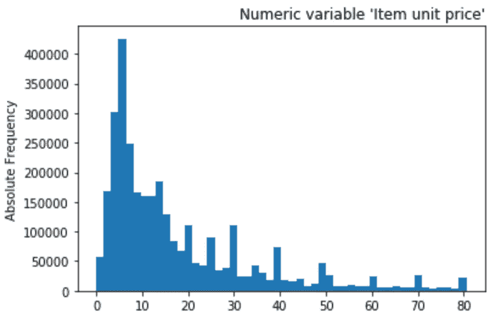

# 捐助者选择:广泛的探索性数据分析(EDA)

> 原文：<https://towardsdatascience.com/donorschoose-extensive-exploratory-data-analysis-eda-9e7879464d0d?source=collection_archive---------30----------------------->

## 一种分析方法，用于解释和揭示对 DonorsChoose 平台的见解，以回答业务问题:'**什么使项目有趣？**


照片由[屋大维丹](https://unsplash.com/@octadan?utm_source=medium&utm_medium=referral)在 [Unsplash](https://unsplash.com?utm_source=medium&utm_medium=referral) 上拍摄

# 关于项目

**DonorsChoose.org**是一个在线慈善平台，成千上万的教师可以在这里提出和推广对材料和特定设备的在线项目请求，让学生的教育机会对每个人都是平等的。

该项目基于一个预测 DonorsChoose.org 激动人心的[**ka ggle 竞赛，旨在确定哪些项目值得关注并具有商业意义。**](https://www.kaggle.com/c/kdd-cup-2014-predicting-excitement-at-donors-choose)

# 目标

以下探索性数据分析(EDA)的目的是揭示趋势和见解，从商业角度来看，确定并证明最有吸引力的财务捐赠项目。

主要目标是分析数据，以便回答下面的业务问题:**什么使项目令人兴奋？**

# 设置

```
# Import required librariesimport pandas as pd
import numpy as np
import matplotlib.pyplot as plt
import matplotlib.style as style
import seaborn as sns
%matplotlib inline
import pingouin as pg
color = sns.color_palette()
from pandas.plotting import table
import scipy
from scipy.stats import pearsonr, spearmanr
from wordcloud import WordCloud, STOPWORDS
import datetime as dt
import plotly
import cufflinks as cf
import plotly.offline
cf.go_offline()
cf.set_config_file(offline=False, world_readable=True)# Load datadon = pd.read_csv("donations.csv")
ess = pd.read_csv("essays.csv")
out = pd.read_csv("outcomes.csv")
res = pd.read_csv("resources.csv")
pro = pd.read_csv("projects.csv")
```

# 数据集信息

数据——在此下载[——被分成 5 个独立的数据集:
1——捐赠，2——论文，3——成果，4——资源，5——项目。](https://www.kaggle.com/c/kdd-cup-2014-predicting-excitement-at-donors-choose/data)


作者图片

664098 个项目有 3097989 个捐赠，619326 个成果。还有 3667217 的资源和 664098 的短文。

# 功能

让我们创建一个函数，打印数据帧的**形状**→观察值、特征、重复值、缺失值的数量。

```
# SHAPEdef shape_df(df):
    print(f"Number of observations: {df.shape[0]}")
    print(f"Number of variables: {df.shape[1]}")
    print(f"Number of duplicates: {df.duplicated().sum()}")
    print(f"Are there any missing values {df.isnull().values.any()}")
    print("-----")
    print(df.dtypes.sort_values(ascending=True))
    print("------")
    print("Datatypes' proportion:")
    print(df.dtypes.value_counts(ascending=True)) 
```

用于检测是否有任何**缺失值** →如果有，返回缺失值的绝对值和百分比。

```
# MISSING VALUESdef null_val(df):
    detect_null_val = df.isnull().values.any()
    if detect_null_val:
        null_abs = df.isnull().sum()
        null_pc = df.isnull().sum() / df.isnull().shape[0] *100
        null_concat = pd.concat([null_abs,null_pc], axis=1).round(2)
        null_concat.columns = ['Absolute', 'Percent']
        return null_concat.sort_values(by="Absolute", ascending=False)
    else:
        print("There are no missing values.") 
```

通过热图→皮尔逊方法显示**相关性**的函数。

```
# CORRELATIONSdef corrs(x):
    mask = np.triu(x.corr(), 1)
    plt.figure(figsize=(19, 9))
    return sns.heatmap(x.corr(), annot=True, vmax=1, vmin=-1, square=True, cmap='BrBG', mask=mask); 
```

# 探索性数据分析

找到我们正在处理的变量的类型(以及类型中的数量),检查缺失值、相关性以及数字和分类变量的统计描述。

# 数据集:项目

## 基本信息

```
How many features are available?
How many observations are in the dataset?
Are there any duplicated records?
Are there any missing values?
What type of variables are there?
How many variables of each type?# Observations, features, duplicates, datatypes and proportionsshape_df(pro)>> output:Number of observations: 664098
Number of variables:    35
Number of duplicates:   0
Are there any missing values? True
-----
fulfillment_labor_materials                 float64
students_reached                           float64
school_ncesid                              float64
school_latitude                            float64
school_longitude                           float64
total_price_including_optional_support     float64
total_price_excluding_optional_support     float64
school_zip                                 float64
primary_focus_subject                      object
primary_focus_area                         object
secondary_focus_subject                    object
secondary_focus_area                       object
projectid                                  object
poverty_level                              object
grade_level                                object
teacher_ny_teaching_fellow                 object
eligible_double_your_impact_match          object
resource_type                              object
teacher_teach_for_america                  object
school_charter_ready_promise               object
eligible_almost_home_match                 object
school_kipp                                object
school_nlns                                object
school_year_round                          object
school_magnet                              object
school_charter                             object
school_county                              object
school_district                            object
school_metro                               object
school_state                               object
school_city                                object
schoolid                                   object
teacher_acctid                             object
teacher_prefix                              object
date_posted                                object
dtype: object
------
Datatypes' proportion:
float64     8
object     27
dtype: int64# Describe missing valuesnull_val(pro)
```


null_val()函数图片作者。

```
# Stats description (num)
pro.describe().round(2)
```


数字统计描述。图片作者。

从 664098 条记录来看,‘total _ price _ excluding _ optional _ support’的平均价格是 542，远远高于表示存在异常值的中值。“total _ price _ including _ optional _ support”也是如此。查看第 1 和第 3 个四分位数，除了最大值之外，数据似乎都正常。

```
# Stats description (cat)
pro.describe(include="object")
```


分类统计描述(裁剪图像)。图片作者。

加利福尼亚州是提交项目最多的州，但芝加哥是观察次数最多的城市(9007 次)。

有三种大都市类型的学校，城市是最常见的。

在 5 种类型的教师中，“夫人”是最常见的记录，女教师在性别方面领先。

在 7 个学习领域中，识字和语言是最受欢迎的领域，供应品是最受欢迎的资源类型。

在被确定为贫困水平最脆弱的学生中，最常见的是最年轻的“PerK-2 级”。

在 2012 年 9 月的最后一天，1490 个项目请求被发布在网上。

```
# Checking correlations
corrs(pro)
```


Corrs()函数。图片作者。

从之前的热图来看，没有深刻的相关性。

# 1.教师的个人资料是什么？它在要求的项目中是如何分配的？

```
# Checking feature "teacher_prefix" distribution
df_teacher = pro[["teacher_acctid","teacher_prefix"]].copy()# Replacing np.nan values by ""unknown"
df_teacher.teacher_prefix.replace(np.nan, "Unkown", inplace=True)# Bar plot
ax = df_teacher["teacher_prefix"].value_counts().plot(kind="bar", figsize=(9,6), fontsize=12, color=sns.color_palette("rocket"), table=True)for p in ax.patches:
    ax.annotate("%.2f" % p.get_height(), (p.get_x() + p.get_width() / 2., p.get_height()), ha='center', va='center', xytext=(0, 7), textcoords='offset points')plt.xlabel("teacher_prefix", fontsize=10)
plt.xticks(rotation=0, horizontalalignment="center")
plt.ylabel("Absolute values", fontsize=10)
plt.title("Teacher Prefix Distribution", fontsize=10, loc="right")# side table
sidetb = df_teacher.teacher_prefix.value_counts().sort_values(ascending=False).to_frame()
sidetb["percent"] = (sidetb.apply(lambda x: x/x.sum())*100).round(2)
sidetb['cumsum'] = sidetb["percent"].cumsum()
display(sidetb.T)ax.axes.get_xaxis().set_visible(False)
table = ax.tables[0]
table.set_fontsize(10)
table.scale(1,1.7)
```


图片作者。

从分析中可以清楚地看出,“Mrs”和“Ms .”是最常见的称谓/前缀，它们合起来相当于大约 87%的记录。

# 时间日期

将 date_posted 转换为“年”、“月”、“日”和“工作日”变量。

```
# Convert "date_posted" into "year","month","day","weekday" featurespro["date_posted"] = pd.to_datetime(pro["date_posted"], format="%Y-%m-%d")
pro["year_posted"] = pro["date_posted"].dt.year
pro["month_posted"] = pro["date_posted"].dt.month.map({1:"Jan", 2:"Feb", 3:"Mar", 4:"Apr", 5:"May", 6:"Jun", 7:"Jul", 8:"Aug", 9:"Sep", 10:"Oct", 11:"Nov", 12:"Dez"})pro["weekday_posted"] = pro["date_posted"].dt.dayofweek.map({0:"Mon", 1:"Tue", 2:"Wed", 3:"Thu", 4:"Fri", 5:"Sat", 6:"Sun"})pro[["date_posted","year_posted","month_posted","weekday_posted"]]
```


图片作者。

# 2.提交项目请求的最常见时期是什么？

## 2.1.在哪个工作日？

```
# Checking distribution of submited projects regarding the weekdaysdf_timedate = pro[["teacher_acctid","teacher_prefix","year_posted","month_posted","weekday_posted","date_posted"]].copy()# Bar plot
ax = df_timedate["weekday_posted"].value_counts().plot(kind="bar", figsize=(9,6), fontsize=12, color=sns.color_palette("rocket"), table=False)for p in ax.patches:
    ax.annotate("%.2f" % p.get_height(), (p.get_x() + p.get_width() / 2., p.get_height()), ha='center', va='center', xytext=(0, 7), textcoords='offset points')plt.xlabel("Weekdays", fontsize=10)
plt.xticks(rotation=0, horizontalalignment="center")
plt.ylabel("Absolute values", fontsize=10)
plt.title("Submited projects regarding the days of the week", fontsize=10, loc="right")# side table
daysofweek = df_timedate.weekday_posted.value_counts().sort_values(ascending=False).to_frame()
daysofweek["percent"] = (daysofweek.apply(lambda x: x/x.sum())*100).round(2)
daysofweek['cumsum'] = daysofweek["percent"].cumsum()
display(daysofweek.T)
```


图片作者。

周日显然是一周中老师提交更多项目的日子。趋势是越接近周末，浓度越大。一个可能的解释是，在星期天，老师们有更多的空闲时间来完成这项任务。

## 2.2.哪几个月？

```
# Checking distribution of submited projects along the academic year# Bar plot
ax = df_timedate["month_posted"].value_counts().plot(kind="bar", figsize=(9,6), fontsize=12, color=sns.color_palette("rocket"), table=True)plt.xlabel("Months", fontsize=10)
plt.xticks(rotation=0, horizontalalignment="center")
plt.ylabel("Absolute values", fontsize=10)
plt.title("Submited projects along the year", fontsize=10,loc="right")ax.axes.get_xaxis().set_visible(False)
table = ax.tables[0]
table.set_fontsize(10)
table.scale(1,1.7)
```


图片作者。

分析显示，平台投稿发生率最高的月份是 9 月和 10 月。在学年开始时有更多的提交量是有意义的。第一学期注意力更集中。

## **2.3。这些年的整体演变是怎样的？**

```
# Excluding 2014 - not complete:df_timedate[df_timedate["year_posted"]==2014].month_posted.unique()>> output: array([‘May’, ‘Apr’, ‘Mar’, ‘Feb’, ‘Jan’], dtype=object)
---# Checking evolution from 2002 to 2013# Bar plot
ax = df_timedate.groupby("year_posted")['teacher_acctid'].count()[:-1].plot(kind="line", figsize=(9,6), fontsize=12, linewidth=2, grid=True, table=True)plt.xlabel("Years", fontsize=10)
plt.xticks(rotation=0, horizontalalignment="center")
plt.ylabel("Absolute values", fontsize=10)
plt.title("Evolution of submited projects", fontsize=10,loc="right")ax.axes.get_xaxis().set_visible(False)
table = ax.tables[0]
table.set_fontsize(10)
table.scale(1,1.7)
```


图片作者。

对年度项目员额分布的分析揭示了一个明显而强劲的增长趋势。自 2002 年该平台诞生以来，增长率一直呈指数级增长。

# 3.哪些领域更有责任进行在线提交？

```
schools_ = pro[["school_metro", "school_state", "school_city", "resource_type", "grade_level", "poverty_level", "year_posted"]].copy()schools_.head()
```


图片作者。

```
# Checking feature "school_metro" regarding school located areas# Replacing np.nan values by ""unknown"
schools_.school_metro.replace(np.nan, "Unkown", inplace=True)
---# Bar plot
ax = schools_.school_metro.value_counts().plot(kind="pie", figsize=(9,6), autopct='%1.2f%%', explode= (0.005, 0.005, 0.005, 0.005), startangle=80, fontsize=12, table=True)# Params
plt.xticks(rotation=0, horizontalalignment="center")
plt.ylabel("", fontsize=10)
plt.title("Metropolitan school areas", fontsize=10,loc="right")ax.axes.get_xaxis().set_visible(False)
table = ax.tables[0]
table.set_fontsize(10)
table.scale(1,1.7)
```


图片作者。

学校属于哪些大都市地区？最高浓度出现在城市地区，其次是郊区和农村。12%未知。

# 4.提交的项目最集中在哪个州？

```
# Checking feature "school_state" regarding higher concentration of project openingshigh_states = schools_.school_state.value_counts()# Bar plot
ax = schools_.school_state.value_counts(ascending=False)[:5].plot(kind="bar", figsize=(9,6), fontsize=12, color=sns.color_palette("rocket"), table=True)# Params
plt.xticks(rotation=0, horizontalalignment="center")
plt.ylabel("Absolute values", fontsize=10)
plt.title("States with higher schools' concentration", fontsize=10,loc="right")ax.axes.get_xaxis().set_visible(False)
table = ax.tables[0]
table.set_fontsize(10)
table.scale(1,1.7)
```


图片作者。

所选的“前 5 名”学校州几乎占所有空缺的 50%。加州领先，其次是纽约和北卡罗来纳，比例接近伊利诺伊州和得克萨斯州。

# 5.哪个城市的哪个学校影响更大？

```
# Checking feature "school_city" regarding project openings# Bar plot
ax = schools_.school_city.value_counts(ascending=False)[:10].plot(kind="bar", figsize=(12,8), fontsize=12, color=sns.color_palette("rocket"), table=True)# Params
plt.xticks(rotation=0, horizontalalignment="center")
plt.ylabel("Absolute values", fontsize=10)
plt.title("Cities with higher schools' concentration", fontsize=10,loc="right")ax.axes.get_xaxis().set_visible(False)
table = ax.tables[0]
table.set_fontsize(10)
table.scale(1,1.7)
```


图片作者。

如果就各州而言，加利福尼亚州之后是纽约州和北卡罗来纳州，比例接近伊利诺伊州和得克萨斯州；就城市而言，芝加哥、洛杉矶、布鲁克林、布朗克斯和纽约最能代表这种分布。

# 6.哪种类型的资源请求要求最高？

```
# Checking feature "resource_type" distribution# Bar plot
ax = schools_.resource_type.value_counts().plot(kind="bar", figsize=(9,6), fontsize=12, color=sns.color_palette("rocket"), table=False)for p in ax.patches:
    ax.annotate("%.2f" % p.get_height(), (p.get_x() + p.get_width() / 2., p.get_height()), ha='center', va='center', xytext=(0, 7), textcoords='offset points')plt.xlabel("Resources", fontsize=10)
plt.xticks(rotation=0, horizontalalignment="center")
plt.ylabel("Absolute values", fontsize=10)
plt.title("Resource types Distribution", fontsize=10, loc="right")
```


图片作者。

从所需资源的类型来看，用品和技术是数量要求最高的类型，其次是书籍、其他、旅行和游客。

# 7.学生的成绩是怎样的？

```
# Checking feature "grade_level" distribution# Bar plot
ax = schools_.grade_level.value_counts().plot(kind="bar", figsize=(9,6), fontsize=12, color=sns.color_palette("rocket"), table=False)for p in ax.patches:
    ax.annotate("%.2f" % p.get_height(), (p.get_x() + p.get_width() / 2., p.get_height()), ha='center', va='center', xytext=(0, 7), textcoords='offset points')plt.xlabel("Grade levels", fontsize=10)
plt.xticks(rotation=0, horizontalalignment="center")
plt.ylabel("Absolute values", fontsize=10)
plt.title("Grade levels distribution", fontsize=10,loc="right")
```


图片作者。

趋势很明显:学生越年轻，在线请求的数量就越多。

# 8.职等和所要求的资源类型之间有什么关系吗？

```
# Understanding how resources are distributed over the grade levelsplt.figure(figsize=(16,8))ax = sns.countplot(x="grade_level", hue="resource_type", data=schools_, dodge=True)plt.legend()
plt.xlabel("Grade levels", fontsize=10)
plt.xticks(rotation=0, horizontalalignment="center")
plt.ylabel("Absolute values", fontsize=10)
plt.title("Resources' distribution by the grade levels", fontsize=10, loc="right");
```


图片作者。

了解资源在年级水平上的分布:无论年级水平如何，对资源的需求趋势是相同的:供应品、技术、书籍等。

# 9.贫困程度会影响申请资金的趋势吗？

```
# Checking feature "poverty_level" distribution# Bar plot
ax = schools_.poverty_level.value_counts(dropna=False).plot(kind="pie", figsize=(12,8), autopct='%1.2f%%', explode= (0.005, 0.005, 0.005, 0.005), startangle=80, fontsize=12, table=True)plt.xticks(rotation=0, horizontalalignment="center")
plt.ylabel("", fontsize=10)
plt.title("Poverty classes distribution regarding requested projects", fontsize=10, loc="right")ax.axes.get_xaxis().set_visible(False)
table = ax.tables[0]
table.set_fontsize(10)
table.scale(1,2)
```


图片作者。

从对贫困阶层分布的分析中可以明显看出，脆弱性越高，申请资助的项目数量就越大。

# 10.在大都市安置和贫困水平方面，申请项目的分布是否有趋势？

```
# Checking "poverty levels" regarding metropolitan school areash_pov = schools_.groupby(["poverty_level","school_metro"]).year_posted.count().iloc[:4]
hpov = pd.DataFrame(h_pov)hst_pov = schools_.groupby(["poverty_level","school_metro"]).year_posted.count().iloc[4:8]
hstpov = pd.DataFrame(hst_pov)l_pov = schools_.groupby(["poverty_level","school_metro"]).year_posted.count().iloc[8:12]
lpov = pd.DataFrame(l_pov)m_pov = schools_.groupby(["poverty_level","school_metro"]).year_posted.count().iloc[12:]
mpov = pd.DataFrame(m_pov) merge_1 = pd.merge(hstpov, hpov, on=["school_metro"])
merge_1.rename(columns={"year_posted_x":"Highest Poverty", "year_posted_y":"High Poverty"}, inplace=True)merge_2 = pd.merge(merge_1,mpov,on=["school_metro"])merge_3 = pd.merge(merge_2,lpov,on=["school_metro"])
merge_3.rename(columns={"year_posted_x":"Moderate Poverty", "year_posted_y":"Low Poverty"},inplace=True)
---# Bar plot
ax = merge_3.sort_values(by=["High Poverty"], ascending=True).plot(kind="bar", figsize=(9,6), fontsize=12, color=sns.color_palette("rocket"), table=True)# Params
plt.xticks(rotation=0, horizontalalignment="center")
plt.ylabel("Absolute values", fontsize=10)
plt.title("Poverty level distribution regarding metropolitan schools' areas", fontsize=10,loc="right")ax.axes.get_xaxis().set_visible(False)
table = ax.tables[0]
table.set_fontsize(10)
table.scale(1,1.7)
```


图片作者。

根据对大都市学区贫困程度的分析，属于高贫困程度城市地区的学校最常见，这也是因为城市地区的密度更大，这与两个阶层的分布和关系有关系。

# 11.就研究领域而言，哪些是提交最多的捐赠？

```
# Checking "primary focus areas" regarding requested projectssubject = pro[["resource_type", "grade_level", "primary_focus_area", "total_price_excluding_optional_support", "total_price_including_optional_support", "poverty_level", "year_posted"]].copy()
---# Bar plot
ax = subject.primary_focus_area.value_counts(ascending=False).plot(kind= "bar", figsize=(9,6), fontsize=12, color=sns.color_palette("rocket"), table=False)for p in ax.patches:
    ax.annotate("%.2f" % p.get_height(), (p.get_x() + p.get_width() / 2., p.get_height()), ha='center', va='center', xytext=(0, 7), textcoords='offset points')plt.xlabel("Primary Focus Areas", fontsize=10)
plt.xticks(rotation=30, horizontalalignment="right")
plt.ylabel("Absolute values", fontsize=10)
plt.title("Primary Focus Areas distribution", fontsize=10, loc="right")
```


图片作者。

关于兴趣/学习领域，与读写和语言相关的科目是提交最多的科目，其次是几乎一半的数学和科学申请。音乐与艺术、应用学习、特殊需求、历史与公民、健康与体育是要求较少的重点领域。

# 12.成绩水平会影响兴趣/学习领域吗？

```
# Understanding how primary focus areas are distributed through the grade levelsplt.figure(figsize=(16,8))ax = sns.countplot(x="grade_level", hue="primary_focus_area", data=subject, dodge=True)plt.legend()
plt.xlabel("Grade levels", fontsize=10)
plt.xticks(rotation=0, horizontalalignment="center")
plt.ylabel("Absolute values", fontsize=10)
plt.title("Primary focus areas distribution by grade levels", fontsize=10, loc="right");
```


图片作者。

不出所料，无论年级高低，研究的重点领域没有明显变化。

# 数据集:论文

```
ess.shape
>> (664098, 6)ess.head()
```


图片作者。

```
# Describe missing values
null_val(ess)
```


图片作者。

## 词云

**Wordcloud** 是一种显示文本串中最常见和最频繁出现的单词的可视化类型，其中单词的大小与其频率成比例。

# 13.论文数据集中出现频率最高的单词是什么？

让我们定义一个函数来创建一个**单词云**，在每一系列文章的数据集中突出并标出最常见的单词。

```
def plot_wordcloud(wc, otherWords=""):ess[wc].dropna(inplace=True)
    text = " ".join(ess[wc][~pd.isnull(ess[wc])])
    wordcloud = WordCloud(width=3000, height=2000, random_state=1, background_color="black", colormap="Set2", collocations=False, stopwords=STOPWORDS.update(otherWords)).generate(text)
    fig = plt.figure(figsize=(14,14))
    plt.imshow(wordcloud)
    plt.title("Wordcloud with %s content" % wc, fontsize=12, loc="right")
    plt.axis("off")
    plt.show()
```

## 标题

```
plot_wordcloud("title", ["need","Help","Classroom"])
```


WordCloud:标题内容。图片作者。

标题中出现最频繁的词是*书，阅读，技术，阅读，科学，数学，图书馆，年级，读写能力，学校，Ipad。*

## 简短描述

```
plot_wordcloud("short_description", ["will", "class", "allow", "able", "one", "year", "many", "time", "remember", "use", "day", "way"])
```


WordCloud:简短描述。图片作者。

在简短描述中出现最频繁的词是*学生、学校、书籍、阅读、技术、学习、技能、学习、教学、儿童、材料、数学、计算机。*

## 需求陈述

```
plot_wordcloud("need_statement",["need", "student", "students", "fulfillment", "including", "help", "donorschoose", "org", "shipping,", "set", "new", "will"])
```


WordCloud:需要声明。图片作者。

需求陈述中出现最频繁的词是*书、阅读、数学、成本、技能、项目、中心、材料、HTML、科学、游戏、技能、相机、iPad。*

# 数据集:资源

## 基本信息

```
How many features are available?
How many observations are in the dataset?
Are there any duplicated records?
Are there any missing values?
What type of variables are there?
How many variables of each type?# Observations, features, duplicates, datatypes and proportionsshape_df(res)>> output:Number of observations: 3667217
Number of variables:    9
Number of duplicates:   0
Are there any missing values? True
-----
vendorid                 float64
item_unit_price          float64
item_quantity            float64
resourceid                object
projectid                 object
vendor_name               object
project_resource_type     object
item_name                 object
item_number               object
dtype: object
------
Datatypes' proportion:
float64    3
object     6
dtype: int64# Describe missing values
null_val(res)
```


图片作者。

```
res.head()
```


图片作者。

```
res.describe(include="all").round(1)
```


图片作者。

超过 150 万本书是最常见的资源类型。

平均项目单价为 180 美元，中位数为 14 美元→这表明存在一些严重的异常值。此外，至少可以说，数据集中出现的一些负值很尴尬。

平均数量为 3.3 个单位，中位数为 1。Q1 和 Q3 表明分布良好，但需要处理那些异常值。

# 14.每种相应类型的资源总共获得了多少捐赠？

要回答这个问题，我们需要计算每种可用资源的**项目数量**和**项目价格**。

## 项目数量

```
res["item_quantity"].value_counts(dropna=False)1.0        2304849
2.0         279693
3.0         108075
5.0          81142
4.0          80076
            ...   
315.0            1
10500.0          1
313.0            1
309.0            1
121.0            1
Name: item_quantity, Length: 313, dtype: int64
---res.item_quantity.value_counts(normalize=True,bins=15).round(6)(-993.1089999999999, 66207.2]    0.997734
(926900.8, 993108.0]             0.000000
(860693.6, 926900.8]             0.000000
(794486.4, 860693.6]             0.000000
(728279.2, 794486.4]             0.000000
(662072.0, 728279.2]             0.000000
(595864.8, 662072.0]             0.000000
(529657.6, 595864.8]             0.000000
(463450.4, 529657.6]             0.000000
(397243.2, 463450.4]             0.000000
(331036.0, 397243.2]             0.000000
(264828.8, 331036.0]             0.000000
(198621.6, 264828.8]             0.000000
(132414.4, 198621.6]             0.000000
(66207.2, 132414.4]              0.000000
Name: item_quantity, dtype: float64
```

通过对 15 个存储桶中的项目进行聚合，我们发现 99%的数据集中在值-993 和 66207 之间。

绘制“项目数量”特征的**经验累积分布函数(ECDF)** 并检测变量中异常值的存在。它显示了数据中比 x 轴更大和更小的点所占的百分比:确实非常高。

```
# Plotting ECDFx = np.sort(res["item_quantity"].dropna())
y = np.arange(1, len(x)+1) / len(x)
plt.plot(x,y,marker = ".", linestyle = "none")
plt.title("ECDF Item Quantity",loc="right");
```


图片作者。

让我们寻找那些遥远的离群值。

```
value = res.item_quantity.quantile([.9999995])
p = value.iloc[0]
res[res["item_quantity"] > p]
```


图片作者。

我已经决定放弃“SWATCH BOOK-SCHOOL SMART CONST 09506”(也没有价格)项目，保留所有其他项目。

```
# Removing outlierres = res[res["item_quantity"] < 993108].copy()
res
```


图片作者。

```
res["item_quantity"].describe().round(2)count    3658906.00
mean           3.03
std           11.75
min            0.00
25%            1.00
50%            1.00
75%            2.00
max        10500.00
Name: item_quantity, dtype: float64
---res["item_quantity"].value_counts(dropna=False)1.00        2731320
2.00         317590
3.00         120462
4.00          87816
5.00          85564
             ...   
2.99              1
274.00            1
10500.00          1
268.00            1
290.00            1
Name: item_quantity, Length: 316, dtype: int64
---# Next step is to deal with np.nan, 0.00 and 2.99 valuesres[res["item_quantity"] == 2.99]
```


图片作者。

```
# Checking for items with no quantity records
(res[res["item_quantity"] == 0]).head()
```


图片作者。

解决这两个问题的方法是用中值代替上述所有异常值。

```
# Replacing anomalous values by np.nanres["item_quantity"] = res["item_quantity"].replace(2.99,3)
res["item_quantity"] = res["item_quantity"].replace(0,np.nan)# Replacing the outliers by the medianres["item_quantity"] = res.item_quantity.fillna(res.item_quantity.median())
---res.item_quantity.describe().round(1)count    3658906.0
mean           3.0
std           11.8
min            1.0
25%            1.0
50%            1.0
75%            2.0
max        10500.0
Name: item_quantity, dtype:float64
```

## 项目价格

```
# Plotting ECDFx = np.sort(res.item_unit_price.dropna())
y = np.arange(1, len(x)+1) / len(x)
plt.plot(x,y,marker = ".", linestyle = "none")
plt.title("ECDF Item Price",loc="right");
```


图片作者。

```
re = res.copy() # Make a copy of the dataset# Dealing with the outliersQ1 = re["item_unit_price"].quantile(0.25)
Q3 = re["item_unit_price"].quantile(0.75)
IQR = Q3 - Q1re["item_unit_price_"] = re.item_unit_price[~((re.item_unit_price < (Q1 - 1.5 * IQR)) |(re.item_unit_price > (Q3 + 1.5 * IQR)))]# Displaying data dispersion without the outliersprint(re.item_unit_price.describe().round(1))
print("")
print(int(re.item_unit_price.describe()[0]) - int(re.item_unit_price_.describe()[0]),"outliers were identified with this operation")count      3653295.0
mean           179.8
std         234667.6
min            -99.6
25%              6.3
50%             14.0
75%             36.0
max      448421569.0
Name: item_unit_price, dtype: float64>> 488446 outliers were identified with this operationre.item_unit_price_.value_counts(dropna=False)NaN       494057
29.950     56527
6.290      49729
19.950     43492
3.590      42383
           ...  
3.321          1
11.331         1
7.551          1
62.150         1
78.540         1
Name: item_unit_price_, Length: 8199, dtype: int64
---# Imputing outliers by the medianres["item_unit_price"] = re["item_unit_price"].fillna(res.item_unit_price.median())# Removing negative valuesres = re[re["item_unit_price_"] > 0].copy()
res.drop(["item_unit_price_"],axis=1,inplace=True)res.describe().round(2)
```


图片作者。

```
# Displaying results without the outliersplt.hist(res.item_unit_price, bins=50)
plt.title('Numeric variable \'Item unit price\'', fontsize=12, loc="right")
plt.ylabel('Absolute Frequency')
plt.show()
```



图片作者。

# 项目 _ 资源 _ 类型

```
r = res[["projectid","project_resource_type","item_unit_price","item_quantity"]].copy()r["amount"] = r.apply(lambda x: x["item_unit_price"] * x["item_quantity"], axis=1)r.head()
```


图片作者。

```
# Scatter plot: relationship between Item Unit Price and Item Quantityfig = plt.figure(figsize=(9,6))
ax = fig.add_subplot(111)
ax.scatter(r["item_quantity"],r["item_unit_price"])
ax.set_xlabel("Iten Quantity")
ax.set_ylabel("Item Unit Price")
ax.set_title("Relationship of Item Unit Price vs. Item Quantity", fontsize=10,loc="right")
ax.set_xlim(0,650);
```


图片作者。

散点图显示，物品越贵，需求的数量越少。

```
# Bar plotax = r.groupby(["project_resource_type"])["amount"].count().sort_values(ascending=False).plot(kind="bar", figsize=(9,6), fontsize=12, color=sns.color_palette("rocket"), table=False)for p in ax.patches:
    ax.annotate("%.2f" % p.get_height(), (p.get_x() + p.get_width() / 2., p.get_height()), ha='center', va='center', xytext=(0, 7), textcoords='offset points')plt.xlabel("project resource type", fontsize=10)
plt.xticks(rotation=30, horizontalalignment="right")
plt.ylabel("Absolute values", fontsize=10)
plt.title("Distribution of project resources by amounts", fontsize=10, loc="right")# side tableamount_ = r.groupby(["project_resource_type"])["amount"].count().sort_values(ascending=False).to_frame()amount_["percent"] = (amount_.apply(lambda x: x/x.sum())*100).round(2)display(amount_.T)
```


图片作者。

每种资源的总量表明，书籍是最昂贵的资源(累计)，其次是补充材料和技术，排在第三位。

# 数据集:资源+成果+捐赠

## 合并数据帧

```
# Merging dataframes Resources and Outcomes, left joindf_m0 = pd.merge(pro,out,how="left",on="projectid")
df_m0.dropna(inplace=True)
---df_m0.drop(columns={"school_ncesid","school_latitude","school_longitude","school_zip","school_county","school_charter","school_magnet","school_year_round","school_nlns","school_kipp","school_charter_ready_promise","teacher_teach_for_america","teacher_ny_teaching_fellow","eligible_double_your_impact_match","eligible_almost_home_match","at_least_1_green_donation","great_chat"}, inplace=True)
---# Merging the above merged dataframe with Donations, left joindf = pd.merge(df_m0,don,how="left",on="projectid")
df.dropna(inplace=True)
---display(df.shape)
>> (467107, 52)
```

# 15.平均而言，在哪些州，个人捐赠者的捐赠更集中？

让我们回过头来了解在哪些州提交的项目更集中。所选的“前 5 名”学校州几乎占所有项目开放的 50%。

```
# Checking feature "school_state" regarding higher concentration of project openings# Bar plotax = schools_.school_state.value_counts(ascending=False)[:5].plot(kind="bar", figsize=(9,6), fontsize=12, color=sns.color_palette("rocket"), table=True)# Paramsplt.xticks(rotation=0, horizontalalignment="center")
plt.ylabel("Absolute values", fontsize=10)
plt.title("States with higher schools' concentration", fontsize=10,loc="right")display(ss.head(5).T)ax.axes.get_xaxis().set_visible(False)
table = ax.tables[0]
table.set_fontsize(10)
table.scale(1,1.7)
```


图片作者。

检查关于项目捐赠高于平均水平的集中度的特征“学校 _ 州”。

```
state_schools = df.groupby("school_state")["donation_total"].mean()# Bar plotax = df.groupby("school_state")["donation_total"].mean().sort_values(ascending=False).head().plot(kind="bar", figsize=(9,6), fontsize=12, color=sns.color_palette("rocket"), table=False)​# Paramsplt.xticks(rotation=0, horizontalalignment="center")
plt.ylabel("Absolute values", fontsize=10)
plt.xlabel("States with higher schools' concentration", fontsize=10)
plt.title("States with schools receiving donations above avegrage", fontsize=10,loc="right")
plt.axhline(df.groupby("school_state")["donation_total"].mean().mean(), linewidth=2, color ="r")
plt.tight_layout()display(ss.head(5).T)
```


图片作者。

各州项目捐赠的平均值是多少？

```
df.groupby("school_state")["donation_total"].mean().mean()
>> 111.75994027601705state_schools.plot.line();
```


图片作者。

```
# Describestate_schools = df.groupby("school_state")["donation_total"].mean()
display(state_schools.describe().to_frame()) # Describe# Plot "total_price_excluding_optional_support"f, (ax_box, ax_hist) = plt.subplots(2, sharex=True, gridspec_kw= {"height_ratios": (0.2, 1)})mean=state_schools.mean()
median=state_schools.median()sns.boxplot(state_schools, ax=ax_box)
ax_box.axvline(mean, color='r', linestyle='--')
ax_box.axvline(median, color='g', linestyle='-')sns.distplot(state_schools, ax=ax_hist)
ax_hist.axvline(mean, color='r', linestyle='--')
ax_hist.axvline(median, color='g', linestyle='-')plt.legend({'Mean':mean,'Median':median})
ax_box.set(xlabel='')
plt.show()
```


# 16.各州申请的项目数量与各州捐助方数量之间是否存在关联？

我们只需按州获得捐款，并按个人捐款人的数量进行分组，然后按降序对值进行排序。

```
high_donors = df.groupby("donor_state")["donor_acctid"].count().sort_values(ascending=False).to_frame()high_donors.head()
```


图片作者。

让我们从前面的计算中获取关于最高提交项目请求的统计数据。

```
high_states.head().to_frame()
```


图片作者。

连接两个数据集。

```
zaq = pd.concat([high_states, high_donors], axis = 1)zaq.rename(columns={"school_state":"Requests", "donor_acctid":"Donations"}, inplace=True)zaq.head()
```


图片作者。

显示按州提交的项目与按州捐赠的项目之间的相关性。

```
# Drop nans
zaq.dropna(inplace=True)
---# Correlations
zaq.plot(x="Requests", y="Donations", kind="scatter", figsize=(9,6), fontsize=12)
plt.title("Projects requested by donations made", fontsize=10,loc="right")
plt.xticks(rotation=0,horizontalalignment="center")
plt.ylabel("Donations made",fontsize=10)
plt.xlabel("Requested projects",fontsize=10)
```


各州申请的项目数量与各州捐助者数量之间似乎存在正相关关系。

```
# Calculating corr. coef. between Requests and Donations
zaq["Requests"].corr(zaq["Donations"])
>> 0.9689520473560519
```

# 17.提交的项目以哪些领域为目标？

```
# Checking "primary focus areas" regarding requested projects
# Bar plotax = df.primary_focus_area.value_counts(ascending=False).plot(kind="bar", figsize=(9,6), fontsize=12, color=sns.color_palette("rocket"), table=False)for p in ax.patches:
    ax.annotate("%.2f" % p.get_height(), (p.get_x() + p.get_width() / 2., p.get_height()), ha='center', va='center', xytext=(0, 7), textcoords='offset points')plt.xlabel("Primary Focus Areas", fontsize=10)
plt.xticks(rotation=30, horizontalalignment="right")
plt.ylabel("Absolute values", fontsize=10)
plt.title("Primary Focus Areas distribution", fontsize=10, loc="right")
```


文化与语言、数学与科学、音乐与艺术、特殊需求、应用学习、历史与公民、健康与体育。

# 18.这项研究的哪些领域获得了更多的捐赠？

从商业角度来看，哪些主要关注领域对捐赠者更有吸引力？

```
prisubject_donor = df.groupby("primary_focus_area")["donation_to_project"].sum().sort_values(ascending=False).to_frame().copy()prisubject_donor.round(2)
```


```
prisubject = df.primary_focus_area.value_counts().sort_values(ascending=False).to_frame()prisubject
```


# 19.对项目的捐赠和主要关注领域之间有什么关联吗？

让我们连接两个数据集，并显示项目的主要关注领域及其捐赠之间的相关性。

```
cde = pd.concat([prisubject, prisubject_donor], axis=1) #Concatenatecde.rename(columns={"school_state":"Requests", "donor_acctid":"Donations"}, inplace=True)cde.round(2).head()
```


```
cde.dropna(inplace=True) #Drop nans#Correlationscde.plot(x="primary_focus_area", y="donation_to_project", kind="scatter", figsize=(9,6), fontsize=12)plt.title("Primary focus area projects requested and its donations", fontsize=10, loc="right")
plt.xticks(rotation=0, horizontalalignment="center");
```


有一个非常强的正相关关系(99%) →捐助者更愿意支持扫盲和语言、数学和科学、音乐和艺术等领域，而不是特殊需求或应用学习。

```
# Correlation
cde.primary_focus_area.corr(cde.donation_to_project)
>> 0.9917272663581518
```

# 20.平均而言，一个项目需要多长时间才能获得全额资助？

```
df[["projectid","date_posted","donation_timestamp"]].head()
```


图片作者。

```
# Filtering fully funded projectdft = (df[df["fully_funded"] == "t"]).copy()
---# Converting column (object --> datetime)dft["donation_timestamp"] = pd.to_datetime(dft["donation_timestamp"], format="%Y-%m-%d")
---# displaying date onlydft["donation_timestamp"] = dft["donation_timestamp"].dt.date
dft["donation_timestamp"] = pd.to_datetime(dft["donation_timestamp"], format="%Y-%m-%d")
---# Calcultaing durations (in days) and coverting into int64dft["funding_span"] = dft.donation_timestamp - dft.date_posted
dft["funding_span"] = dft.funding_span.dt.days
---# Counting the days until fully fundedstates_funding_proj = dft.groupby(["school_state","projectid"])["funding_span"].mean()
states_funding_projschool_state  projectid                       
AK            02059528bc746a40214a5fd9cb5e9d6b     66.000000
              0213fbd06fb04ca6a797da6ae0040cb1      0.000000
              02158d40acc0744af7d7584531092f07     99.066667
              0257042b0165752bc3e686cc90665632     13.000000
              02ad156dee38b083f364c8164f7f9b2f      0.000000
                                                     ...    
WY            fb0296ec6586036457750d0b1b38a49d    101.000000
              fc9c54832601b2ed0ba54237b80de254     27.500000
              fce5bf5cd0ae40947a1152bd1b834604     41.500000
              fd69421691ce38787a90ce9dac747477     24.500000
              fe450a764037db85093d0511315ba944      1.000000
Name: funding_span, Length: 173512, dtype: float64
---states_funding_avg = states_funding_proj.groupby(["school_state"]).mean()avg_days = states_funding_avg.mean()
print(f"Fully funding average days:", states_funding_avg.mean())>> Fully funding average days: 40.45127526109651---# Average days until fully funded projects by state
# Bar plotax = states_funding_proj.groupby(["school_state"]).mean().sort_values().plot(kind="barh", figsize=(12,9), fontsize=12, color=sns.color_palette("rocket"), table=False)# Paramsplt.xticks(rotation=0, horizontalalignment="center")
plt.ylabel("States", fontsize=10)
plt.xlabel("Days until fully funded projects", fontsize=10)
plt.title("Average days until fully funded projects by state", fontsize=10, loc="right")
plt.axvline(avg_days, linewidth=2, color ="r")
plt.tight_layout()
```


图片作者。

41 天是项目获得全额资助的平均时间。

上图区分了比平均天数早得到资助的州和晚得到资助的州。

接下来，低于平均水平的州:

```
states_funding_avg[states_funding_avg < avg_days].sort_values(ascending=False)school_state
WA    40.141406
ID    40.066648
NJ    39.942280
GA    39.741997
TX    39.658309
NV    39.577678
NY    39.497603
AR    39.418404
AZ    39.395866
NM    39.259313
NH    39.224946
CT    39.036108
IL    39.022429
PA    38.834201
MA    38.724716
MN    38.491491
OR    38.392444
FL    38.354962
MT    37.189795
CO    36.780902
KY    35.623806
WV    35.029220
MO    34.963707
CA    34.799367
TN    32.973356
DC    32.016388
HI    31.547774
DE    31.091836
AK    30.834884
Name: funding_span, dtype: float64
```

平均天数以上的州:

```
states_funding_avg[states_funding_avg >= avg_days].sort_values(ascending=False)school_state
MS    53.589771
AL    50.309404
SC    48.911828
RI    48.640019
WY    48.480016
NC    46.838167
MI    46.655316
IA    46.202405
VA    45.981566
LA    44.471631
ME    43.272701
ND    42.832920
VT    42.401578
OH    42.291703
MD    42.054127
NE    41.993862
IN    41.962964
UT    41.597421
WI    41.588098
OK    41.471277
KS    40.946715
SD    40.889714
Name: funding_span, dtype: float64
```

# 总结

1-教师简介是什么？女性 87% {Mrs: 47%，Ms: 40%}，男性 13%。

**2-最常见的提交期限是什么时候？
2.1-在哪些工作日？**星期日，星期六，星期二，星期一，，星期三，星期四(已排序)。
**2.2-在哪几个月？**设定，10 月，1 月，8 月，2 月，12 月，11 月，3 月，4 月，7 月，5 月，6 月
**2.3——这些年的整体演变是怎样的？**增长呈指数增长。

**3-哪些大都市获得了更多提交？**城市 53%，郊区 23%，农村 12%，未知 12%。

**4-哪个州的项目最集中？**接下来的“前 5 名”代表了将近 50%:加利福尼亚、纽约、北卡罗来纳、伊利诺伊和得克萨斯。

**5-哪个城市的哪个学校影响更大？**有城邦关系:芝加哥、洛杉矶、布鲁克林、布朗克斯、纽约。

**6-哪种类型的资源请求要求最高？**物资、技术、书籍、其他、旅行、访客(已排序)。

学生的成绩是怎样的？趋势很明显:越年轻的学生，在线请求的数量越多。

**8-级别和申请的资源类型之间有什么关系吗？不管等级高低，趋势都是一样的:供应品、技术、书籍、其他、旅行、访客(已分类)。**

**9-贫困水平会影响申请资金的趋势吗？**脆弱性越高，申请资助的项目金额越大。

**10-在大都市安置和贫困水平方面，申请项目的分布有趋势吗？**最常见的是属于高贫困水平城市地区的学校。

**11-就研究领域而言，哪些是提交最多的捐赠？**识字&语言、数学&科学、音乐&艺术、应用学习、特殊需求、历史&公民学、健康和体育。

**12-成绩水平会影响兴趣/学习领域吗？**不出所料，无论年级高低，学习的重点领域没有明显变化。

**13-论文数据集中出现频率最高的单词是哪些？
a)标题**:书，阅读，科技，阅读，科学，数学，图书馆，年级，识字，学校，Ipad。 **b)简短描述**:学生、学校、书籍、阅读、技术、学习、技能、材料、数学、计算机。
**c)需求陈述**:书籍、阅读、数学、成本、技能、项目、中心、素材、HTML、科学、游戏、技能、相机、iPad。

**14-每种相应类型的资源共收到多少捐款？**书籍(511957)，用品(1199005)，技术(243412)，其他(206560)，旅行(520)，访客(181)。

**15-平均而言，在哪些州个人捐赠者的捐赠更集中？AR，MT，RI，OK，NV。**

请求的数量和捐赠者之间有什么联系吗？有正相关。

提交的项目针对哪些领域？识字&语言、数学&科学、音乐&艺术、特殊需求、应用学习、历史&公民学和健康&体育。

研究中的哪些领域获得了更多捐赠？识字&语言、数学&科学、音乐&艺术、应用学习、特殊需求、历史&公民学、健康&体育(已排序)。

**19-对项目的捐赠和主要关注领域之间有什么关联吗？**有非常强的正相关:99%。

平均而言，一个项目需要多长时间才能获得全额资助？ 41 天。

埃达总结道。

*   你可以在这里找到完整的代码**。**
*   **数据集可以在这里 下载 [**。**](https://www.kaggle.com/c/kdd-cup-2014-predicting-excitement-at-donors-choose/data)**
*   **卡格尔争夺 [**预测 DonorsChoose.org**](https://www.kaggle.com/c/kdd-cup-2014-predicting-excitement-at-donors-choose)的兴奋**

**查看您可能也会喜欢的其他文章:**

**</machine-learning-costs-prediction-of-a-marketing-campaign-exploratory-data-analysis-part-i-758b8f0ff5d4>  </15-business-questions-about-mobile-marketing-campaigns-roas-return-on-ad-spend-ff636a8095b6>  </descriptive-statistics-expectations-vs-reality-exploratory-data-analysis-eda-8336b1d0c60b>  

感谢阅读。**