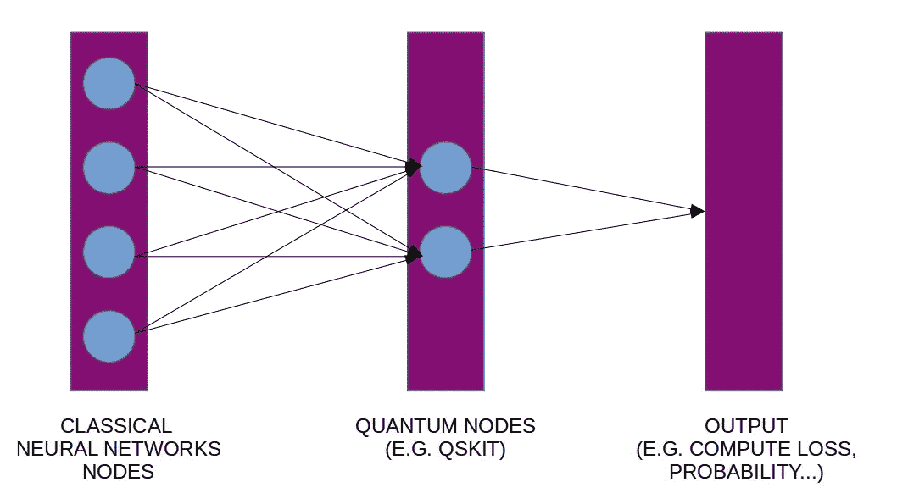
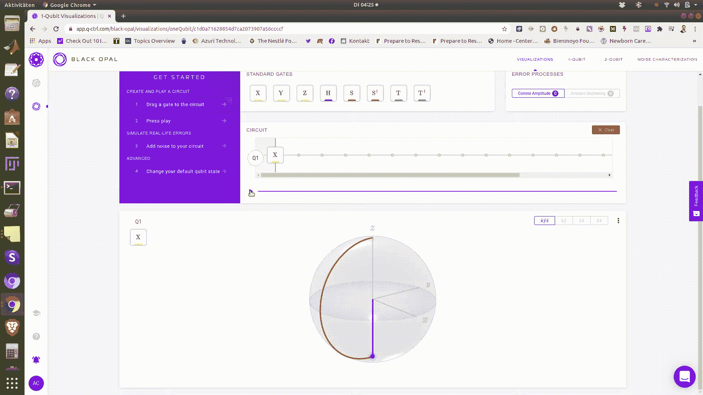
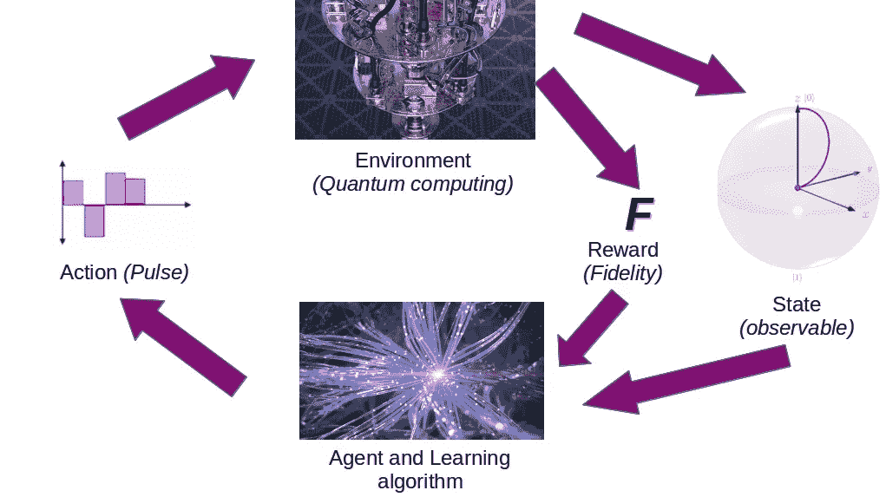
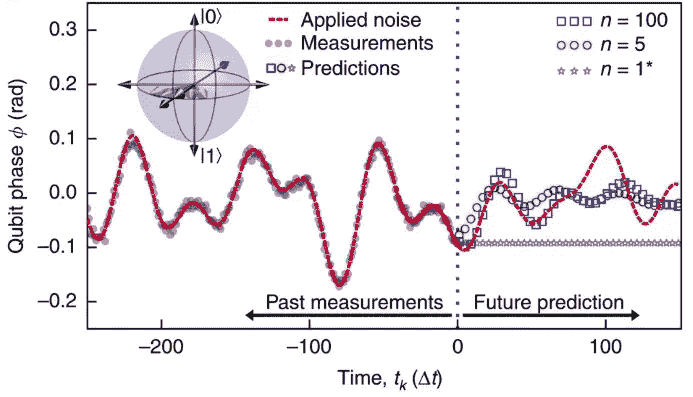

# 不要问量子计算能为机器学习做什么

> 原文：<https://towardsdatascience.com/dont-ask-what-quantum-computing-can-do-for-machine-learning-cc44feeb51e8?source=collection_archive---------17----------------------->

## 问机器学习能为量子计算做什么

作者绘制的图像

量子计算和*机器学习*是我们这个时代的热门词汇。除了明确的炒作，还有一些真实的依据。随着传统计算的进步，我们能够在基于机器学习和其他领域的图像相关分析中取得令人难以置信的结果。另一方面，量子物理学一直是某种困难的神秘领域，导致数学的惊人进步(以及许多完全不科学的伪科学)。量子计算正在成为克服传统计算的一些限制的新途径，包括小型化晶体管的物理限制。去年，人们已经将量子计算作为神经网络的*层*或者作为*贝叶斯天真分类器*对待。

请点击此处了解更多信息:

<https://medium.com/illumination-curated/is-quantum-machine-learning-the-next-thing-6328b594f424>  

2020 年 3 月，谷歌宣布发布[tensor flow Quantum](https://ai.googleblog.com/2020/03/announcing-tensorflow-quantum-open.html)——一系列结合了最先进的机器学习和量子计算算法的工具。

> 总之，这个想法是使用量子计算作为分类系统中的一个步骤，但是我们也可以反过来想。

量子机器学习分类器的典型设置。作者图片。

反过来，Q-CTRL 是一家位于悉尼和洛杉矶之间专注于量子计算的公司的先驱。

> 铺平的道路是专注于量子计算，并有效地使用机器学习来抑制噪声和量子硬件缺陷的影响。

由于噪音的影响，大多数量子计算机硬件可以在不到一毫秒的时间内执行计算，然后需要重置，目前这还不如一台低成本的笔记本电脑。结果比听起来要糟糕得多，在下一节中会有更好的解释。

# 脱散

当量子计算机中经典二进制位的量子版本 *qu 位暴露于硬件噪声时，其中的信息非常容易退化。这个过程被称为*消相干*。这是我们仍然处于量子计算初级阶段的原因之一。在下面的截屏中，我记录了一个理想情况下的单个量子位估计，在硬件噪声的影响下也是如此。从一个量子位来看，这似乎并不悲惨，但想象执行一项任务所需的所有量子位，可以让我们知道与 RaspberryPi 或手机相比，结果会有多嘈杂。*

1 量子位预期结果来自(作者截屏)

噪声导致 1 个量子位(作者截屏)

我们如何解决退相干？自 90 年代末以来，像安德鲁·斯蒂安和 T2·彼得·肖这样的人已经提出了通过引入某种冗余来补偿它的模型，这在我们当前的量子计算机中是不可行的，如果你想象大量的比特(你将需要重复每个量子比特几次)。

Q-CTRL 的解决方案是基于机器学习创建固件，可以修复退相干，而不需要额外的不可行的硬件。

量子计算硬件基于光-物质相互作用(光学硬件)来执行量子逻辑操作。这些电磁信号的组成实际上是可以由机器学习工具定义/提炼的算法。这个笨重的圆圈应该可以减少退相干。为了真正理解这种方法，需要一个典型的机器学习专家所不具备的量子计算知识。我尽我最大的努力在下面的部分进行总结。

Q-CTRL 解决方案被称为 BOULDER OPAL，它是一个 Python 包，可以通过在终端中键入来轻松安装

> pip 安装质量控制

并简单地将其导入为

> 从质量控制导入质量控制

剩下的如何设置[哈密顿量](https://en.wikipedia.org/wiki/Hamiltonian_(quantum_mechanics))，移相，控制等等……是一个独立的话题(如果你感兴趣，你可以从下面的教程中学习或者阅读[文档](https://docs.q-ctrl.com/boulder-opal/user-guides/set-up-quantum-systems))。关键的方面是，为了实现控制，从而降低噪声，*复杂的基于梯度的优化*可以通过使用 TensorFlow 或其他机器学习工具来实现，这将在下面关于强化学习的章节中讨论。

# 强化学习

在可用于控制噪声的优化中， ***强化学习*** 已经被成功利用。强化学习是[机器学习](https://en.wikipedia.org/wiki/Machine_learning)的一个领域，其中智能代理在一个环境中采取行动，以最大化一个累积 ***奖励*** 。

量子硬件中强化学习的整体观点。图片改编自 iStock

通过量子计算中的强化学习，学习者通过用量子设备本身做实验来创建优化的脉冲。此外，强化学习可以发现和利用我们不知道的新的物理机制。然而，这样做的缺点是，学习者不能告诉你解决方案是如何找到的，所以我们不知道设备中噪声抑制的物理原理。

对于那些更习惯于机器学习而不是量子计算的人，我将在量子物理学和强化学习中使用的术语之间建立一座桥梁:**量子计算机被认为是学习代理的环境。**代理的任务是实现执行高保真度门控的目标。一个代理能够对环境做出各种动作(在我们的例子中，是对量子计算机施加脉冲)。

代理通过使用一组可测量的可观察值和基于其与目标接近程度的奖励来学习达到其目标。我们的*奖励*来源于闸门保真度。学习算法在多次实验后使用这些信息来提高代理的性能。

总结

1.  为了理解环境和状态，代理向量子计算机部署一系列脉冲。
2.  然后，代理获取该状态，并使用该信息来决定下一步要采取的操作。

在实践中，代理获取状态，并使用神经网络来决定对脉冲的下一段采取什么行动。我们量化脉冲的幅度，以便学习者从有限的选项集中进行选择。

一个完整的门脉冲被称为一个*事件，*在事件结束时，由国家给代理人一个奖励(在强化学习术语中)。这允许我们将误差信号提升到测量噪声之上。

前述强化学习可以用各种各样的学习器来执行，包括深度策略梯度、深度确定性策略梯度孪生以及软行动者批评。所有这些学习者都有超参数，在用于真正的实验之前必须进行调整

实验可以在 IBM 的量子计算机上运行，结合众所周知的量子计算工具(如 [QSkit](https://qiskit.org/) )和机器学习工具(如 [SciKit-learn](https://scikit-learn.org/) )。

这种基于机器学习的优化量子计算方法已经证明可以减少硬件错误并提高门保真度:

鸣谢:Q-CTRL/悉尼大学。2017

# 参考

[M. Hidary“量子计算:一种实用方法”](https://www.springer.com/gp/book/9783030239213)

[T. Jaksch，R. Ortner，P. Auer《强化学习的近似最优后悔界限》](https://jmlr.csail.mit.edu/papers/v11/jaksch10a.html)

[Q-CTRL 量子固件](https://q-ctrl.com/foundations/quantum-firmware/)

# 如果你愿意，可以和我联系

[www.yawlab.io](http://www.yawlab.io/)

[@ Dr _ Alex _ 克里米](https://twitter.com/Dr_Alex_Crimi)

[@ Alec rimi 博士](https://www.instagram.com/dr.alecrimi/)

[https://www.linkedin.com/in/alecrimi/](https://www.linkedin.com/in/alecrimi/)