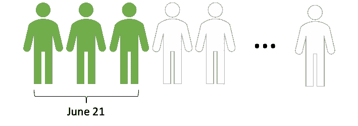
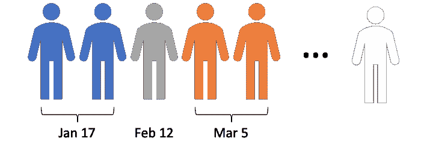
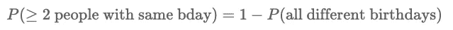
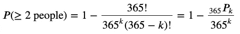
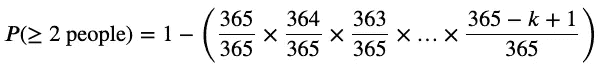
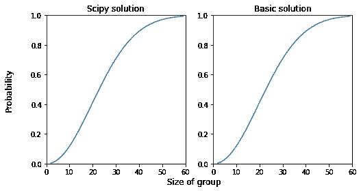
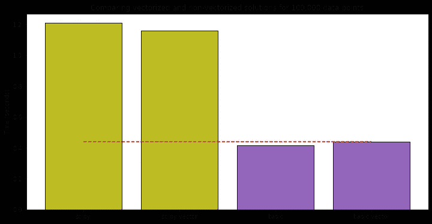

# 不要认为 NumPy.vectorize 更快

> 原文：<https://towardsdatascience.com/dont-assume-numpy-vectorize-is-faster-dd7e455dba2?source=collection_archive---------12----------------------->

## 用不同的向量化函数解决生日悖论


照片由 [Adi Goldstein](https://unsplash.com/@adigold1?utm_source=medium&utm_medium=referral) 在 [Unsplash](https://unsplash.com?utm_source=medium&utm_medium=referral) 上拍摄

循环是您在编程中学习的第一个构造之一，但是对数组中的每个元素执行操作时，循环可能是一种过于冗长的方式。NumPy 提供了一个叫做`vectorize`的便捷方法，用**更少的代码行**对数组执行操作。许多人认为这个函数也能提高性能。在本文中，我将向您展示如何使用`vectorize`(这部分很简单)，以及它是否能提高性能。我将通过使用两个非常不同的 Python 函数解决一个常见的统计学问题(生日悖论)来实现这一点。

在我进入实现之前，解决争议是很重要的。同样，一些人观察到`vectorize`比普通的`for`循环要快，但是甚至 NumPy [文档](https://numpy.org/doc/stable/reference/generated/numpy.vectorize.html)也声明:

> “`**vectorize**`功能主要是为了方便，而不是为了性能。该实现本质上是一个 for 循环。

文档是否正确？我将向你介绍我的实验。在本文的最后，我将发布 Jupyter 笔记本，其中包含为本文执行的所有代码和测试，因此您可以复制我的发现。在讨论发现之前，我先解释一下这个例子中用到的问题:生日悖论。

# 生日悖论解释

在一群人中，两个或两个以上的人同一天生日的概率是多少？当小组由两个人组成时，它是相当小的(大约百分之一的四分之一)，如果小组由 366 人组成，它就变成 100%(忽略闰年)。2 到 366 人之间的概率是什么样子的？这就是生日悖论，有时被称为生日问题。

悖论检验了“两个或更多”人同一天生日的概率。这当然意味着三个人可能有同一天生日，如下图所示。或者四个人…



同一天生日的三个人——作者图片

或者两个*集合*的人可能有相同的生日，而集合本身彼此不同，如下所示。



两组相同的生日——作者图片

两个****或更多*** 的人可能有很多相同的生日，因此更容易计算出**的补数**，或*没有人*有相同生日的概率。*

**

*我不打算深入讨论得出数学解的细节，因为《走向数据科学》的撰稿人 Cassie Kozyrkov 已经在本文[中介绍过了。我将直接跳到解决方案(数学方程和相应的 Python)。](/using-the-birthday-paradox-to-teach-probability-fundamentals-c08bbcb351d1)*

## *解决方案 1:科学的方法*

*第一种解决方案使用一种不寻常的符号(下标在 *P* 的两侧)来表示排列。读作“365 选 *k* ”*

**

*好消息是 Python `scipy`库有一个排列函数，可以产生答案！Python 代码远没有上面的等式那么可怕。还有什么比一行函数更简单的呢？*

```
*import scipy.special as sppdef bday_scipy(k):
    return 1 - spp.perm(365,k) / 365**k*
```

## *解决方案 2:“基本”方法*

*第二种解决方案是一种基本的暴力方法。它由随着组大小( *k* )的增加而重复相乘的分数组成。缩小的分数表明，随着群体规模的增加，没有人同一天生日的概率降低(因此两个或更多人同一天生日的机会增加)。*

**

*这个解决方案的 Python 表示比第一个解决方案要长，但是很容易理解。*

```
*def bday_basic(k):
    p = 1.
    for idx in range(1,k):
        p *= (365-idx) / 365
    return 1-p*
```

## *比较两种解决方案*

*我上面提出的两个方程在数学上是相同的。这些术语被不同地分组以突出不同的模式，但是它们是相同的。如果这是杰拉尔德·兰博教授的课，我会用数学方法证明。相反，我将用图表证明它。*

*下图显示两个函数产生相同的结果。我还比较了这些图表中的值，发现差异在零和`2.22e-16`(本质上是零)之间。换句话说，这两个函数**产生** **同样的结果**。*

**

*同一个问题的两种解决方案会产生相同的结果——作者图片*

> *这两种方法在数学上是相同的，但是有不同的 Python 实现。这正是我想要的，以便比较性能。*

# *用 NumPy 向量化生日悖论*

*同样，我对同一个问题有两种不同的方法:*

```
*import scipy.special as sppdef bday_scipy(k):
    return 1 - spp.perm(365,k) / 365**kdef bday_basic(k):
    p = 1.
    for idx in range(1,k):
        p *= (365-idx) / 365
    return 1-p*
```

*在使用上述函数的矢量化版本之前，我必须创建矢量化版本。这很简单:*

```
*import numpy as np
scipy_vect = np.vectorize(bday_scipy)
basic_vect = np.vectorize(bday_basic)*
```

*现在我有了两个“普通的”Python 函数和它们的向量等价物。这些向量可以应用于 NumPy 数组*而无需循环*。下面的代码创建一个表示组大小的整数数组，并计算该组中两个或更多人同一天生日的概率。这里没有`for`循环！*

```
*group_size = np.arange(2,60,dtype='uint')# calculate probability for the entire range of group sizes
scipy_probability = scipy_vect(group_size)*
```

*和*

```
*basic_probability = basic_vect(group_size)*
```

*下面是`basic_probability`的样子:*

```
*array([0.00273973, 0.00820417, 0.01635591, 0.02713557, 0.04046248,
       0.0562357 , 0.07433529, 0.09462383, 0.11694818, 0.14114138,
       0.16702479, 0.19441028, 0.22310251, 0.25290132, 0.28360401,
       0.31500767, 0.34691142, 0.37911853, 0.41143838, 0.44368834,
       0.47569531, 0.50729723, 0.53834426, 0.5686997 , 0.59824082,
       0.62685928, 0.65446147, 0.68096854, 0.70631624, 0.73045463,
       0.75334753, 0.77497185, 0.79531686, 0.81438324, 0.83218211,
       0.84873401, 0.86406782, 0.87821966, 0.89123181, 0.90315161,
       0.91403047, 0.92392286, 0.93288537, 0.9409759 , 0.94825284,
       0.9547744 , 0.96059797, 0.96577961, 0.97037358, 0.97443199,
       0.97800451, 0.98113811, 0.98387696, 0.98626229, 0.98833235,
       0.99012246, 0.99166498, 0.99298945])*
```

*从编码的角度来看，NumPy `vectorize`很方便，因为它非常简洁。但是它的表现如何呢？矢量化的函数比非矢量化的快吗？或者 NumPy 文档是否正确？*

# *比较向量化和非向量化函数的性能*

*对于本文前面定义的生日悖论，我有两个解决方案:*

*   *`bday_scipy`*
*   *`bday_basic`*

*我还创建了每个的 NumPy 矢量化版本:*

*   *`scipy_vect`*
*   *`basic_vect`*

*他们如何比较？什么更快？在上一节中，我向您展示了如何使用矢量化函数。您已经知道如何将“普通”(非矢量化)Python 函数放入一个`for`循环中:*

```
*probability = []
for k in group_size:
    probability.append(bday_scipy(k))*
```

*和*

```
*probability = []
for k in group_size:
    probability.append(bday_basic(k))*
```

*为了比较性能，我将`group_size`定义为一个数组长度为 100，000 的 NumPy 随机整数数组，并使用 Python 的`timeit`多次执行四种方法中的每一种，以绘制平均性能图。*

*请参考下图了解结果。我发现`scipy`矢量化函数比非矢量化函数稍微快**一点**，如下图中橄榄色条所示。重点是轻微的。在下图所示的试验中，矢量化函数的速度提高了 4%。它并不像其他人有时声称的那样快 2 倍或 100 倍。*

*我发现`basic`矢量化的函数比非矢量化的函数稍慢**，如上图中紫色条所示。实际上慢了 6%!同样，这些差异是轻微的(不是两倍慢)。***

******

***性能结果—按作者分类的图片***

***我多次执行这些测试，矢量化和非矢量化函数之间的差异并不大，但是测试之间的关系都与上图相似。***

***请注意，紫色条的高度都是橄榄色条的一半。换句话说，两个版本的“基本”解决方案都比两个版本的“科学”解决方案快一倍！***

# ***结论***

***这个精心设计的实验的结果留给我一个相当沉闷的结论，即 NumPy 文档是正确的。***

> ***“`vectorize`功能主要是为了方便，而不是为了性能。该实现本质上是一个 for 循环。***

***我同意 Chelsea Troy 在[这篇非常透彻的博客](https://chelseatroy.com/2018/11/07/code-mechanic-numpy-vectorization/)中的观点，NumPy 本身使用了一些针对 C 语言高度优化的循环结构，但是 NumPy `vectorize`函数显然没有**而不是**使用并行化。***

***这两种算法之间的性能差异要比函数的矢量化版本和非矢量化版本之间的性能差异大得多。“基本”解决方案每次完成的时间不到“科学”解决方案的一半。这突出了选择正确的算法可能对性能有最大的影响。***

***如果您关心性能，请投入时间寻找合适的算法。如果你关心代码的优雅，使用`numpy.vectorize`。我个人喜欢两样都做！***

***正如所承诺的，这里是本文使用的所有代码:***