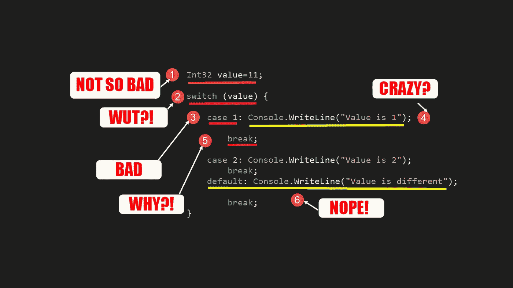
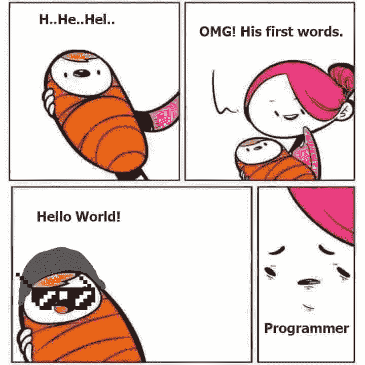
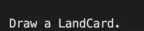

# 不要成为一个基本的编码者，使用 5 种可能性来避免糟糕的切换情况

> 原文：<https://towardsdatascience.com/dont-be-a-basic-coder-and-use-5-possibilities-to-avoid-the-bad-switch-case-c92402f4061?source=collection_archive---------3----------------------->

## 您编写真正灵活和可伸缩代码的方法



图片由[作者](https://www.udemy.com/user/arnold-abraham-3/)

您想到的第一个问题是:为什么要避免 switch-case 结构？

想象你正在做你梦想中的项目，一切都很好。你不断地实现特性。但是你突然想到:

*为什么我会不断地向任何开关盒添加新盒？*

*为什么我要不断修改以前运行良好的代码？*

阅读本文几个月后，您将真正能够构建健壮的、可伸缩的应用程序。代码写一次，重复使用，直到调用树烧毁。在不改变旧代码的情况下添加新功能。甚至一个可理解的 git 历史也得到保证，一个项目/游戏/应用也进化了，而不是突变了。

***而这一切都是因为你已经学会了*** [***避免使用 switch——case***](https://bit.ly/3vuZxsk)***。***

# 背后的原因

你可能理解开关的情况，因为他们有一个低的学习曲线，并导致相当舒适的使用。它是初级和中级程序员的默认工具集。但是使用它们也有一些缺点。

它们在创建初始用例集的过程中工作得很好，但是一旦你必须扩展它们，它们就会变得不方便并使你的代码膨胀。

此外，当您想要映射复杂的场景时，switch-case 是一团乱麻。

在我多年的 C#开发中，我大量使用了切换用例，并多次遇到切换用例的缺点:

*   不使用变量意味着更少的灵活性和硬编码情况
*   在多种情况下不使用同一个常量意味着运行时灵活性降低
*   没有使用关系表达式(==，！=，<= etc.)
*   No usage of float or constants
*   Not expandable by redefining the environment, need to redefine switch-case

# The Fundamental Problem of Switch-Case

Let’s imagine we want to make a trading card game, and we are about to realize a fundamental part of the game.

*在一个回合中从一副牌中抽牌。*

因此，我们需要`CardDeck`的类，以便以后从中抽牌。

`CardDeck`是一个类，并且有一个字段`amountOfCards`用于表示剩余要抽的牌的数量。

# 使用开关盒进行操作



图片来自 Pinterest 上的[编码迷因](https://in.pinterest.com/sachmon1000/coding-meme/)

要从一个初级程序员起步，我们必须首先像一个初级程序员一样思考。

因此，第一种方法旨在使用开关盒。

`Draw()`函数将检查该事实，并接受牌组和牌的类型作为参数:

每张抽牌都要告诉我们抽到了什么样的牌。将有 4 个选项:

1.  怪物卡
2.  魔法卡片
3.  陷阱卡
4.  土地卡

如果至少还有 1 张牌，我们将随机得到一个进入开关盒的条目`cardTypes`。无论画了什么，调用`PutCardToHand()`都会打印出类型。

现在`Main`函数调用这段代码。我们首先将这个 draw 函数放在一个公共类`SwitchCaseUser`中，意思是实例化:

另外，`cardTypes`在这里被定义为一个字符串数组。这段代码会导致



虽然这款电源线工作正常，也达到了设计目的，但我们面临着 3 个关键问题:

1.  **switch-case 是硬编码的**:定义要在外部绘制的类型将使这个函数与这个外部世界紧密耦合。这个函数哪里知道自己在抽什么牌？外部空间的变化将改变该函数内部的情况。
2.  **定义可以在该函数中绘制的卡片类型**会导致同样的问题，因为现在该函数明确地知道可以绘制什么。但是为什么绘图函数必须知道这些呢？绘制函数应该绘制，不管它在绘制什么。在这种情况下，卡类型的改变也意味着开关外壳的改变。
3.  **扩展这个行为很笨重，代码也不灵活**。因为一旦我们有了一个完整的功能类，它准确地做了它应该做的事情，并且做得很好，它应该永远保持原样。我们应该以有效的代码方式编程，并且应该一直有效。如果外部行为改变，不要再触摸它。这意味着传递所有需要的引用来实现这个结果，并且独立于已经传递的内容。

***避免开关盒将有助于消除所有提到的缺点。***

# 避免开关盒— 5 种可能性


图片由[memegenerator.net](https://memegenerator.net/instance/67304044/dr-evil-meme-best-practice)

同样，我们将卡片组和卡片类型交给我们的`Draw()`函数，但是这次我们不使用开关盒。相反，我们使用**五种不同的方法**来避免切换情况。

对于所有五种方法，函数的每个头和每个第一部分都是相同的:

if 语句中有可互换的部分:

第一个和第二个选项在避免切换的情况下保持原来的字符串数组`cardTypes`。所有其他的例子都基于到一个`List<string>`的转换。

> 这只是对开关情况的有意义替换的简短比较。如果您想要对每种技术有更深入的解释，您可以在 Robert C. Martin 的《干净的代码》一书中找到它们。

## #1 For 循环/ ForEach 循环

for 循环遍历数组，将`cardType`与来自`cardTypes`的所有条目进行比较，并将匹配传递给`PutCardToHand`函数。

## #2 本地功能

局部函数的功能与 for 循环几乎相同，但它使用 forEach 循环将其封装到一个局部函数中。

一些恶意的人可能会说这只是像#1 一样的一种复杂的方式，但是这是一个展示，本地函数在更高级的用例中变得有趣。

## #3 索引方法

现在将`array`转换为`list`。

因为有一个列表可供我们使用，所以我们可以使用一些先验函数来聚集它们。

我们的`cardTypesList`现在可以访问一组功能(微软文档中的完整指南[)。一个是`indexOf`方法，它返回匹配我们输入的条目的索引。](https://docs.microsoft.com/de-de/dotnet/api/system.collections.generic.list-1?view=netframework-4.8)

将这个传递给我们的函数`PutCardToHand`将会得到想要的行为。

## #4 匿名方法


图片来自 [Filmstarts.de](https://www.filmstarts.de/nachrichten/18520774.html)

匿名的方法就像是 Wile E. Coyote 和他那晦涩的武器去抓走鹃。Meep Meep。

我们必须处理定义开销。

命名函数中的匿名函数作为参数会导致函数定义的双重麻烦。

这是一种相当沉重的编码方式，因此，以后也不容易理解。要注意！

```
((Func<string (inputParameter1), List<string> (inputParameter2), string (return parameter)>) anonymousFunction(inputParameter1, inputParameter2, returnParameter)
{
  Lambda Expression returning cardType}(passingParameter1, passingParameter2) <- Instant Invokation
```

这个匿名函数的典型用法是当有一个大型数据集传入时，我们只需要在代码的这个特定部分聚合属性的子集，或者另一个典型用法是当您只需要在此时此地对数据做一次事情时。

因此，定义一个命名函数并污染你的类空间是没有必要的。

更容易理解的方法是将匿名函数存储在委托中，然后像这样调用它:

尽管如此，匿名函数应该保持简短。

## # 5λ-表达式


图片由[dark waters syndicate](http://www.darkwatersyndicate.com/archives/redefining-bronchitis-aint-nobody-got-time-for-that)

在这种情况下，匿名函数既长又过分。我掩护你。因此，对于这类问题，lambda 表达式是简单而正确的。

看看你能多短多快得到结果。

这是一个简单的 oneliner，使用列表的`Find()`方法。

关于匿名函数有效的东西在这里也是有效的，因为 Lambda 表达式是一个增强的匿名函数。

# Main 中的调用—避免切换案例结尾

因为这是为了避免切换的情况，所以我将所有的选择打包到了`SwitchCaseAvoider`类中。

在 main 中，我们把它叫做，就像另一个一样:

会导致


# 结论

并非所有这些都是处理这种特定情况的最佳方式。

如果您试图在大型数据集中使用它们来获得一个匹配，其中一些(如 for 循环或 forEach 循环)会变得计算密集型。此外，还有内置功能(例如，用于集合)。

他们的共同点是:

**它们可以通过重新定义环境来扩展，而不是功能本身。**

因此，有一个比处理特定问题的最佳方法更重要的原则要实现。

你的程序不能解决特定的问题；他们总能解决一个或多个复杂的问题。履行总体原则，比如在 Unity 中用我的 SOLID 系列创作游戏更为重要。

***感谢您的阅读，如果您想要更多优秀的经过处理的编程内容，*** [***请访问我在 Udemy 上的奇遇***](https://www.udemy.com/user/arnold-abraham-3/) ***关于 C#和 SQL。***

# 预选套装物品

<https://medium.com/geekculture/how-net-5-breaks-your-c-coding-project-with-the-data-type-string-be41ea48f0a2>  <https://medium.com/nerd-for-tech/the-reasons-not-to-migrate-from-javascript-to-typescript-89b587ed9ac9>  <https://medium.com/front-end-weekly/how-naming-ruins-your-code-6f3a53a380b9> 