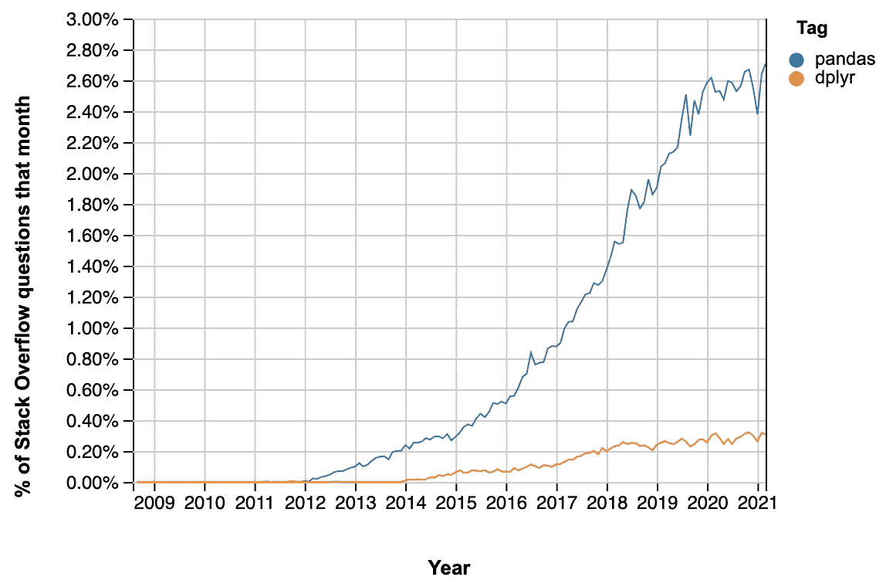

# 不要被 Python 的天花乱坠所迷惑

> 原文：<https://towardsdatascience.com/dont-be-fooled-by-the-hype-python-s-got-c92183ab33ea?source=collection_archive---------9----------------------->

## 仍然是你想要的工具


在 [Unsplash](https://unsplash.com/s/photos/hype?utm_source=unsplash&utm_medium=referral&utm_content=creditCopyText) 上拍摄的 [Verena Yunita Yapi](https://unsplash.com/@verenayunita?utm_source=unsplash&utm_medium=referral&utm_content=creditCopyText)

*如果你认为副标题中有错别字，那就想想 JLO(:*

众所周知，python 在 DS 从业者中的流行程度在过去几年中飙升，这表明一方面有抱负的 DS 和另一方面的组织都像滚雪球一样更喜欢 python 而不是 R。

展示 python 崛起的一种流行方式是，用标签“pandas”来绘制栈溢出中所提问题的分数，与“dplyr”进行比较:



[https://insights.stackoverflow.com/trends?tags=pandas%2Cdplyr](https://insights.stackoverflow.com/trends?tags=pandas%2Cdplyr)

但是这个图表还讲述了另一个故事:所有这些新的 pandas 用户搜索堆栈过度溢出，因为 pandas 真的很难理解。我将在本文后面用几个常见操作的例子来证明这个断言，这些操作在 dplyr 中很简单，但在 pandas 中需要我们大多数人去搜索堆栈溢出。

我非常相信使用正确的工具来完成工作(在过去的 6 个月里，我一直在为我们基于 Java 的生产环境编写 Scala Spark)。对于大多数数据科学家来说，数据争论占据了大部分工作，这已经成为共识。


经 https://scientistcafe.com/2017/03/25/whatisdatascience.html[许可拍摄](https://scientistcafe.com/2017/03/25/whatisdatascience.html)

由此可见，与 pandas 用户相比，dplyr 用户大部分时间都能享受到工作效率的提升。r 在许多其他领域也有优势:可用的 ide、包管理、数据结构和许多其他领域。

这些优势是如此之多，以至于在一篇文章中涵盖所有这些优势是不切实际的。为此，我已经开始在一个专门的 [github repo](https://github.com/IyarLin/R-advantages-over-python#readme) 中汇编 R 相对于 python 的所有优势。我计划从这篇文章开始，在一系列的文章中分批分享它们。

在列举不同的原因时，我尽量避免以下情况:

1.  太主观的比较。例如，函数缩进和花括号结束。
2.  一段时间后人们可以习惯的问题，如 python 索引(尽管它从 0 开始，或者 object[0:2]只返回前 2 个元素的事实仍然偶尔会让我迷惑)。

你可能会问，我希望通过这个完成什么？我希望:

1.  组织意识到使用 R 的价值，并更多地选择使用它来代替 python。
2.  结果，python 开发人员社区意识到了可以改进其 DS 产品的方法，并采取了相应的行动。python 已经从 R 中借用了一些很棒的概念(例如，数据帧、[因子数据类型](https://pandas.pydata.org/pandas-docs/stable/user_guide/categorical.html)、 [pydatatable](https://github.com/h2oai/datatable) 、 [ggplot](https://plotnine.readthedocs.io/en/stable/) ) —更重要的是，它这样做了，所以当我们必须使用 python 时，我们可以享受它们。

现在，我不认为在任何可以想象的场景中，R 都比 python 更好。我只是希望意识到 R 提供的优势会鼓励组织考虑更多地使用它。

好了，现在来谈谈举证责任。下面我将给出几个例子来说明为什么在 dplyr 中大多数操作都很简单，而在 pandas 中它们经常需要搜索堆栈溢出。这也是为什么 dplyr 比熊猫更容易相处的原因。关于 R 相对于 python 的其他优势，请参见 [repo](https://github.com/IyarLin/R-advantages-over-python#readme) 。

我们从一个简单的例子开始:计算 iris 数据集中每个物种的平均萼片长度。

在 dplyr 中:

```
iris %>%
  group_by(Species) %>%
  summarise(mean_length = mean(Sepal.Length))
```

在熊猫身上做同样事情的一个常见方法是使用 *agg* 方法:

```
(
  iris
  .groupby('Species')
  .agg({'Sepal.Length':'mean'})
  .rename({'Sepal.Length':'mean_length'}, axis = 1)
)
```

我们可以看到 pandas 需要一个额外的*重命名*调用。

我们可以通过向 *agg* 传递一个元组来避免额外的*重命名*:

```
(
  iris
  .groupby('Species')
  .agg(mean_length = ('Sepal.Length', 'mean'))
)
```

虽然这看起来更接近 dplyr 语法，但它也强调了一个事实，即有多种方法可以使用 *agg* 方法——与在 R 中有许多方法可以做同样的事情而在 python 中只有一种明显的方法的常识相反。

现在，假设我们想要使用加权平均值(以萼片宽度作为权重)。

在 dplyr 中，我们使用带附加参数的加权均值函数:

```
iris %>%
  group_by(Species) %>%
  summarize(weighted_mean_length = 
            weighted.mean(Sepal.Length, Sepal.Width))
```

相当直接。事实上，它非常简单，我们可以即时进行实际的加权平均值计算:

```
iris %>%
  group_by(Species) %>%
  summarize(weighted_mean_length = 
            sum(Sepal.Length * Sepal.Width)/ sum(Sepal.Width))
```

对熊猫来说，这并不简单。人们不能仅仅改变上面的例子。

在搜索堆栈溢出时，我发现了下面的[解决方案](https://stackoverflow.com/a/10964938/5472037)，在撰写本文时，它获得了 104 张赞成票，并在其中添加了几行以获得我们想要的结果:

```
def wavg(group):
    d = group['Sepal.Length']
    w = group['Sepal.Width']
    return (d * w).sum() / w.sum()(
    iris.groupby('Species')
    .apply(wavg)
    .to_frame()
    .rename({0:'weighted_mean_length'}, axis = 1)
)
```

更好的解决方案是:

```
def wavg(group):
    d = group['Sepal.Length']
    w = group['Sepal.Width']
    return pd.Series({'weighted_mean_length':(d * w).sum() / w.sum()})(
    iris.groupby('Species')
    .apply(wavg)
)
```

最后，一位评论员指出，有一个更优雅的解决方案，但即使是他的解决方案也必须做一些修改才能达到我们的目的:

```
(
  iris
  .groupby('Species')
  .apply(lambda x: pd.Series({'weighted_mean_length':
np.average(x['Sepal.Length'], 
weights = x['Sepal.Width'])}))
)
```

总结一下:python 的禅宗说:“应该有一种——最好只有一种——显而易见的方法来做这件事。”。我们可以看到，对于 dplyr 来说，这是非常正确的，而在熊猫中，你有许多许多不同的方式，没有一个是显而易见的，所有都相对繁琐。

# 窗口功能

# 窗口上的聚合

假设我们想要计算每个物种的萼片长度的平均值，并将其附加到原始数据集(在 SQL: SUM(Sepal。长度)超过(按物种划分))将是:

```
(
  iris
  .assign(mean_sepal = lambda x: 
  x.groupby('Species')['Sepal.Length']
  .transform(np.mean))
)
```

我们可以看到，这需要一个专用的方法(*转换*)，相比之下，dplyr 只需要添加一个 *group_by* :

```
iris %>%
  group_by(Species) %>%
  mutate(mean_sepal = mean(Sepal.Length))
```

现在假设我们想对一个有两个参数变量的函数做同样的事情。在 dplyr 中，它非常简单，只是对前面的代码做了一个小而直观的调整:

```
iris %>%
  group_by(Species) %>%
  mutate(mean_sepal = 
         weighted.mean(Sepal.Length, Sepal.Width))
```

我无法想出一种方法来使用一个具有 1 个以上输入变量的函数，例如熊猫的加权平均值。

# 扩展窗口

现在假设我们想要计算萼片的展开和。萼片长度增加。每种内的宽度(单位为 SQL: SUM(萼片。长度)超过(按种划分，按萼片排序。宽度))

在 dplyr 中，这非常简单:

```
iris %>%
  arrange(Species, Sepal.Width) %>%
  group_by(Species) %>%
  mutate(expanding_sepal_sum = 
         sapply(1:n(), 
                function(x) sum(Sepal.Length[1:x])))
```

注意，我们不需要记住任何额外的函数/方法。您使用无处不在的工具(例如 sapply)找到了一个解决方案，只需将其插入到 dplyr 链中。

在 pandas 中，我们将不得不搜索堆栈溢出来提出*扩展*方法:

```
(
  iris
  .sort_values(['Species', 'Sepal.Width'])
  .groupby('Species')
  .expanding()
  .agg({'Sepal.Length': 'sum'})
  .rename({'Sepal.Length':'expanding_sepal_sum'}, axis = 1)
)
```

同样，我们需要使用一个额外的*重命名*调用。

为了避免额外的*重命名*，你可能想要像我们上面做的那样将一个元组传递给 *agg* ，但是出于某种原因，下面的语法不起作用:

```
(
  iris
  .sort_values(['Species', 'Sepal.Width'])
  .groupby('Species')
  .expanding()
  .agg(expanding_sepal_sum = ('Sepal.Length', 'sum'))
)
```

您也可以通过使用以下眼霜来避免额外的*重命名*:

```
(
  iris.assign(expanding_sepal_sum = lambda x:x.sort_values(['Species', 'Sepal.Width'])
                .groupby('Species')
                .expanding().agg({'Sepal.Length': 'sum'})
                .reset_index()['Sepal.Length'])
)
```

# 移动窗口

现在，假设我们想要计算一个移动中心窗口平均值(在 SQL: AVG(Sepal。长度)超过(按种划分，按萼片排序。EN 2 之前和之后 2 行之间行宽)

和往常一样，在 dplyr 中，这非常简单:

```
iris %>%
  arrange(Species, Sepal.Width) %>%
  group_by(Species) %>%
  mutate(moving_mean_sepal_length = sapply(
    1:n(),
    function(x) mean(Sepal.Length[max(x - 2, 1):min(x + 2, n())])
  ))
```

与其他示例一样，您所要做的就是使用无处不在的工具找到一个解决方案，并将其插入到 dplyr 链中。

在熊猫中，我们必须查找*滚动*方法，阅读它的文档并得出以下结论:

```
(
  iris
  .sort_values(['Species', 'Sepal.Width']).groupby('Species')
  .rolling(window = 5, center = True, 
           min_periods = 1)
  .agg({'Sepal.Length': 'mean'})
  .rename({'Sepal.Length':'moving_mean_sepal_length'}, axis = 1)
)
```

这个帖子到此为止。如果你还不是皈依者，请在本系列的下一篇文章中关注更多的例子。您还可以在“R 优于 python”[repo](https://github.com/IyarLin/R-advantages-over-python#readme)中查看更多示例。