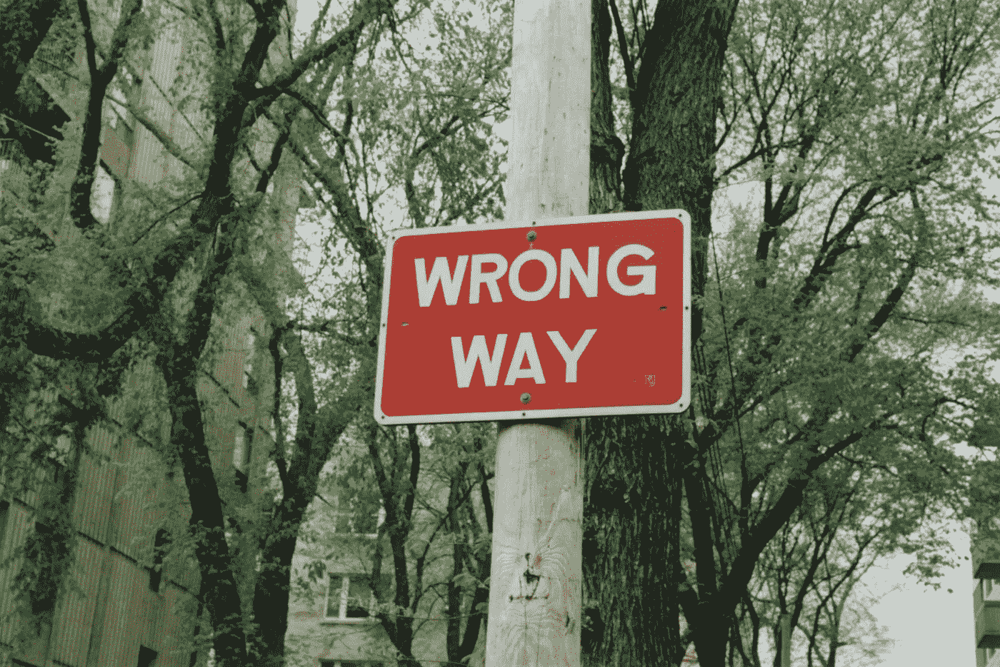
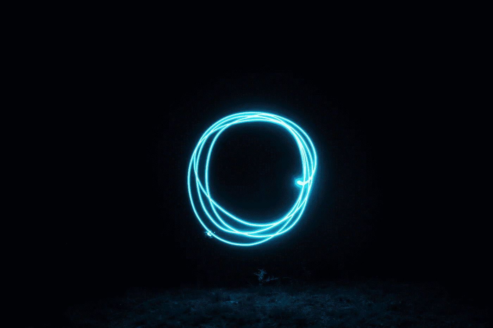

# 在下一次数据科学面试中，不要做这三件事

> 原文：<https://towardsdatascience.com/dont-do-these-3-things-in-your-next-data-science-interview-64f24528ce10?source=collection_archive---------14----------------------->

## 意见

## …作为一名面试官，我应该避免什么



兰迪·雷伯恩在[Unsplash](https://unsplash.com/s/photos/don%27t?utm_source=unsplash&utm_medium=referral&utm_content=creditCopyText)【1】上拍摄的照片。

# 目录

1.  介绍
2.  假装知道答案
3.  沿着长切线前进
4.  围绕您的数据科学
5.  摘要
6.  参考

# 介绍

从我参加数据科学面试的经历来看，我经历过各种各样的应聘者，他们展现了一些他们应该有的东西，一些他们不应该有的东西。在这篇文章中，我们将讨论在下一次数据科学面试中应该避免什么(*其中一些也适用于非数据科学面试*)。下面，我将给出一些我个人认为是你在面试中应该避免的事情，以及应该怎么做。

# 假装知道答案


照片由[绿色变色龙](https://unsplash.com/@craftedbygc?utm_source=unsplash&utm_medium=referral&utm_content=creditCopyText)在[Unsplash](https://unsplash.com/s/photos/quiz?utm_source=unsplash&utm_medium=referral&utm_content=creditCopyText)【2】上拍摄。

我以前面试的时候绝对是这个*禁忌*的罪魁祸首。假装知道答案的一个可能原因是害怕被拒绝。然而，真正令人赞赏的是相反的情况，当你试图回答你确实知道的问题，或者你完全说你只是不知道。这可能会让一些人感到惊讶，但我宁愿有人说他们不知道某事，而不是假装、撒谎或绕着答案打转。

不知道所有事情真的没关系，一些面试官可能只是评估你的知识，而不是测试你，而是知道他们需要教你什么。此外，很高兴知道你在面试中完全诚实和坦率，所以当你得到这份工作时，所有的期望都建立在你的知识基础上。

如果你表现出你现在可能撒谎，或者现在假装，而有人后来发现了，那么这可能会给未来的工作留下不好的印象。

> 不要做什么:

*   假装，撒谎，或者在答案周围打圈

> 你应该说什么:

*   “我可以告诉你我确实知道这个，但我不知道其余的”
*   “在专业环境中，当我不知道答案时，我会这样做”

总的来说，对我个人来说，听到有人说不知道，我觉得更难能可贵。我认为让一个申请人什么都知道是不公平的。当然， *IDK 的*的数量是有主观限制的，但在数据科学的世界里，数据分析、数据工程、软件工程、机器学习和数据科学本身之间有如此多的重叠，以至于不知道每一个概念、库或技能也没关系。

*注意:这可能只是我的偏好，但我认为诚实和透明可以走得很远，我认为我们都一直在努力。*

# 沿着长切线前进


[Denys Nevozhai](https://unsplash.com/@dnevozhai?utm_source=unsplash&utm_medium=referral&utm_content=creditCopyText) 在[Unsplash](https://unsplash.com/s/photos/roads?utm_source=unsplash&utm_medium=referral&utm_content=creditCopyText)【3】上拍照。

有时候，人们可能认为回答一个问题的时间越长，就意味着他们听起来有更多的知识。相反的情况很可能是真的，当有一个简洁而自信的答案时，面试官会知道你马上就知道答案了，并且可以继续测试你更多的知识。当一个人滔滔不绝地讲几分钟时，也很难跟上。

> 不要做什么:

*   为一个数据科学项目提供答案，这个项目花费的时间比几分钟还要长
*   提示:更长的答案并不意味着更令人印象深刻的答案

> 你应该做什么:

*   通过强调业务问题、约束、利弊以及模型的影响，围绕数据科学项目创建用户故事(模型答案*)*

*总而言之，要简洁，这样面试就更像是一场对话。*

# *围绕您的数据科学*

**

*Javier Esteban 在 Unsplash 上的照片。*

*这个*‘不要’*听起来可能有点模糊。更明确地说，我指的是当你只谈论一个数据科学项目时，它是如何与你相关的。当然，你的回答的主要部分应该展示你的经验和技能，但是有一个主要部分应该涵盖其他部分。*

> *不要做什么:*

*   *只谈一个与你有关的数据科学项目*
*   *“我得到了 98%的模型准确率，这对我真的很好”*
*   *“我主要是自己参与这个项目”(*如果这是真的，没关系，但是如果有更多的人参与，那么请看下面的*)*

> *你应该做什么:*

*   *提及参与模型创建和最终确定的其他人*
*   *讨论涉及的利益相关者*
*   *讨论受益于该模型的不同部门*
*   *“我得到了 98%的模型准确率，这对公司来说非常好，不仅使我们的 KPI 显著提高，还为我们的用户创造了更好的产品”*
*   *“我和许多不同的同事一起研究这个模型，包括我的主要利益相关者，产品经理，以及软件工程师和 UI 开发人员，将完整的模型实现到产品中”*

*总的来说，你可能认为说你自己做了所有事情听起来更令人印象深刻，但这可能会向面试官展示相反的情况。这可能是因为你很难共事，也没有合作经验。*

# *摘要*

*和任何观点类文章一样，有保留地接受建议。你可以用不同的方式给面试官留下印象，而不是试图做你认为他们想看到的事情，做你自己，诚实，开放，通过问题说话，简洁，感谢和讨论帮助你达到你现在位置的人。*

> *以下是你在下一次数据科学面试中要避免的三件事:*

```
** Pretend Knowing the Answer* Going on Long Tangents* Centering Data Science Around You*
```

*我希望你觉得我的文章既有趣又有用。如果您同意或不同意在您的数据科学面试中应该避免的这些事情，请随时在下面发表评论。为什么或为什么不？你认为在数据科学面试中还应该避免哪些事情？这些当然可以进一步澄清，但我希望我能够对数据科学面试和一般面试有所启发，感谢您的阅读！*

****我不属于这些公司中的任何一家。****

**请随时查看我的个人资料、* [Matt Przybyla](https://medium.com/u/abe5272eafd9?source=post_page-----64f24528ce10--------------------------------) 、*和其他文章，并通过以下链接订阅接收我的博客的电子邮件通知，或通过点击屏幕顶部的订阅图标* *点击订阅图标* ***，如果您有任何问题或意见，请在 LinkedIn 上联系我。****

***订阅链接:**[https://datascience2.medium.com/subscribe](https://datascience2.medium.com/subscribe)*

# *参考*

*[1]兰迪·雷伯恩在 [Unsplash](https://unsplash.com/s/photos/don%27t?utm_source=unsplash&utm_medium=referral&utm_content=creditCopyText) 上拍摄的照片，(2021)*

*[2]照片由[绿色变色龙](https://unsplash.com/@craftedbygc?utm_source=unsplash&utm_medium=referral&utm_content=creditCopyText)在 [Unsplash](https://unsplash.com/s/photos/quiz?utm_source=unsplash&utm_medium=referral&utm_content=creditCopyText) 上拍摄，(2015)*

*[3]照片由 [Denys Nevozhai](https://unsplash.com/@dnevozhai?utm_source=unsplash&utm_medium=referral&utm_content=creditCopyText) 在[Unsplash](https://unsplash.com/s/photos/roads?utm_source=unsplash&utm_medium=referral&utm_content=creditCopyText)(2018)拍摄*

*[4]Javier Esteban 在 [Unsplash](https://unsplash.com/s/photos/circle?utm_source=unsplash&utm_medium=referral&utm_content=creditCopyText) 上拍摄的照片，(2018)*