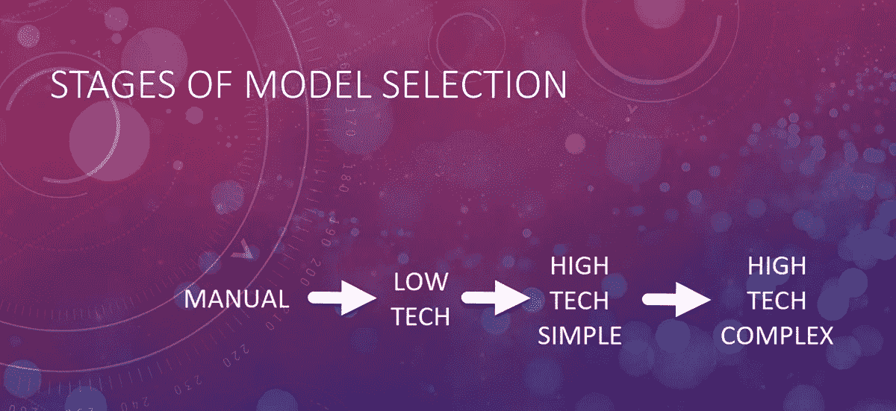
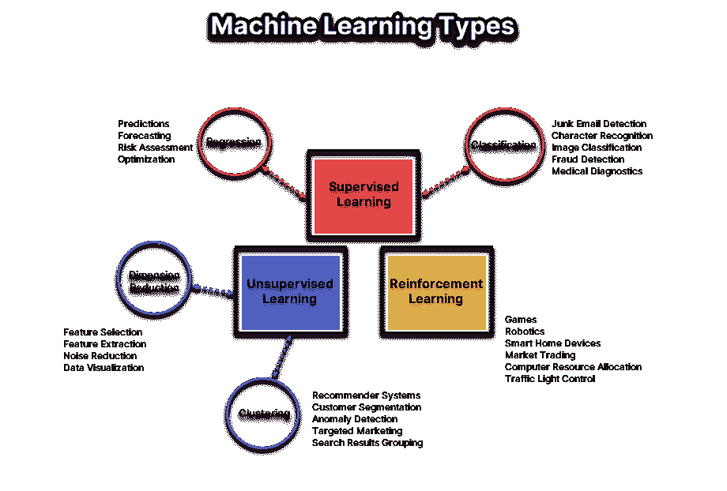
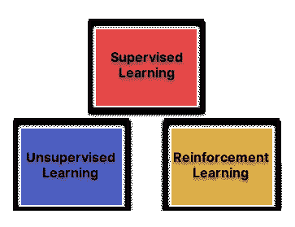
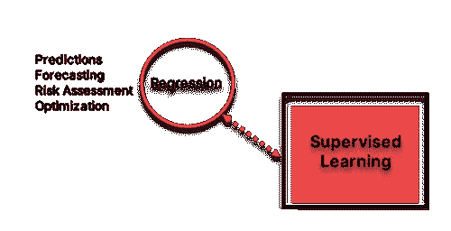
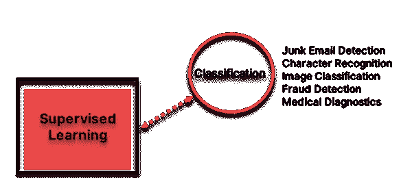
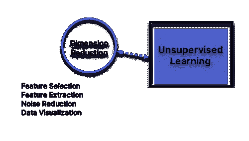
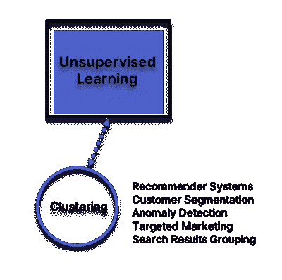
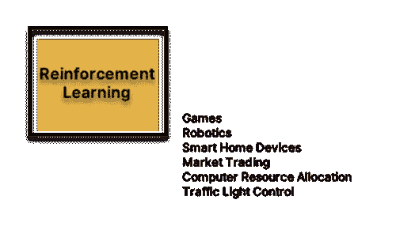

# 不要淹没在海洋里

> 原文：<https://towardsdatascience.com/dont-drown-in-the-ml-ocean-5078f2d2bb62?source=collection_archive---------42----------------------->

托马斯·维马雷在 [Unsplash](https://unsplash.com?utm_source=medium&utm_medium=referral) 上的照片

## 模型选择可以决定一个 ML 项目的成败

# **简介**

想象你在海洋上扬帆起航，驶向深海，看不见陆地。选择一个 ML 模型可能有点像这样——兴奋和恐惧的奇怪混合。随着大量的机器学习算法在你面前展开(并且逐年增长)，第二次猜测选择是正常的，并且可能会在无休止的超参数调整中挣扎。

有一张准确的地图来指导车型选择，可以让你树立信心，相信自己正朝着正确的方向前进，并且会到达目的地。

# **型号选择阶段**

***手动***

*   我怎么用手做这个？
*   工作流程和步骤
*   固有的挑战

首先把所有的技术放在一边，问问你自己:我怎么用手来做这个*？如果我坚持手动实现这个流程，我会从哪里开始，工作流&步骤会是什么样的？考虑到这一点，无论自动化程度如何，都可能会面临挑战。*

****低技术****

*   *传统技术*
*   *启发式、基于规则的解决方案*
*   *比 ML 更划算*

*接下来考虑使用传统软件技术解决问题。一个*启发式的、基于规则的*解决方案会是什么样子？如果符合要求，它们通常更具成本效益。也许 ML 对你的问题来说是矫枉过正了。*

****高科技简单****

*   *最简单的 ML 模型*
*   *装配线上的多个型号*
*   *为解决方案装配现成的模型*

*我可以用什么最简单的 ML 模型来解决我的问题？或者是一系列简单的模型——一个接一个，就像一条装配线。有什么办法可以把现成的 ML 模型拿来改装一下，解决我的问题吗？*

****高科技综合体****

*   **黑箱*进场*
*   *成熟、全能的模型*
*   *高度定制的，也许是新颖的算法*

*如果我有一个*黑盒*，里面有一个超级复杂的 ML 模型解决了我的问题:那对我来说值多少钱？如果所提供的价值足够高，那么追求高度定制的解决方案可能是值得的，这种解决方案可能建立在新颖的算法之上。*

**

*这张图片和作者后来的所有图片*

# *值得吗？*

*想象一下疯狂的成功:*

*   *值得吗？*
*   *你开始的时候投资回报清楚吗？*
*   *在开始一个项目之前，要知道回报*

*在你花费更多的大脑周期之前，后退一步，想象你已经安全到达目的地。值得吗？假设你的 ML 实现取得了超出任何人想象的成功——当你开始时，你对投资回报有准确的认识吗？有些项目不管最终的回报如何，都有自己的发展势头。在你出发之前，确保你的旅程结束时有一桶金在等着你。*

# *整体情况*

**

*这是我们用来选择 ML 模型的地图。*

*许多不同类型的机器学习模型可能看起来势不可挡。了解哪些类型的模型在过去的项目中被证明是成功的，这是将正确的工具应用于手头工作的关键。*

# ***ML 的三大类型***

**

***监督学习***

*这是 ML 的一个分支，涉及在包含答案的数据集上训练我们的模型，因此当部署时，模型可以智能地响应新的数据点。*

***无监督学习***

*ML 的这一分支涉及在数据集上训练我们的模型，这些数据集不包含我们正在寻找的答案——相反，我们通常要求我们的模型在数据中寻找自然模式，或集群。*

***强化学习***

*ML 的第三个分支与模型有关，这些模型通过在环境中反复试验来学习，当它们接收到对其行为的反馈时，表现得越来越智能。*

# ***监督学习:回归***

**

*预测建模是最流行的回归类型之一。假设你想*预测*一栋房子的价格，基于各种特征——比如:位置、面积、卧室数量、可步行性等。你可以从公共领域收集一些数据(比如 Zillow)，根据这些数据训练你的回归模型，然后输入新房子的信息，看看它会做出什么样的价格预测。*

# ***监督学习:分类***

**

*我们都太熟悉上传到脸书、Instagram 和谷歌图片等服务的图片的自动标记和分类了。这种类型的 ML 模型擅长于基于输入图像上存在的一些属性将某物放置在离散的类别(或类)中。*

# ***无监督学习:维数缩减***

**

*有时候，我们输入到机器学习模型中的特征并不都那么有用。这就是降维技术的用武之地。使用像主成分分析(PCA)这样的技术，您可以将原始输入特征减少到那些实际上有助于获得所需答案的特征。*

# ***无监督学习:聚类***

**

**聚类*是一种无监督的学习方法，通过这种方法，机器学习模型被要求在数据中寻找*模式*。我们不是告诉模型要寻找什么，而是问它是否能*在数据中发现*任何有趣的东西。这种技术有助于将志同道合的客户聚集在一起，以便为未来提供推荐，就像亚马逊一样。*

# ***强化学习***

**

*游戏玩家可能很熟悉几年前 DeepMind 凭借 AlphaGo 系统击败顶级职业围棋选手的惊人成功。AlphaGo 的底层是一个复杂的*强化学习*实现——机器学习模型越玩越擅长玩围棋。*

# ***真实世界用例***

*下面的例子说明了什么类型的 ML 模型在解决什么类型的问题时是有用的:*

> ****转移生产线上的不良品****
> 
> *分类*(使用卷积神经网络或 CNN 的图像分类)**
> 
> ****为一个游戏树立一个敌人****
> 
> *强化学习*
> 
> ****预测汽车销售价格****
> 
> *回归*
> 
> ****基于以往采购的针对性营销活动****
> 
> *使聚集*
> 
> ****将论坛上的帖子分类****
> 
> *分类*(自然语言处理，NLP，可能使用递归神经网络或 RNNs)**
> 
> ****检测信用卡欺诈活动****
> 
> *分类*或*聚类*(两种方法对异常检测都有用)**
> 
> ****通过图表和图形洞察大量数据****
> 
> *降维*

# ***结论***

*   *机器学习是巨大的——但是我们有一张地图*
*   *选择适当的自动化水平*
*   *确保风险值得回报*
*   *使用地图选择模型*
*   *谷歌避免从空白画布开始*

*到现在为止，你应该意识到，尽管机器学习的领域确实很广阔，但有一些既定的界限，使得导航它变得简单得多。*

*从评估适合手头问题的自动化水平开始——确保风险值得回报。*

*然后确定你的业务问题最适合的 ML 类别，并开始谷歌搜索，看看其他 ML 从业者如何应对类似挑战的例子。有大量的宣传资料可以作为你下一个项目的起点——只需查看 *kaggle* 上的“笔记本”选项卡就能获得一些灵感！记住:重新发明轮子是*永远不会*正确的答案。*